# 字符串函数 · 作业填空（单选 1~2 + 填空 3~7）

> 整理日期：2026-06-18  
> 单选 2 题（4 分）+ 填空 5 题（96 分）

---

## 目录

### 专题 · string.h 速记
- [头文件与四大金刚](#专题--stringh-速记)
- [两大神探 strchr / strstr](#两大神探)

### 填空题
- [第 3 题 · 字符串比较与交换](#第-3-题)
- [第 4 题 · 阶乘和 1!+2!+…+n!](#第-4-题)
- [第 5 题 · 手动连接字符串](#第-5-题)
- [第 6 题 · 回文串判断](#第-6-题)
- [第 7 题 · 字符串冒泡排序](#第-7-题)
- [专题 · 二维字符数组怎么打印](#专题--二维字符数组怎么打印)

---

## 专题 · string.h 速记

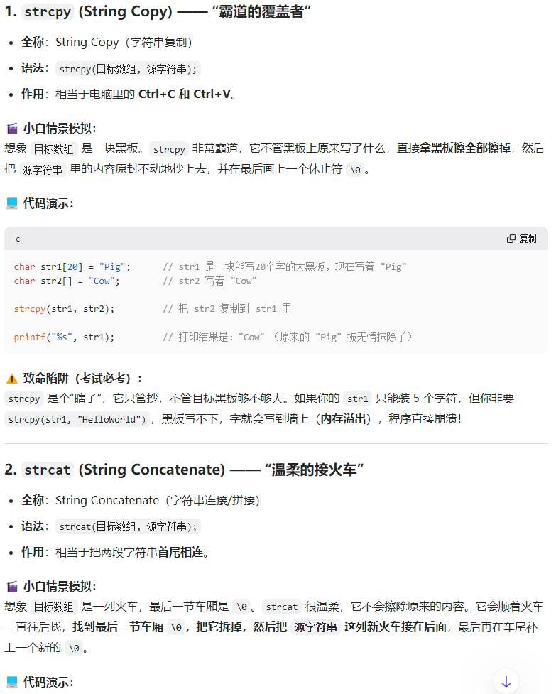
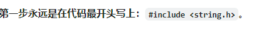

**第一步永远写：** `#include <string.h>`

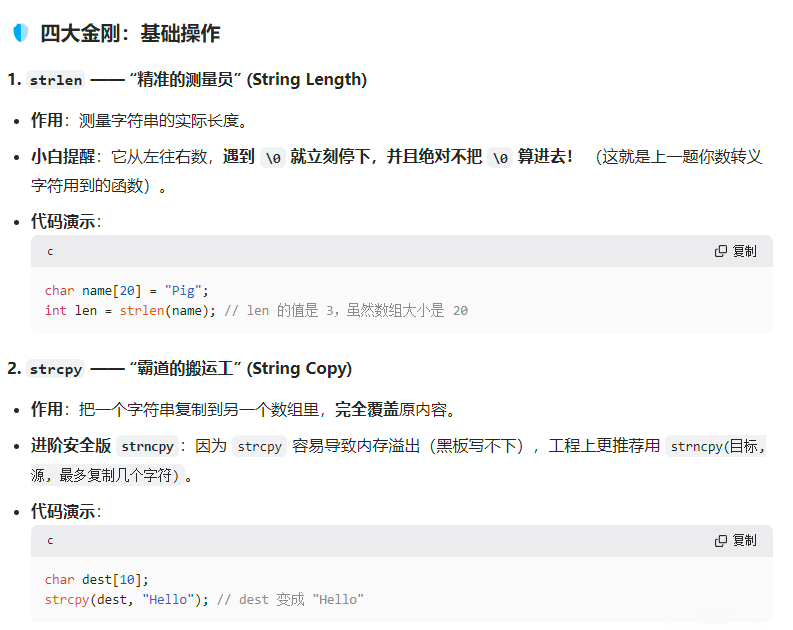
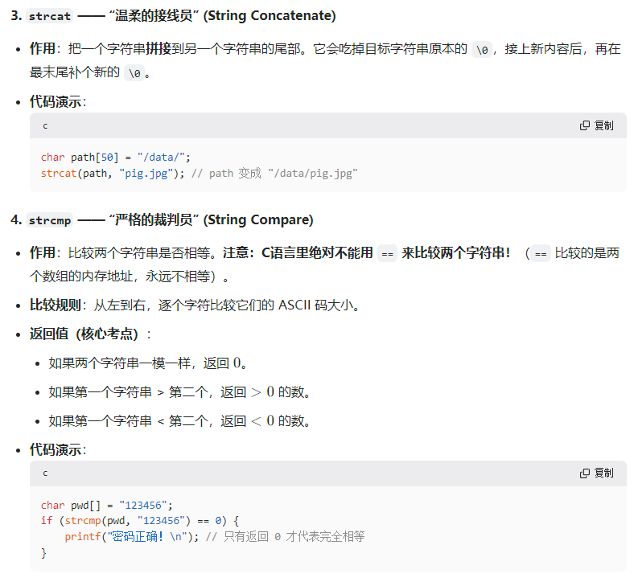
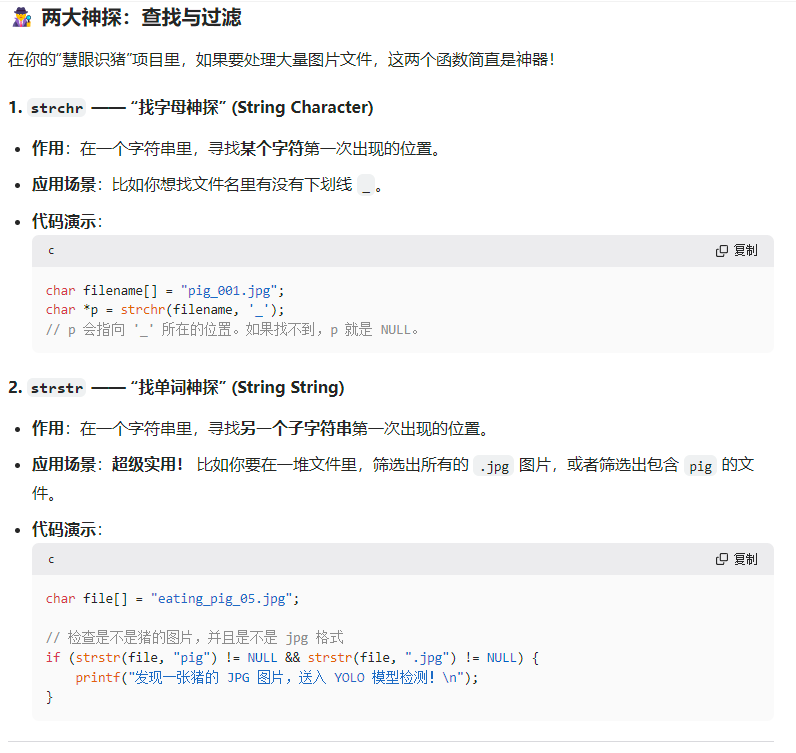

| 函数 | 作用 | 考点 |
|------|------|------|
| `strlen(s)` | 测长度，**不含** `\0` | 遇 `\0` 停 |
| `strcpy(dest, src)` | 复制覆盖 | 数组不能用 `=` 赋值 |
| `strncpy` | 安全复制，限长度 | 防溢出 |
| `strcat(dest, src)` | 接到 dest 末尾 | 去掉原 `\0` 再拼接 |
| `strcmp(a,b)` | 比较大小 | **相等返回 0**；绝不用 `==` |
| `strchr(s, c)` | 找**字符** | 找不到返回 NULL |
| `strstr(s, sub)` | 找**子串** | 过滤 `.jpg`、`pig` 等 |

### ⚠️ 避坑指南

- 字符串**不能**用 `>`、`=` 比较或赋值
- `strcmp` 返回 `>0` 即可，**不要写 `== 1`**
- `strlen` 不数 `\0`；转义字符如 `\n` 算 1 个字符

---

## 第 3 题

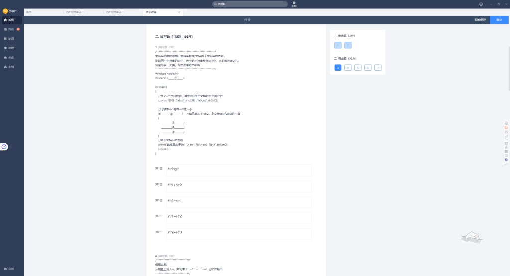
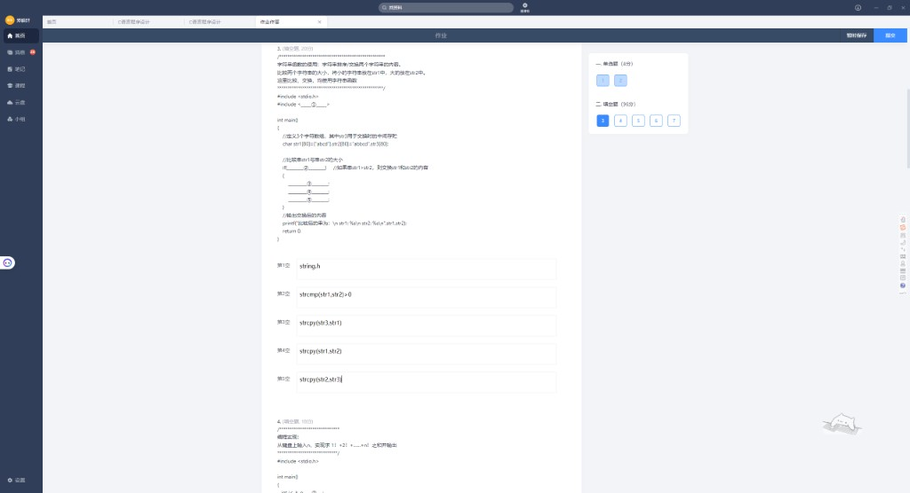
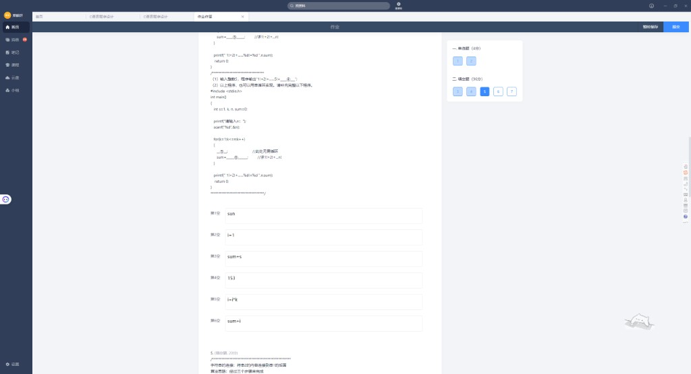

小串放 `str1`，大串放 `str2`，用 `str3` 作中间杯。

| 空 | 正确答案 | 你的易错 |
|----|----------|----------|
| ① | `string.h` | ✓ |
| ② | **`strcmp(str1,str2)>0`** | ✗ `str1>str2`（比的是地址） |
| ③ | `strcpy(str3,str1)` | ✗ `str3=str1` |
| ④ | `strcpy(str1,str2)` | ✗ `str1=str2` |
| ⑤ | `strcpy(str2,str3)` | ✗ `str2=str3` |

**三杯水交换**：`str3←str1` → `str1←str2` → `str2←str3`

---

## 第 4 题

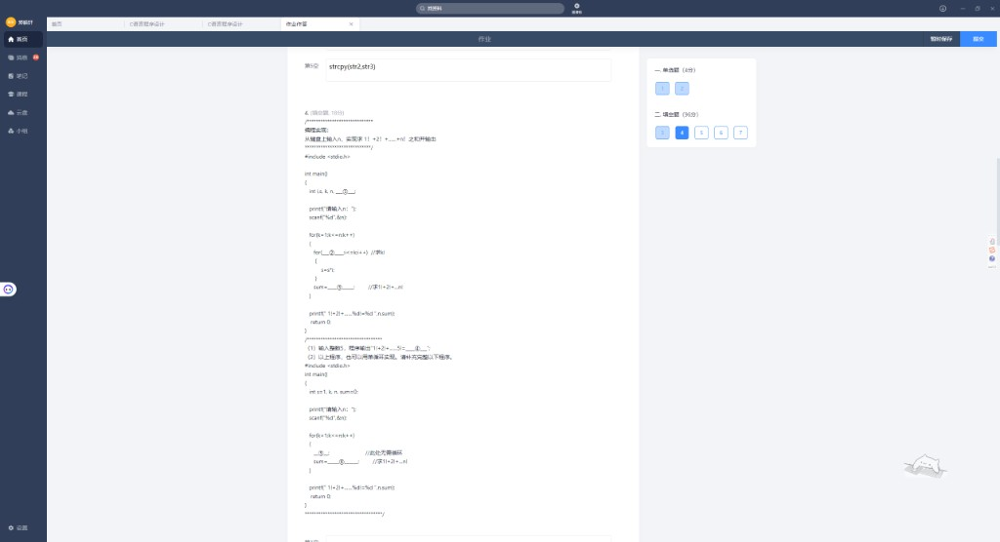
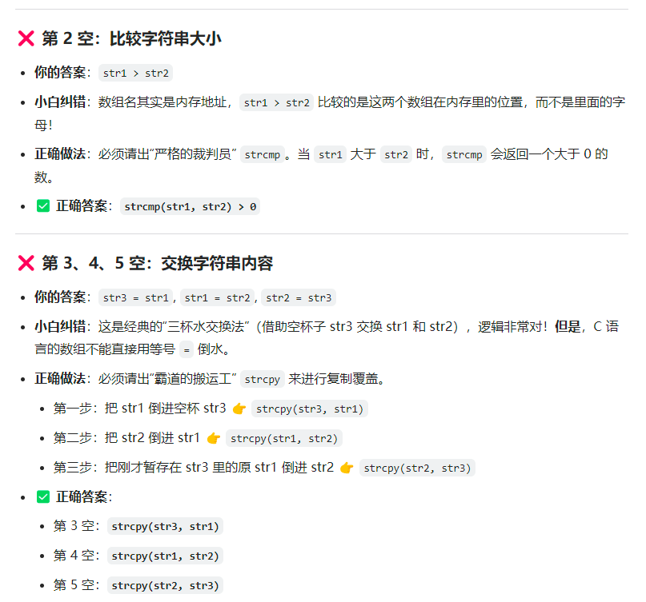
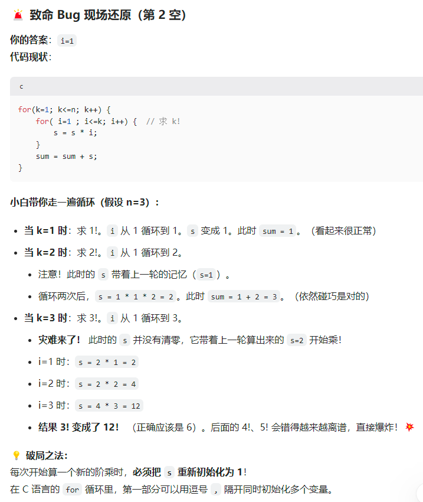

求 `1!+2!+…+n!`，`n=5` 时答案 **153**（1+2+6+24+120）。

### 双循环版

| 空 | 正确答案 | 你的易错 |
|----|----------|----------|
| ③ 声明 | `s=1, sum=0` | — |
| ② 内循环头 | **`i=1,s=1; i<=k; i++`** | ✗ 只写 `i=1`，s 不重置 |
| ① 累加 | `sum+s` 或 `sum=sum+s` | — |

**致命陷阱**：每算新一轮 `k!`，**必须把 `s` 重置为 1**，否则 `3!` 会从上一轮结果接着乘。

### 单循环版

| 空 | 正确答案 |
|----|----------|
| ⑤ | `s=s*k` |
| ④ | `sum+s` 或 `sum=sum+s` |
| ⑥ n=5 输出 | **153** |

---

## 第 5 题

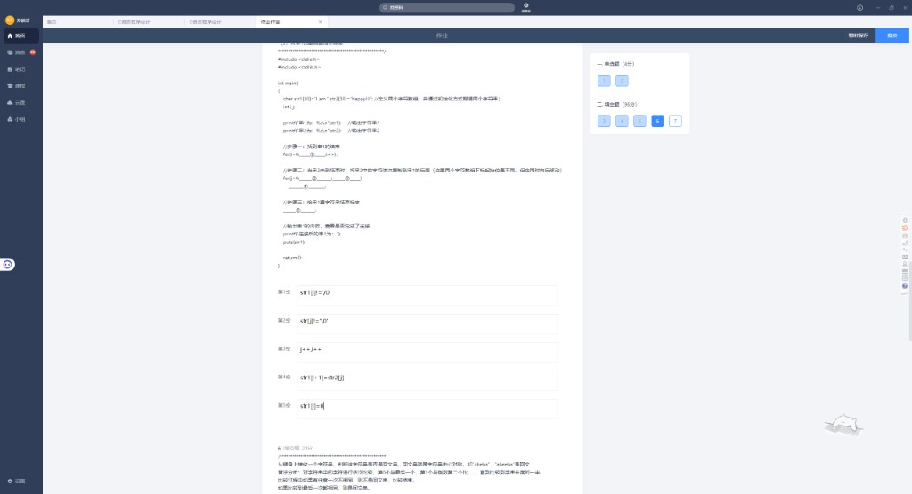
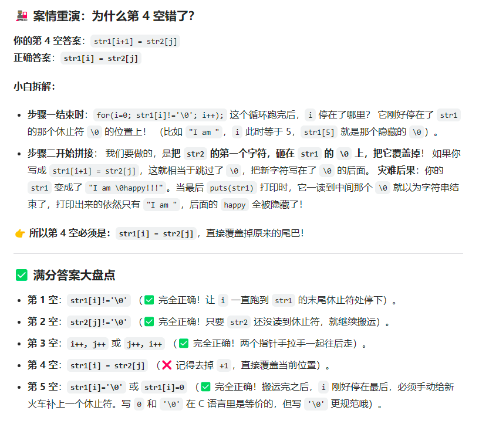

不用 `strcat`，手动把 `str2` 接到 `str1` 后面。

| 空 | 正确答案 | 你的易错 |
|----|----------|----------|
| ① 找 str1 尾 | `str1[i]!='\0'` | ✓ |
| ② 循环条件 | `str2[j]!='\0'` | ✓ |
| ③ 双指针后移 | `i++,j++` 或 `j++,i++` | ✓ |
| ④ 复制字符 | **`str1[i]=str2[j]`** | ✗ `str1[i+1]=…` 跳过 `\0` |
| ⑤ 补结尾 | `str1[i]='\0'` 或 `str1[i]=0` | ✓ |

**为什么不能用 `i+1`？** 第一轮循环后 `i` 已停在 `\0` 位置，应**直接覆盖** `\0`，否则 `puts` 仍只打印前半段。

---

## 第 6 题

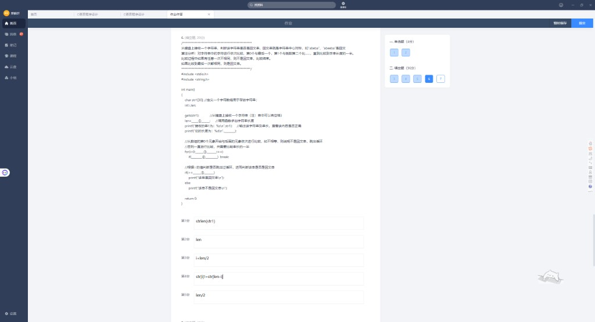
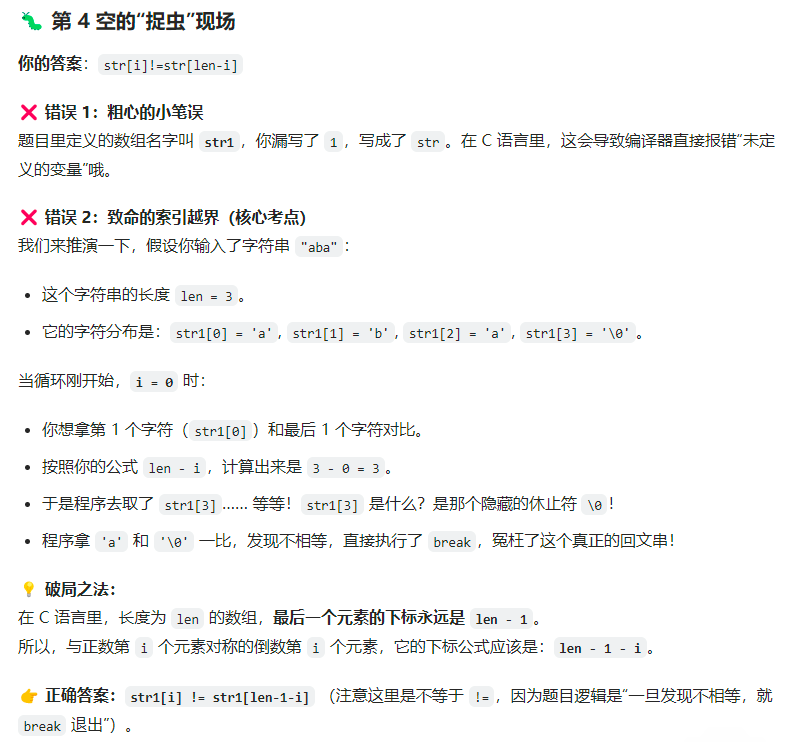

| 空 | 正确答案 | 你的易错 |
|----|----------|----------|
| ① 求长 | `strlen(str1)` | ✓ |
| ② 输出长 | `len` | ✓ |
| ③ 循环界 | `i<len/2` | ✓ |
| ④ 比较 | **`str1[i]!=str1[len-1-i]`** | ✗ `str` 写错名；`len-i` 越界 |
| ⑤ 判断 | `len/2` | ✓ |

**索引口诀**：长度为 `len` 时，最后一个有效下标是 **`len-1`**，对称位置是 **`len-1-i`**。

例：`"aba"`，`len=3`，`i=0` 时应比 `str1[0]` 与 `str1[2]`，不是 `str1[3]`（那是 `\0`）。

---

## 第 7 题

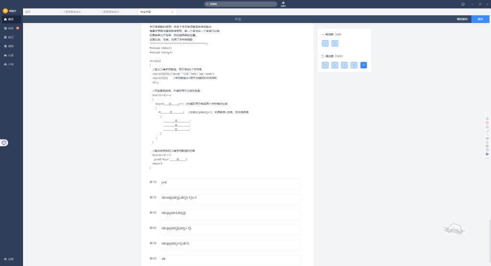
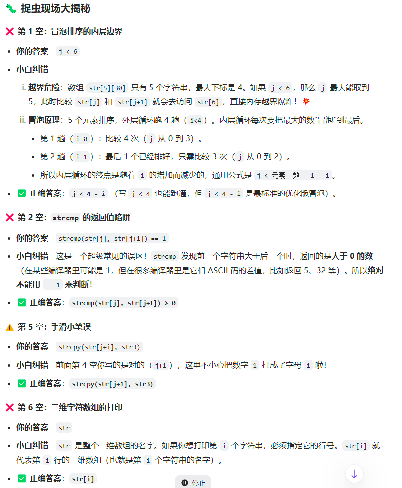

5 个字符串升序冒泡，`str[5][10]`。

| 空 | 正确答案 | 你的易错 |
|----|----------|----------|
| ① 内循环 | **`j<4-i`**（或 `j<4`） | ✗ `j<6` 越界 |
| ② 比较 | **`strcmp(str[j],str[j+1])>0`** | ✗ `==1` |
| ③ | `strcpy(str3,str[j])` | ✓ |
| ④ | `strcpy(str[j],str[j+1])` | ✓ |
| ⑤ | **`strcpy(str[j+1],str3)`** | ✗ `str[j+i]` 手滑 |
| ⑥ 打印 | **`str[j]`** | ✗ `str`（整表地址） |

---

## 专题 · 二维字符数组怎么打印

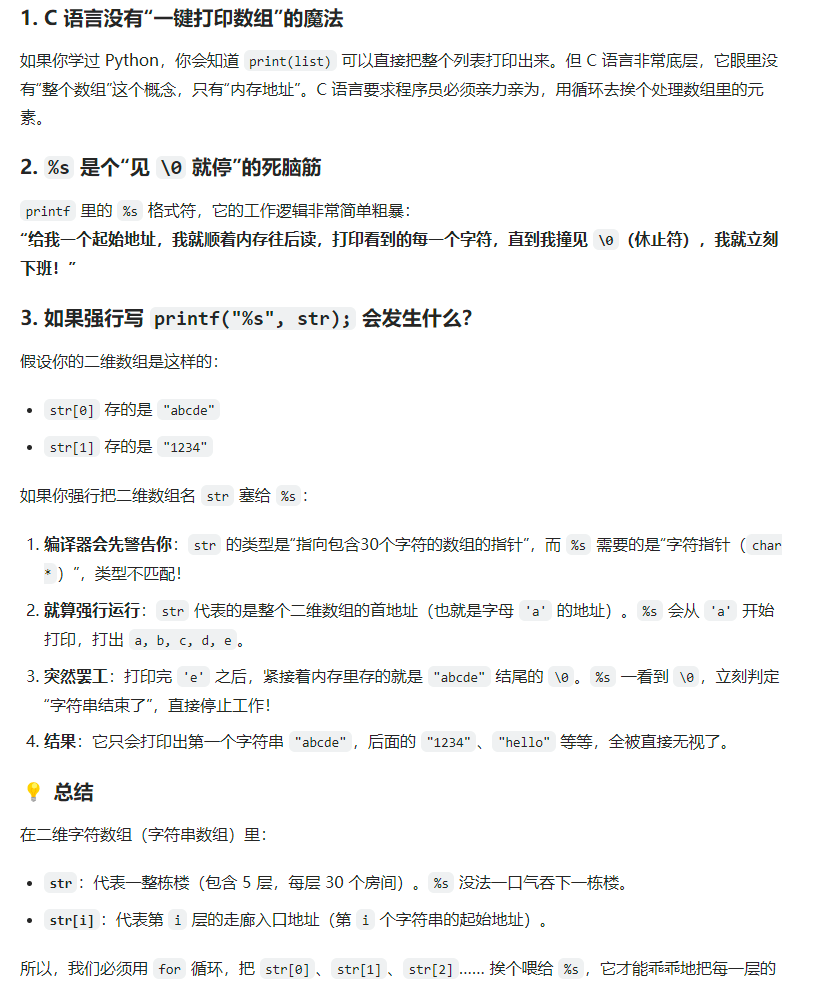

第 7 题第 ⑥ 空为什么必须写 `str[j]`？因为 C **没有一键打印整个字符串数组**。

### 三个事实

1. **C 比 Python 底层** — 没有 `print(整个数组)`，只能循环逐个处理
2. **`%s` 见 `\0` 就停** — 从起始地址往后读，遇到 `\0` 立刻结束
3. **`printf("%s", str)` 只打第一行** — `str` 指向整个二维数组的首地址（第一串开头），打完 `"abcde"` 遇到 `\0` 就停，后面的 `"1234"` 等全看不到

### 比喻

| 写法 | 含义 |
|------|------|
| `str` | 整栋楼（5 层），`%s` 一次只能进一层门口 |
| `str[i]` | 第 `i` 层门口地址，才是第 `i` 个字符串 |

### 正确打印写法

```c
for (j = 0; j < 5; j++)
    printf("%s\n", str[j]);   // 每次传一行的首地址
```

### ⚠️ 避坑指南

- `printf("%s", str)` → 类型不匹配 + 只输出**第一个**字符串
- 二维字符数组打印 → **循环 + `str[i]`**，和 YOLO 里逐张读图片路径是一个思路

---

## 本卷易错点速记

| 题号 | 易错点 | 一句话 |
|------|--------|--------|
| 3 | `str1>str2` | 字符串用 `strcmp`，交换用 `strcpy` |
| 4 | 只写 `i=1` | 每轮 `k!` 要 `s=1` 重置 |
| 5 | `str1[i+1]` | 覆盖 `\0` 用 `str1[i]` |
| 6 | `len-i` | 对称下标 `len-1-i` |
| 7 | `j<6`、`==1`、`str` | 边界 `j<4-i`；打印用 `str[j]` |

---

## 附录：截图索引

| 文件 | 内容 |
|------|------|
| `01~02` | 作业界面 |
| `03~08` | string.h 专题 |
| `09~11` | 第 3 题 |
| `12~14` | 第 4 题 |
| `15~16` | 第 5 题 |
| `17~18` | 第 6 题 |
| `19~21` | 第 7 题 + 二维数组打印 |

---

*单选 1~2 题截图已收录，题目正文发来后可补全。*
