# 实验10 · 函数（二）+ 指针初步

> 整理日期：2026-06-18  
> 全卷 16 题（单选 10 + 填空 6）· **全卷完结**

---

## 目录

### 单选题（1~10）
- [第 1 题 · 三个 a 的混战](#第-1-题)
- [第 2 题 · 全局变量作用域](#第-2-题)
- [第 3 题 · static 遮蔽全局 x](#第-3-题)
- [第 4 题 · 就近原则遮蔽 s](#第-4-题)
- [第 5 题 · static 双变量追踪](#第-5-题)
- [第 6 题 · 间接递归](#第-6-题)
- [第 7 题 · static m 与 k](#第-7-题)
- [第 8 题 · 全局 vs 局部同名](#第-8-题)
- [第 9 题 · static 生存期](#第-9-题)
- [第 10 题 · 递归类型辨析](#第-10-题)

### 填空题
- [第 11 题 · 指针未初始化](#第-11-题)
- [第 12 题 · 水仙花数](#第-12-题)
- [第 13 题 · 各位之和为 4](#第-13-题)
- [第 14 题 · 递归逆序输出各位](#第-14-题)
- [第 15 题 · 指针交换两数](#第-15-题)
- [第 16 题 · 指针遍历数组](#第-16-题)

### 专题
- [全局变量 · 酒店咖啡机](#专题--全局变量)
- [直接递归 vs 间接递归](#专题--递归类型)
- [循环调用 vs 循环里调用](#专题--循环调用)
- [数组名即首地址](#专题--数组与指针)

---

## 第 1 题

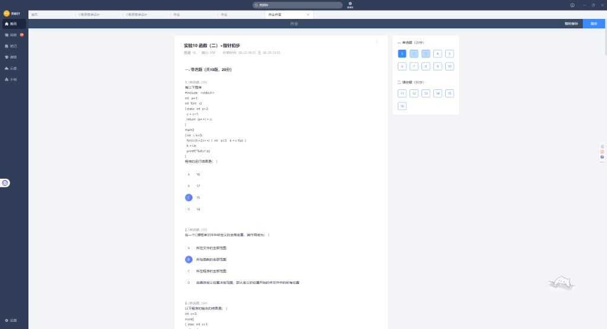
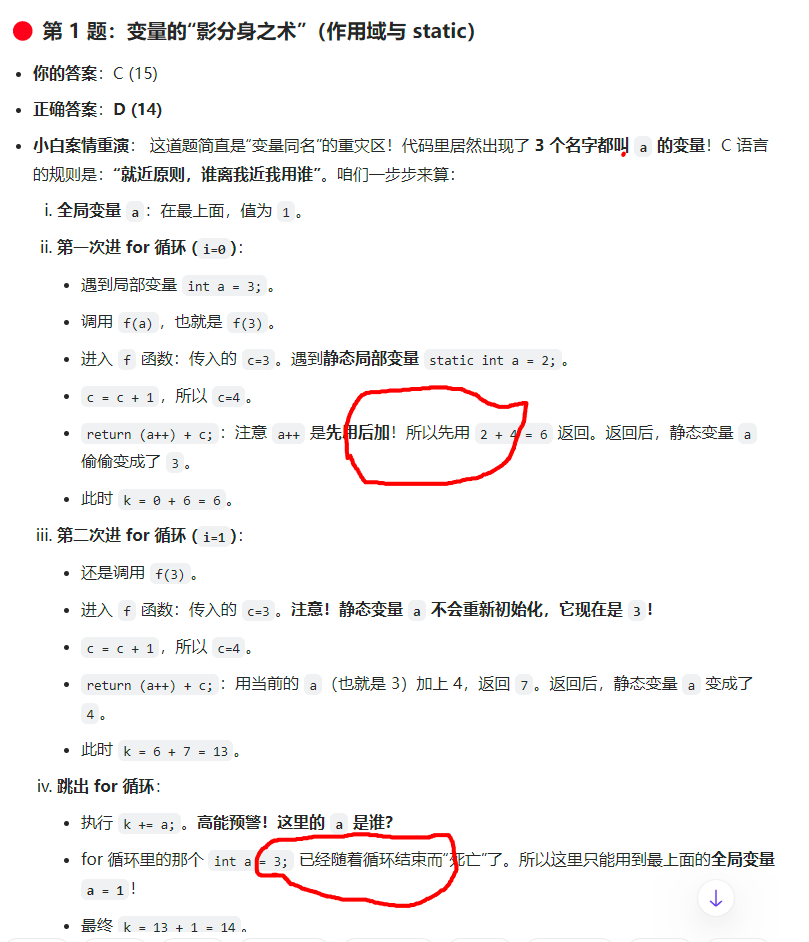

三个同名 `a` 同时登场：

| 变量 | 位置 | 初值 |
|------|------|------|
| 全局 `a` | 文件顶部 | 1 |
| 局部 `a` | `for` 循环内 `int a=3` | 3（循环结束即销毁） |
| 静态 `a` | `f` 内 `static int a=2` | 2，只初始化一次 |

```c
// 第 1 次 f(3)：c=4，return (a++)+c = 2+4=6，static a→3，k=6
// 第 2 次 f(3)：c=4，return 3+4=7，static a→4，k=13
// 循环结束 k+=a → 用的是全局 a=1（for 里的 a 已"死亡"），k=14
```

| 你的答案 | 正确答案 |
|----------|----------|
| C. 15 | **D. 14** |

**【⚠️ 避坑】** 循环内的 `int a=3` 出了 `for` 就不存在了；`k+=a` 只能找到**全局** `a=1`。

---

## 第 2 题

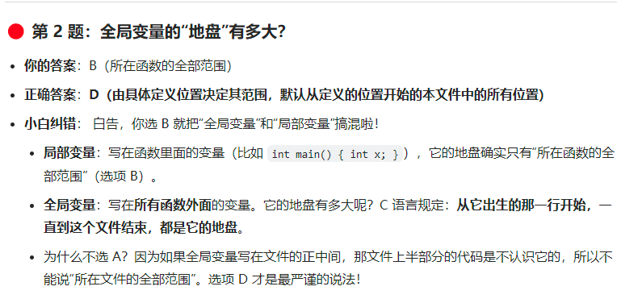

全局变量作用域 = **从定义行到本文件末尾**，定义之前的代码看不到它。

| 你的答案 | 正确答案 |
|----------|----------|
| B. 所在函数的全部范围 | **D. 由定义位置决定，从定义处到本文件末尾** |

别把全局变量和局部变量搞混：B 描述的是**局部变量**的地盘。

---

## 第 3 题


```c
int x = 3;              // 全局 x，控制循环次数
static int x = 1;       // func 内 static x，与全局无关
for(i=1; i<x; i++)      // i=1,2 各调一次 incre()
// 第1次：x=2 打印2；第2次：x=3 打印3 → 输出 23
```

| 你的答案 | 正确答案 |
|----------|----------|
| B ✓ | **B. 2 3** |

---

## 第 4 题

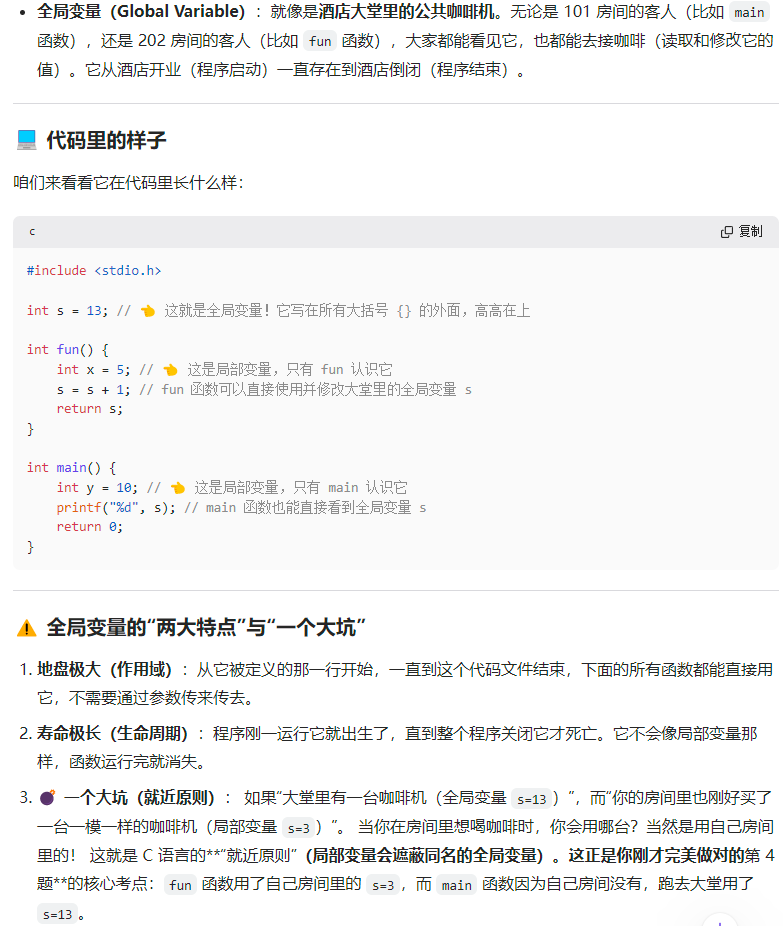

```c
int s = 13;             // 全局 s（大堂咖啡机）
int fun(...) {
    int s = 2;          // 局部 s 遮蔽全局（房间里的咖啡机）
    return x*y - s;     // 用局部 s=2 → 7*5-2=33
}
printf("%d", fun(m,n)/s);  // main 无局部 s，用全局 s=13 → 33/13=2
```

| 你的答案 | 正确答案 |
|----------|----------|
| A ✓ | **A. 2** |

**【⚠️ 避坑 · 就近原则】** 同名时，函数内优先用**局部**变量，看不见全局的。

---

## 第 5 题

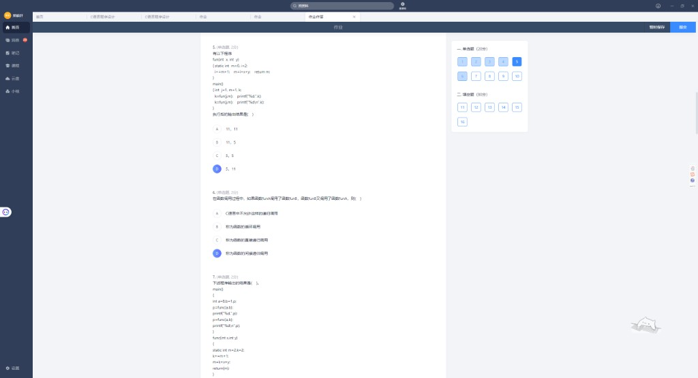

```c
static int m=0, i=2;
// 第1次：i = 2+0+1 = 3，m = 3+1+1 = 5
// 第2次：i = 3+5+1 = 9，m = 9+1+1 = 11
```

| 你的答案 | 正确答案 |
|----------|----------|
| D ✓ | **D. 5, 11** |

---

## 第 6 题

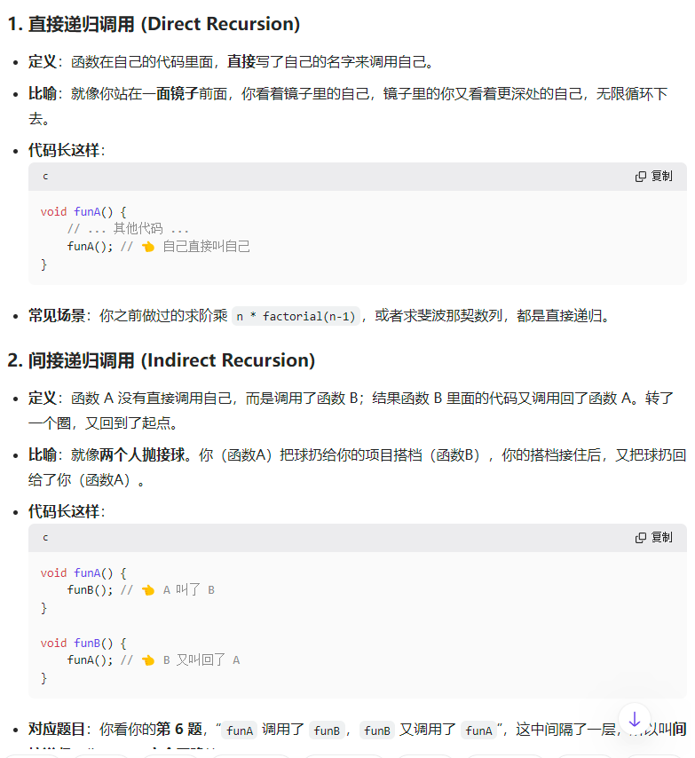
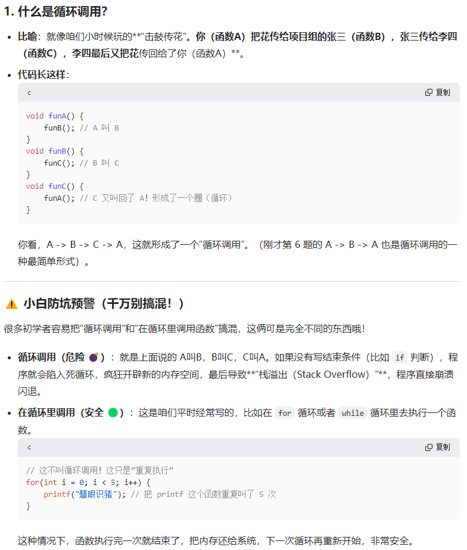

`funA` 调 `funB`，`funB` 又调 `funA` → **间接递归**（中间隔了一层）。

| 类型 | 特征 | 例子 |
|------|------|------|
| 直接递归 | 自己调自己 | `f(n-1)` |
| 间接递归 | A→B→A | 本题 |
| 循环调用 | A→B→C→A（≥3 个函数成环） | 与间接递归不同 |

| 你的答案 | 正确答案 |
|----------|----------|
| D ✓ | **D. 间接递归调用** |

**【⚠️ 避坑】** `for` 里反复调函数是**重复执行**，不是循环调用；循环调用是无终止条件的 A→B→A 死循环，会栈溢出。

---

## 第 7 题


```c
static int m=2, k=2;
// 第1次：k = 2+2+1 = 5，m = 5+8+1 = 14
// 第2次：k = 5+14+1 = 20，m = 20+8+1 = 29
```

| 你的答案 | 正确答案 |
|----------|----------|
| B ✓ | **B. 14, 29** |

---

## 第 8 题

```c
int a, b;               // 全局，默认初值 0
void fun() { a+=100; b+=200; }  // 改的是全局 a,b → 100, 200
main() {
    int a=5, b=7;       // 局部遮蔽全局
    fun();
    printf("%d%d\n", a, b);  // 打印局部 → 57
}
```

| 你的答案 | 正确答案 |
|----------|----------|
| C ✓ | **C. 57** |

`fun()` 改的是全局变量，但 `printf` 看到的是 `main` 里的局部 `a=5, b=7`。

---

## 第 9 题


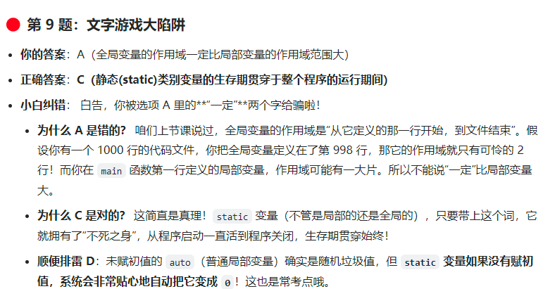

| 选项 | 判断 |
|------|------|
| A 全局作用域一定比局部大 | ✗ 被「一定」坑了——全局从定义行才开始 |
| B 形参都是全局变量 | ✗ 形参是局部变量 |
| **C static 生存期贯穿整个程序** | ✓ |
| D auto 和 static 未赋值都是随机值 | ✗ static 未赋值默认为 **0** |

| 你的答案 | 正确答案 |
|----------|----------|
| A | **C** |

---

## 第 10 题

程序结构：A 调 B、C；B 调 A；P 调 A。

| 选项 | 判断 |
|------|------|
| A P 调 A 是嵌套不是递归 | ✗ P 没调自己 |
| B P 直接递归调 A | ✗ 直接递归是自己调自己 |
| **C B 中调 A 是 A 的间接递归** | ✓ A→B→A |
| D 表述混乱 | ✗ |

| 你的答案 | 正确答案 |
|----------|----------|
| C ✓ | **C** |

---

## 第 11 题


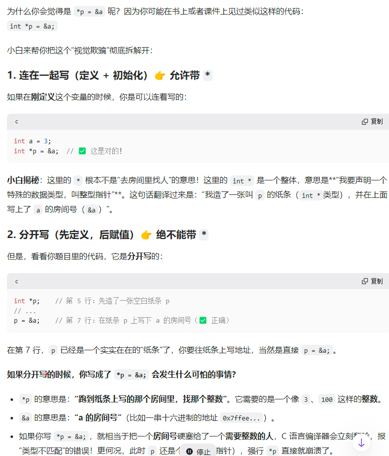

```c
int *p;
*p = &a;   // 第7行错误：p 未初始化，不能对 *p 解引用赋值
```

| 空 | 正确答案 | 你的答案 |
|----|----------|----------|
| ① 错误行号 | **7** | 7 ✓ |
| ② 改正 | **`p = &a`** | `*p=&a` ✗ |

**【⚠️ 避坑】** 定义与赋值分开时：
- `int *p = &a;` ✓ 定义+初始化，`int *` 是一个类型
- `p = &a;` ✓ 先定义后赋值，**不要加 `*`**
- `*p = &a;` ✗ 把地址塞进整型房间，类型不匹配且 p 可能是野指针

---

## 第 12 题


四位「水仙花数」：各位四次方之和等于本身（如 1634 = 1⁴+6⁴+3⁴+4⁴）。

| 空 | 正确答案 | 你的答案 |
|----|----------|----------|
| ① 调用判断 | **`func(i) == 1`** | ✓ |
| ② 百位 | **`n / 100 % 10`** | ✓ |
| ③ 比较 | **`n ==`** | ✓ |
| ④ 第 2 个 | **8208** | 1634 ✗（1634 是第 1 个） |

四位水仙花数：**1634 → 8208 → 9474**（共 3 个）。

---

## 第 13 题


输出 10~10000 间**各位数字之和等于 4** 的整数，每 10 个换行。

| 空 | 正确答案 | 你的答案 |
|----|----------|----------|
| ① 循环条件 | **`i < 10000`**（且循环前 `count=0`） | `count=1` ✗ |
| ② 调用函数 | **`is_four(i)`** 或 `is_four(i)==1` | `is_four==1` ✗ |
| ③ 换行 | **`count % 10 == 0`** | ✓ |
| ④ 取个位 | **`n % 10`** | `sum%10` ✗ |
| ⑤ 提前退出 | **`sum > 4`** | ✓ |
| ⑥ 去掉个位 | **`n = n / 10`** 或 `n /= 10` | `n/10` 缺赋值 |
| ⑦ 判断成功 | **`sum == 4`** | ✓ |

```c
int is_four(int n) {
    int sum = 0;
    while (n > 0) {
        sum += n % 10;      // ④
        if (sum > 4) return 0;  // ⑤
        n = n / 10;         // ⑥
    }
    return sum == 4;        // ⑦
}
```

---

## 第 14 题

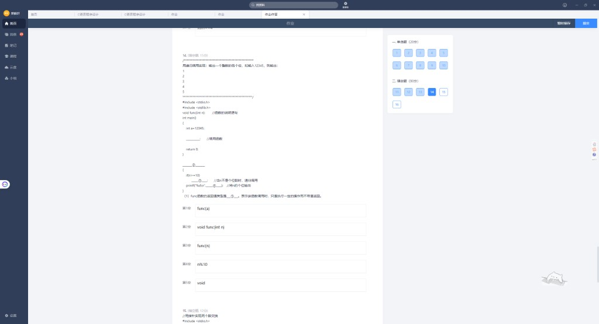
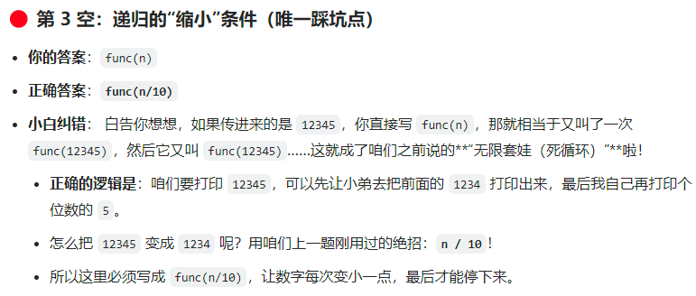

递归输出 12345 的各位（先高位后低位）：1→2→3→4→5。

| 空 | 正确答案 | 你的答案 |
|----|----------|----------|
| ① 调用 | **`func(a)`** | ✓ |
| ② 函数定义 | **`void func(int n)`** | ✓ |
| ③ 递归 | **`func(n / 10)`** | `func(n)` ✗ 会死循环 |
| ④ 输出个位 | **`n % 10`** | ✓ |
| ⑤ 返回类型 | **`void`** | ✓ |

**递归必须「缩小」**：每次 `n/10` 去掉一位，最终 `n<10` 停止；写 `func(n)` 永远 12345→12345→…

---

## 第 15 题


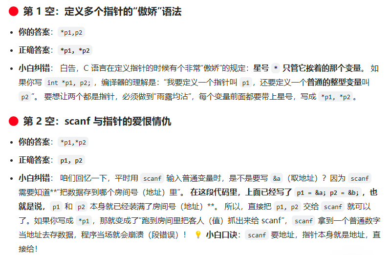

用指针实现两数交换（a<b 时交换）。

| 空 | 正确答案 | 你的答案 |
|----|----------|----------|
| ① 定义指针 | **`int *p1, *p2`** | `*p1,p2` ✗ |
| ② scanf | **`p1, p2`** | `*p1,*p2` ✗ |
| ③ 交换中间步 | **`*p1 = *p2`** | ✓ |

**【⚠️ 避坑】**
- `int *p1, p2;` 只有 p1 是指针，p2 是 int
- `scanf` 要地址；`p1=&a` 后 **p1 本身就是地址**，直接传 `p1`，不要 `*p1`

完整交换：`t=*p1; *p1=*p2; *p2=t;`

---

## 第 16 题


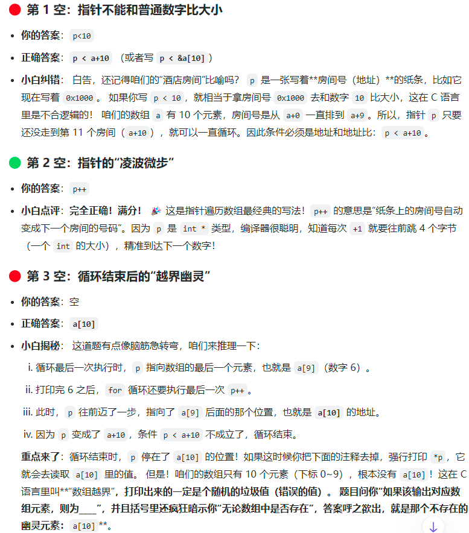
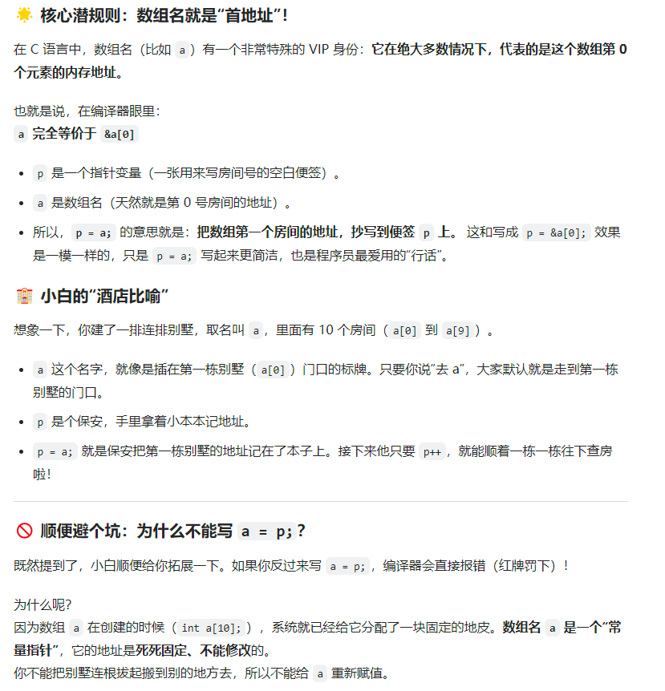

```c
int a[10] = {1,3,2,5,10,4,7,9,8,6};
int *p;
for (p = a; p < a + 10; p++)   // ①②
    printf("%d ", *p);
// 循环结束后 *p 对应 a[10]（越界位置）
```

| 空 | 正确答案 | 你的答案 |
|----|----------|----------|
| ① 循环条件 | **`p < a + 10`** | `p<10` ✗ |
| ② 步进 | **`p++`** | ✓ |
| ③ 循环后 *p 对应 | **`a[10]`** | 空 ✗ |

**【⚠️ 避坑】** 指针不能与整数比（`p<10`）；数组名 `a` 等价于 `&a[0]`，是常量首地址，不能 `a=p` 重新赋值。

---

## 专题 · 全局变量


全局变量 = 酒店大堂的公共咖啡机：

- **作用域**：定义行 → 文件末尾，下方所有函数都能直接用
- **生命周期**：程序启动到结束
- **就近原则**：函数内若有同名局部变量，局部遮蔽全局

---

## 专题 · 递归类型

| 类型 | 代码特征 |
|------|----------|
| 直接递归 | `funA(){ funA(); }` |
| 间接递归 | `funA(){ funB(); }` `funB(){ funA(); }` |
| 循环调用 | `A→B→C→A` 成环，无终止条件 → 栈溢出 |

---

## 专题 · 数组与指针


| 规则 | 说明 |
|------|------|
| `a` ≡ `&a[0]` | 数组名在多数情况下代表首元素地址 |
| `p = a` | 等价于 `p = &a[0]` |
| `a = p` | ✗ 数组名是常量指针，不能改 |
| `p < a+10` | 指针与指针比，不能与整数 10 比 |

---

## 本卷易错点速记

| 题号 | 你的选择 | 正确答案 | 一句话 |
|------|----------|----------|--------|
| 1 | C (15) | **D (14)** | for 内局部 a 出了循环就死了 |
| 2 | B | **D** | 全局变量从定义行到文件末 |
| 9 | A | **C** | static 生存期=整个程序；别信「一定」 |
| 11② | `*p=&a` | **`p=&a`** | 分开写时赋值给 p，不是 *p |
| 12④ | 1634 | **8208** | 1634 是第 1 个水仙花数 |
| 13①②④ | count=1 等 | **count=0, is_four(i), n%10** | 函数要传参；取位用 n |
| 14③ | func(n) | **func(n/10)** | 递归必须缩小问题 |
| 15①② | *p1,p2 / *p1,*p2 | **\*p1,\*p2 / p1,p2** | 多指针各带*；scanf 直接传指针 |
| 16①③ | p<10 / 空 | **p<a+10 / a[10]** | 指针比地址；循环结束越界 |

---

## 附录：截图索引

| 文件 | 内容 |
|------|------|
| `01~11` | 单选 1~10 |
| `12~15` | 填空 11~12 指针/水仙花 |
| `16~17` | 填空 13 各位和为 4 |
| `18~19` | 填空 14 递归输出 |
| `20~22` | 填空 15 指针交换 |
| `21~24` | 填空 16 指针数组 + 专题 |

---

*实验10 全卷 16 题整理完毕。*
