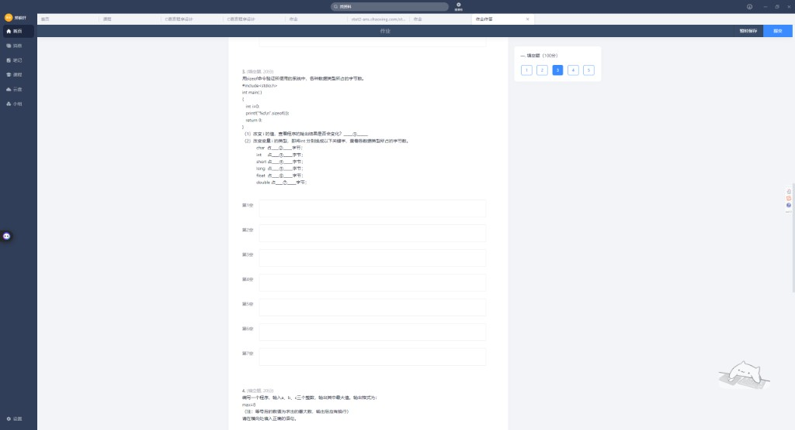
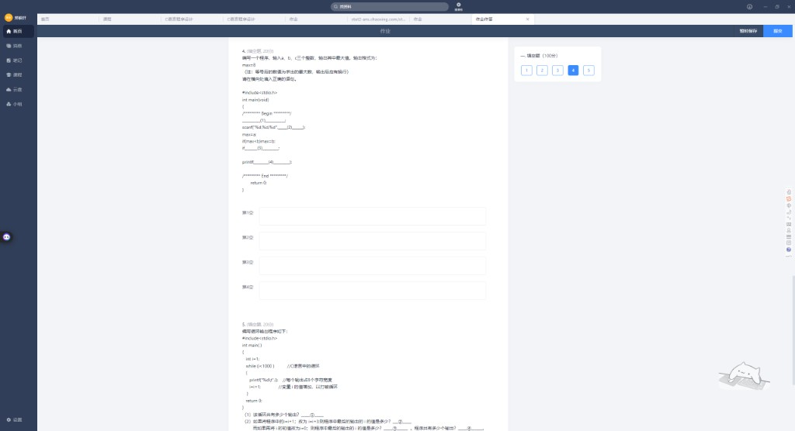
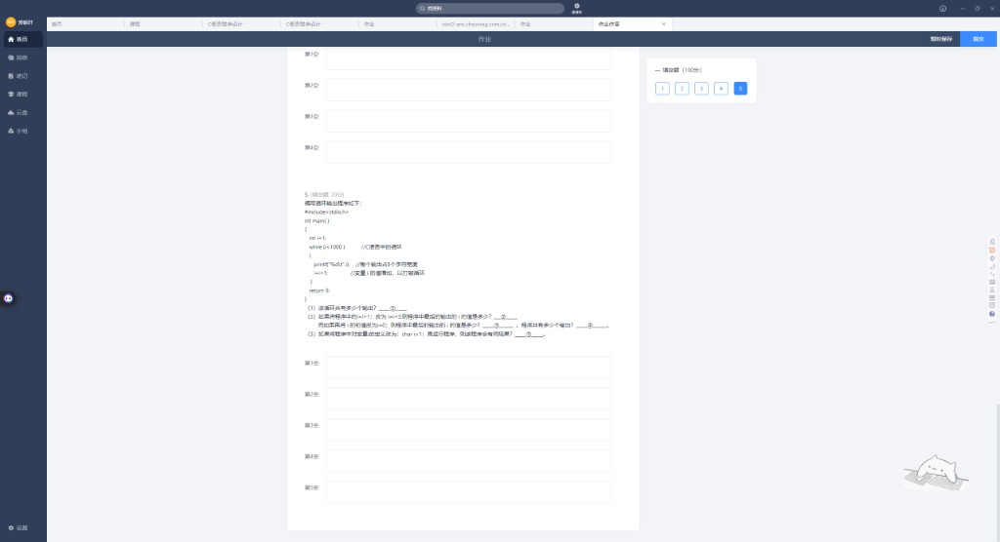

# 实验1 · C语言开发基础（填空题 1~5）

> 整理日期：2026-06-14  
> 满分 100 分，共 5 题

---

## 目录

1. [第 1 题 · Hello,world!](#第-1-题)
2. [第 2 题 · 两数求和](#第-2-题)
3. [第 3 题 · sizeof 验证类型大小](#第-3-题)
4. [第 4 题 · 三数求最大值](#第-4-题)
5. [第 5 题 · while 循环分析](#第-5-题)

---

## 第 1 题


**题目**：输出 `Hello,world!`，并在其后输出**两个空行**（大小写必须完全一致）。

```c
#include <stdio.h>
int main()
{
    ____________________;
    return 0;
}
```

### 参考答案

```c
printf("Hello,world!\n\n");
```

或分两行：

```c
printf("Hello,world!\n");
printf("\n");
```

### 要点

- `\n` 换行一次；两个 `\n` 或额外 `printf("\n")` 得到两个空行
- 字符串必须是 `Hello,world!`（注意逗号、无空格）

---

## 第 2 题


### 原程序（有错）

```c
#include <stdio.h>
int main()
{
    int a, b, c;
    a = 123;
    b = 321;
    c = a + b;
    printf("两数之和为 %d\n", sum);  // ❌ sum 未定义
    return 0;
}
```

### 填空答案

| 空 | 答案 | 说明 |
|----|------|------|
| ① | **sum** | 错误的变量名 |
| ② | **c** | 应改为已存结果的变量 c |
| ③ | **`printf("%d+%d=%d\n", a, b, c);`** | 输出 `123+321=444` |
| ④ | **`12+45=57`** | 输入 `12 45` 时的运行结果 |
| ⑤ | **不正确**（或：否 / 不能） | 见下方说明 |

### ③ 格式说明

```c
printf("%d+%d=%d\n", a, b, c);
// %d 对应整数；+ 和 = 是普通字符，直接写在格式串里
```

### ④ scanf 程序

```c
scanf("%d %d", &a, &b);
c = a + b;
printf("%d+%d=%d\n", a, b, c);
```

输入 `12 45`（空格分隔）→ 输出 **`12+45=57`**

### ⑤ 用逗号分隔 `12, 45` 为何不对？

`scanf("%d %d", ...)` 格式串里是**空格**，不是逗号。

- 读完 `12` 后，缓冲区里是 `, 45`
- 下一个 `%d` 遇到 `,` 无法继续读 → **输入失败 / 结果错误**

若要逗号分隔，格式串应写：`scanf("%d,%d", &a, &b);`

### ⚠️ 避坑指南

`scanf` 格式串要和键盘输入**逐字符匹配**（空格、逗号都算）。

---

## 第 3 题



```c
#include <stdio.h>
int main()
{
    int i = 0;
    printf("%d\n", sizeof(i));
    return 0;
}
```

### 填空答案

| 空 | 答案 | 说明 |
|----|------|------|
| ① | **不会变化**（或：不变） | `sizeof` 看的是**类型**占多少字节，与 i 的值无关 |
| ② char | **1** 字节 | |
| ③ int | **4** 字节 | |
| ④ short | **2** 字节 | |
| ⑤ long | **4** 字节 | Windows 常见；部分 64 位 Linux 为 8 |
| ⑥ float | **4** 字节 | |
| ⑦ double | **8** 字节 | |

### 记忆口诀

**char 1，short 2，int/float 4，double 8，long 看环境（多为 4）**

### ⚠️ 避坑指南

`sizeof` 是编译期运算符，结果与变量当前存什么数无关；改 `i=0` 为 `i=100` 输出不变。

---

## 第 4 题



**题目**：输入三个整数 `a、b、c`，输出最大值，格式 `max=8`（等号后是最大值，末尾换行）。

### 完整参考答案

```c
#include <stdio.h>
int main(void)
{
    /********** Begin **********/
    int a, b, c, max;                    // (1)
    scanf("%d %d %d", &a, &b, &c);      // (2)
    max = a;
    if (max < b) max = b;
    if (max < c) max = c;              // (3)
    printf("max=%d\n", max);           // (4)
    /********** End **********/
    return 0;
}
```

### 各空答案

| 空 | 答案 |
|----|------|
| (1) | `int a, b, c, max` |
| (2) | `&a, &b, &c` |
| (3) | `max < c) max = c` 或完整 `if (max < c) max = c;` |
| (4) | `"max=%d\n", max` 或完整 `printf("max=%d\n", max);` |

### 逻辑思路

先令 `max = a`，再分别与 `b`、`c` 比较更新，无需嵌套 if。

---

## 第 5 题



```c
#include <stdio.h>
int main()
{
    int i = 1;
    while (i < 1000)        // 循环条件：i < 1000
    {
        printf("%8d", i);   // 每个数占 8 个字符宽度
        i = i + 1;
    }
    return 0;
}
```

### 填空答案

| 空 | 答案 | 说明 |
|----|------|------|
| ① | **999** | i 从 1 到 999，共 999 次输出 |
| ② | **997** | `i=i+3` 时，最后一轮 i=997（997+3=1000 不满足） |
| ③ | **997** | 初值 -8、`i=i+3` 时最后打印的 i |
| ④ | **336** | 同上条件下共 336 次输出 |
| ⑤ | **死循环**（或：无限循环 / 一直输出） | `char i=1` 时溢出导致 |

### ① 原程序：多少次输出？

```
i = 1, 2, 3, …, 999  →  共 999 次（i=1000 时不进入循环体）
```

### ② `i = i + 3`，初值 1

```
打印的 i：1, 4, 7, …, 997（997+3=1000 不再进入循环）
最后一轮打印的 i = 997
共 333 次输出（若题目只问"最后 i"填 997）
```

### ③④ 初值 -8，`i = i + 3`

```
序列：-8, -5, -2, 1, 4, …, 997
最后一项：997
项数：(-8 到 997，步长 3) → (997-(-8))/3 + 1 = 336
```

- 最后打印的 i：**997**
- 输出次数：**336**

### ⑤ `char i = 1` 会怎样？

`char` 通常只有 1 字节（-128~127 或 0~255）。

- `i` 超过 127 会发生**溢出回绕**（如 127→-128）
- `i < 1000` 长期为真 → **死循环**，一直输出

### ⚠️ 避坑指南

循环题先写：初值、条件、步长 → 找最后一项公式，再算次数。

### 📌 和 Monica 答案为啥不一样？（以你作业原题为标准）

Monica 把**题目条件读错了**，不是计算方式不同。对照表如下：

| 项目 | **你作业原题**（按截图） | Monica 写的 | 影响 |
|------|--------------------------|-------------|------|
| 循环条件 | `while (i < 1000)` | `i <= 1000` | ① 999 vs 1000 |
| 改步长 | `i = i + 3` | `i = i + 2` | ② 997 vs 999 |
| 改初值 | `i = -8` | `i = 0` | ③④ 997/336 vs 1000/501 |

**按你作业原题，应填：**

| 空 | 正确答案 | Monica 错填 |
|----|----------|-------------|
| ① | **999** | 1000 |
| ② | **997** | 999 |
| ③ | **997** | 1000 |
| ④ | **336** | 501 |
| ⑤ | **死循环** | （方向一致） |

**验算原题 ①**（`i < 1000`，`i++`）：

```
进入循环时 i = 1, 2, …, 999（共 999 次）
i 变成 1000 时，1000 < 1000 为假，不再进入
```

**验算 Monica 的 ①**（若真是 `i <= 1000`）：

```
i = 1 … 1000，共 1000 次 —— 但这不是你卷子上的条件
```

**结论**：交作业以**你截图里的原题**为准；Monica 第 5 题把 `<` 看成 `<=`，把 `+3` 看成 `+2`，把 `-8` 看成 `0`，所以数字全不对。第 4 题填空两边基本一致。

---

## 速记卡片

| 知识点 | 一句话 |
|--------|--------|
| printf 换行 | `\n` 一个换行，`\n\n` 两个空行 |
| scanf 格式 | 格式串要和输入一致（空格 vs 逗号） |
| sizeof | 看类型大小，与变量值无关 |
| 三数 max | max=a，再两次 if 比较 |
| while 次数 | 末项公式 + 项数 = (末-首)/步长 + 1 |
| char 溢出 | 小类型自增可能死循环 |

---

## 附录：原始截图索引

| 文件名 | 内容 |
|--------|------|
| `01_实验1_题目1与2上.png` | 实验说明 + 第 1、2 题（上） |
| `02_实验1_题目2下.png` | 第 2 题（下）填空 |
| `03_实验1_题目3.png` | 第 3 题 sizeof |
| `04_实验1_题目4与5上.png` | 第 4、5 题（上） |
| `05_实验1_题目5下.png` | 第 5 题（下）填空 |

---

*单选题 1~40 见 `错题本_第二批.md`、`错题本_第三批.md`。*
