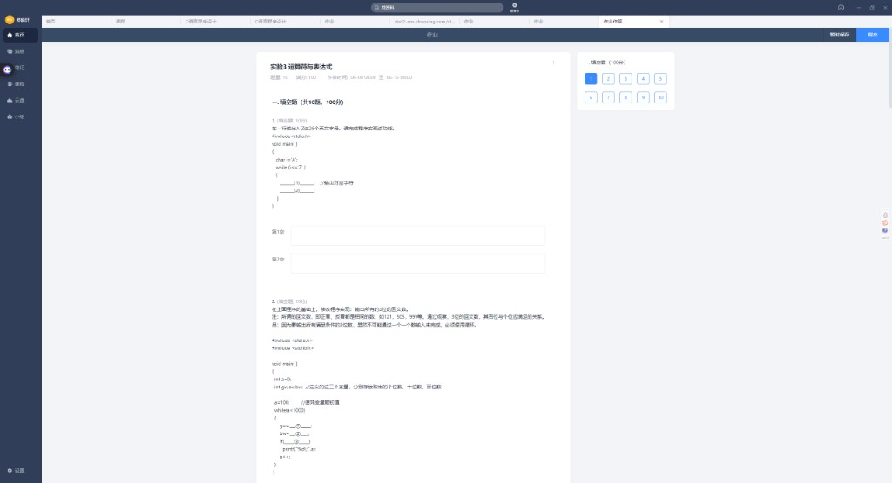
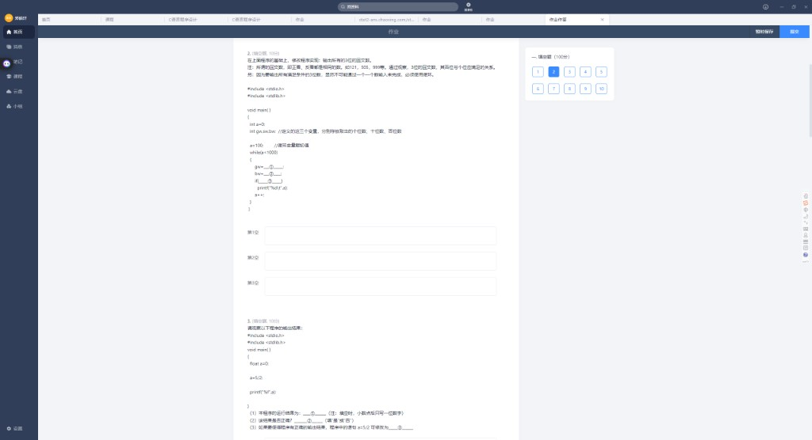
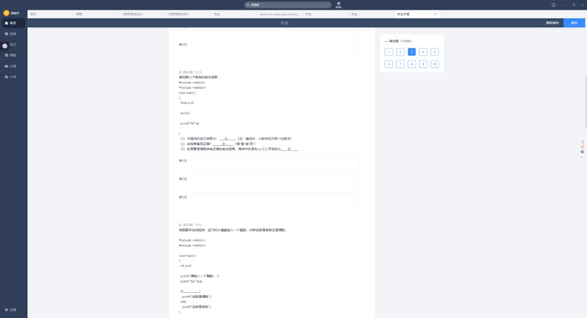
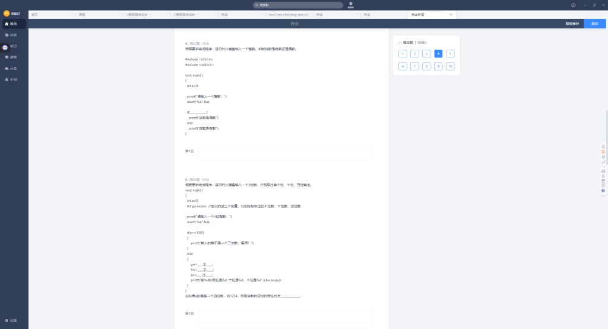
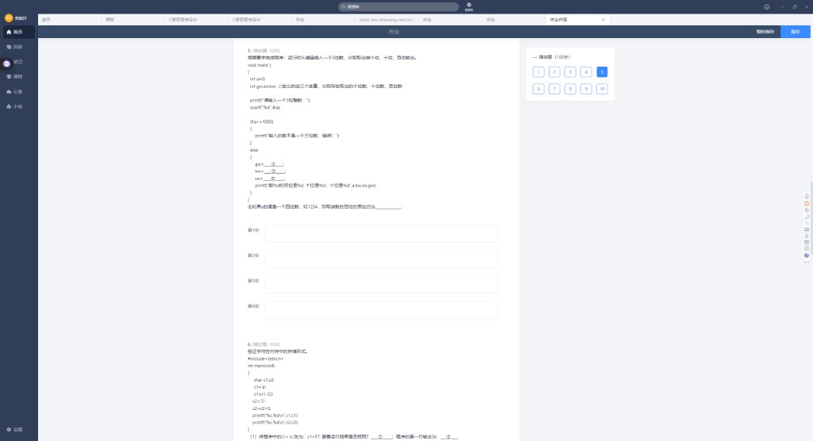
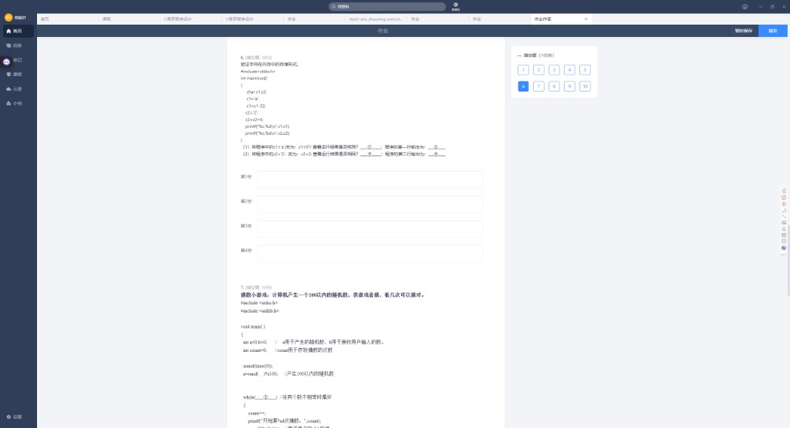
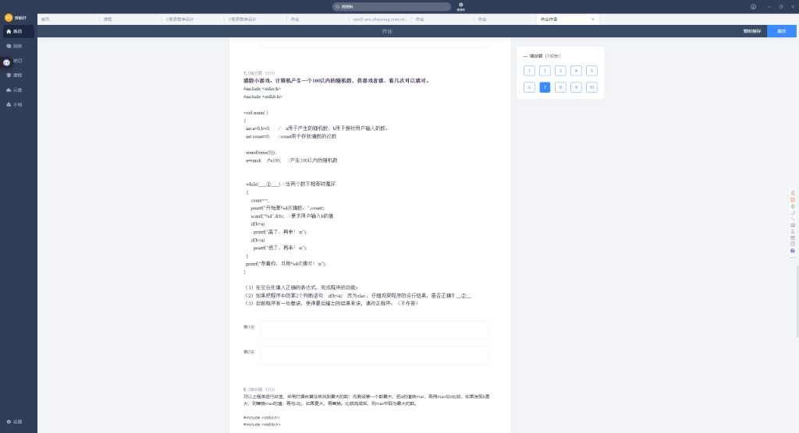
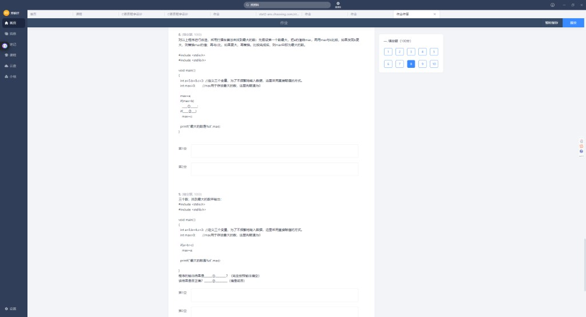
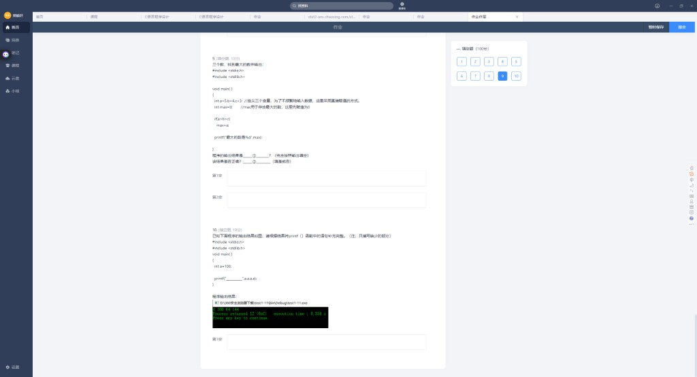

# 实验3 · 运算符与表达式（填空题 1~10）

> 整理日期：2026-06-14  
> 满分 100 分，共 10 题

---

## 目录

1. [第 1 题 · 输出 A~Z](#第-1-题)
2. [第 2 题 · 三位回文数](#第-2-题)
3. [第 3 题 · 5/2 与 float](#第-3-题)
4. [第 4 题 · 奇偶判断](#第-4-题)
5. [第 5 题 · 拆分三位数](#第-5-题)
6. [第 6 题 · 字符存储形式](#第-6-题)
7. [第 7 题 · 猜数游戏](#第-7-题)
8. [第 8 题 · 擂台法求 max](#第-8-题)
9. [第 9 题 · 连环比较陷阱](#第-9-题)
10. [第 10 题 · printf 多格式输出](#第-10-题)

---

## 第 1 题



在一行输出 A~Z 共 26 个字母。

```c
char i = 'A';
while (i <= 'Z')
{
    ____(1)____;   // 输出字符
    ____(2)____;
}
```

| 空 | 参考答案 |
|----|----------|
| (1) | `printf("%c", i)` |
| (2) | `i++` 或 `i = i + 1` |

---

## 第 2 题



输出所有三位回文数（百位 = 个位，如 121、505、999）。

```c
a = 100;
while (a < 1000)
{
    gw = ____(1)____;
    bw = ____(2)____;
    if (____(3)____)
        printf("%d\t", a);
    a++;
}
```

| 空 | 参考答案 | 含义 |
|----|----------|------|
| (1) | `a % 10` | 个位 |
| (2) | `a / 100` | 百位 |
| (3) | `gw == bw` | 个位等于百位 |

---

## 第 3 题



```c
float a = 0;
a = 5/2;
printf("%f", a);
```

| 空 | 参考答案 | 说明 |
|----|----------|------|
| ① 输出（保留一位小数） | **2.0** | `5/2` 整数除法得 2，赋给 float |
| ② 结果是否正确 | **否** | 数学上应是 2.5 |
| ③ 如何改正 | **`a = 5.0/2`** 或 `a = 5/2.0` 或 `a = (float)5/2` | 至少一边是小数/浮点 |

### ⚠️ 避坑指南

`float a` 救不了 `5/2`——除法发生在赋值**之前**，两边都是 int 就先截断了。

---

## 第 4 题



输入整数，判断奇偶（`if` 里判断**偶数**）：

```c
scanf("%d", &a);
if (______)
    printf("该数是偶数");
else
    printf("该数是奇数");
```

| 参考答案 |
|----------|
| `a % 2 == 0` |

---

## 第 5 题



输入三位数，输出个、十、百位：

```c
gw = __①__;
bw = __②__;
sw = __③__;
printf("该数的百位是%d, 十位是%d, 个位是%d", bw, sw, gw);
```

| 空 | 参考答案 |
|----|----------|
| ① 个位 | `a % 10` |
| ② 百位 | `a / 100` |
| ③ 十位 | `a / 10 % 10` 或 `(a % 100) / 10` |
| ④ 四位数 1234 的百位 | `a / 100 % 10` 或 `1234/100%10` → **2** |

**记忆**：个 `%10`，百 `/100`，十 `/10%10`

---

## 第 6 题



```c
c1 = 'a';
c1 = c1 - 32;      // 'A'，ASCII 65
c2 = '2';
c2 = c2 + 5;       // '2' 的 ASCII 50 + 5 = 55 → 字符 '7'
printf("%c, %d\n", c1, c1);
printf("%c, %d\n", c2, c2);
```

| 空 | 参考答案 |
|----|----------|
| ① `c1=97` 与 `c1='a'` 结果相同？ | **是**（97 就是 `'a'` 的 ASCII） |
| ② 第一行输出 | **`A, 65`** |
| ③ `c2='2'` 改为 `c2=2` 结果相同？ | **否**（`'2'`=50，2 是数值 2） |
| ④ 第二行输出（`c2='2'` 时） | **`7, 55`**（字符 `7`，ASCII 55） |

### 对比 `c2='2'` vs `c2=2`

| 写法 | c2+5 后 | `%c` | `%d` |
|------|---------|------|------|
| `c2='2'` | 50+5=55 | `7` | 55 |
| `c2=2` | 2+5=7 | 不可见控制符 | 7 |

---

## 第 7 题



猜数游戏（`rand()%100` 产生随机数）：

```c
srand(time(0));
a = rand() % 100;
while (____①____)   // 两数不等时循环
{
    count++;
    scanf("%d", &b);
    if (b > a) printf("高了，再来！\n");
    if (b < a) printf("低了，再来！\n");
}
printf("恭喜你，共用%d次猜对!\n");  // ❌ 缺参数
```

| 空 | 参考答案 |
|----|----------|
| ① while 条件 | **`a != b`** 或 `b != a` |
| ② 第二个 `if` 改 `else` 是否正确 | **否**（猜对时 b==a，会误走 else 输出"低了"） |
| ③ 程序错误（需改正） | 最后一行应写 **`printf("恭喜你，共用%d次猜对!\n", count);`** |

另：使用 `time(0)` 需 `#include <time.h>`

---

## 第 8 题



擂台法求三数最大（`a=5, b=8, c=3`）：

```c
max = a;
if (max < b)
    ____①____;
if (____②____)
    max = c;
```

| 空 | 参考答案 |
|----|----------|
| ① | `max = b` |
| ② | `max < c` 或完整 `if (max < c)` |

运行结果：`最大的数是8`

---

## 第 9 题



```c
int a=5, b=4, c=3, max=0;
if (a > b > c)
    max = a;
printf("最大的数是%d", max);
```

| 空 | 参考答案 |
|----|----------|
| ① 程序输出（完全按输出填） | **`最大的数是0`** |
| ② 结果是否正确 | **否** |

**解析**：`a>b>c` → `(5>4)>3` → `1>3` → 0（假），`max` 保持 0。

（与单选题第 14 题连环比较同一考点）

---

## 第 10 题

`a=100`，运行输出：`100 64 144`

```c
int a = 100;
printf("________", a, a, a);
```

| 参考答案 |
|----------|
| **`%d %x %o`** 或 `%d %x %o`（中间有空格） |

| 格式 | 含义 | 100 的输出 |
|------|------|------------|
| `%d` | 十进制 | 100 |
| `%x` | 十六进制 | 64 |
| `%o` | 八进制 | 144 |

验算：八进制 144 = 1×64 + 4×8 + 4 = 100 ✓

---

## 速记卡片

| 知识点 | 一句话 |
|--------|--------|
| 取个位 | `n % 10` |
| 取十位 | `n / 10 % 10` |
| 取百位 | `n / 100`（三位数）或 `n/100%10`（四位数） |
| 整数除法 | `5/2=2`，float 变量救不了 |
| 字符 vs 数字 | `'2'` 是 ASCII 50，`2` 是数值 2 |
| while 猜数 | 条件 `a!=b`；printf 别忘了 `count` |
| a>b>c | `(a>b)>c`，不是数学连比 |
| 同一数多格式 | `%d %x %o` → 十进制、十六、八进制 |

---

## 附录：原始截图索引

| 文件名 | 内容 |
|--------|------|
| `01_题目1-2.png` | 第 1、2 题 |
| `02_题目2-3.png` | 第 2、3 题 |
| `03_题目3-4.png` | 第 3、4 题 |
| `05_题目2.png` | 第 2 题 |
| `06_题目3-4.png` | 第 3、4 题 |
| `07_题目4-5.png` | 第 4、5 题 |
| `08_题目5-6.png` | 第 5、6 题 |
| `09_题目6-7.png` | 第 6、7 题 |
| `10_题目7-8.png` | 第 7、8 题 |
| `11_题目8-9.png` | 第 8、9 题 |
| `12_题目9-10.png` | 第 9、10 题 |

---

*实验1 见 `实验1_填空题.md`；单选题见 `错题本_第二批.md`、`错题本_第三批.md`。*
