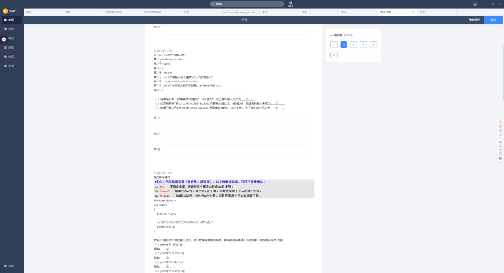
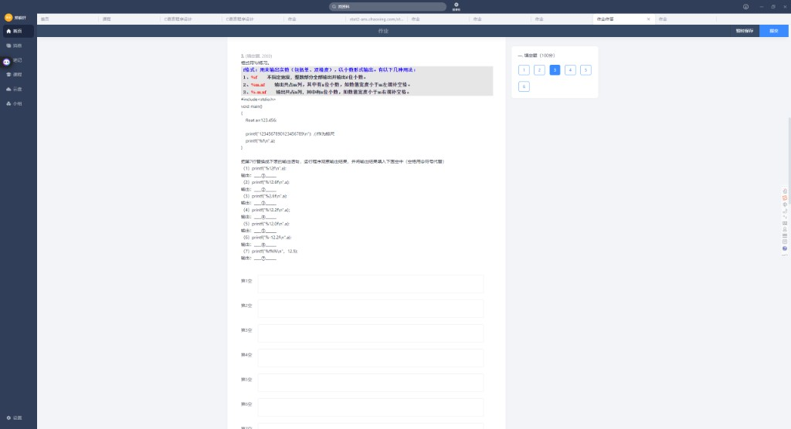
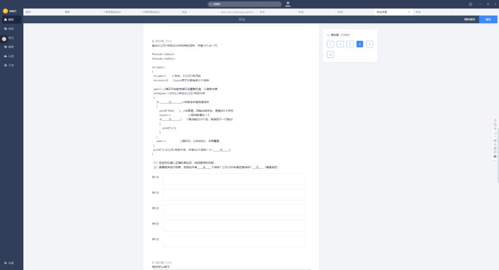
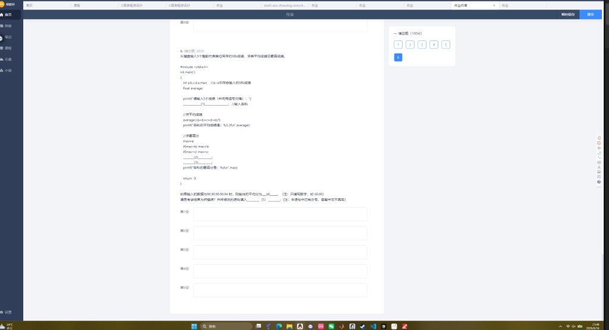

# 实验4 · 输入输出（填空题 1~6）

> 整理日期：2026-06-14  
> 满分 100 分，共 6 题

---

## 目录

1. [第 1 题 · scanf 缺 &](#第-1-题)
2. [第 2 题 · scanf 格式串匹配](#第-2-题)
3. [第 3 题 · printf %f 格式](#第-3-题)
4. [第 4 题 · 输出闰年](#第-4-题)
5. [第 5 题 · printf %d 格式](#第-5-题)
6. [第 6 题 · 五科成绩平均与最高分](#第-6-题)

---

## 第 1 题


```c
scanf("%d %d", a, b);   // ❌ 错误
```

| 空 | 参考答案 |
|----|----------|
| ① 运行结果是否正确 | **否** |
| ② 修改后的语句 | **`scanf("%d %d", &a, &b);`** |

### ⚠️ 避坑指南

`scanf` 第二个参数起必须是**地址**（`&变量名`），否则段错误或读不到数据。

---

## 第 2 题



```c
scanf("a=%d, n=%d", &a, &n);
```

| 空 | 格式串 | 正确输入方式 |
|----|--------|--------------|
| ① | `a=%d, n=%d` | **`a=3, n=5`**（与格式串逐字匹配） |
| ② | `%d %d` | **`3 5`**（空格分隔） |
| ③ | `%d%d` | **`3 5`** 或 **`3` 回车 `5`**（不能写 `35`，会被当成一个数） |

---

## 第 3 题



`float a = 123.456`，用 `@` 表示空格。

### 格式规则速记

| 格式 | 含义 |
|------|------|
| `%f` | 默认 6 位小数 |
| `%m.nf` | 总宽 m，小数 n 位，**右对齐**（左边补空格） |
| `%-m.nf` | 总宽 m，**左对齐**（右边补空格） |
| `%ms` | 字符串宽 m，右对齐 |

### 填空答案

| 空 | 语句 | 输出（@=空格） |
|----|------|----------------|
| ① | `printf("%f\n", a)` | `123.456000` |
| ② | `printf("%12f\n", a)` | `@@123.456000`（12 位宽，右对齐） |
| ③ | `printf("%2.1f\n", a)` | `123.5`（宽 2 不够则按实际输出） |
| ④ | `printf("%12.2f\n", a)` | `@@@@@@123.46`（6 空格 + 123.46） |
| ⑤ | `printf("%-12.0f\n", a)` | `123@@@@@@@@@`（左对齐，0 位小数） |
| ⑥ | `printf("%-12.2f\n", a)` | `123.46@@@@@@` |
| ⑦ | `printf("%9s\n", "12.5")` | `@@@@@12.5`（5 空格 + 12.5） |

> 平台若要求写实际空格，把 `@` 换成空格即可。

---

## 第 4 题



输出公元 1~2023 年所有闰年，每行 10 个。

```c
while (year <= 2023)
{
    if (____①____)
    {
        printf("%5d", ____);      // 年
        count++;
        if (____②____)
            printf("\n");
    }
    year++;
}
printf("...共 %d 个闰年", ____③____);
```

| 空 | 参考答案 |
|----|----------|
| ① 闰年条件 | **`(year%4==0 && year%100!=0) \|\| (year%400==0)`** |
| printf 中 | **`year`** |
| ② 每 10 个换行 | **`count % 10 == 0`** |
| ③ 总数参数 | **`count`** |
| ④ 共有多少个闰年 | **490** |
| ⑤ 1000 年是闰年吗 | **否** |

### 闰年判断口诀

- 能被 4 整除 **且** 不能被 100 整除 → 闰年
- **或者** 能被 400 整除 → 闰年
- 1000：能被 100 整除但不能被 400 整除 → **不是**闰年

### ④ 验算公式

```
闰年个数 = n/4 - n/100 + n/400
2023/4 - 2023/100 + 2023/400 = 505 - 20 + 5 = 490
```

---

## 第 5 题


`int k = 1234`，`*` 用于观察对齐。

| 空 | 语句 | 输出 |
|----|------|------|
| ① | `printf("%8d*\n", k)` | `    1234*`（4 前导空格） |
| ② | `printf("%2d\n", k)` | `1234`（实际 4 位 > 2，按实际输出） |
| ③ | `printf("%06d\n", k)` | `001234`（前导补 0） |
| ④ | `printf("%-8d*\n", k)` | `1234    *`（4 尾随空格，左对齐） |

### %d 格式速记

| 格式 | 效果 |
|------|------|
| `%md` | 右对齐，左边补空格 |
| `%0md` | 右对齐，左边补 **0** |
| `%-md` | 左对齐，右边补空格 |
| 实际位数 > m | 按实际宽度输出，不截断 |

---

## 第 6 题



输入 5 科成绩，求平均分和最高分。

| 空 | 参考答案 |
|----|----------|
| (1) 输入 | **`scanf("%d %d %d %d %d", &a, &b, &c, &d, &e);`** |
| (2) | **`if (max < d) max = d;`** |
| (3) | **`if (max < e) max = e;`** |
| (4) 输入 90,80,80,90,84 的平均分 | **84.00** |
| (5) 改正平均分错误 | **`average = (a + b + c + d + e) / 5.0`** |

### ④ 为何是 84.00 不是 84.80？

```c
average = (a+b+c+d+e) / 5;   // 整数除法！
(90+80+80+90+84) / 5 = 424/5 = 84
```

用 `%5.2f` 打印 → **`84.00`**

数学平均 84.8，但 C 里先整除再赋给 float。

### (5) 改正

至少一边用浮点：`/ 5.0` 或 `(float)(a+b+c+d+e)/5`

---

## 速记卡片

| 知识点 | 一句话 |
|--------|--------|
| scanf | 必须 `&变量`；格式串与输入逐字匹配 |
| %f | 默认 6 位小数；%m.nf 右对齐；%-m.nf 左对齐 |
| %d | %8d 补空格；%06d 补 0；%-8d 左对齐 |
| 闰年 | 4 整除且 100 不整除，或 400 整除 |
| 平均分 | 全 int 则 `/5` 整除，要 `/5.0` |

---

## 附录：原始截图索引

| 文件名 | 内容 |
|--------|------|
| `01_题目1-2.png` | 第 1、2 题 |
| `02_题目2-3.png` | 第 2、3 题 |
| `03_题目3_printf格式.png` | 第 3 题 %f 格式 |
| `04_题目4_闰年.png` | 第 4 题闰年 |
| `05_题目5.png` | 第 5 题 %d 格式 |
| `06_题目6.png` | 第 6 题五科成绩 |

---

*实验3 见 `实验3_填空题.md`；scanf 深入见 `错题本_第一批.md`。`*
