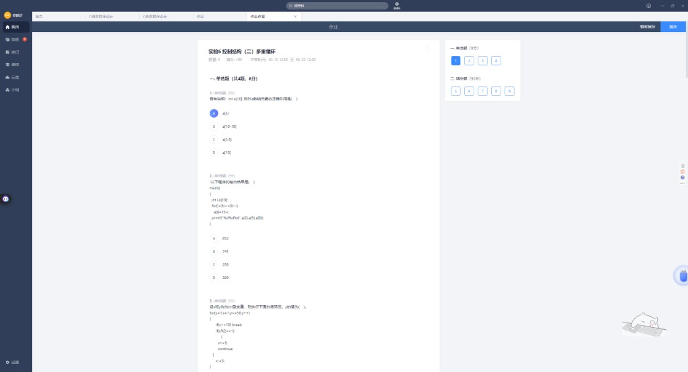
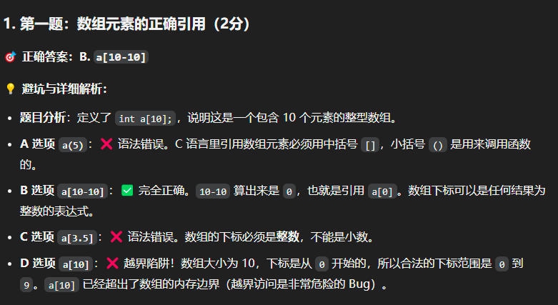
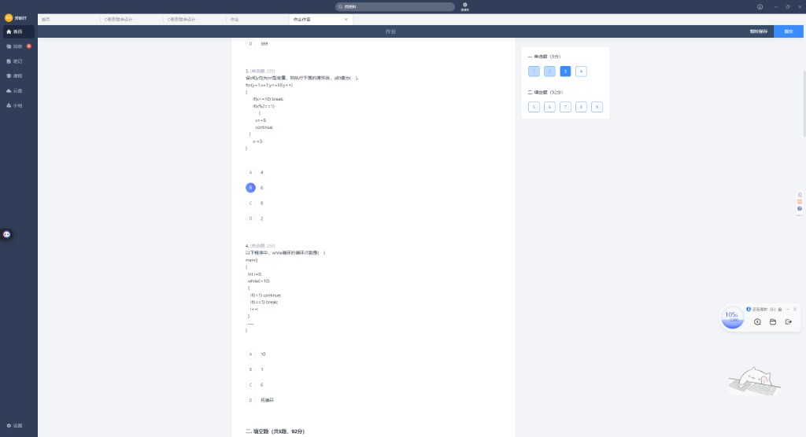
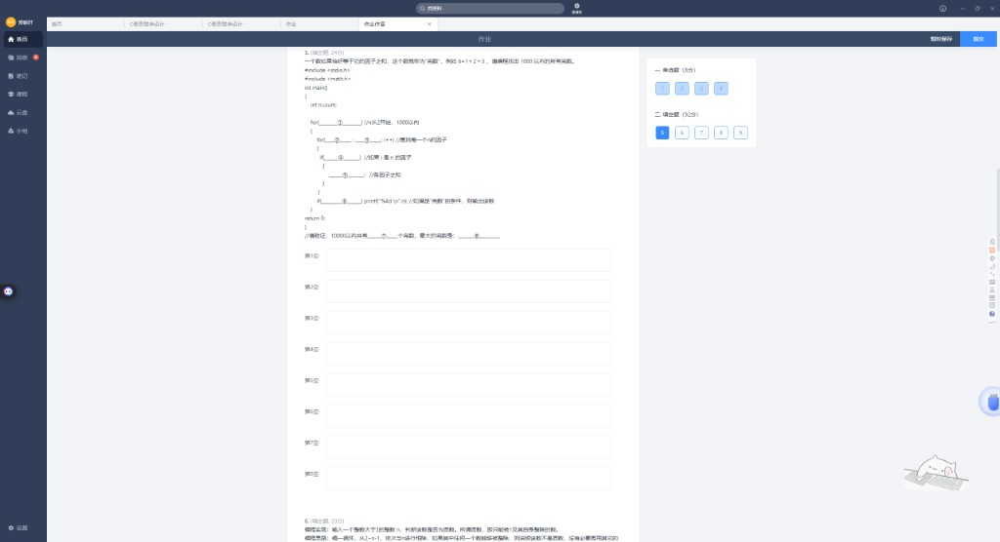
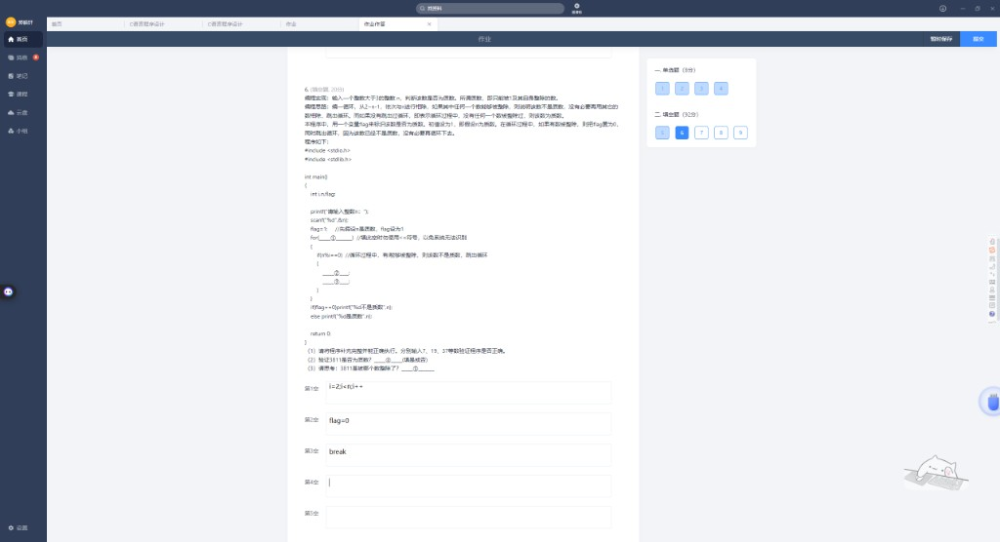
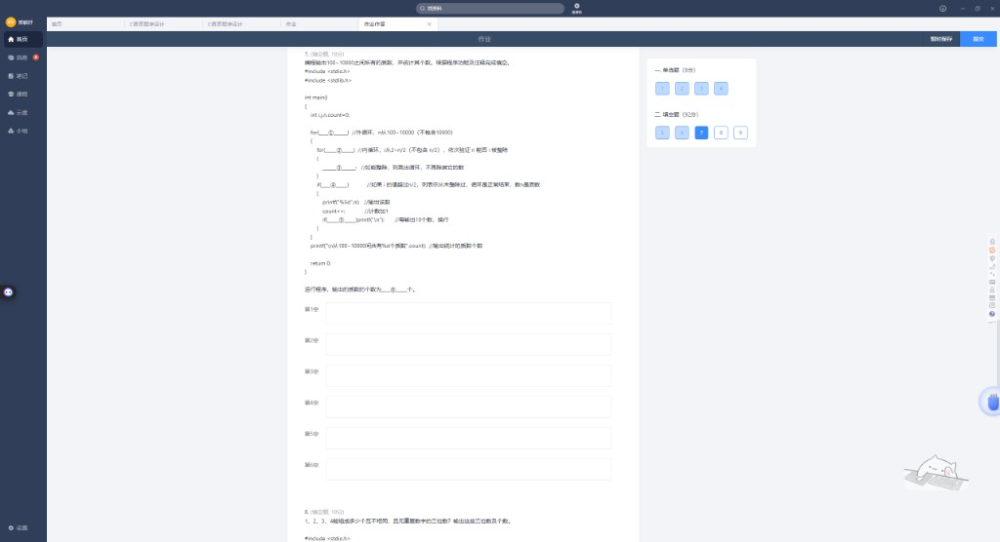
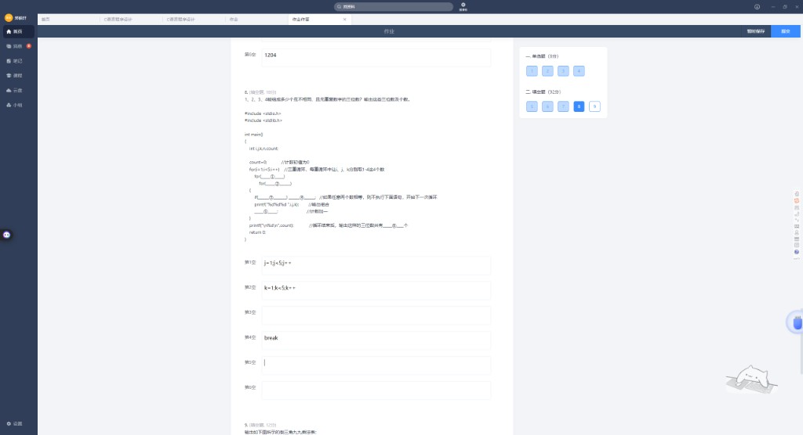
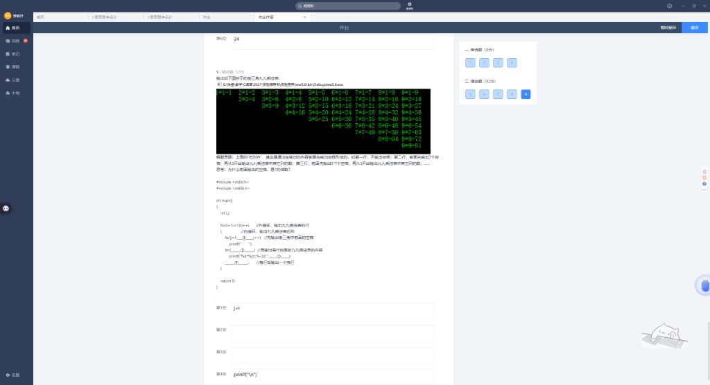

# 实验6 · 控制结构（二）多重循环

> 整理日期：2026-06-14  
> 单选 4 题（8 分）+ 填空 5 题（92 分）

---

## 目录

### 单选题
- [第 1 题 · 数组下标](#单选-第-1-题)
- [第 2 题 · 数组赋值输出](#单选-第-2-题)
- [第 3 题 · break 与 continue](#单选-第-3-题)
- [第 4 题 · while 死循环](#单选-第-4-题)

### 填空题
- [第 5 题 · 完数](#填空-第-5-题)
- [第 6 题 · 判断质数](#填空-第-6-题)
- [第 7 题 · 100~10000 质数](#填空-第-7-题)
- [第 8 题 · 1~4 组成三位数](#填空-第-8-题)
- [第 9 题 · 右上三角九九表](#填空-第-9-题)

---

## 单选 第 1 题




`int a[10];` 合法下标范围 **0~9**。

| 选项 | 判断 |
|------|------|
| A `a[5]` | ✓ 合法（也正确） |
| **B `a[10-10]`** | ✓ **标准答案**（= `a[0]`，下标可以是表达式） |
| C `a[3.5]` | ✗ 下标必须是整数 |
| D `a[10]` | ✗ **越界** |

---

## 单选 第 2 题

```c
for(i=9; i>=0; i--)
    a[i] = 10 - i;
printf("%d%d%d", a[2], a[5], a[8]);
```

| i | a[i]=10-i |
|---|-----------|
| 9 | 1 |
| 8 | 2 |
| … | … |
| 2 | **8** |
| 5 | **5** |

| 答案 |
|------|
| **A. 852** |

---

## 单选 第 3 题



```c
for(y=1, x=1; y<=50; y++)
{
    if(x>=10) break;
    if(x%2==1) { x+=5; continue; }
    x-=3;
}
```

| y | x 变化 |
|---|--------|
| 1 | x=1→6 (continue) |
| 2 | x=6→3 |
| 3 | x=3→8 (continue) |
| 4 | x=8→5 |
| 5 | x=5→10 (continue) |
| 6 | x=10，break |

| 你的答案 | 正确答案 |
|----------|----------|
| B 6 ✓ | **B. 6** |

---

## 单选 第 4 题

```c
int i=0;
while(i<10)
{
    if(i<1) continue;
    if(i==5) break;
    i++;
}
```

`i=0` 时 `continue` 跳过 `i++`，**i 永远为 0** → 死循环。

| 答案 |
|------|
| **D. 死循环** |

---

## 填空 第 5 题



完数：等于所有因子之和（如 6=1+2+3）。

| 空 | 参考答案 |
|----|----------|
| ① 外循环 n | **`n=2; n<1000; n++`** |
| ② 内循环 i 初值 | **`i=1`** |
| ③ 内循环条件 | **`i<n`** |
| ④ 是因子 | **`n%i==0`** |
| ⑤ 累加 | **`sum+=i`** 或 `sum=sum+i` |
| ⑥ 是完数 | **`sum==n`** |
| ⑦ 10000 以内个数 | **4**（6, 28, 496, 8128） |
| ⑧ 最大完数 | **8128** |

1000 以内完数：**6, 28, 496**（3 个）。

---

## 填空 第 6 题



| 空 | 你的答案 | 参考答案 |
|----|----------|----------|
| ① for | `i=2;i<n;i++` ✓ | **`i=2; i<n; i++`** |
| ② 发现因子 | `flag=0` ✓ | **`flag=0`** |
| ③ 退出 | `break` ✓ | **`break`** |
| ④ 3111 是质数吗 | | **否** |
| ⑤ 能被谁整除 | | **3**（3111÷3=1037） |

---

## 填空 第 7 题



输出 100~10000 之间（不含 10000）所有质数，每行 10 个。

| 空 | 参考答案 |
|----|----------|
| ① 外循环 | **`n=100; n<10000; n++`** |
| ② 内循环 | **`j=2; j<n/2; j++`** |
| ③ 能整除则 | **`n%j==0`** |
| ④ 是质数 | **`j>=n/2`**（内循环正常结束，未 break） |
| ⑤ 换行 | **`count%10==0`** |
| ⑥ 质数个数 | **1204** |

---

## 填空 第 8 题



用 1、2、3、4 组成无重复数字的三位数。

| 空 | 你的答案 | 参考答案 |
|----|----------|----------|
| ① | `j=1;j<5;j++` ✓ | **`j=1; j<5; j++`** |
| ② | `k=1;k<5;k++` ✓ | **`k=1; k<5; k++`** |
| ③ 有重复则跳过 | | **`i==j \|\| i==k \|\| j==k`** |
| ④ | `break` | **`continue`**（跳过本次，不是跳出全部） |
| ⑤ 计数 | | **`count++`** |
| ⑥ 共有几个 | | **24**（4×3×2=24） |

### ⚠️ 避坑

有重复应 **`continue`** 进入下一组合，不是 `break` 结束整个循环。

---

## 填空 第 9 题



右上三角九九表：第 i 行先打 **(i-1) 组空格**，再打 **i×i 到 9×i**。

```c
for(i=1; i<=9; i++)
{
    for(j=1; j<i; j++)          // ① 打前面的空格
        printf("       ");
    for(j=i; j<=9; j++)         // ② 打印本行算式
        printf("%d*%d=%-2d ", j, i, i*j);  // ③
    printf("\n");               // ④
}
```

| 空 | 你的答案 | 参考答案 |
|----|----------|----------|
| ① 空格循环 | `j<i` ✓ | **`j<i`**（或 `j<=i-1`） |
| ② 算式循环 | | **`j=i; j<=9; j++`** |
| ③ printf 参数 | | **`j, i, i*j`** |
| ④ 换行 | `printf("\n")` ✓ | **`printf("\n")`** |

每行第 1 行 9 个式子，第 2 行 8 个…第 9 行 1 个，形成右上三角。

---

## 速记卡片

| 知识点 | 一句话 |
|--------|--------|
| 数组下标 | 0~n-1，可以是表达式，不能是小数 |
| continue | 跳过本轮剩余，**别忘了后面的 i++** |
| 完数 | 因子之和等于自身；10000 内 4 个 |
| 质数 | 2~n-1 试除；3111 被 3 整除 |
| 内循环 j>=n/2 | 没 break 说明是质数 |
| 排列组合 | 4 取 3 排列 = 24 |
| 九九表右上 | 先 (i-1) 组空格，j 从 i 到 9 |

---

## 附录：截图索引

| 文件 | 内容 |
|------|------|
| `01_单选1-3.png` | 单选 1~3 |
| `02_第1题数组解析.png` | 数组下标解析 |
| `03_单选3-4.png` | 单选 3~4 |
| `04~08` | 填空 5~9 |

---

*break/continue 详见 `选择结构_填空题.md` 第 38 题、`错题本_第三批.md`。*
