# 实验7 · 数组与排序（7-8 章填空）

> 整理日期：2026-06-18  
> 填空题 2~8 题（共 8 题 / 96 分）· 第 1 题截图未提供

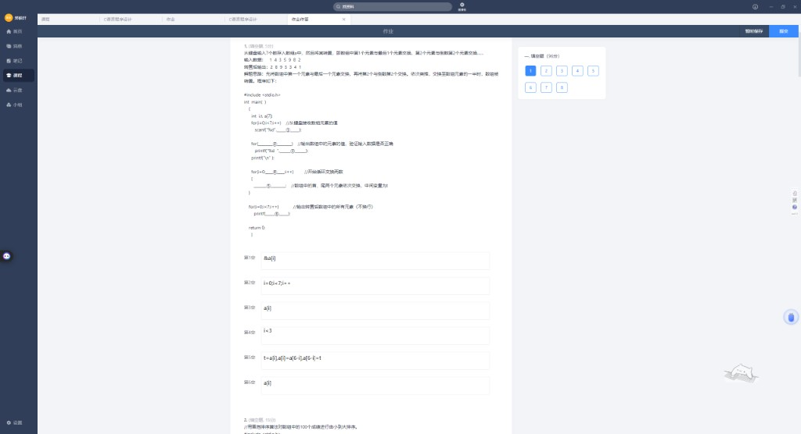

---

## 目录

- [第 2 题 · 冒泡排序 100 个数](#第-2-题--冒泡排序)
- [第 3 题 · 选择排序 10 个数](#第-3-题--选择排序)
- [第 4 题 · 二维数组转置 3×4](#第-4-题--矩阵转置)
- [第 5 题 · 按行输出并求行和](#第-5-题--行求和)
- [第 6 题 · 100 成绩最高/最低/平均](#第-6-题--最高最低平均)
- [第 7 题 · 字符串长度与 scanf](#第-7-题--字符串长度)
- [第 8 题 · 30 人 4 科成绩统计](#第-8-题--成绩二维数组)

---

## 第 2 题 · 冒泡排序

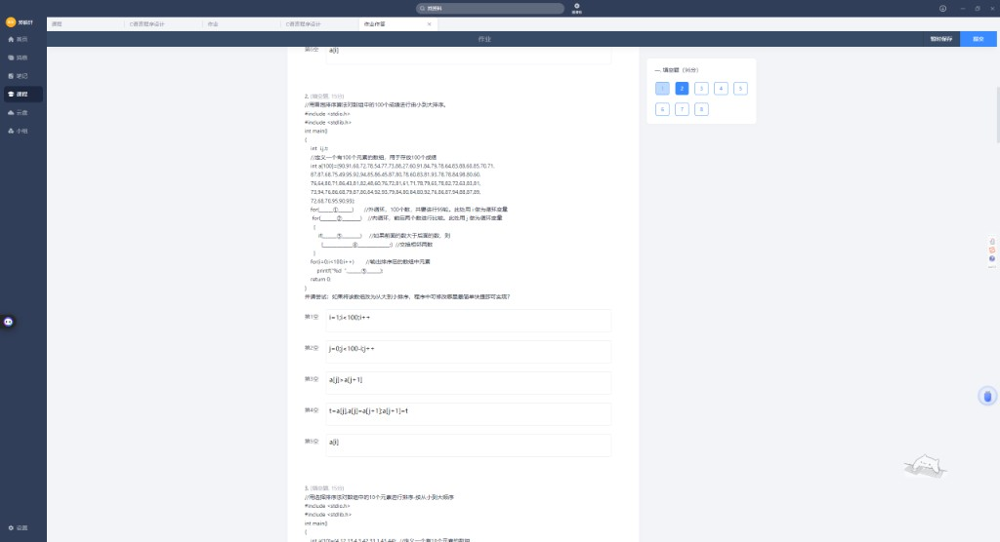

100 个数**从小到大**冒泡排序。

| 空 | 正确答案 | 你的答案 / 易错 |
|----|----------|-----------------|
| ① 外循环 | `i=1;i<100;i++` | ✓（99 轮） |
| ② 内循环 | **`j=0;j<100-i;j++`** | ✗ `j+=2` 跳过相邻对 |
| ③ 比较 | `a[j]>a[j+1]` | ✓ |
| ④ 交换 | `t=a[j];a[j]=a[j+1];a[j+1]=t` | ✓ |
| ⑤ 输出 | `a[i]` | ✓ |

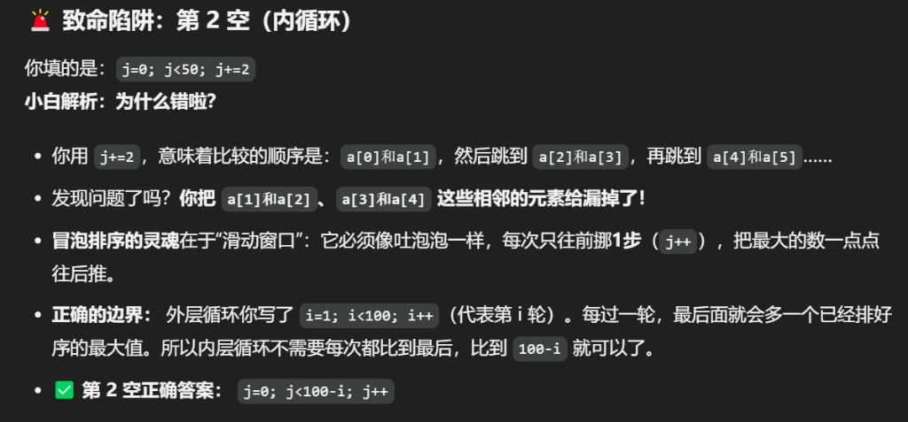

**手推要点**：

- 外循环第 `i` 轮 → 末尾已有 `i` 个最大值 → 内循环只需到 `100-i`
- 内循环必须 **`j++` 步长 1**，像滑动窗口逐个比较相邻元素

**改从大到小**：把 ③ 改成 `a[j]<a[j+1]` 即可。

---

## 第 3 题 · 选择排序

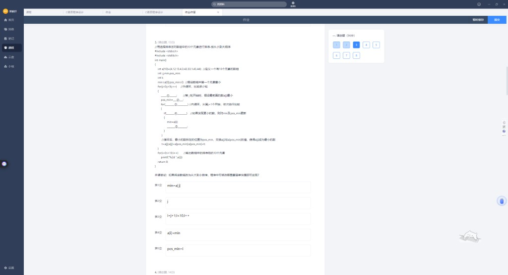

| 空 | 正确答案 |
|----|----------|
| ① | `min=a[j]` |
| ② | `j`（`pos_min=j`） |
| ③ | `i=j+1;i<10;i++` |
| ④ | **`a[i]<min`** |
| ⑤ | `pos_min=i` |

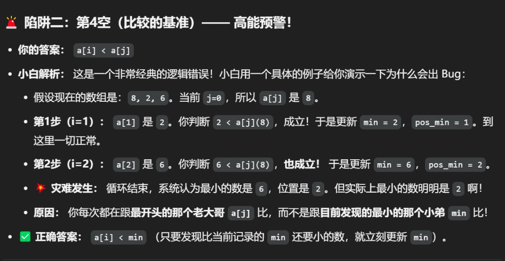

| 你的易错 | 为什么错 |
|----------|----------|
| `a[i]<a[j]` | 每轮都和**固定起点** `a[j]` 比，会把较大值误当成最小 |

**例**：`[8,2,6]`，`j=0` 时比 `a[j]=8` → 最后误选 6 为最小，正确最小是 2。

**改从大到小**：④ 改成 `a[i]>min`。

---

## 第 4 题 · 矩阵转置

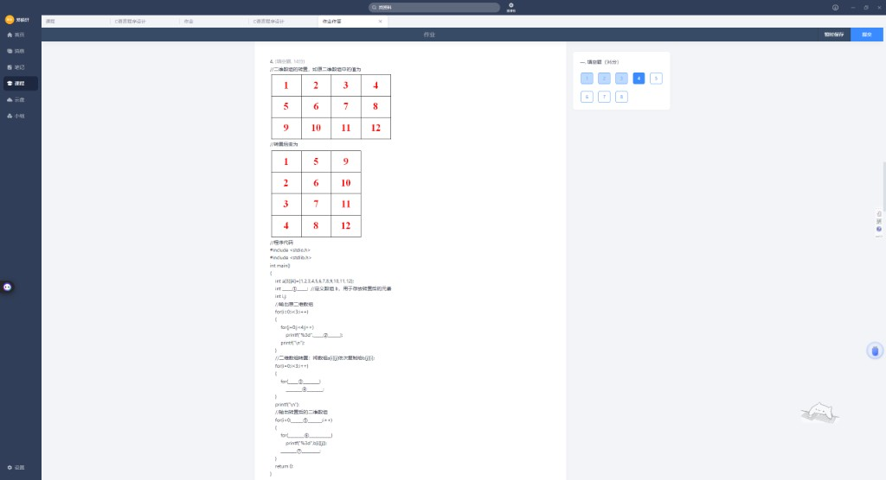
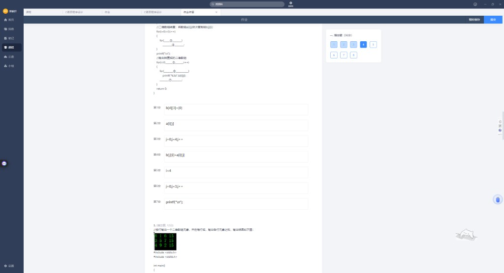

3 行 4 列 → 转置后 4 行 3 列：`b[j][i]=a[i][j]`。

| 空 | 正确答案 |
|----|----------|
| ① 定义 b | `b[4][3]` 或 `b[4][3]={0}` |
| ② 输出原阵 | `a[i][j]` |
| ③ 内循环 | `j=0;j<4;j++` |
| ④ 转置核心 | `b[j][i]=a[i][j]` |
| ⑤ 外循环界 | `i<4` |
| ⑥ 内循环界 | `j=0;j<3;j++` |
| ⑦ 换行 | `printf("\n")` |

---

## 第 5 题 · 行求和

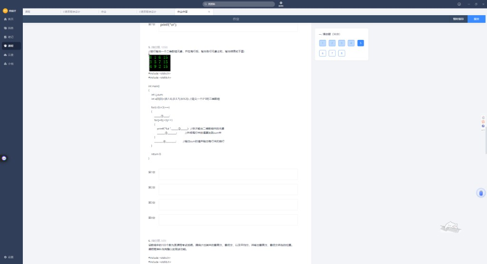
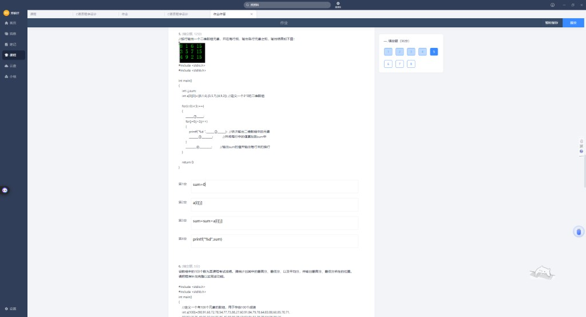

期望输出：

```
8 1 6 15
3 5 7 15
4 9 2 15
```

| 空 | 正确答案 |
|----|----------|
| ① 每行开始 | `sum=0` |
| ② 输出元素 | `a[i][j]` |
| ③ 累加 | `sum=sum+a[i][j]` |
| ④ 输出行和 | `printf("%d\n",sum)` |

---

## 第 6 题 · 最高/最低/平均

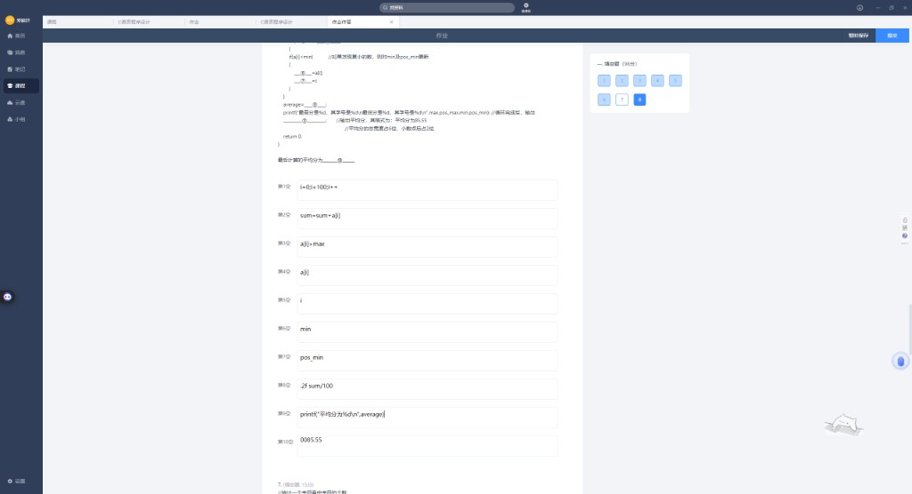
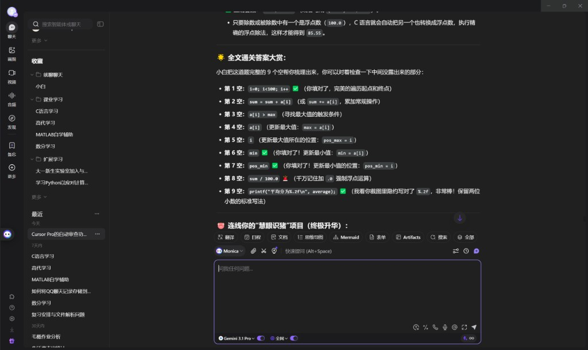

| 空 | 正确答案 | 你的易错 |
|----|----------|----------|
| ① 循环 | `i=0;i<100;i++` | ✓ |
| ② 累加 | `sum=sum+a[i]` | ✓ |
| ③ 比最大 | `a[i]>max` | ✓ |
| ④ 更新 max | `max=a[i]` | ✓ |
| ⑤ 更新位置 | `pos_max=i` | ✓ |
| ⑥ 更新 min | `min=a[i]` | ✓ |
| ⑦ 更新位置 | `pos_min=i` | ✓ |
| ⑧ 平均分 | **`sum/100.0`** | ✗ `sum/100` 整数除法 |
| ⑨ 输出 | **`printf("平均分为%.2f\n",average)`** | ✗ 用了 `%d` |
| ⑩ 结果 | `85.55`（按给定数据） | ✗ 填成 `.2f` 等格式串 |

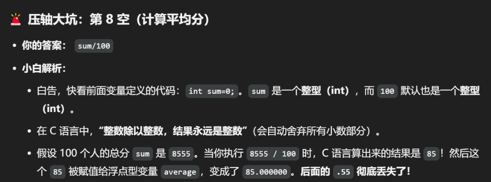

### ⚠️ 避坑指南

- `int / int` → 小数被砍：`8555/100=85`，不是 85.55
- 必须 **`100.0`** 或 `(float)sum/100`
- 输出浮点用 **`%.2f`**，宽度要求时 `%8.2f`

---

## 第 7 题 · 字符串长度

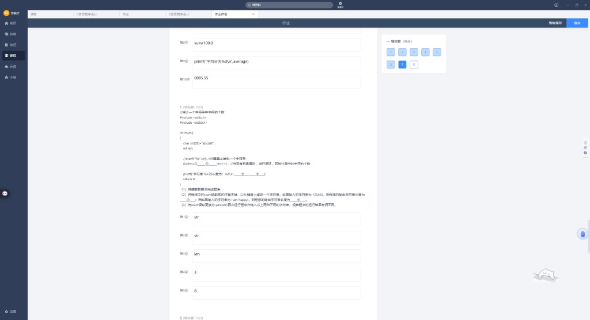
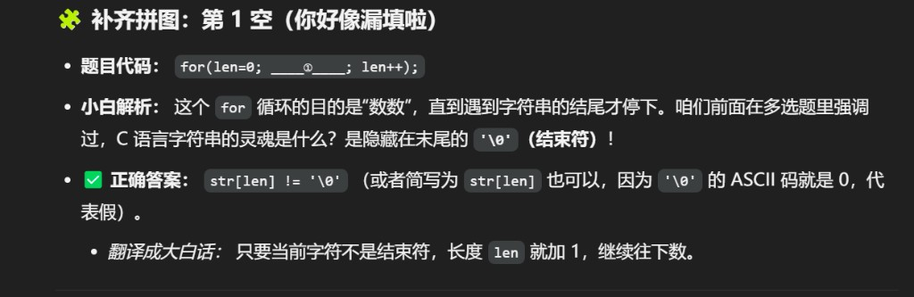
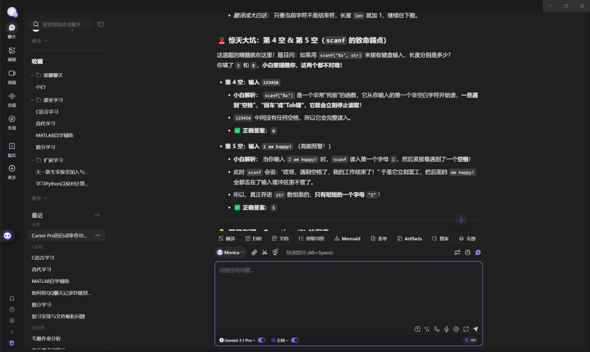

| 空 | 正确答案 | 你的答案 |
|----|----------|----------|
| ① 循环条件 | **`str[len]!='\0'`** 或 `str[len]` | ✗ 漏填 / 只写 `str` |
| ② printf 串 | `str` | ✓ |
| ③ printf 长 | `len` | ✓ |
| ④ 输入 `123456` | **6** | ✗ 3 |
| ⑤ 输入 `I am happy!` | **1** | ✗ 8 |

**scanf `%s` 遇空格就停**：`I am happy!` 只读到 `I`，长度 1。

**gets** 能读整行（含空格），但已不安全，现代 C 用 `fgets`。

---

## 第 8 题 · 成绩二维数组

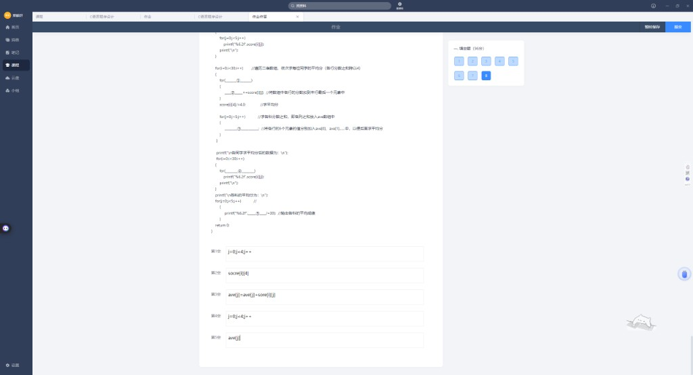


`score[30][5]`：前 4 列为科目，第 5 列存行平均；`ave[5]` 存各科总分。

| 空 | 正确答案 | 你的答案 / 问题 |
|----|----------|-----------------|
| ① 求行均内循环 | `j=0;j<4;j++` | ✓ |
| ② 累加到第 5 列 | **`score[i][4]`** | ✗ 拼写 `socre` |
| ③ 各科累加 | **`ave[j]=ave[j]+score[i][j]`** | ✗ 拼写 `sore` |
| ④ 打印内循环 | **`j=0;j<5;j++`** | ✗ `j<4` 少打印平均列 |
| ⑤ 科均输出 | `ave[j]` | ✓ |

### ⚠️ 避坑指南

1. **变量名拼写**：`score` 不是 `socre` / `sore`
2. **打印范围**：算完平均后要 **`j<5`** 才能输出第 5 列平均分
3. 行平均：`score[i][4]/=4.0`；科平均：`ave[j]/30`

---

## 本卷易错点速记

| 题号 | 易错点 | 一句话 |
|------|--------|--------|
| 2 | `j+=2` | 冒泡内循环必须 `j++` |
| 3 | `a[i]<a[j]` | 选最小要和 `min` 比 |
| 6 | `sum/100` | 平均分要 `100.0` + `%.2f` |
| 7 | scanf 长度 | `%s` 遇空格停，不是整句长度 |
| 8 | 拼写 / j<4 | `score` 别写错；打印要 `j<5` |

---

## 附录：截图索引

| 文件 | 内容 |
|------|------|
| `01` | Monica 7-8 章导读 |
| `02~03` | 第 2 题冒泡排序 |
| `04~05` | 第 3 题选择排序 |
| `06~07` | 第 4 题转置 |
| `08~09` | 第 5 题行求和 |
| `10~11,15` | 第 6 题统计 |
| `12~14` | 第 7 题字符串 |
| `16~17` | 第 8 题成绩表 |

---

*第 1 题截图发来后可继续追加。*
