# 实验9 · 函数（一）

> 整理日期：2026-06-18  
> 全卷 16 题（单选 10 + 填空 6）· **全卷完结**

---

## 目录

### 单选题（1~10）
- [第 1 题 · 隐式 int](#第-1-题)
- [第 2 题 · char 嵌套调用](#第-2-题)
- [第 3 题 · 单向值传递](#第-3-题)
- [第 4 题 · void fun 调用](#第-4-题)
- [第 5 题 · 返回值谁说了算](#第-5-题)
- [第 6 题 · 传值无法交换](#第-6-题)
- [第 8 题 · 递归](#第-8-题)
- [第 9 题 · 隐式 int 再考](#第-9-题)
- [第 10 题 · 嵌套调用求和](#第-10-题)

### 填空题
- [第 11 题 · static 阶乘](#第-11-题)
- [第 12 题 · 100~10000 质数](#第-12-题)
- [第 13 题 · 递归阶乘](#第-13-题)
- [第 14 题 · 奇偶判断](#第-14-题)
- [第 15 题 · 质数判断](#第-15-题)
- [第 16 题 · 幂函数 power](#第-16-题)

### 专题
- [指针酒店示例代码](#专题--指针酒店)

---

## 第 1 题

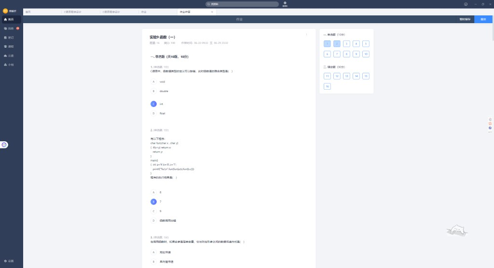

函数返回类型省略 → C89 **隐式 `int`**。

| 你的答案 | 正确答案 |
|----------|----------|
| C ✓ | **C. int** |

---

## 第 2 题

```c
char fun(char x,char y) {
    if(x<y) return x;
    return y;
}
// a='9', b='8', c='7'
fun(fun(a,b), fun(b,c));
// fun('9','8')→'8'；fun('8','7')→'7'；fun('8','7')→'7'
```

| 你的答案 | 正确答案 |
|----------|----------|
| B ✓ | **B. 7** |

---

## 第 3 题

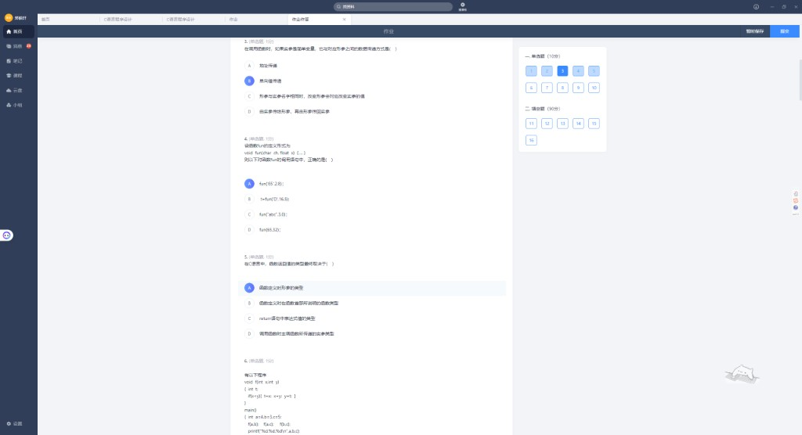

简单变量实参 → **单向值传递**（复印件理论）。

| 你的答案 | 正确答案 |
|----------|----------|
| B ✓ | **B. 单向值传递** |

---

## 第 4 题

`void fun(char ch, float x)` 合法调用：

| 选项 | 判断 |
|------|------|
| **A `fun(65, 2.8)`** | ✓ 65='A' |
| B `t=fun('D',16.5)` | ✗ void 不能赋值 |
| C `fun("abc",3.0)` | ✗ 字符串不是 char |
| D `fun(65,32)` | 第二参 int→float 可转，但 A 更标准 |

| 答案 |
|------|
| **A** |

---

## 第 5 题

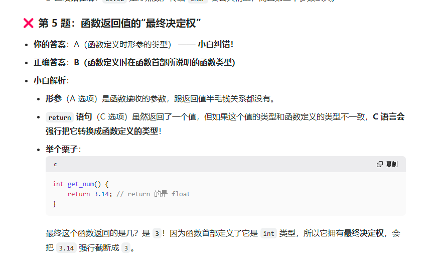

```c
int get_num() { return 3.14; }  // 仍按 int 返回 → 3
```

| 你的答案 | 正确答案 |
|----------|----------|
| A 形参类型 | **B. 函数首部说明的类型** |

形参与返回值无关；`return` 表达式会被首部类型强制转换。

---

## 第 6 题

```c
void f(int x,int y) {
    if(x<y) { t=x; x=y; y=t; }  // 只交换形参副本
}
// f(a,b); f(a,c); f(b,c); → a,b,c 仍是 4,3,5
```

| 答案 |
|------|
| **4, 3, 5** |

---

## 第 8 题

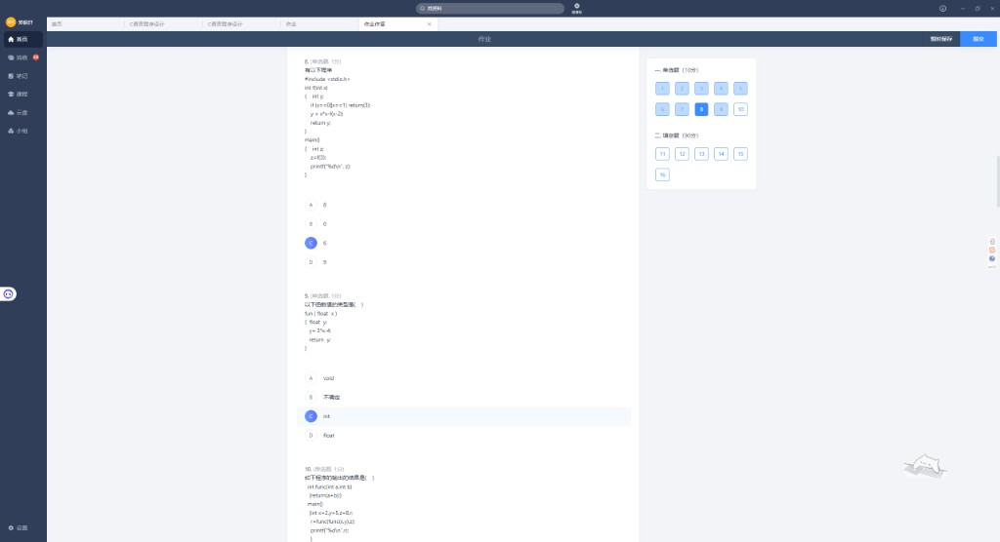

```c
int f(int x) {
    if(x==0||x==1) return 3;
    return x*x - f(x-2);
}
// f(3) = 9 - f(1) = 9 - 3 = 6
```

| 你的答案 | 正确答案 |
|----------|----------|
| C ✓ | **C. 6** |

---

## 第 9 题

```c
fun(float x) { ... return y; }  // 首部无类型 → 隐式 int
```

| 你的答案 | 正确答案 |
|----------|----------|
| C ✓ | **C. int** |

---

## 第 10 题

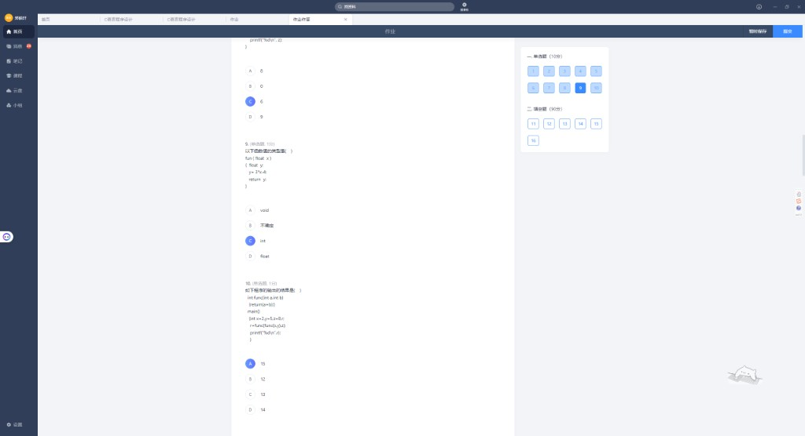

```c
r = func(func(2,5), 8);  // func(7,8) = 15
```

| 你的答案 | 正确答案 |
|----------|----------|
| A ✓ | **A. 15** |

---

## 第 11 题

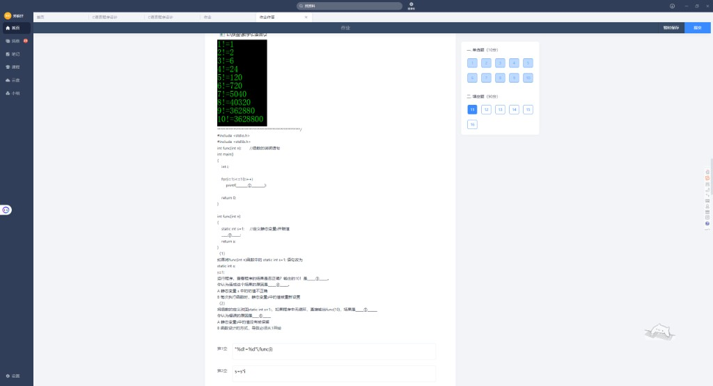
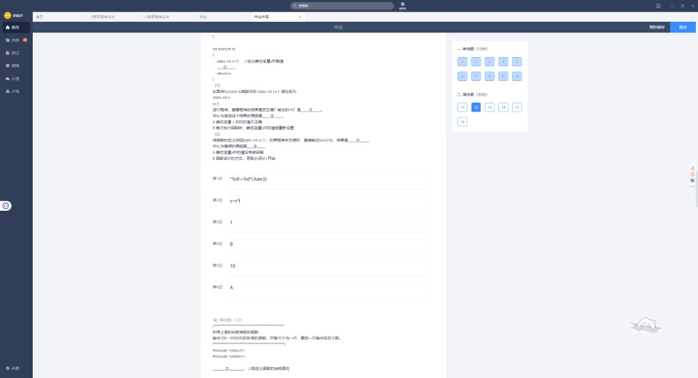

用 `static int s=1` 连续调用 `func(1)…func(10)` 输出 1!~10!。

| 空 | 正确答案 | 你的答案 |
|----|----------|----------|
| ① printf | **`"%d!=%d\n", i, func(i)`** | 缺第一个 `i` |
| ② 累乘 | **`s = s * n`** 或 `s *= n` | `s=s*i` ✗（`i` 是 main 里的变量，func 里不认识） |

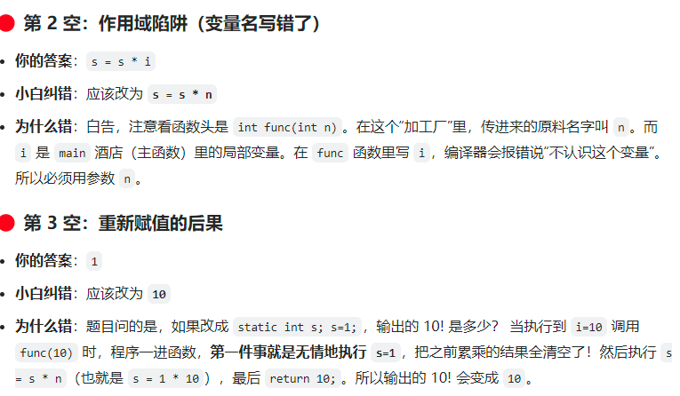

**【⚠️ 避坑】作用域陷阱**：形参叫 `n`，函数体内只能用 `n`，不能写 `main` 里的 `i`。

### (1) 改成 `static int s; s=1;` 会怎样？

每次调用都把 `s` 重置为 1，只能算 `n×1`，**10! 行变成 `10!=10`**。

| 空 | 正确答案 | 你的答案 |
|----|----------|----------|
| ③ 10! 输出 | **10** | 1 |
| ④ 原因 | **B. 每次调用都重置 static** | B ✓ |

### (2) 保持原定义，直接调用 `func(10)`（无循环）

只执行一次 `s=1*10`，结果是 **10**，不是 3628800。

| 空 | 正确答案 | 你的答案 |
|----|----------|----------|
| ⑤ 结果 | **10** | 10 ✓ |
| ⑥ 原因 | **B. 必须从 1 开始依次调用** | A |

---

## 第 12 题

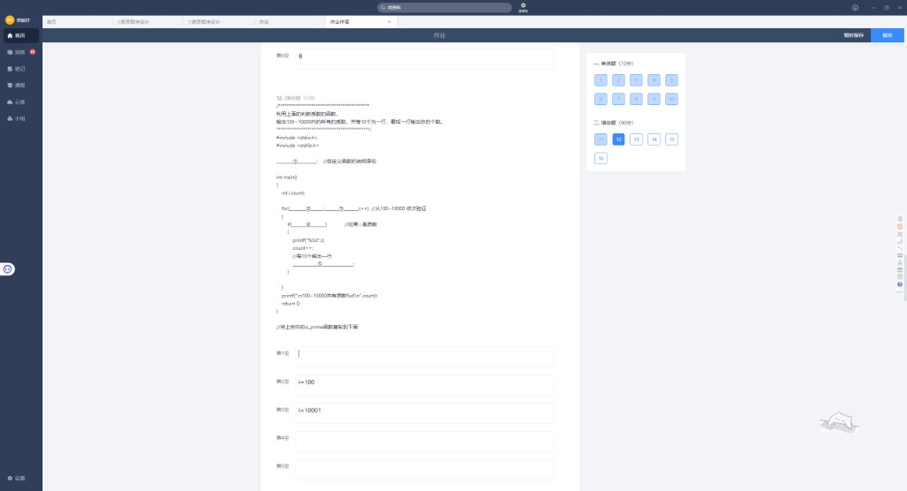
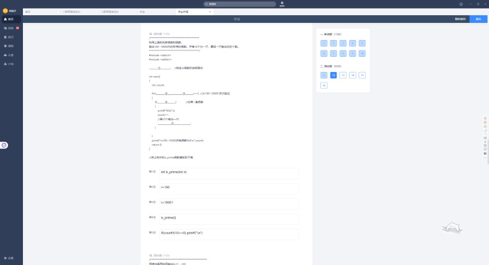

输出 **100~10000 间的所有质数**，每 10 个换行，最后输出总数。（需把前面写的 `is_prime` 函数复制到下方）

| 空 | 正确答案 | 你的答案 |
|----|----------|----------|
| ① 函数声明 | **`int is_prime(int n);`** | — |
| ② for 初值 | **`i = 100`** | `i=100` ✓ |
| ③ for 条件 | **`i < 10001`** 或 `i <= 10000` | `i<10001` ✓ |
| ④ 质数判断 | **`is_prime(i)`** | — |
| ⑤ 每 10 个换行 | **`if(count % 10 == 0) printf("\n")`** | — |

**【⚠️ 避坑】** `count` 要在循环前 **`count = 0`** 初始化，否则 `count++` 从垃圾值开始。

---

## 第 13 题

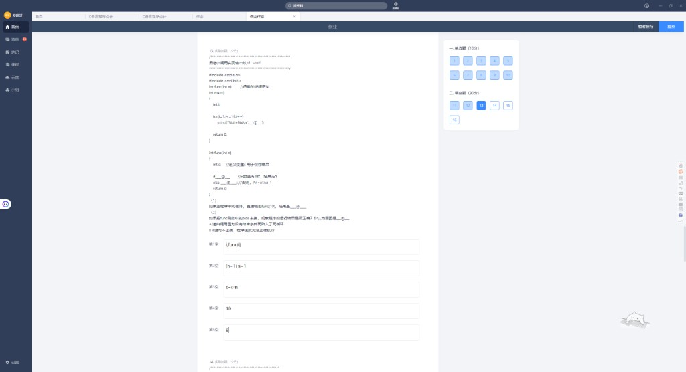
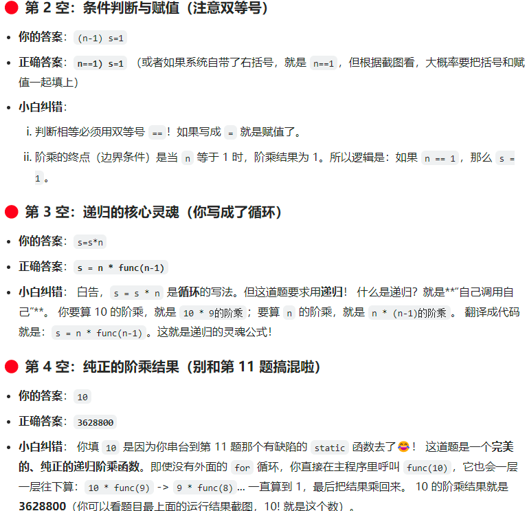
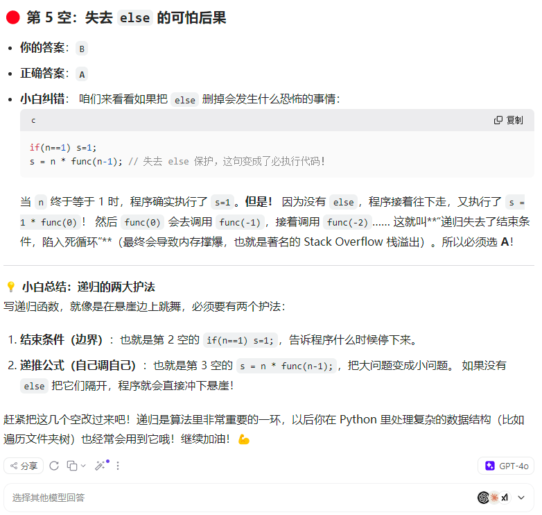

用**递归**实现阶乘，循环输出 1!~10!。

| 空 | 正确答案 | 你的答案 |
|----|----------|----------|
| ① printf 参数 | **`func(i)`** | `i,func(i)` ✓（① 在 `"%d!=%d\n",` 后面） |
| ② 递归边界 | **`n == 1) s = 1`** | `(n=1) s=1` ✗ 要用 `==` 比较 |
| ③ 递归公式 | **`s = n * func(n - 1)`** | `s=s*n` ✗ 那是循环写法 |
| ④ 直接 func(10) | **`3628800`** | `10` ✗ 别和 static 那题混了 |
| ⑤ 去掉 else 后果 | **A. 无终止条件，无限递归** | B ✗ |

```c
int func(int n) {
    int s;
    if (n == 1)          // ② 边界：必须写 ==
        s = 1;
    else
        s = n * func(n-1); // ③ 自己调自己
    return s;
}
```

**递归两大护法**：① 边界 `if(n==1)` ② 递推 `else s=n*func(n-1)`。没有 `else`，`n=1` 后还会执行 `func(0)→func(-1)…` → **栈溢出**。

---

## 第 14 题

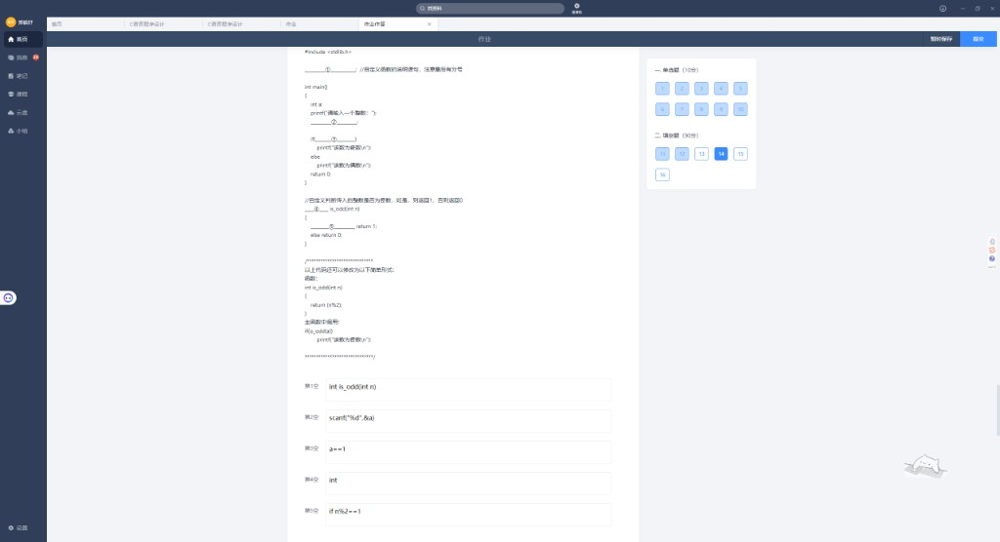
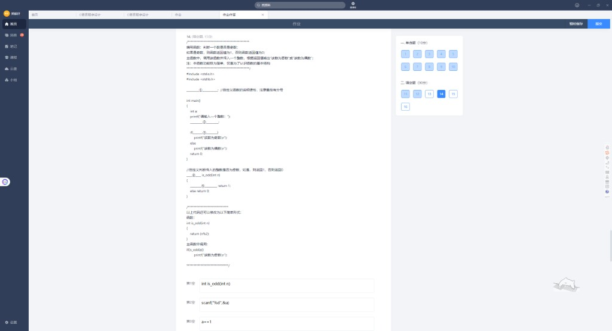
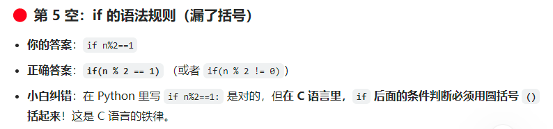

自定义 `is_odd`，奇数返回 1，偶数返回 0。

| 空 | 正确答案 | 你的答案 |
|----|----------|----------|
| ① 函数声明 | **`int is_odd(int n);`** | ✓ |
| ② 读入整数 | **`scanf("%d", &a);`** | ✓ |
| ③ main 中判断 | **`is_odd(a)`** | `a==1` ✗ 应调函数，不是比 1 |
| ④ 函数定义首部 | **`int`** | ✓ |
| ⑤ 奇数条件 | **`if(n % 2 == 1)`** | `if n%2==1` ✗ C 里 if 后必须加 `()` |

简化写法：`return (n % 2);` 非 0 即真。

---

## 第 15 题

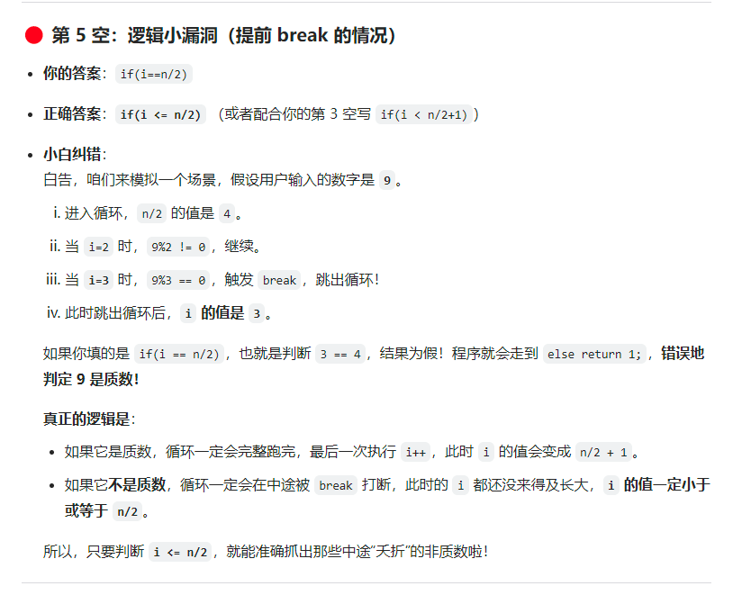
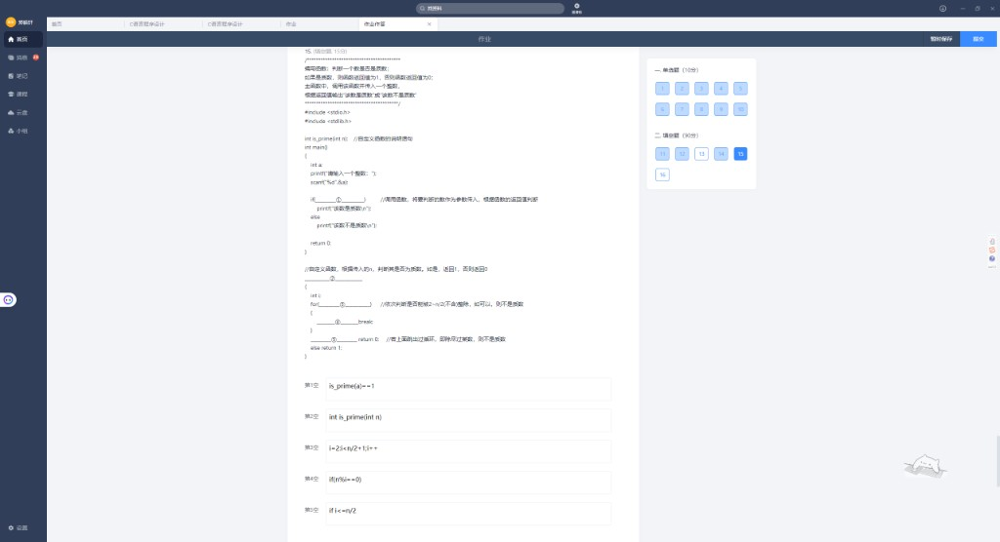

自定义 `is_prime`，质数返回 1，否则返回 0。

| 空 | 正确答案 | 你的答案 |
|----|----------|----------|
| ① main 调用 | **`is_prime(a) == 1`** | ✓ |
| ② 函数首部 | **`int is_prime(int n)`** | ✓ |
| ③ for 循环 | **`i = 2; i <= n/2; i++`** | ✓ |
| ④ 发现因子 | **`if(n % i == 0)`** | ✓ |
| ⑤ 循环后判断 | **`if(i <= n/2)`** | `if(i==n/2)` ✗ |

**⑤ 为何用 `<=` 不是 `==`？** 以 n=9 为例：i=3 时 `9%3==0` 触发 `break`，此时 i=3，而 n/2=4。`3==4` 为假会误判 9 为质数；`3<=4` 为真才正确返回 0。

---

## 第 16 题

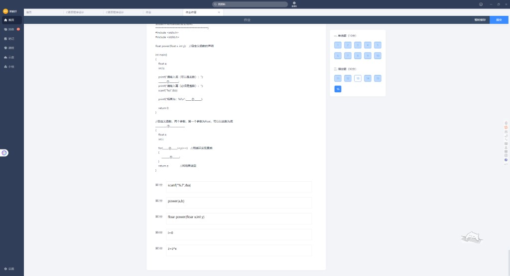
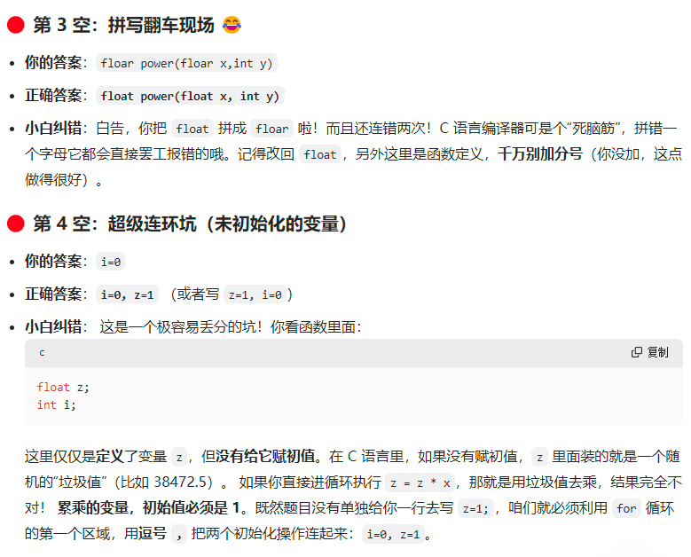

自定义 `power(x, y)` 用循环实现 x 的 y 次方。

| 空 | 正确答案 | 你的答案 |
|----|----------|----------|
| ① 读底数 | **`scanf("%f", &a);`** | ✓ |
| ② 调用并输出 | **`power(a, b)`** | ✓ |
| ③ 函数定义 | **`float power(float x, int y)`** | 注意拼写 `float` 不能写成 `floar` |
| ④ for 初始化 | **`i = 0, z = 1`** | 只写 `i=0` ✗ `z` 也要初始化为 1 |
| ⑤ 累乘 | **`z = z * x`** | ✓ |

**【⚠️ 避坑】未初始化局部变量是垃圾值**，`z=z*x` 前必须 `z=1`，否则结果随机。

```c
float power(float x, int y) {
    float z;
    int i;
    for (i = 0, z = 1; i < y; i++)   // ④ 逗号表达式一次初始化两个
        z = z * x;                    // ⑤
    return z;
}
```

---

## 专题 · 指针酒店

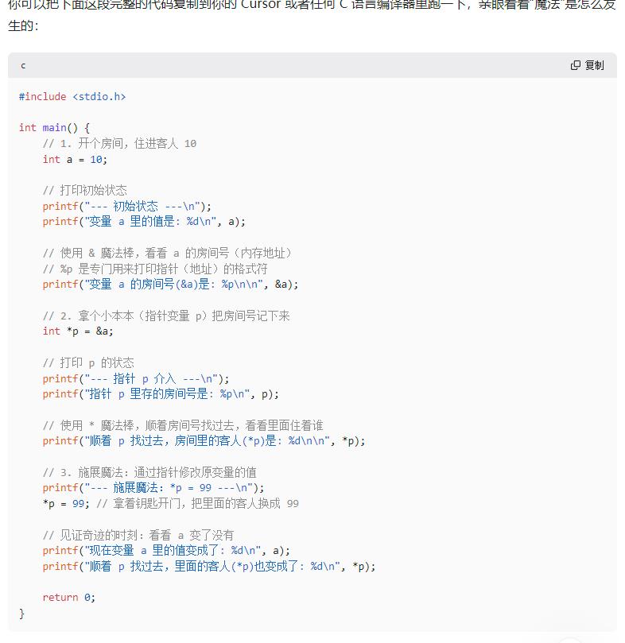

```c
int a = 10;
int *p = &a;    // p 记下房间号
printf("%p", &a);   // %p 打印地址
printf("%d", *p);   // *p 顺着地址找客人
*p = 99;            // 通过指针改原变量
```

| 符号 | 含义 |
|------|------|
| `&a` | 取地址（房间号） |
| `*p` | 解引用（开门看客人） |
| `%p` | 打印指针/地址 |

---

## 本卷易错点速记

| 题号 | 你的选择 | 正确答案 | 一句话 |
|------|----------|----------|--------|
| 5 | A | **B** | 返回值看函数首部 |
| 11② | `s=s*i` | **`s=s*n`** | 形参作用域，func 里没有 `i` |
| 11③ | 1 | **10** | `s=1` 每轮重置破坏累乘 |
| 11⑥ | A | **B** | static 阶乘要从 1 顺序调用 |
| 13② | `n=1` | **`n==1`** | 比较用 `==`，赋值用 `=` |
| 13③ | `s=s*n` | **`s=n*func(n-1)`** | 递归要自己调自己 |
| 13④ | 10 | **3628800** | 纯递归 10! 是真阶乘 |
| 13⑤ | B | **A** | 缺 else → 无限递归栈溢出 |
| 14③ | `a==1` | **`is_odd(a)`** | 要调函数返回值判断 |
| 14⑤ | 无括号 | **`if(n%2==1)`** | C 的 if 条件必须加 `()` |
| 15⑤ | `i==n/2` | **`i<=n/2`** | break 后 i 可能小于 n/2 |
| 16④ | 只 init i | **`i=0,z=1`** | 累乘前 z 必须置 1 |

---

## 附录：截图索引

| 文件 | 内容 |
|------|------|
| `01~08` | 单选 1~10 + 填空 11 初稿 |
| `09~11` | 填空 11 纠错与答案 |
| `12~13` | 填空 12 质数 |
| `14~18` | 填空 13 递归阶乘 |
| `15~16, 19` | 填空 14 奇偶 |
| `20~21` | 填空 15 质数 |
| `22~23` | 填空 16 幂函数 |

---

*实验9 全卷 16 题整理完毕。*
