# 4-5 章节练习 · 函数与指针基础

> 整理日期：2026-06-14  
> 全卷 50 题（单选 40 + 多选 5 + 判断 5）· **已全部整理**

---

## 目录

### 单选题
- [第 1 题 · 指针与数组求和](#第-1-题)
- [第 2 题 · 函数首部](#第-2-题)
- [第 3 题 · 递归函数](#第-3-题)
- [第 4 题 · 值传递](#第-4-题)
- [第 5 题 · static 局部变量](#第-5-题)
- [第 6 题 · 函数嵌套调用与类型转换](#第-6-题)
- [第 7 题 · 实参个数与逗号表达式](#第-7-题)
- [第 8 题 · 直接/间接递归](#第-8-题)
- [第 9 题 · 无 return 的函数](#第-9-题)
- [第 10 题 · 全局变量作用域](#第-10-题)
- [第 11 题 · 一维数组定义](#第-11-题)
- [第 12 题 · 间接递归](#第-12-题)
- [第 13 题 · 双 static 追踪](#第-13-题)
- [第 14 题 · 三层 a 遮蔽](#第-14-题)
- [第 15 题 · 传值无法交换](#第-15-题)
- [第 16 题 · static + 全局 a](#第-16-题)
- [第 17 题 · 变量遮蔽输出](#第-17-题)
- [第 18 题 · 隐式 int](#第-18-题)
- [第 19~21 题 · 值传递与频数统计](#第-19-21-题)
- [第 22 题 · 欧几里得算法](#第-22-题)
- [第 23 题 · scanf 找错行](#第-23-题)
- [第 24~27 题 · 二维数组与作用域](#第-24-27-题)
- [第 28~30 题 · void 与数组下标](#第-28-30-题)
- [第 32~33 题 · 传值与 static 累加](#第-32-33-题)
- [第 34~36 题 · 存储类与全局变量](#第-34-36-题)
- [第 37~39 题 · 循环与隐式 int](#第-37-39-题)
- [第 40 题 · 数组初始化](#第-40-题)
- [第 41 题 · 字符串定义（多选）](#第-41-题)

### 多选题（42~45）
- [第 42~45 题 · 二维数组与函数定义](#第-42-45-题多选)

### 判断题（46~50）
- [第 46~50 题 · 函数规则判断](#第-46-50-题判断)

### 知识点专题
- [函数四种组合](#专题-函数四种组合)
- [static 变量 vs 普通局部变量](#专题-static-变量)
- [全局变量与 extern](#专题-全局变量与-extern)

---

## 第 1 题

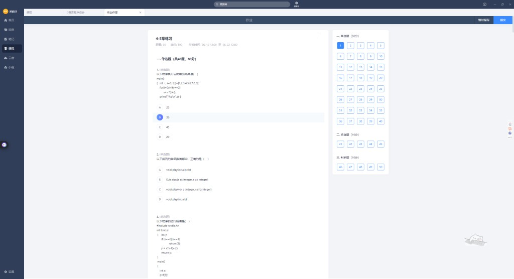

**题目**：以下程序执行后的输出结果是（ ）

```c
main()
{
    int i, s = 0, t[] = {1, 2, 3, 4, 5, 6, 7, 8, 9};
    for (i = 0; i < 9; i += 2)
        s += *(t + i);
    printf("%d\n", s);
}
```

| 你的答案 | 正确答案 |
|----------|----------|
| B 36 | **A. 25** |

**手算**：

- `i` 取 0、2、4、6、8 → 对应 `t[0]=1, t[2]=3, t[4]=5, t[6]=7, t[8]=9`
- `s = 1+3+5+7+9 = 25`

### 深度解析

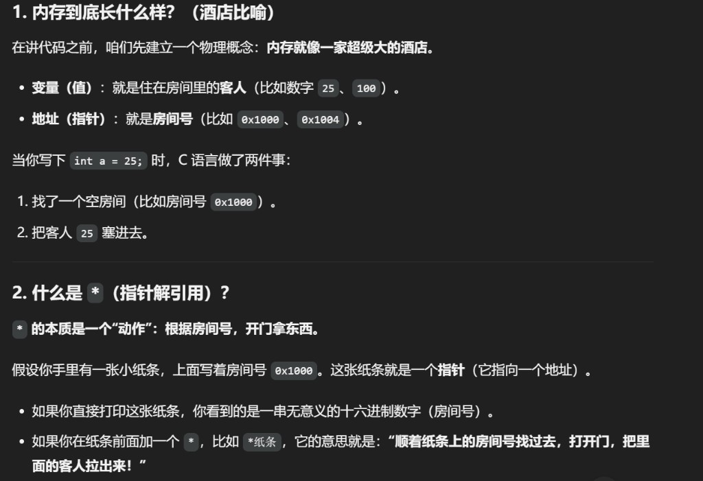
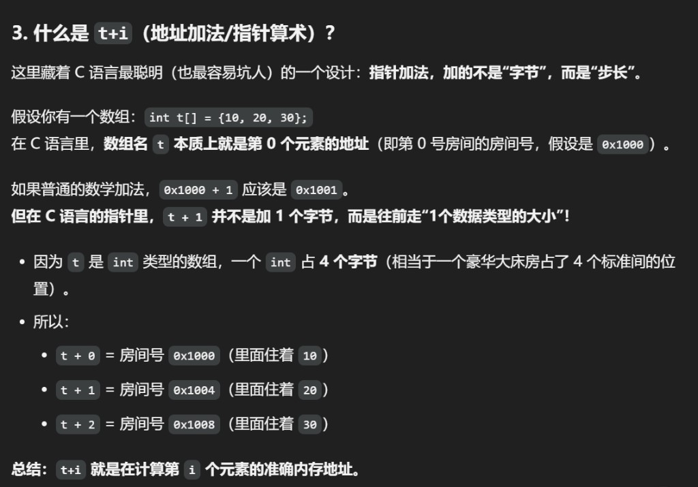
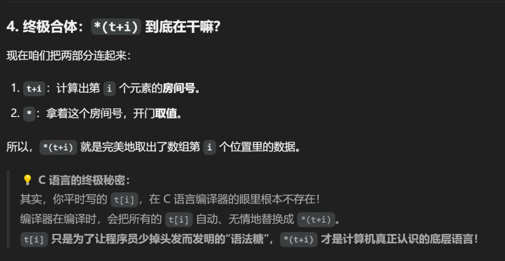

| 表达式 | 含义 |
|--------|------|
| `t` | 数组首元素地址（"房间号"） |
| `t + i` | 地址向后跳 **i 个 int**（不是 i 个字节） |
| `*(t + i)` | 取该地址上的值，等价于 **`t[i]`** |

### ⚠️ 避坑指南

`*(t+i)` 和 `t[i]` 完全等价——编译器会把 `t[i]` 替换成 `*(t+i)`。  
`i+=2` 是步长 2，别当成每次加 1 把所有元素加起来。

---

## 第 2 题

**题目**：以下函数首部中，正确的是（ ）

| 选项 | 判断 |
|------|------|
| **A. `void play(int a, int b)`** | ✓ **标准答案** |
| B. `Sub play(a as integer, b as integer)` | ✗ Pascal 语法 |
| C. `void play(var a:integer, var b:integer)` | ✗ 非 C 语法 |
| D. `void play(int a, b)` | ✗ 参数 `b` 缺类型 |

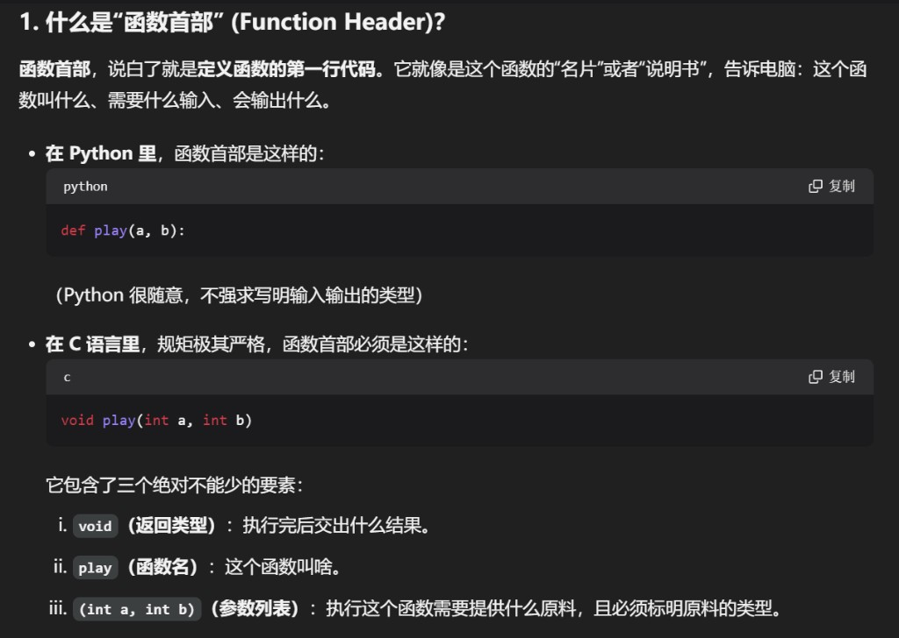
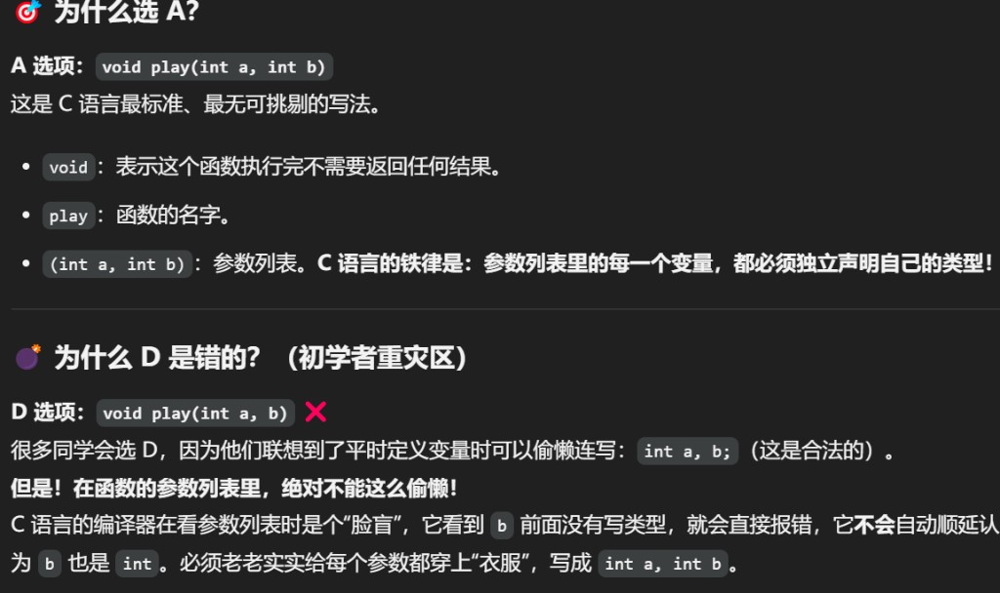

### ⚠️ 避坑指南

普通变量可以写 `int a, b;`，但**函数参数列表里每个参数都必须单独写类型**，不能省略第二个的 `int`。

---

## 第 3 题

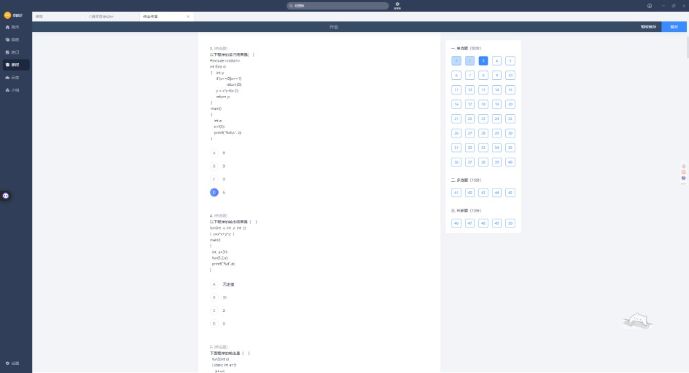

**题目**：递归函数 `f` 的运行结果

```c
int f(int x)
{
    int y;
    if (x == 0 || x == 1)
        return (3);
    y = x * x - f(x - 2);
    return y;
}
main()
{
    int z;
    z = f(3);
    printf("%d\n", z);
}
```

| 你的答案 | 正确答案 |
|----------|----------|
| D 6 ✓ | **D. 6** |

**递推**：

```
f(3) = 3×3 - f(1) = 9 - 3 = 6
f(1) = 3  （递归出口）
```

---

## 第 4 题

**题目**：值传递，main 中 `a` 的值

```c
fun(int x, int y, int z)
{ z = x * x + y * y; }
main()
{
    int a = 31;
    fun(5, 2, a);
    printf("%d", a);
}
```

| 答案 |
|------|
| **B. 31** |

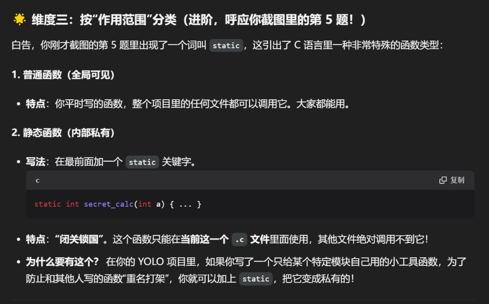

**四步理解**：

1. `main` 里 `a = 31`
2. 调用 `fun(5, 2, a)` → 形参 `z` 得到 **31 的副本**
3. 函数内 `z = 5×5 + 2×2 = 29`，改的是副本
4. 返回 `main`，`a` 仍是 **31**

### ⚠️ 避坑指南

C 默认**值传递**——函数改的是副本，原变量不动。要改原变量需传**指针**（地址传递）。

---

## 第 5 题

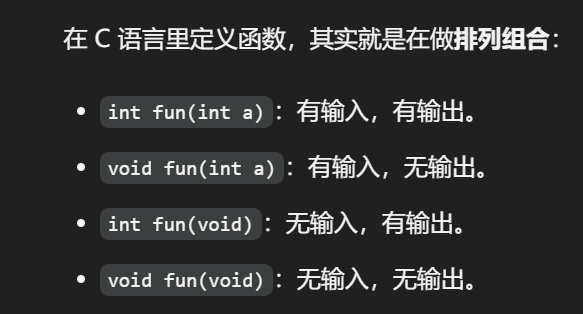

**题目**：`static` 局部变量

```c
fun(int x)
{ static int a = 3;
  a += x;
  return(a); }
main()
{
    int k=2, m=1, n;
    n = fun(k);
    n = fun(m);
    printf("%d\n", n);
}
```

| 你的答案 | 正确答案 |
|----------|----------|
| C 4 | **B. 6** |

**逐步追踪**：

| 调用 | static a 变化 | 返回值 |
|------|---------------|--------|
| 第 1 次 `fun(2)` | 3→5（初值只赋一次） | 5 |
| 第 2 次 `fun(1)` | 5→6 | **6** |

### 专题：static 变量

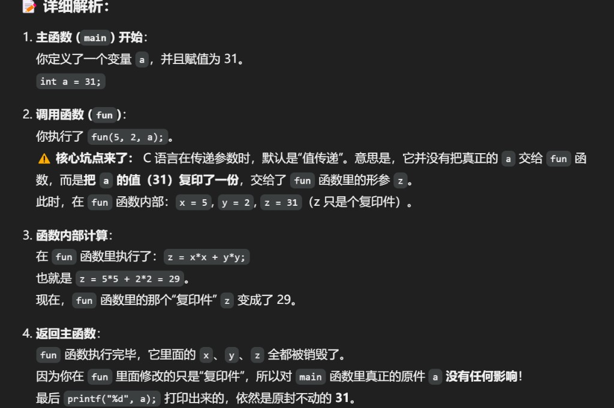
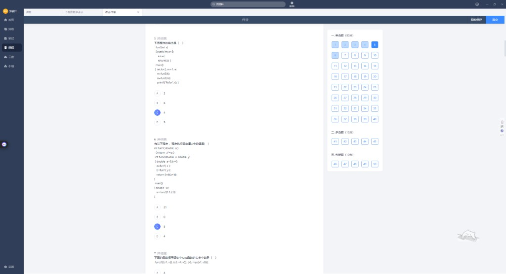
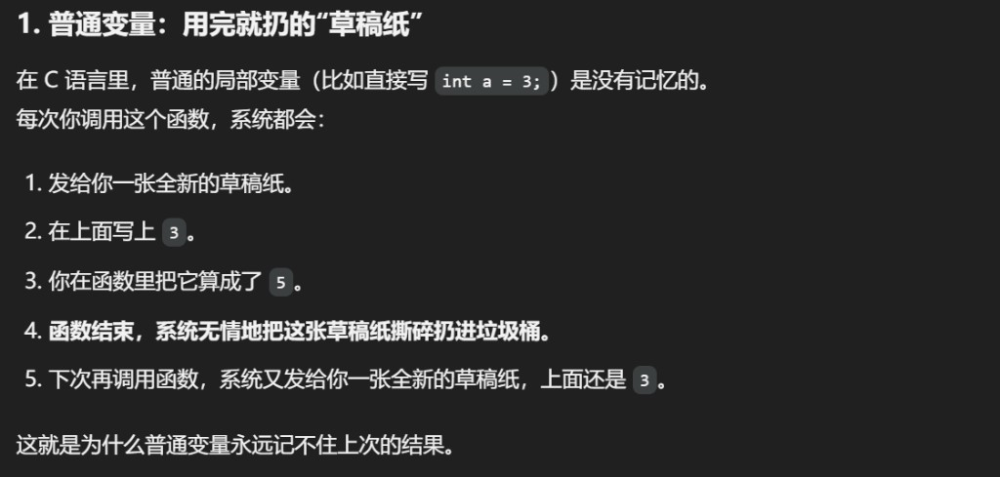
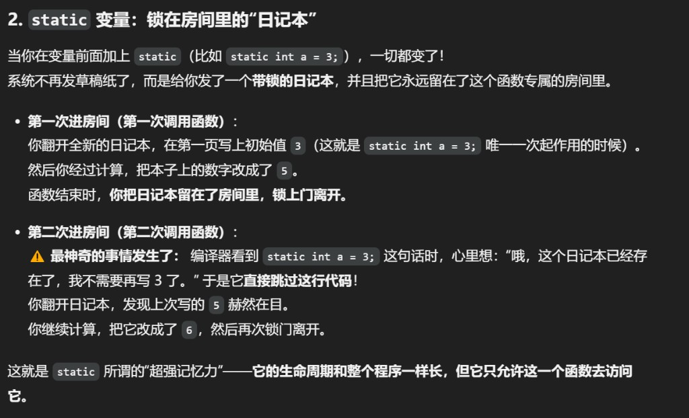

| 类型 | 生命周期 | 记忆 |
|------|----------|------|
| 普通局部变量 | 函数结束即销毁 | "草稿纸"，每次重新发 |
| **static 局部变量** | 整个程序期间 | "锁在房间里的日记本"，**只初始化一次**，值会保留 |

---

## 第 6 题

**题目**：嵌套函数调用

```c
int fun1(double a)
{ return a * a; }
int fun2(double x, double y)
{ double a=0, b=0;
  a = fun1(x);
  b = fun1(y);
  return (int)(a + b); }
main()
{
    double w;
    w = fun2(1.1, 2.0);
}
```

| 你的答案 | 正确答案 |
|----------|----------|
| C 5 ✓ | **C. 5** |

**计算**：

- `fun1(1.1) = 1.21`，`fun1(2.0) = 4.0`
- `(int)(1.21 + 4.0) = (int)5.21 = 5`

---

## 第 7 题

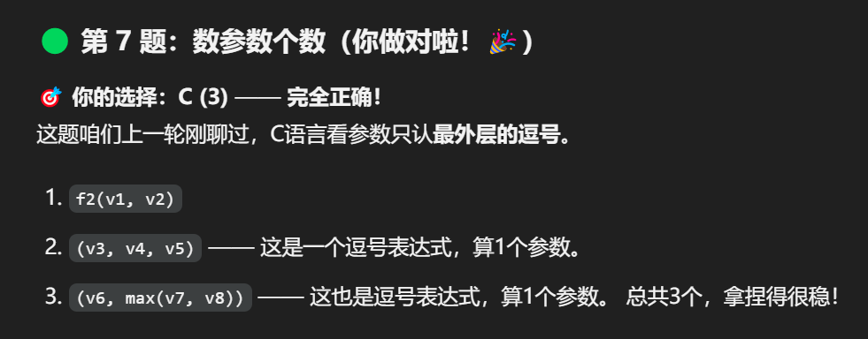

**题目**：`func` 的实参个数

```c
func(f2(v1, v2), (v3, v4, v5), (v6, max(v7, v8)));
```

| 你的答案 | 正确答案 |
|----------|----------|
| C 3 ✓ | **C. 3** |

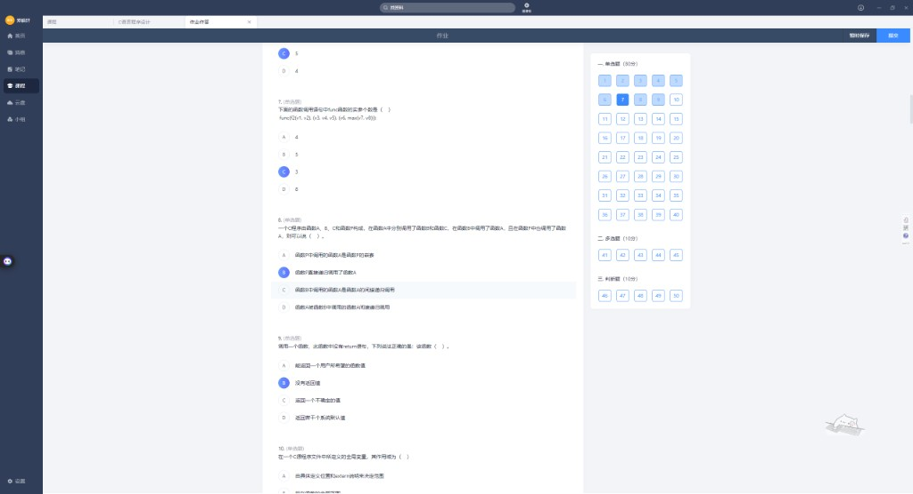

**最外层逗号才分隔参数**：

| 参数 | 说明 |
|------|------|
| ① `f2(v1, v2)` | 函数调用，算 1 个实参 |
| ② `(v3, v4, v5)` | **逗号表达式**，值为 `v5`，算 1 个 |
| ③ `(v6, max(v7, v8))` | 逗号表达式，值为 `max(...)`，算 1 个 |

---

## 第 8 题

**题目**：A 调 B/C，B 调 A，P 调 A

| 你的答案（初版） | 订正后 |
|------------------|--------|
| B 函数 P 直接递归调用 A | **C. 函数 B 中间接调用的 A 是 A 的间接递归** ✓ |

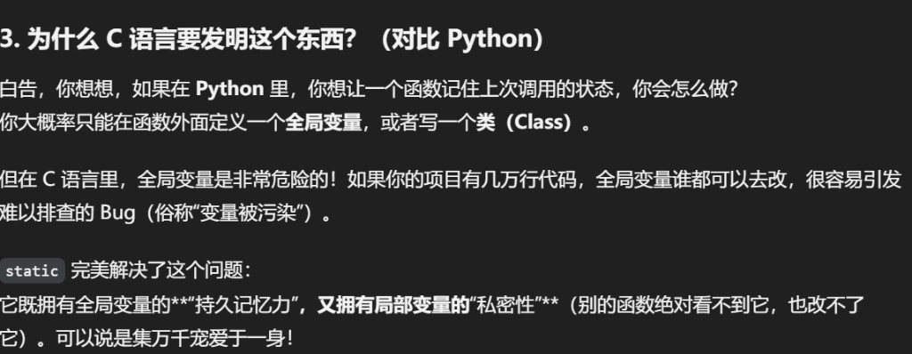

| 概念 | 定义 | 本题 |
|------|------|------|
| **直接递归** | 函数调用自己 | — |
| **间接递归** | A→B→A 绕一圈 | **A 调 B，B 又调 A** ✓ |
| 普通调用 | 无循环 | P 调 A 只是普通调用，不是递归 |

---

## 第 9 题

**题目**：函数中没有 `return` 语句

| 你的答案（初版） | 订正后 |
|------------------|--------|
| B 没有返回值 | **C. 返回一个不确定的值** ✓ |

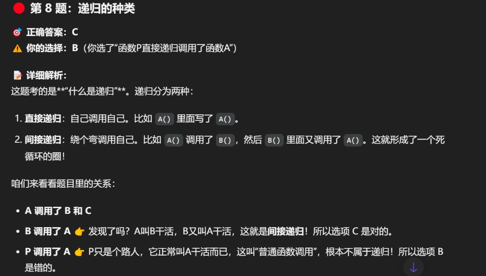

| 函数类型 | 无 return 时 |
|----------|--------------|
| `void fun()` | 确实无返回值 |
| 非 void（如默认 int） | **返回寄存器里的垃圾值**，不确定 |

### ⚠️ 避坑指南

考试常考：非 void 函数缺 `return` 不是"没返回值"，而是**返回随机垃圾值**——这是 C 的经典陷阱。

---

## 第 10 题

**题目**：源文件中定义的全局变量，其作用域为（ ）

| 你的答案 | 正确答案 |
|----------|----------|
| A ✓ | **A. 由具体定义位置和 extern 说明来决定范围** |

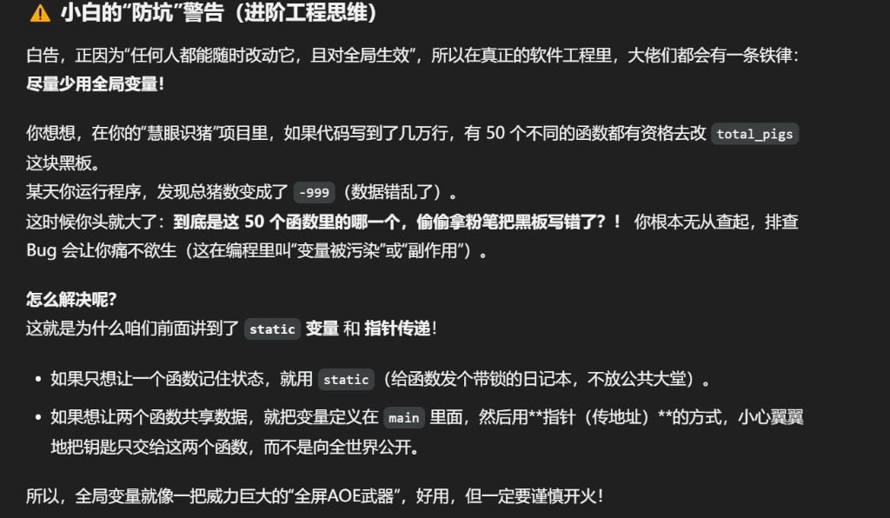
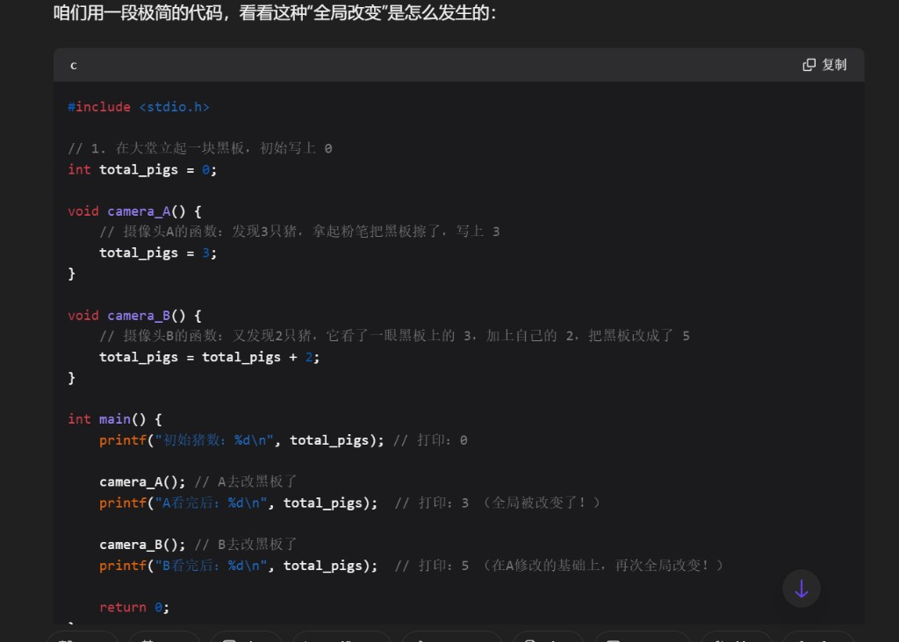
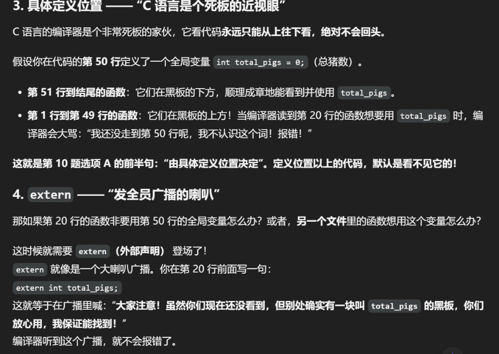

**三个层次**：

1. **全局变量** = 公司大堂的公共黑板，所有函数都能改
2. **定义位置** = C 从上到下读，定义**之前**的代码默认看不见
3. **`extern`** = 大喇叭广播："别处有这个变量，放心用"

| 选项 | 为什么错 |
|------|----------|
| B 所在函数的全部范围 | 全局变量不在函数里 |
| C 所在程序的全部范围 | 忽略了定义顺序和 extern |
| D 所在文件的全部范围 | 太绝对，extern 可跨文件 |

---

## 第 11 题

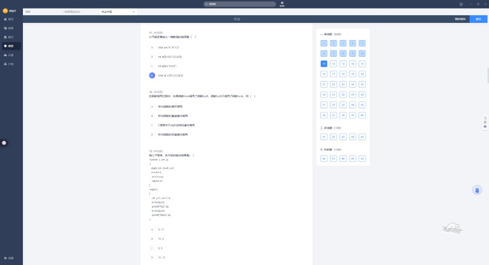

**题目**：能正确定义一维数组的选项

| 选项 | 判断 |
|------|------|
| A `char a={'A','B','C'}` | ✗ 缺 `[]` |
| B `int a[5]={0,1,2,3,4,5}` | ✗ 6 个初值超界 |
| C `int a[5]="0123"` | ✗ 类型不匹配 |
| **D `char a[]={0,1,2,3,4,5}`** | ✓ **自动定长 6** |

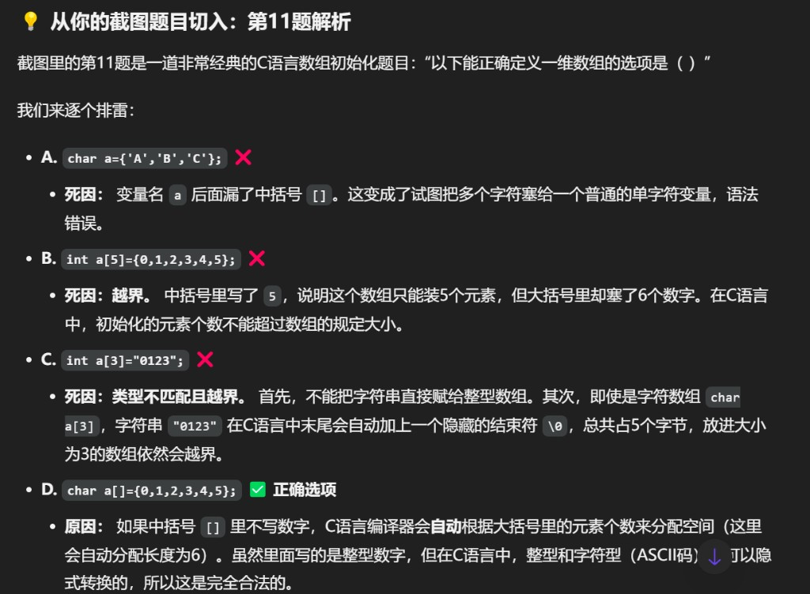

---

## 第 12 题

**题目**：funA 调 funB，funB 又调 funA

| 答案 |
|------|
| **D. 间接递归调用** |

直接递归 = 自己调自己；A↔B 绕一圈 = **间接递归**。

---

## 第 13 题

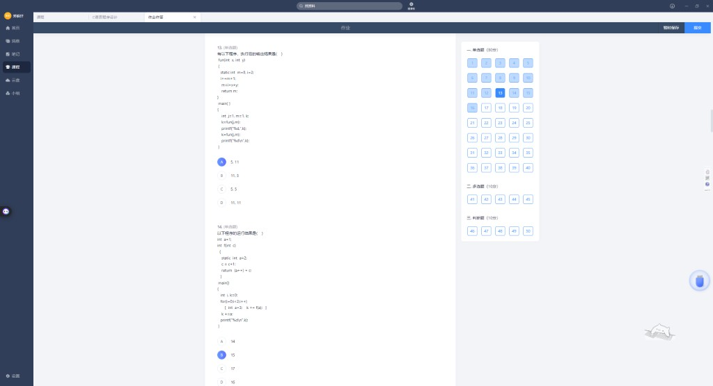

```c
fun(int x, int y)
{
    static int m=0, i=2;
    i = i + m + 1;
    m = i + x + y;
    return m;
}
// main: j=1,m=1; 连续调用两次 fun(j,m)
```

| 调用 | i 变化 | static m | 返回 |
|------|--------|----------|------|
| 第1次 x=1,y=1 | 2+0+1=3 | 3+1+1=5 | **5** |
| 第2次 | 3+5+1=9 | 9+1+1=11 | **11** |

| 你的答案 | 正确答案 |
|----------|----------|
| A 5,11 ✓ | **A. 5, 11** |

---

## 第 14 题

**题目**：全局 `a`、static `a`、局部 `a` 三层遮蔽

```c
int a = 1;
int f(int c) {
    static int a = 2;
    c = c + 1;
    return (a++) + c;
}
main() {
    int i, k = 0;
    for(i = 0; i < 2; i++) {
        int a = 3;
        k += f(a);  // 传 3，与全局/静态 a 无关
    }
    k += a;  // 全局 a 仍为 1
    printf("%d\n", k);
}
```

| 调用 | static a | 返回 (a++)+c |
|------|----------|--------------|
| 1 | 2→3 | 2+4=**6** |
| 2 | 3→4 | 3+4=**7** |

`k = 6+7+1(全局a) = **14**`

| 你的答案 | 正确答案 |
|----------|----------|
| B 15 | **A. 14** |

### ⚠️ 避坑指南

`for` 里 `int a=3` 只遮蔽全局 `a`；`f` 里的 `static a` 是第三层，与 main 的 `a` 互不干扰。

---

## 第 15 题

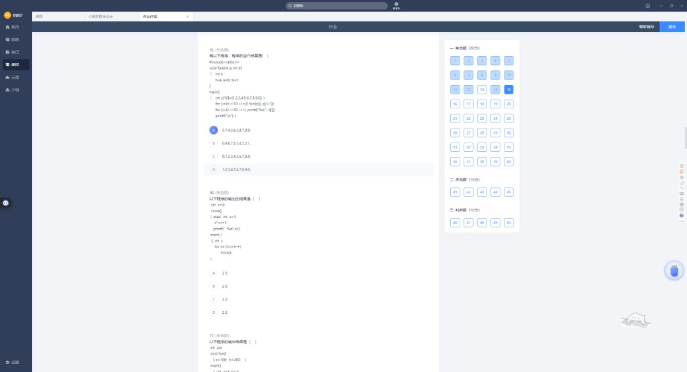

`fun` 试图交换形参，但**传值**——数组 `c` 不变。

| 你的答案 | 正确答案 |
|----------|----------|
| D ✓ | **D. 1,2,3,4,5,6,7,8,9,0** |

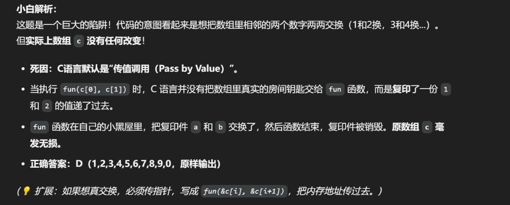

真要交换需 `fun(&c[i], &c[i+1])` 传地址。

---

## 第 16 题

```c
int a = 2;
incr() {
    static int x = 1;
    x *= a + 1;   // 用全局 a
    printf("%d ", x);
}
main() {
    for (i = 1; i <= a; i++) incr();  // a=2，跑 2 次
}
```

| 次 | x 计算 | 输出 |
|----|--------|------|
| 1 | 1×(2+1)=3 | 3 |
| 2 | 3×3=9 | 9 |

| 答案 |
|------|
| **D. 3 9** |

---

## 第 17 题

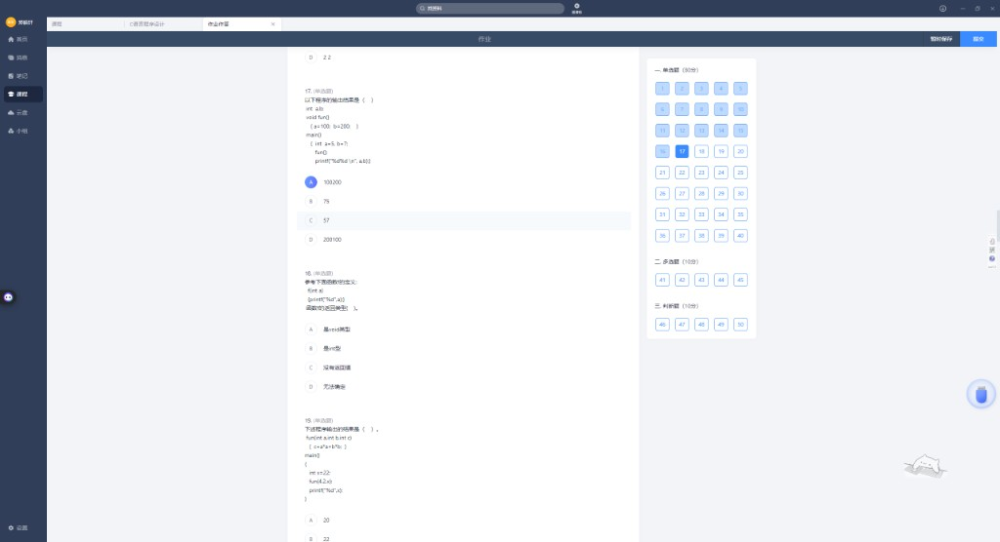

```c
int a, b;           // 全局
void fun() { a=100; b=200; }
main() {
    int a=5, b=7;   // 局部遮蔽全局
    fun();          // 改的是全局 a,b
    printf("%d %d\n", a, b);  // 打印局部
}
```

| 你的答案 | 正确答案 |
|----------|----------|
| A 100 200 | **C. 5 7** |

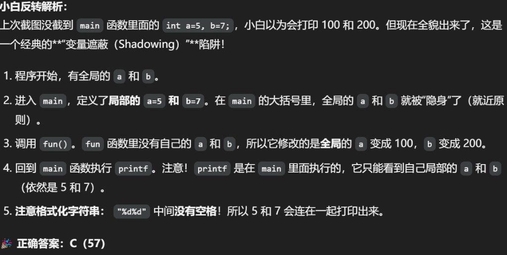
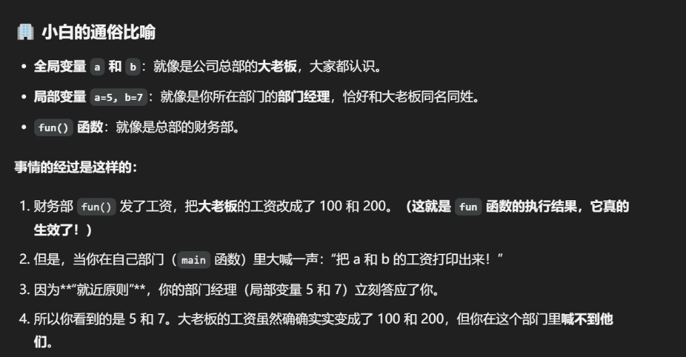

财务部改了总部大老板工资，你部门经理（局部变量）的工资单不变。

---

## 第 18 题

`f(int a) { printf("%d", a); }` — 函数名前没写类型

| 答案 |
|------|
| **B. 是 int 型**（C89 隐式 int） |

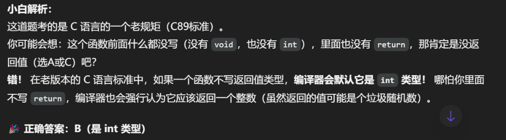

---

## 第 19~21 题

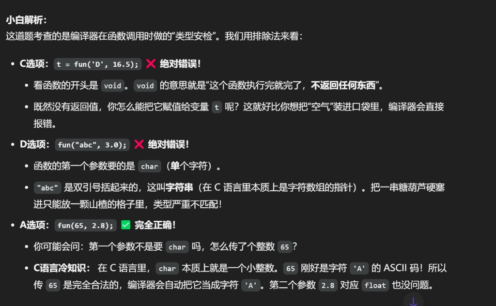

### 第 19 题 · 值传递

`fun(4,2,x)` 不改 `x` → **B. 22** ✓

### 第 20 题 · void fun(char, float)

| 选项 | 判断 |
|------|------|
| **A `fun(65,2.8)`** | ✓ 65='A' |
| C `t=fun(...)` | ✗ void 不能赋值 |
| D `fun("abc",...)` | ✗ 字符串≠char |

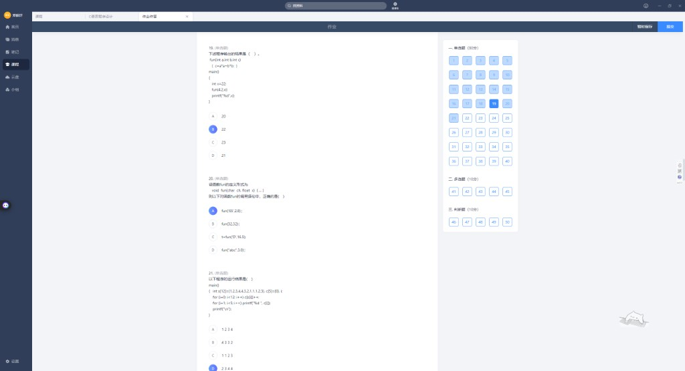

### 第 21 题 · 频数统计 `c[s[i]]++`

`s` 中 1 出现 4 次、2 出现 3 次、3 出现 3 次、4 出现 2 次  
输出 `c[1]~c[4]` → **4332**（无空格）

| 你的答案 | 正确答案 |
|----------|----------|
| D 2 3 4 4 | **B. 4 3 3 2** |

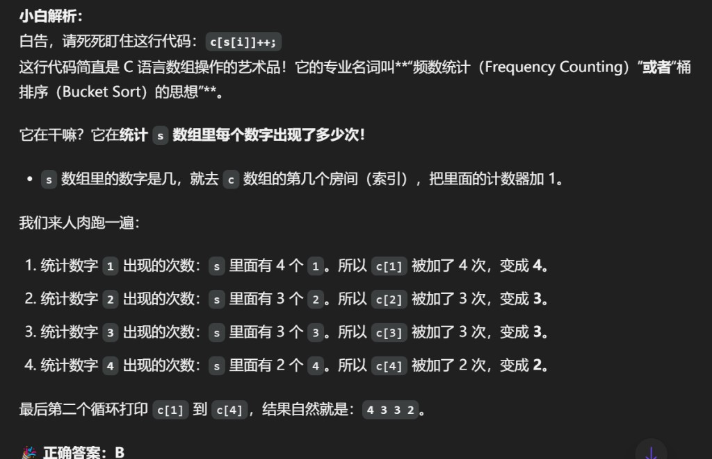
![c[s[i]++](images/章节45/40_c数组索引神来之笔.png)

---

## 第 22 题

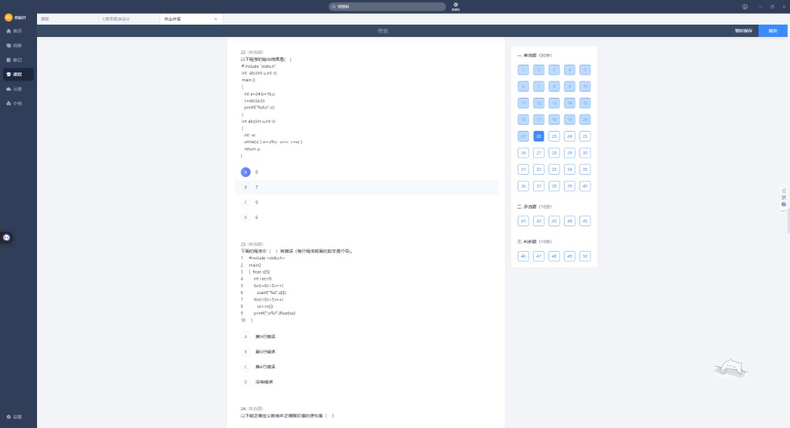

辗转相除法 GCD(24,16)：

```
24%16=8 → u=16,v=8
16%8=0  → u=8,v=0，结束
```

| 你的答案 | 正确答案 |
|----------|----------|
| A 8 ✓ | **A. 8** |

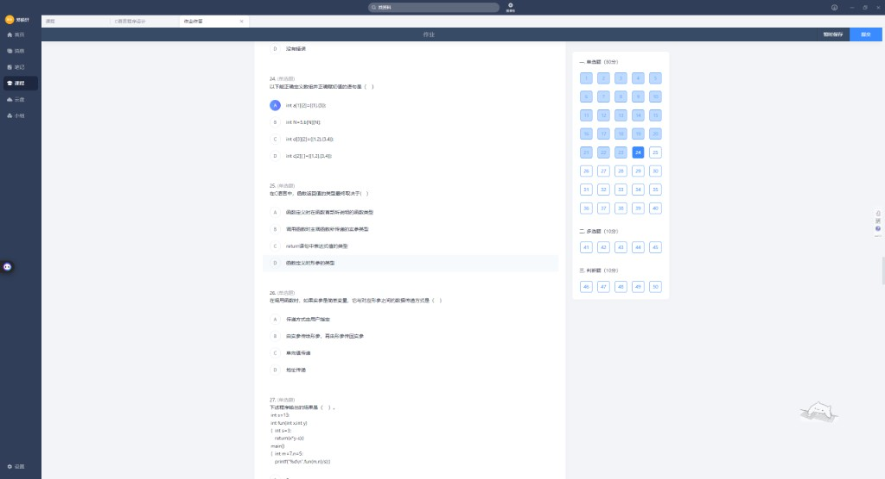

---

## 第 23 题

```c
scanf("%d", s[i]);  // 第6行：缺 &，且 s[i] 是 float 不是地址
```

| 答案 |
|------|
| **B. 第 6 行错误** |

---

## 第 24~27 题

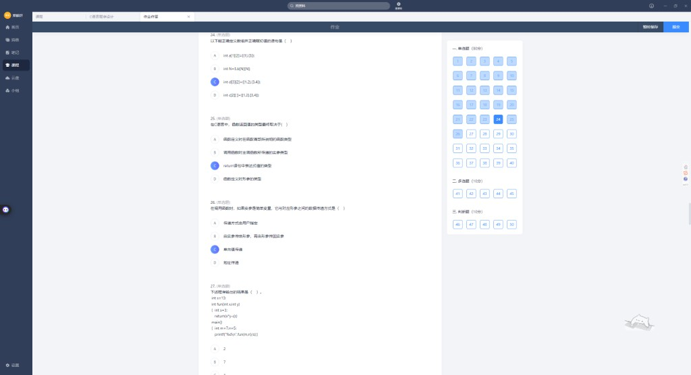

### 第 24 题 · 二维数组

| 选项 | 判断 |
|------|------|
| A `[1][2]` 却初始化 2 行 | ✗ |
| B `b[N][N]` 变长数组 | ✗ |
| **C `d[3][2]={{1,2},{3,4}}`** | ✓ 第3行自动补 0 |
| D `c[2][]` 缺列数 | ✗ |

| 你的答案 | 正确答案 |
|----------|----------|
| A→**C** ✓ | **C** |

### 第 25 题 · 返回值类型谁说了算

`int f() { return 99.5; }` → 仍按首部 **int** 返回，截断为 99。

| 你的答案 | 正确答案 |
|----------|----------|
| C | **A. 函数首部说明的类型** |

### 第 26 题 · 简单变量传递

| 你的答案 | 正确答案 |
|----------|----------|
| C ✓ | **C. 单向值传递** |

### 第 27 题 · 局部 s 遮蔽全局 s

```c
int s=13;
int fun(int x,int y) {
    int s=3;
    return x*y-s;    // 35-3=32
}
printf("%d\n", fun(m,n)/s);  // 32/13=2（整数除法）
```

| 答案 |
|------|
| **A. 2** |

`fun` 内改的是局部 `s=3`；`main` 里 `/s` 用的是全局 `s=13`。

---

## 第 28~30 题

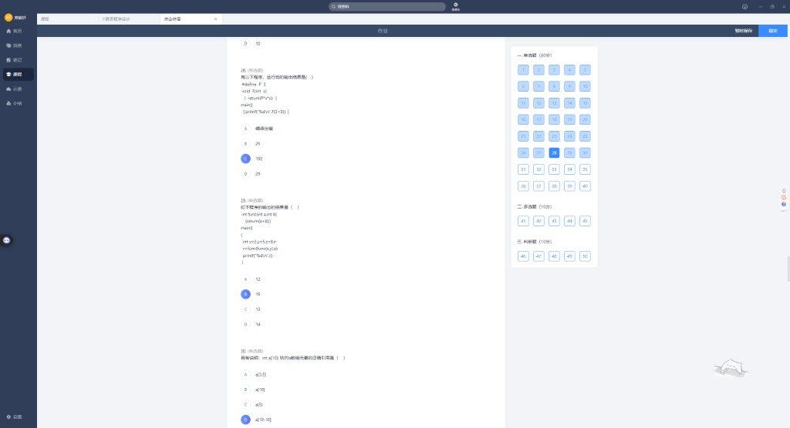

### 第 28 题 · void 函数不能 return 值

```c
#define P 3
void F(int x) { return(P*x*x); }  // void 却 return 整数 → 编译错误
main() { printf("%d\n", F(2+3)); }
```

| 你的答案 | 正确答案 |
|----------|----------|
| C 192 | **A. 编译出错** |

`void` = 无返回值，不能 `return(表达式)`。即便 `F(5)` 算出来是 `3×25=75`，代码本身非法。

### 第 29 题 · 函数作实参（嵌套调用）

```c
r = func(func(x,y), z);  // func(2,5)=7 → func(7,8)=15
```

| 你的答案 | 正确答案 |
|----------|----------|
| B 15 ✓ | **B. 15** |

### 第 30 题 · 数组元素合法引用

`int a[10]` 下标必须是**整型表达式**，且 `0~9` 范围内：

| 选项 | 判断 |
|------|------|
| A `a[3.5]` | ✗ 浮点下标 |
| B `a(10)` | ✗ 圆括号不是下标语法 |
| **C `a[5]`** | ✓ |
| **D `a[10-10]`** | ✓ 即 `a[0]` |

| 你的答案 | 说明 |
|----------|------|
| D ✓ | C、D 均合法；D 是 `a[0]` |

---

## 第 32~33 题

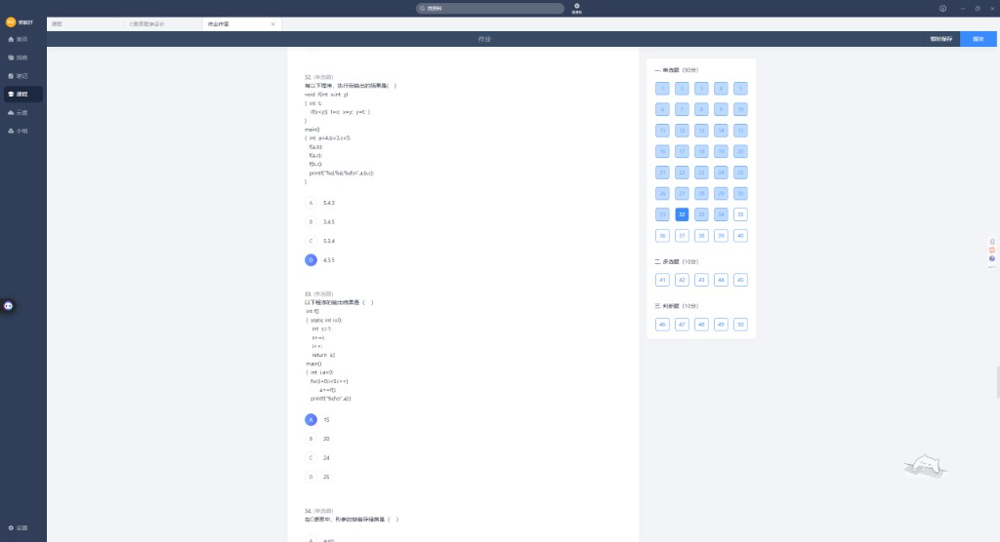

### 第 32 题 · 传值调用无法交换

```c
void f(int x, int y) {
    if (x < y) { t = x; x = y; y = t; }  // 只交换形参副本
}
// f(a,b); f(a,c); f(b,c); → a,b,c 仍是 4,3,5
```

| 你的答案 | 正确答案 |
|----------|----------|
| D 4,3,5 ✓ | **D. 4, 3, 5** |

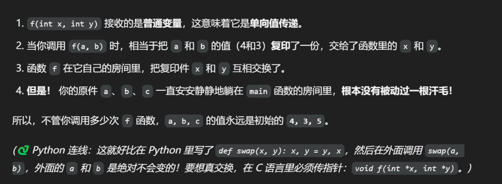

要真交换需指针：`void f(int *x, int *y)`。

### 第 33 题 · static i + 局部 s

每次调用：`s = 1 + i`（i 为 static 累加），然后 `i++`。

| 调用 | i（前） | 返回 s |
|------|---------|--------|
| 1 | 0 | 1 |
| 2 | 1 | 2 |
| 3 | 2 | 3 |
| 4 | 3 | 4 |
| 5 | 4 | 5 |

`a = 1+2+3+4+5 = 15`

| 你的答案 | 正确答案 |
|----------|----------|
| A 15 ✓ | **A. 15** |

---

## 第 34~36 题

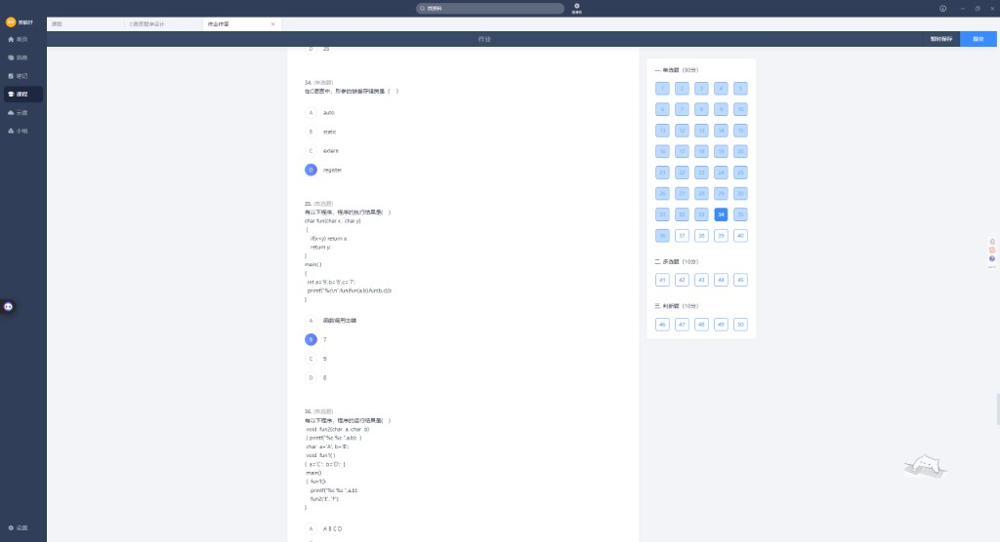

### 第 34 题 · 形参缺省存储类

| 你的答案 | 正确答案 |
|----------|----------|
| A auto ✓ | **A. auto** |

形参本质是**函数内的局部变量**，默认 `auto`（用完即毁的"一次性纸杯"）。

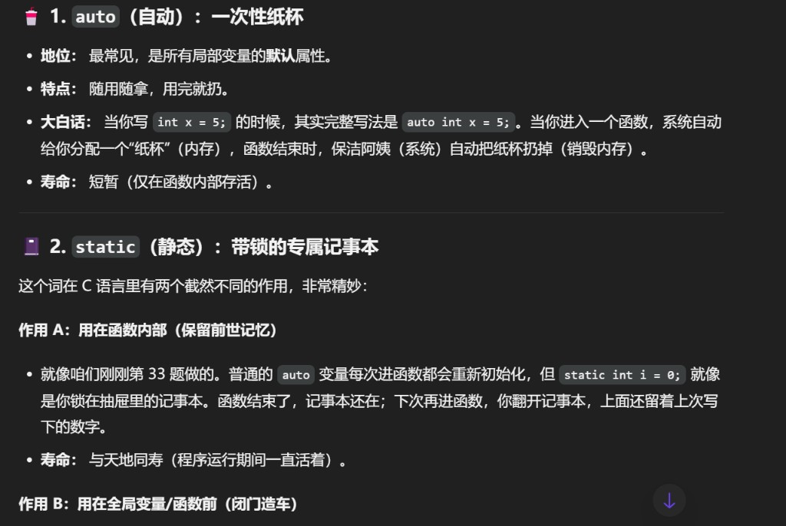
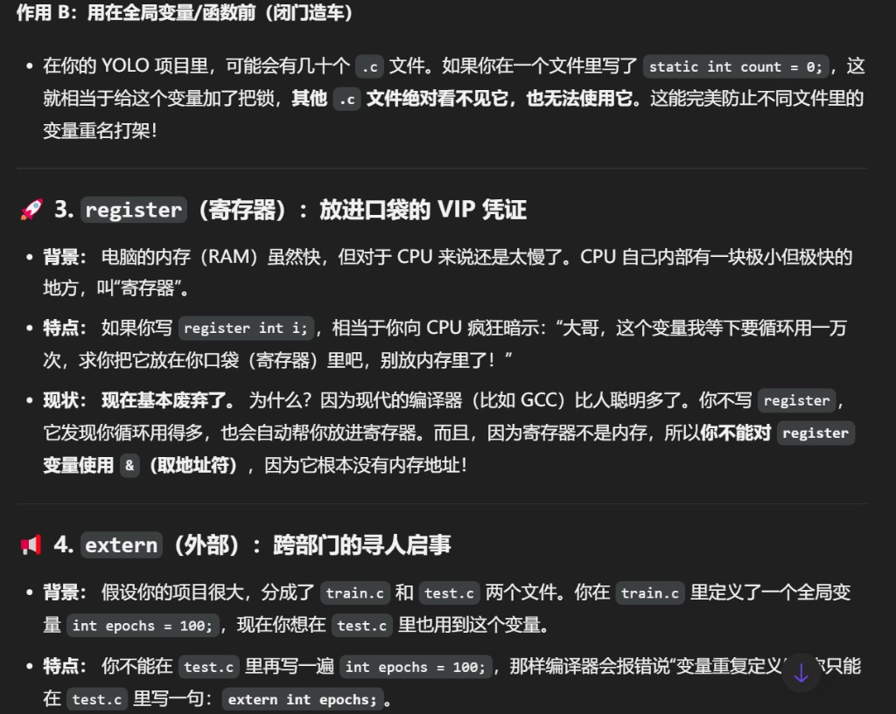

| 存储类 | 一句话 |
|--------|--------|
| `auto` | 局部默认，函数结束销毁 |
| `static` | 有记忆；全局 static 仅本文件可见 |
| `register` | 建议放寄存器，现代编译器基本忽略 |
| `extern` | 声明别处已定义的全局变量 |

### 第 35 题 · char 比较取较小

```c
int a='9', b='8', c='7';  // ASCII 57, 56, 55
fun(a,b) → '8'；fun(b,c) → '7'；fun('8','7') → '7'
printf("%c") → 7
```

| 你的答案 | 正确答案 |
|----------|----------|
| B 7 ✓ | **B. 7** |

### 第 36 题 · 全局变量被 fun1 修改

```c
fun1();           // 全局 a='C', b='D'
printf → C D
fun2('E','F');    // E F
```

| 你的答案 | 正确答案 |
|----------|----------|
| B ✓ | **B. C D E F** |

---

## 第 37~39 题

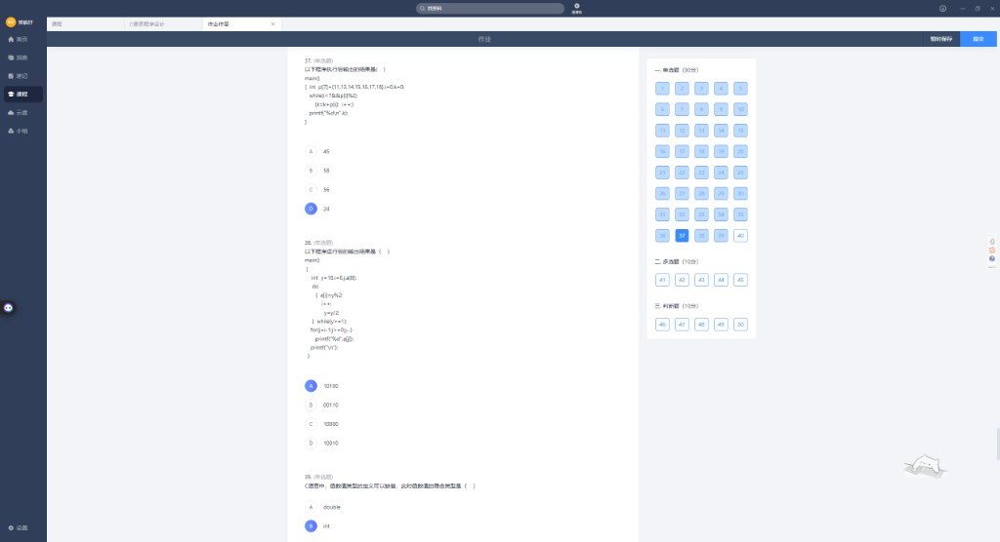

### 第 37 题 · while 遇偶数停止

```c
while (i < 7 && p[i] % 2)  // 奇数才继续
```

累加 `11 + 13 = 24`，遇到 `14`（偶数）停止。

| 你的答案 | 正确答案 |
|----------|----------|
| D 24 ✓ | **D. 24** |

### 第 38 题 · 十进制转二进制

`y=18` 辗转取余 → `a[]` 存 `{0,1,0,0,1}`，倒序输出 **10010**。

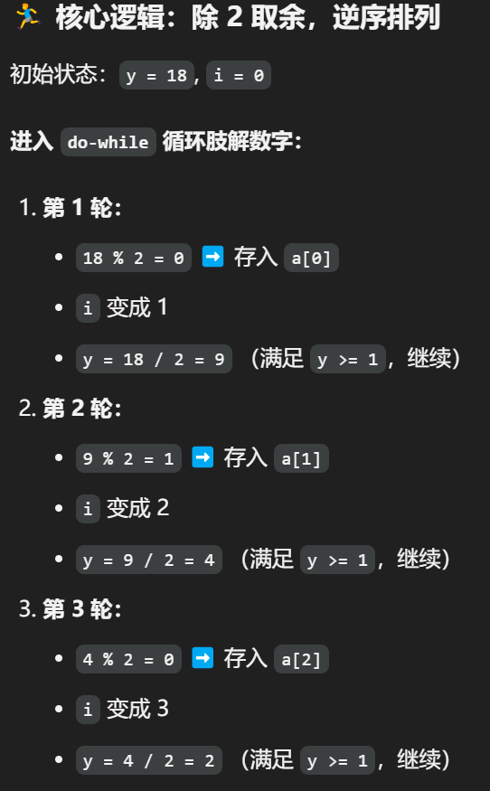
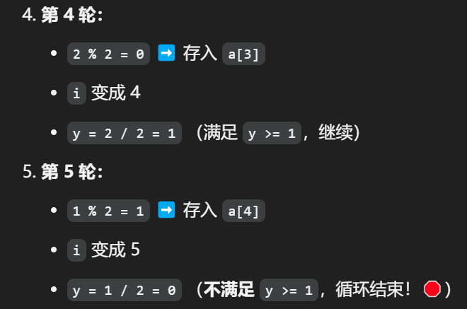

| 你的答案 | 正确答案 |
|----------|----------|
| A 10100 | **D. 10010** |

### 第 39 题 · 隐式 int（再考）

| 你的答案 | 正确答案 |
|----------|----------|
| B ✓ | **B. int** |

与第 18 题同一考点：C89 函数名前不写类型 → 默认 `int`。

---

## 第 40 题

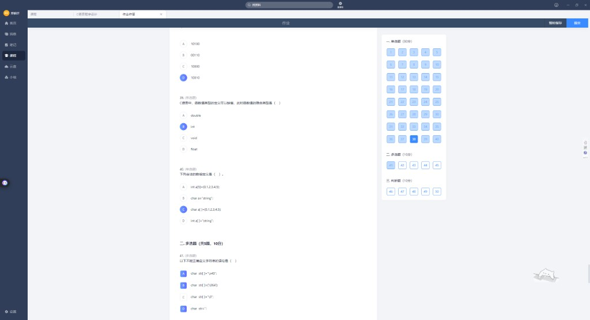
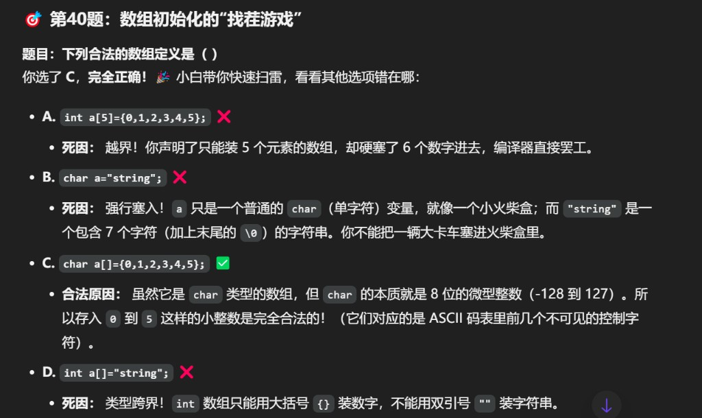

| 选项 | 判断 |
|------|------|
| A `int a[5]={0,1,2,3,4,5}` | ✗ 6 个初值超界 |
| B `char a="string"` | ✗ 单个 char 装不下字符串 |
| **C `char a[]={0,1,2,3,4,5}`** | ✓ char 可当小整数用 |
| D `int a[]="string"` | ✗ int 数组不能用 `""` |

| 你的答案 | 正确答案 |
|----------|----------|
| C ✓ | **C** |

---

## 第 41 题（多选）

**题目**：不能正确定义**字符串**的语句是（ ）

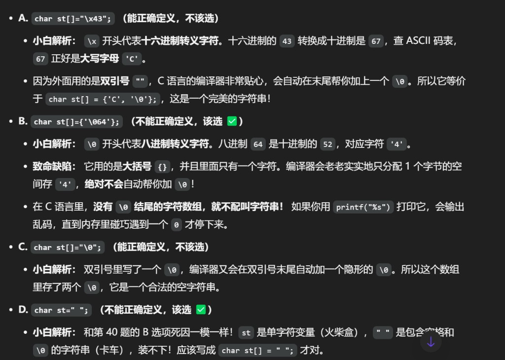

| 选项 | 能否定义字符串 | 说明 |
|------|----------------|------|
| A `char st[]="\x43";` | ✓ 能 | `\x43`='C'，双引号自动补 `\0` |
| **B `char st[]={'\064'};`** | ✗ **不能** | 花括号只有 1 字节，**无 `\0` 结尾** |
| C `char st[]="\0";` | ✓ 能 | 合法空串 |
| **D `char st=" ";`** | ✗ **不能** | `st` 是单个 char，不是数组 |

| 你的答案 | 正确答案 |
|----------|----------|
| A, B, D | **B、D**（A 是合法字符串，不应选） |

### ⚠️ 避坑指南

- 双引号 `""` → 编译器自动在末尾加 `\0` → 才是 C 字符串
- 花括号 `{'4'}` 只给 1 字节 → 没有 `\0` → 不是字符串，`printf("%s")` 会越界读

---

## 第 42~45 题（多选）

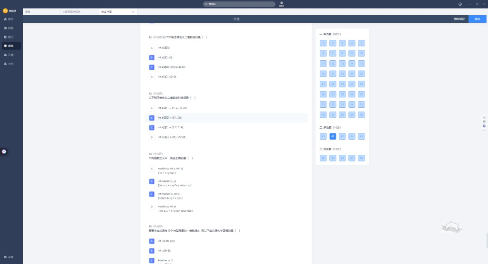

### 第 42 题 · 不能正确定义二维数组

| 选项 | 判断 | 说明 |
|------|------|------|
| A `int a[2][3];` | ✓ 能 | 合法声明 |
| B `int a[][3]={0};` | 争议 | 标准 C 合法；部分教材要求 `{{0,0,0}}` 形式 |
| C `int a[2][3]={{1,2},{3,4}};` | ✓ 能 | 标准写法 |
| D `int a[][3]={1,2,3};` | ✓ 能 | 推断为 1 行 3 列 |

| 你的答案 | 参考答案 |
|----------|----------|
| B | **B**（超星常见标 B；严格语法上四选项大多合法） |

### 第 43 题 · 能正确定义二维数组

| 选项 | 判断 |
|------|------|
| A `int a[2][]={{1,2},{3,4}}` | ✗ 缺列数 |
| **B `int a[2][2]={{1},{2}}`** | ✓ 余下补 0 |
| **C `int a[][2]={1,2,3,4}`** | ✓ 推断 2 行 |
| D `int a[2][2]={{1},{2},{3}}` | ✗ 3 行初值超 2 行 |

| 你的答案 | 正确答案 |
|----------|----------|
| B | **B、C** |

### 第 44 题 · 完全正确的函数定义

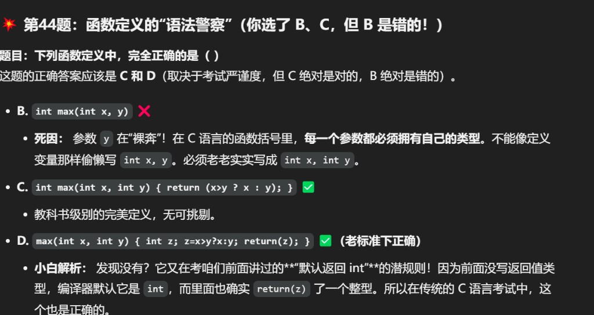

| 选项 | 判断 |
|------|------|
| A 缺返回类型、无 return | ✗ |
| B `int max(int x, y)` 形参 y 缺类型 | ✗ **必错** |
| **C `int max(int x,int y){ return ... }`** | ✓ 现代标准完美 |
| **D `max(int x,int y){ return z; }`** | ✓ C89 隐式 int |

函数形参**每个都要写类型**，不能写 `int x, y`（与变量声明不同）。

| 你的答案 | 正确答案 |
|----------|----------|
| C | **C、D** |

### 第 45 题 · 10 个 int 元素的一维数组

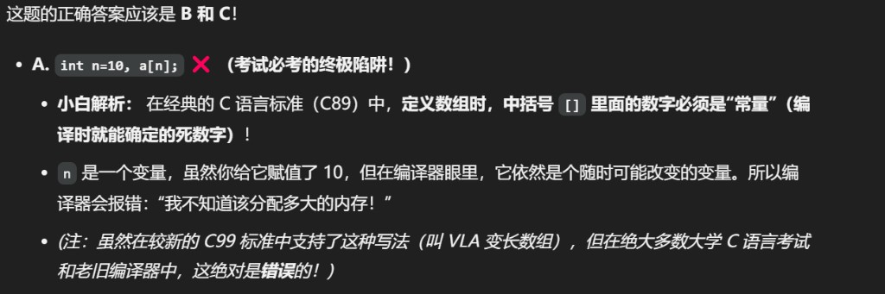

| 选项 | 判断 |
|------|------|
| A `int n=10, a[n];` | ✗ C89 数组长度须常量；C99 VLA 考试常判错 |
| **B `int a[5+5];`** | ✓ 常量表达式 = 10 |
| **C `#define n 5` + `int a[2*n];`** | ✓ 宏展开为常量 |
| **D `int a[10];`** | ✓ 最直接 |

| 你的答案 | 正确答案 |
|----------|----------|
| B | **B、C、D**（A 是 C89 终极陷阱） |

---

## 第 46~50 题（判断）


### 第 46 题 · 函数不能嵌套定义

**题目**：C 语言的函数可以嵌套定义。

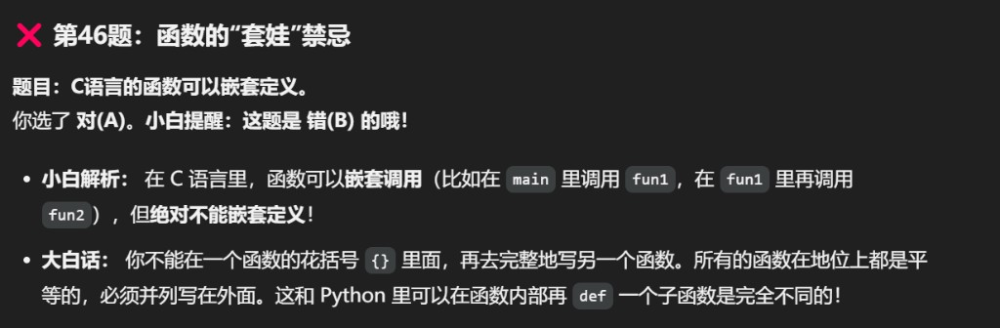

| 你的答案 | 正确答案 |
|----------|----------|
| A 对 | **B. 错** |

- **嵌套调用** ✓：`main` 调 `fun1`，`fun1` 里再调 `fun2`
- **嵌套定义** ✗：不能在 `fun1` 的 `{}` 里再写完整 `fun2` 定义（Python 可以，C 不行）

### 第 47 题 · 并非所有函数名用户自定

| 你的答案 | 正确答案 |
|----------|----------|
| B 错 ✓ | **B. 错** |

`main` 必须叫 `main`；`printf` 等库函数名也不能改。

### 第 48 题 · 形参占用栈空间

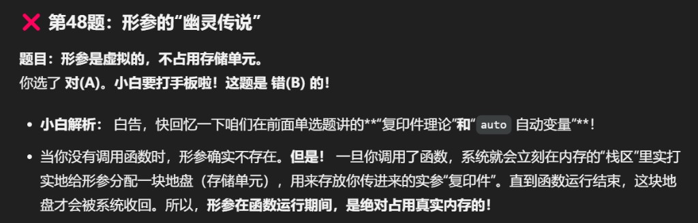

**题目**：形参是虚拟的，不占用存储单元。

| 你的答案 | 正确答案 |
|----------|----------|
| A 对 | **B. 错** |

函数调用时，系统在**栈区**给形参分配真实内存存实参的"复印件"；函数结束才回收。

### 第 49 题 · 非主函数靠调用执行

| 你的答案 | 正确答案 |
|----------|----------|
| A 对 ✓ | **A. 对** |

标准 C 程序里，除 `main` 外函数都通过调用链执行。

### 第 50 题 · 程序在 main 结束而非最后一个函数

**题目**：C 程序总是从 `main` 开始，在**程序最后一个函数**中结束。

| 你的答案 | 正确答案 |
|----------|----------|
| B 错 ✓ | **B. 错** |

程序在 **`main` 返回**（或 `exit`）时结束，与源文件中函数书写顺序无关。

---

## 专题 · 函数四种组合

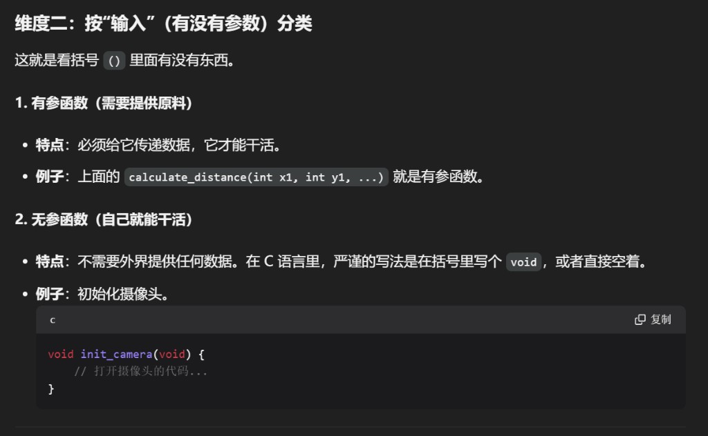
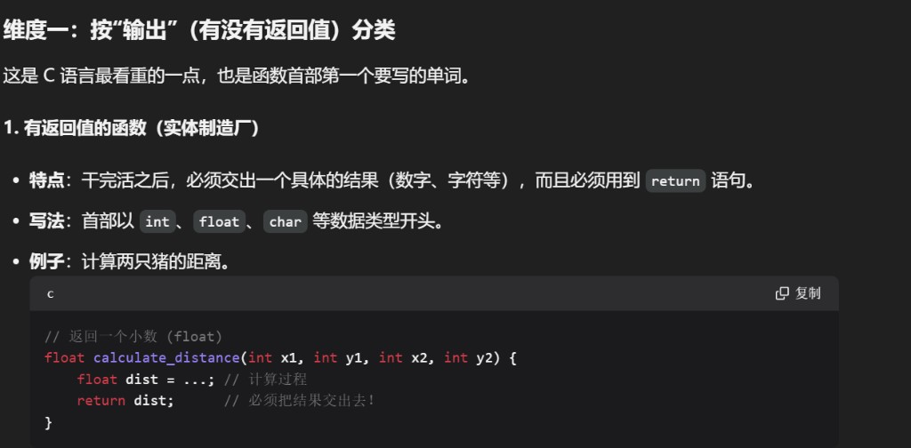
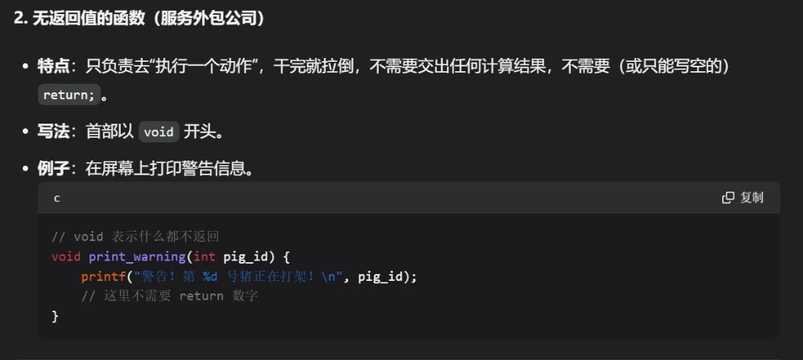

| 写法 | 输入 | 输出 |
|------|------|------|
| `int fun(int a)` | 有 | 有（return 整数） |
| `void fun(int a)` | 有 | 无 |
| `int fun(void)` | 无 | 有 |
| `void fun(void)` | 无 | 无 |

---

## 专题 · static 变量

**为什么 C 发明 static？**

- 全局变量：有记忆，但谁都能改 → **变量污染**
- static 局部：有记忆 + 只有本函数能访问 → 两全其美

---

## 专题 · 全局变量与 extern

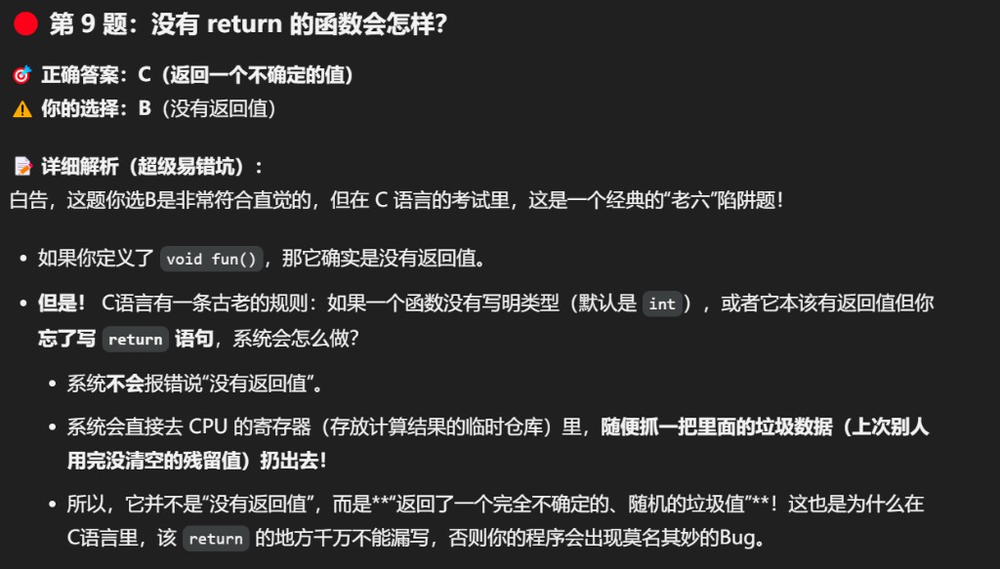
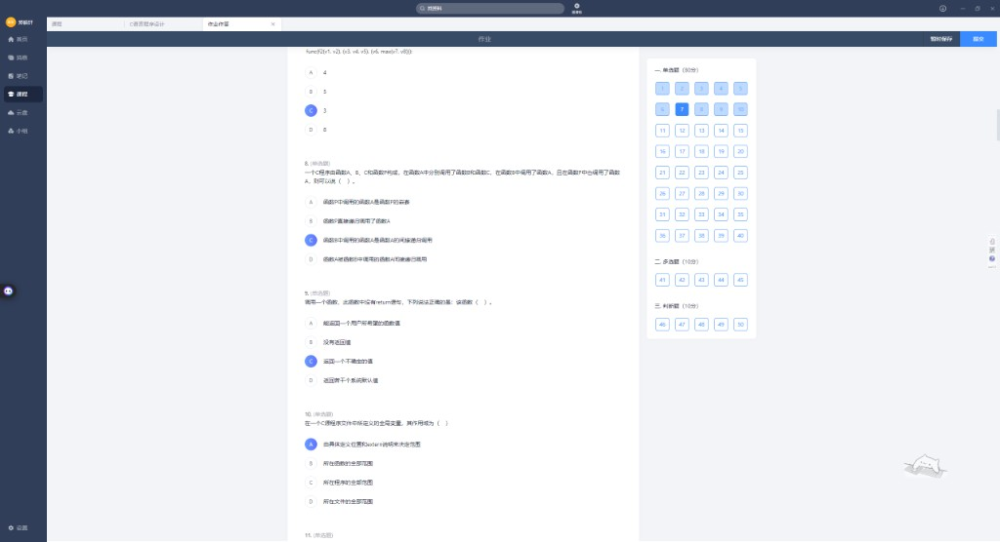

工程上尽量少用全局变量。需要共享数据时，优先：

1. **static** — 函数内部记状态
2. **指针传递** — 只把"钥匙"交给需要的函数

---

## 本批易错点速记

| 题号 | 你的选择 | 正确答案 | 一句话 |
|------|----------|----------|--------|
| 1 | B 36 | **A 25** | `*(t+i)` 步长 2 求奇数位之和 |
| 5 | C 4 | **B 6** | static 只初始化一次 |
| 8 | B | **C** | A↔B 间接递归 |
| 9 | B | **C** | 非 void 缺 return → 垃圾值 |
| 14 | B 15 | **A 14** | 三层 a：全局/static/局部 |
| 17 | A 100 200 | **C 5 7** | 局部变量遮蔽全局 |
| 21 | D | **B 4332** | `c[s[i]]++` 频数统计 |
| 25 | C | **A** | 返回值看函数首部类型 |
| 28 | C 192 | **A** | void 不能 return 值 |
| 38 | A 10100 | **D 10010** | 18 的二进制 |
| 41 | A,B,D | **B,D** | 字符串必须有 `\0` |
| 43 | B | **B,C** | 二维数组列数不能省 |
| 44 | C | **C,D** | 形参每个都要类型 |
| 45 | B | **B,C,D** | `a[n]` 在 C89 非法 |
| 46 | A 对 | **错** | 不能嵌套定义函数 |
| 48 | A 对 | **错** | 形参占栈空间 |

---

## 附录：截图索引

| 文件 | 内容 |
|------|------|
| `01~04` | 第 1 题 + 指针算术 |
| `05~21` | 第 2~10 题 + 专题 |
| `22~27` | 全局变量 + extern |
| `28~50` | 第 11~27 题 + 解析 |
| `52~63` | 第 28~41 题 + 存储类/十转二 |
| `64~69` | 第 42~50 题（多选+判断） |

---

*本卷 50 题已全部整理完毕。*
