# C题库 · 结课练习一

> 整理日期：2026-06-18  
> 全卷 **471 题** · **单选 1~334 · 多选 335~393 · 判断 394~471 已全部录入**

---

## 目录

- [第 1 题 · while 循环](#第-1-题)
- [第 2 题 · 十进制转二进制](#第-2-题)
- [第 3 题 · 指针比较返回](#第-3-题)
- [第 4 题 · 指针传值与字符自增](#第-4-题)
- [第 5 题 · 指针求字符串长度](#第-5-题)
- [第 6 题 · 编译流程](#第-6-题)
- [第 7 题 · 指针交换首字符](#第-7-题)
- [第 8~10 题](#第-8-题)
- [第 11~13 题](#第-11-题)
- [第 14~16 题](#第-14-题)
- [第 17~19 题](#第-17-题)
- [第 20~23 题](#第-20-题)
- [第 24~26 题](#第-24-题)
- [第 27~29 题](#第-27-题)
- [第 30~35 题](#第-30-题)
- [第 36~40 题](#第-36-题)
- [第 41~45 题](#第-41-题)
- [第 46~51 题](#第-46-题)
- [第 52~60 题](#第-52-题)
- [第 61~68 题](#第-61-题)
- [第 69~75 题](#第-69-题)
- [第 76~85 题](#第-76-题)
- [第 86~100 题](#第-86-题)
- [第 101~110 题](#第-101-题)
- [第 111~120 题](#第-111-题)
- [第 121~130 题](#第-121-题)
- [第 131~133 题](#第-131-题)
- [第 134~150 题](#第-134-题)
- [第 151~177 题](#第-151-题)
- [178~334 快速答案](#178334-快速答案)
- [复习重点总结](#复习重点总结)
- [你的易错点总览（1~177）](#你的易错点总览1177共-55-题)
- [考前50题（必刷）](#考前50题必刷)
- [考前必刷独立文件](#考前必刷独立文件)
- [考前20题·多选必刷](#考前20题多选必刷)
- [考前15题·判断必刷](#考前15题判断必刷)
- [335~349 多选题答案](#335349-多选题答案)
- [350~353 多选题答案](#350353-多选题答案)
- [354~357 多选题答案](#354357-多选题答案)
- [358~361 多选题答案](#358361-多选题答案)
- [362~365 多选题答案](#362365-多选题答案)
- [366~369 多选题答案](#366369-多选题答案)
- [370~372 多选题答案](#370372-多选题答案)
- [373 多选题答案](#373-多选题答案)
- [374~377 多选题答案](#374377-多选题答案)
- [378~380 多选题答案](#378380-多选题答案)
- [381~384 多选题答案](#381384-多选题答案)
- [385~387 多选题答案](#385387-多选题答案)
- [388~390 多选题答案](#388390-多选题答案)
- [391~393 多选题答案](#391393-多选题答案)
- [394~471 判断题答案](#394471-判断题答案)

---

## 第 1 题

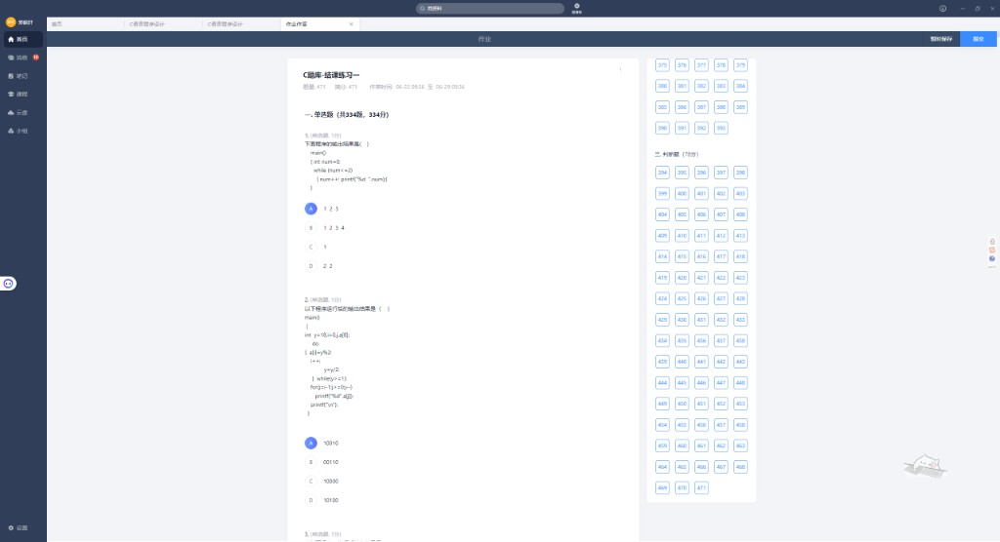

```c
main()
{
    int num=0;
    while (num<=2)
    {
        num++; printf("%d ", num);
    }
}
```

| 轮次 | num（判断前） | 动作 | 输出 |
|------|---------------|------|------|
| 1 | 0 ≤ 2 ✓ | num→1 | 1 |
| 2 | 1 ≤ 2 ✓ | num→2 | 2 |
| 3 | 2 ≤ 2 ✓ | num→3 | 3 |
| 4 | 3 ≤ 2 ✗ | 结束 | — |

| 你的答案 | 正确答案 |
|----------|----------|
| A ✓ | **A. 1 2 3** |

---

## 第 2 题

```c
int y=18, i=0, j, a[6];
do {
    a[i] = y % 2;  i++;
    y = y / 2;
} while (y >= 1);
for (j = i-1; j >= 0; j--)
    printf("%d", a[j]);
```

`18` 除 2 取余 → `a[]={0,1,0,0,1}`，倒序输出 **10010**。

| 你的答案 | 正确答案 |
|----------|----------|
| A ✓ | **A. 10010** |

> 同 [章节45 第38题](章节45_函数练习.md#第-38-题--十进制转二进制)

---

## 第 3 题

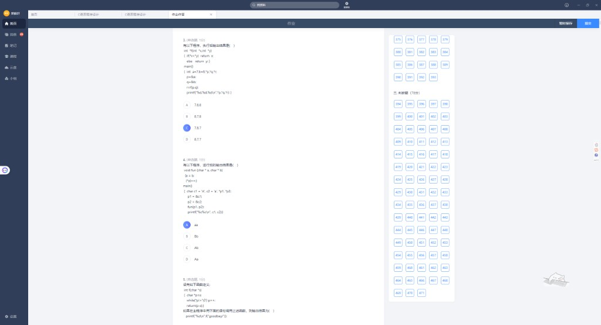

```c
int *f(int *x, int *y)
{
    if (*x < *y) return x;
    else return y;
}
// p=&a(7), q=&b(8), r=f(p,q) → r 指向较小者 a
printf("%d,%d,%d\n", *p, *q, *r);  // 7, 8, 7
```

| 你的答案 | 正确答案 |
|----------|----------|
| C ✓ | **C. 7,8,7** |

函数返回的是**指针**（地址），`r` 与 `p` 同指 `a`，`*r=7`。

---

## 第 4 题

```c
void fun(char *a, char *b)
{
    a = b;      // 只改了形参副本 a 的指向，p1 不变
    (*a)++;     // 通过 a 改的是 c2：'a' → 'b'
}
// c1='A' 未动，c2='b'
printf("%c%c\n", c1, c2);
```

| 你的答案 | 正确答案 |
|----------|----------|
| A aa | **C. Ab**（或选项中含 `Ab` 的项） |

### ⚠️ 避坑指南

- `a = b` 是**指针副本**重新赋值，不影响 `main` 里的 `p1`
- `(*a)++` 改的是 `a` **当前指向**的内存（即 `c2`）
- 想改 `p1` 的指向需 `char **`，想改 `c1` 需传 `&c1`

---

## 第 5 题

```c
int f(char *s)
{
    char *p = s;
    while (*p != '\0') p++;
    return (p - s);    // 指针相减 = 元素个数
}
printf("%d\n", f("goodbey"));
```

`"goodbey"` 共 **7** 个字符（g-o-o-d-b-e-y）。

| 答案 |
|------|
| **7** |

`p - s`：两指针间相差的元素个数，即字符串长度。

---

## 第 6 题

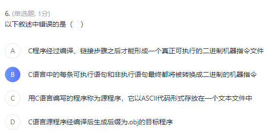

「错误的是」：**B** — 非执行语句（如变量声明、预处理指令）**不会**都变成二进制机器指令。

| 你的答案 | 正确答案 |
|----------|----------|
| B ✓ | **B** |

---

## 第 7 题

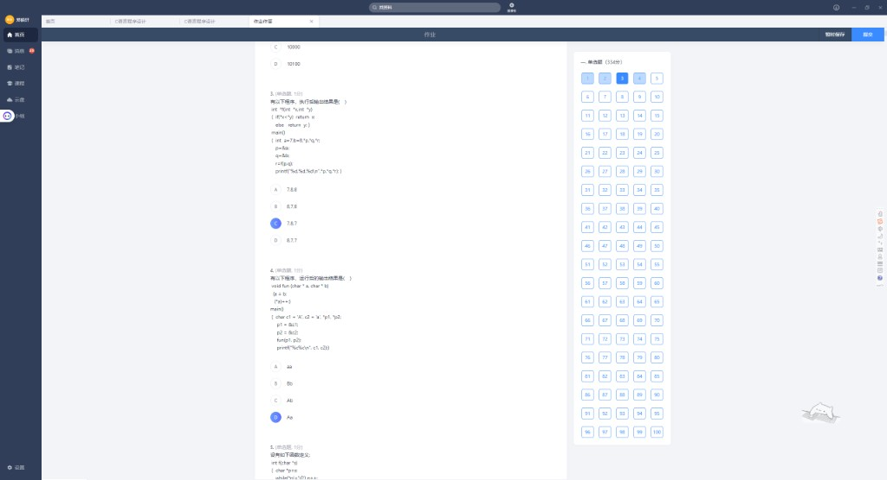
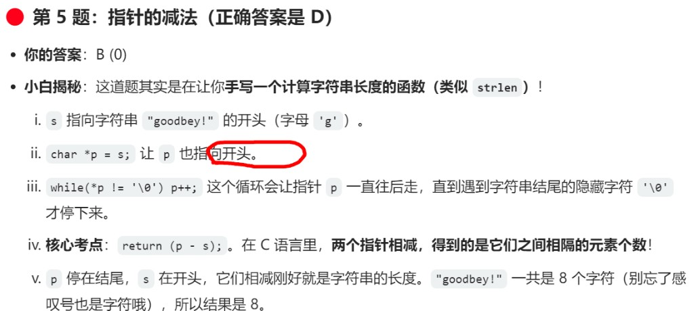
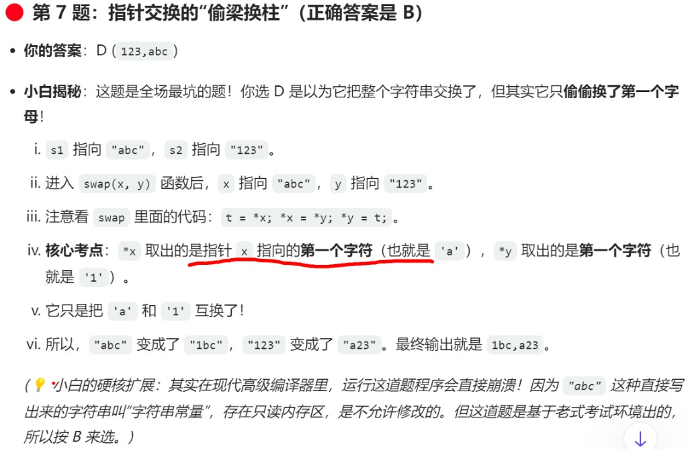

`swap` 里 `*x = *y` 只交换**首字符**，不是整串对调。

```c
// s1→"abc", s2→"123"
// *x='a' 与 *y='1' 互换 → "1bc" 和 "a23"
```

| 你的答案 | 正确答案 |
|----------|----------|
| D `123,abc` | **B `1bc,a23`** |

**【⚠️ 避坑】** `*p` 只取**一个字符**；打印整串用 `printf("%s", p)` 传地址，不要 `printf("%s", *p)`。

---

## 第 8 题

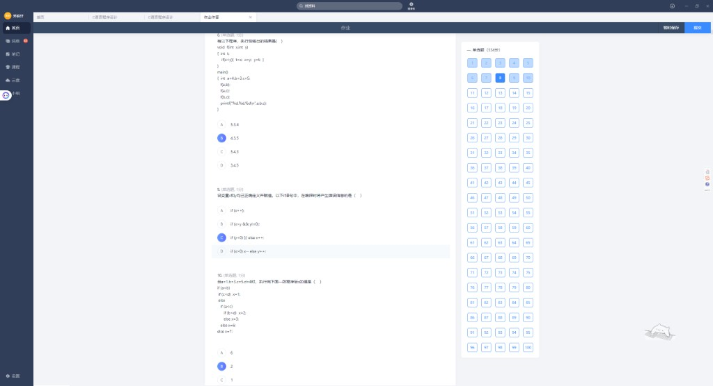

`f` 交换形参 `x,y`，**传值** → `main` 里 `a,b,c` 仍是 **4,3,5**。

| 你的答案 | 正确答案 |
|----------|----------|
| B ✓ | **B. 4,3,5** |

---

## 第 9 题

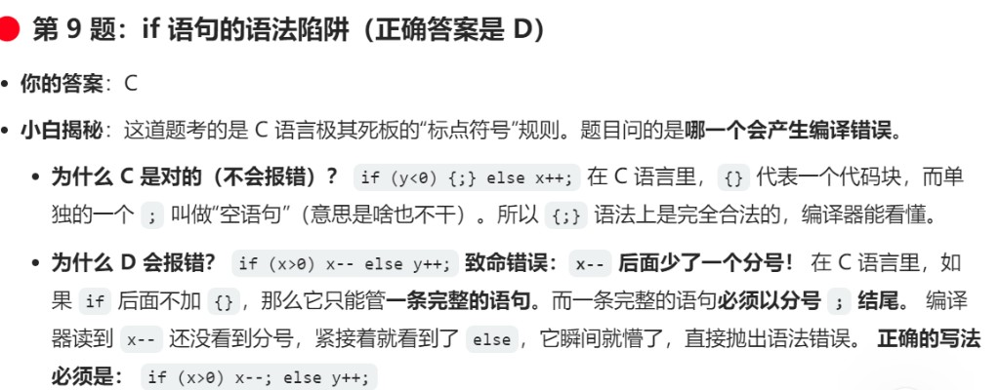

| 选项 | 编译 |
|------|------|
| C `if(y<0){;} else x++;` | ✓ 合法 |
| **D `if(x>0) x-- else y++;`** | ✗ **`x--` 后缺分号** |

| 你的答案 | 正确答案 |
|----------|----------|
| C | **D** |

无 `{}` 时，`if` 分支必须是**带分号的完整语句**：`if(x>0) x--; else y++;`

---

## 第 10 题

`a=1,b=3,c=5,d=4` → `a<b` 真 → `c<d` 假 → 走 `else` 里 `a<c` 真 → `b<d` 真 → **x=2**。

| 你的答案 | 正确答案 |
|----------|----------|
| B ✓ | **B. 2** |

---

## 第 11 题

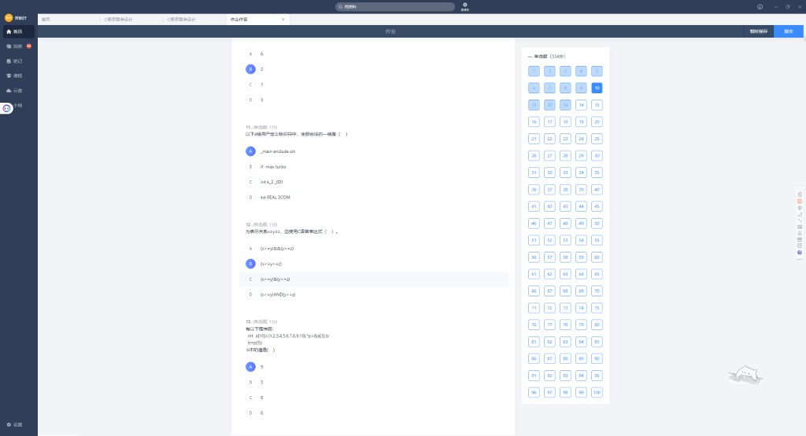

合法标识符：字母/下划线开头，非关键字。

| 你的答案 | 正确答案 |
|----------|----------|
| A ✓ | **A `_main` `enclude` `sin`** |

---

## 第 12 题

表示 x≥y≥z 必须拆开写：

| 你的答案 | 正确答案 |
|----------|----------|
| B `(x>=y>=z)` | **A `(x>=y)&&(y>=z)`** |

**【⚠️ 避坑】** C 里 `x>=y>=z` 会先算 `x>=y` 得 0/1，再和 `z` 比，**不是**链式比较。

---

## 第 13 题

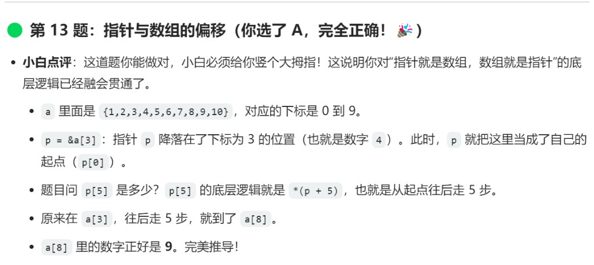

`p=&a[3]` → `p[5]` 等价 `a[3+5]=a[8]` → 值 **9**。

| 你的答案 | 正确答案 |
|----------|----------|
| A ✓ | **A. 9** |

---

## 第 14 题

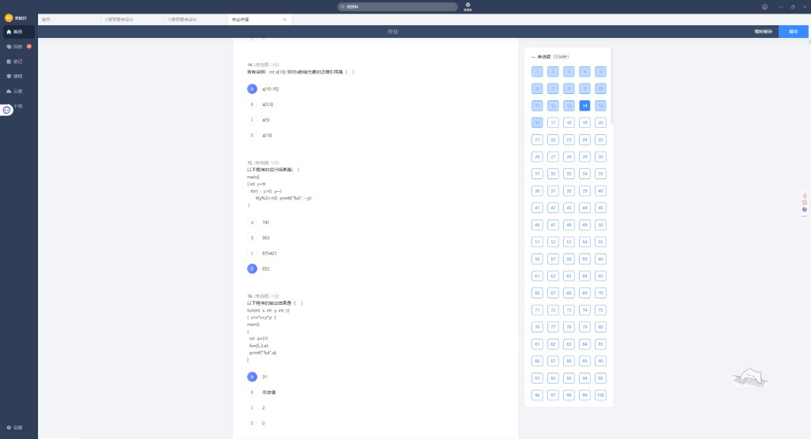

| 选项 | 判断 |
|------|------|
| **A `a[10-10]`** | ✓ 即 `a[0]` |
| B `a[3,5]` | ✗ 逗号表达式 |
| C `a(5)` | ✗ 函数调用语法 |
| D `a[10]` | ✗ 越界 |

| 你的答案 | 正确答案 |
|----------|----------|
| A ✓ | **A** |

---

## 第 15 题

```c
for(; y>0; y--)
    if(y%3==0) printf("%d", --y);
// y=9→8, 6→5, 3→2 → 输出 852
```

| 你的答案 | 正确答案 |
|----------|----------|
| D ✓ | **D. 852** |

---

## 第 16 题

`fun(5,2,a)` 传值，`z=x*x+y*y` 只改形参 → **`a` 仍是 31**。

| 你的答案 | 正确答案 |
|----------|----------|
| A ✓ | **A. 31** |

---

## 第 17 题

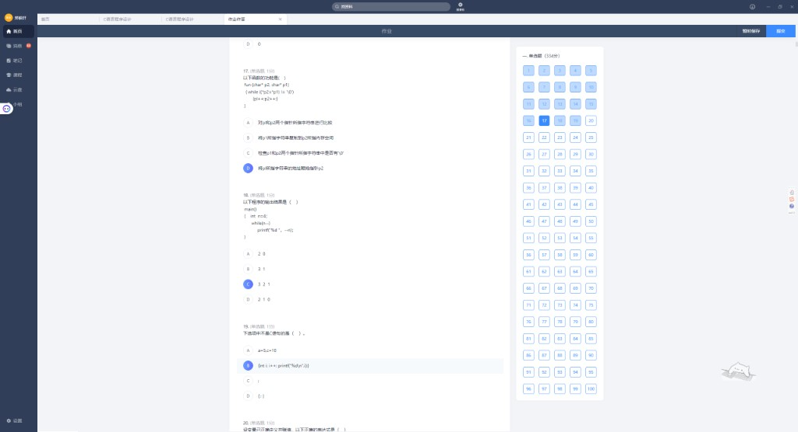
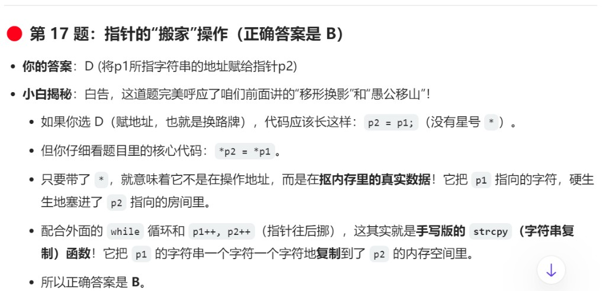

```c
while ((*p2=*p1) != '\0') { p1++; p2++; }
// 手工 strcpy：逐字符复制，不是 p2=p1 改地址
```

| 你的答案 | 正确答案 |
|----------|----------|
| D 地址赋值 | **B 复制字符串** |

---

## 第 18 题

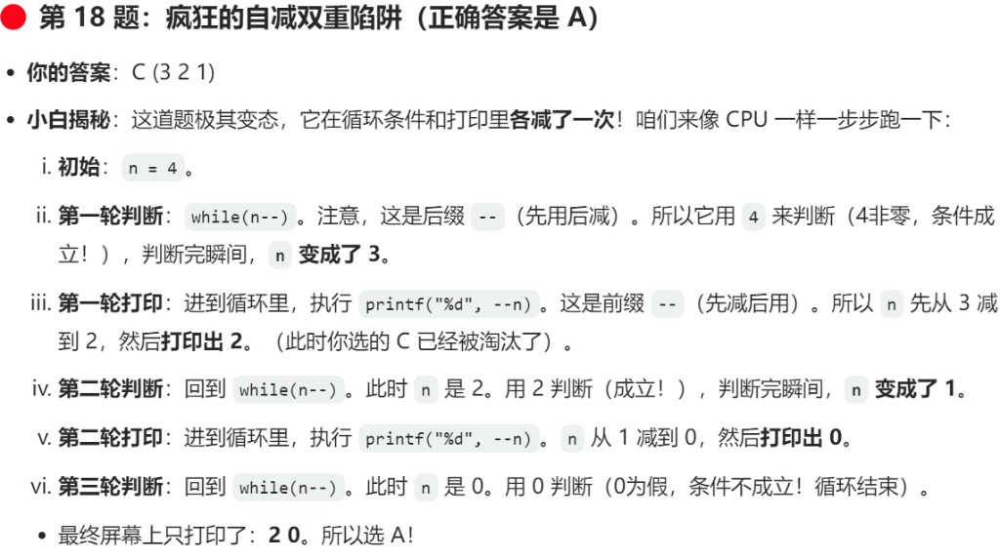

```c
n=4;
while(n--)    // 先判断 4，再 n→3
    printf("%d", --n);  // 3→2 打印2；再 1→0 打印0
// 输出 2 0
```

| 你的答案 | 正确答案 |
|----------|----------|
| C `3 2 1` | **A `2 0`** |

---

## 第 19 题

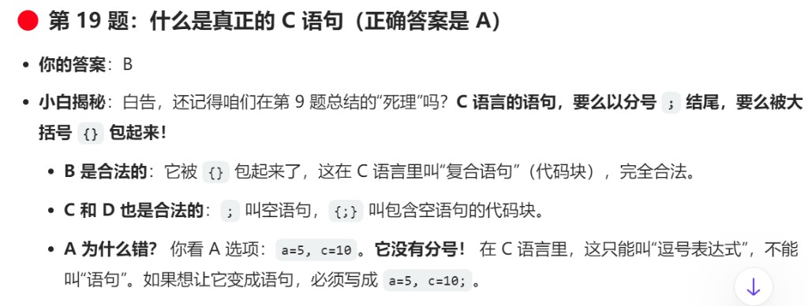

| 选项 | 是否语句 |
|------|----------|
| **A `a=5,c=10`** | ✗ 逗号表达式，**缺分号** |
| B `{int i++; ...}` | ✓ 复合语句 |
| C `;` | ✓ 空语句 |
| D `{;}` | ✓ |

| 你的答案 | 正确答案 |
|----------|----------|
| B | **A** |

---

## 第 20 题

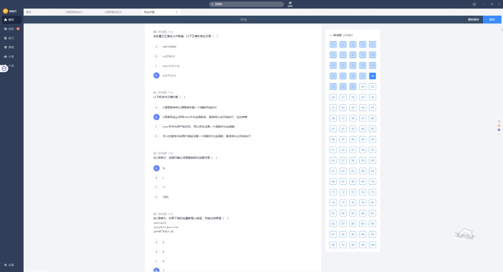
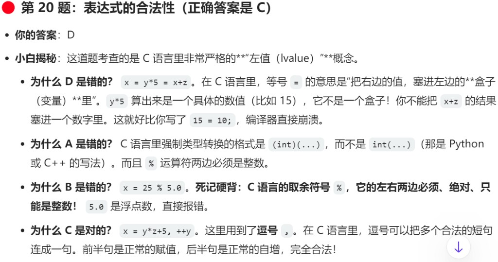

| 选项 | 判断 |
|------|------|
| D `x=y*5=x+z` | ✗ 左边 `y*5` 不是左值 |
| **C `x=y*z+5, ++y`** | ✓ 逗号表达式 |

| 你的答案 | 正确答案 |
|----------|----------|
| D | **C** |

---

## 第 21 题

| 你的答案 | 正确答案 |
|----------|----------|
| B ✓ | **B. 必须用 main，程序从此开始** |

---

## 第 22 题

| 你的答案 | 正确答案 |
|----------|----------|
| A ✓ | **A. `%` 两侧必须是整型** |

---

## 第 23 题

```c
sum=a=5;           // sum=5, a=5
a=sum++;           // a=5, sum=6
a++;               // a=6
++a;               // a=7
```

| 你的答案 | 正确答案 |
|----------|----------|
| C ✓ | **C. 7** |

---

## 第 24 题

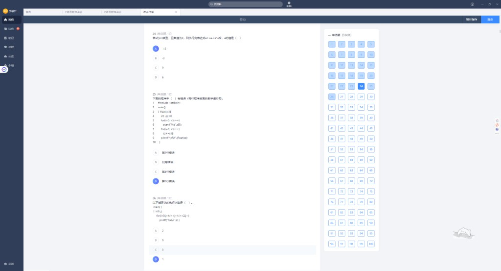

`a=3`：`a-=a*a` → `a=-6`；`a+=a` → **a=-12**。

| 你的答案 | 正确答案 |
|----------|----------|
| A ✓ | **A. -12** |

---

## 第 25 题

第 6 行 `scanf("%d",&a[i])`：`a` 是 **float** 数组，格式符应为 `%f`。

| 你的答案 | 正确答案 |
|----------|----------|
| D ✓ | **D. 第 6 行错误** |

---

## 第 26 题

```c
for(i=0,j=1; i<=j+1; i+=2, j--)
// 第1轮 i=0,j=1 条件真，打印0 → i=2,j=0
// 第2轮 i=2,j=0 → i<=1 假，结束 → 执行 1 次
```

| 你的答案 | 正确答案 |
|----------|----------|
| D ✓ | **D. 1** |

---

## 第 27 题

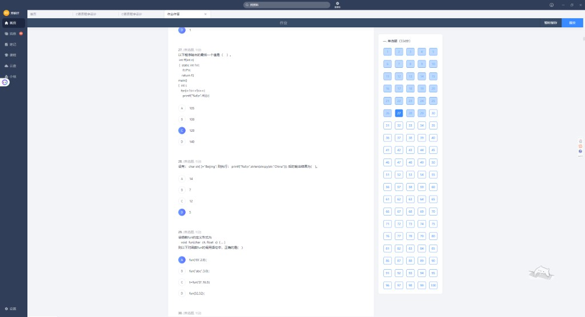

`static int f` 在 `ff` 里累乘 → 输出 1、2、6、24、**120**。

| 你的答案 | 正确答案 |
|----------|----------|
| C ✓ | **C. 120** |

---

## 第 28 题

`strcpy(str,"China")` 后 `strlen` → **5**（不含 `\0`）。

| 你的答案 | 正确答案 |
|----------|----------|
| D ✓ | **D. 5** |

---

## 第 29 题

`void fun(char ch, float x)` → **`fun(65, 2.8)`** 合法（整型可赋给 char）。

| 你的答案 | 正确答案 |
|----------|----------|
| A ✓ | **A** |

---

## 第 30 题

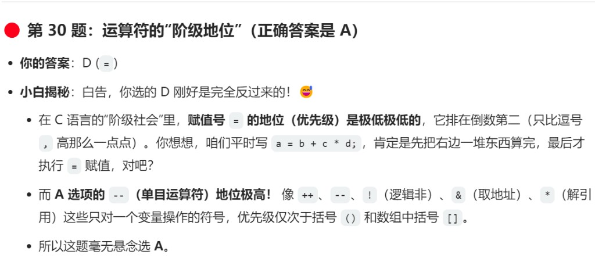

问**优先级最高**的：`--` 是一元运算符，很高；`=` 很低（只比 `,` 高）。

| 你的答案 | 正确答案 |
|----------|----------|
| D `=` | **A `--`** |

---

## 第 31 题

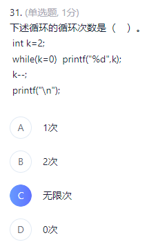

```c
int k=2;
while(k=0) printf("%d", k);  // = 是赋值，不是 ==
k--;
```

`k=0` 把 k 赋为 0，表达式值为 0 → 条件为假 → **循环 0 次**。

| 你的答案 | 正确答案 |
|----------|----------|
| C 无限次 | **D 0 次** |

**【⚠️ 避坑】** `while(k=0)` ≠ `while(k==0)`；赋值结果是 0，循环体一次都不进。

---

## 第 32 题

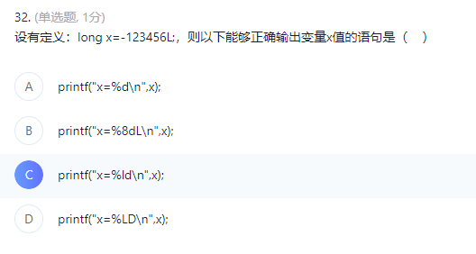

`long x=-123456L` 必须用 **`%ld`** 输出（`l` 小写）。

| 选项 | 判断 |
|------|------|
| A `%d` | ✗ int 格式 |
| B `%8dL` | ✗ 非法写法 |
| **C `%ld`** | ✓ |
| D `%LD` | ✗ 大小写错 |

| 你的答案 | 正确答案 |
|----------|----------|
| C ✓ | **C** |

**【⚠️ 避坑】** `long` → `%ld`；`long long` → `%lld`；格式符大小写敏感。

---

## 第 33 题

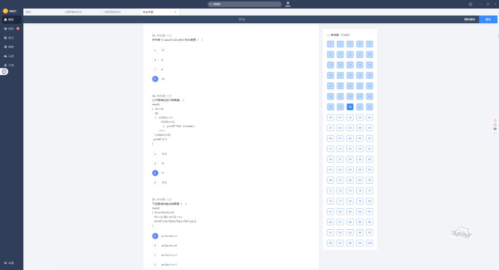
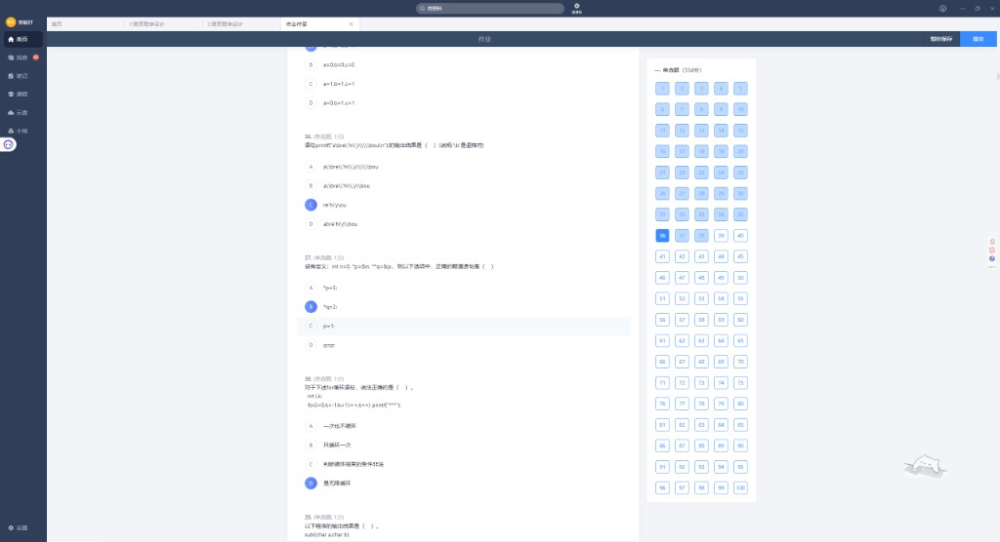

`"\\abcd\123\xA8\f"` 拆解：

| 片段 | 字符数 |
|------|--------|
| `\\` | 1 |
| `abcd` | 4 |
| `\123` 八进制 | 1 |
| `\xA8` 十六进制 | 1 |
| `\f` | 1 |
| **合计** | **8** |

| 你的答案 | 正确答案 |
|----------|----------|
| D 10 | **C 8** |

**【⚠️ 避坑】** 见到 `\` 先看后面是 `\\`、`\123`、`\xAB` 还是 `\t` 这种「一整包」，别把 `\123` 拆成三个数字。

---

## 第 34 题

```c
i=7 时：7%3==1 且 7%5==2 → 打印 7 后 break
```

| 你的答案 | 正确答案 |
|----------|----------|
| C ✓ | **C. 7** |

---

## 第 35 题

`++a` 使 `a=1`，`||` 短路，**`b、c` 不再运算** → `a=1,b=0,c=0`。

| 你的答案 | 正确答案 |
|----------|----------|
| A ✓ | **A** |

---

## 第 36 题

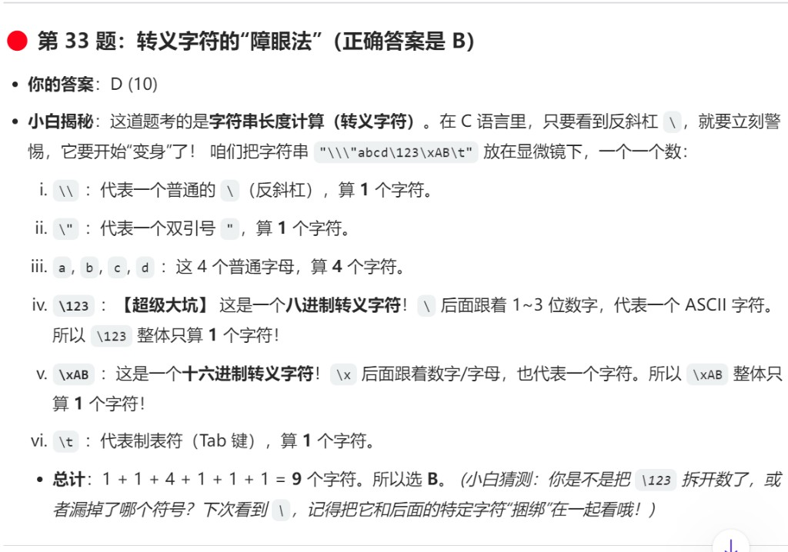

`printf("a\bre\hi\y\\\\\\bou\n")` 经 `\b` 退格等处理后输出 **`re\h\y\you`**。

| 你的答案 | 正确答案 |
|----------|----------|
| C ✓ | **C** |

---

## 第 37 题

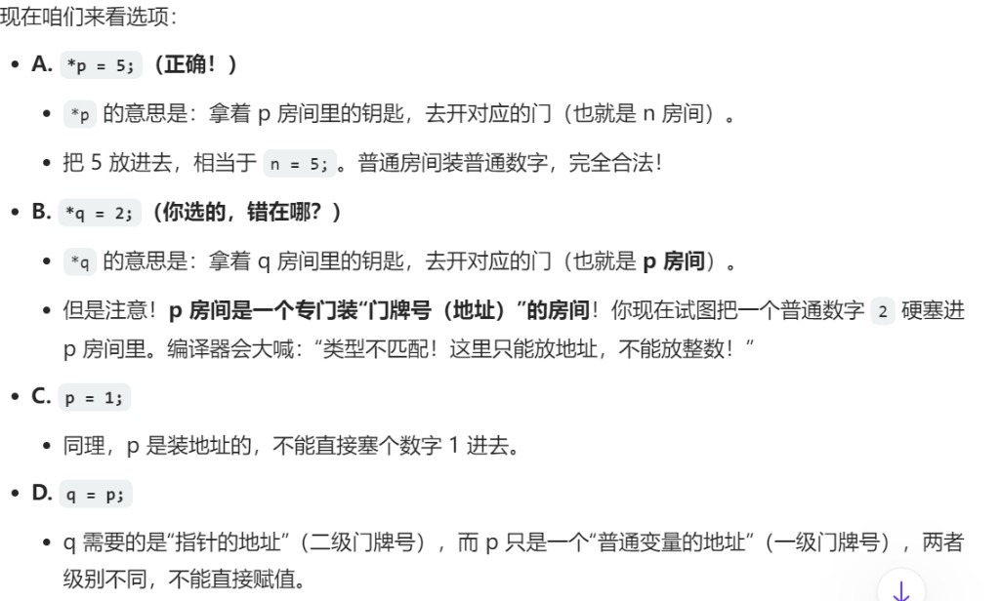

`int n, *p=&n, **q=&p`：

| 选项 | 判断 |
|------|------|
| **A `*p=5`** | ✓ 等价 `n=5` |
| B `*q=2` | ✗ `*q` 是 `p`，不能把整数塞进指针变量 |

| 你的答案 | 正确答案 |
|----------|----------|
| B | **A** |

---

## 第 38 题

`for(i=0,k=-1; k=1; i++,k++)` → `k=1` 恒真 → **无限循环**。

| 你的答案 | 正确答案 |
|----------|----------|
| D ✓ | **D** |

---

## 第 39 题

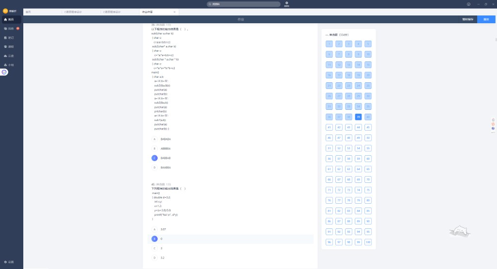

| 调用 | 效果 | 输出 |
|------|------|------|
| `sub3(&a,&b)` | 交换内容 | BA |
| `sub2(&a,b)` | `*a=b`，`b` 传值 | BB |
| `sub1(a,b)` | 只换形参 | AB |

合计：**BABBAB**

| 你的答案 | 正确答案 |
|----------|----------|
| C ✓ | **C** |

---

## 第 40 题

`x=1.2` 赋给 int → `x=1`；`y=(1+3.8)/5.0=0`；`d*y=0`。

| 你的答案 | 正确答案 |
|----------|----------|
| B ✓ | **B. 0** |

---

## 第 41 题

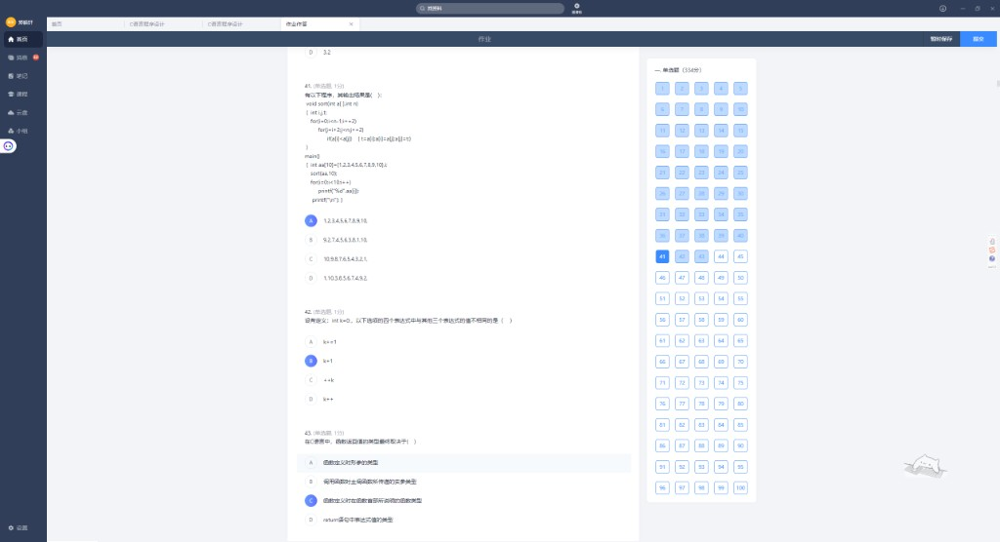
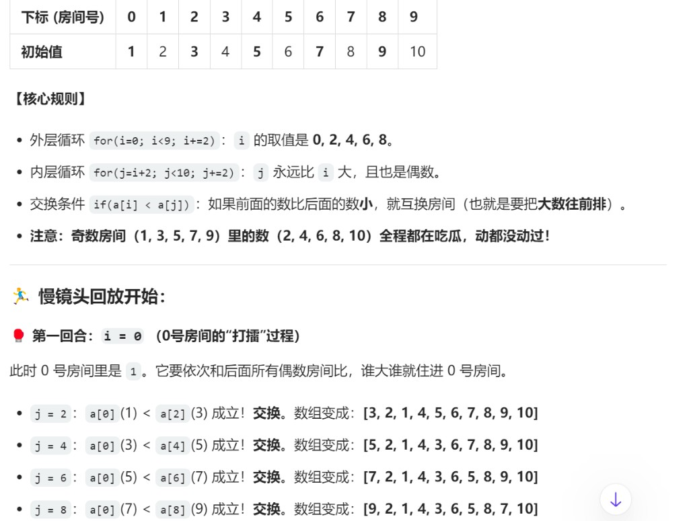

只对**偶数下标**元素做降序交换，奇数位不动 → **9,2,7,4,5,6,3,8,1,10**

| 正确答案 |
|----------|
| **B** |

---

## 第 42 题

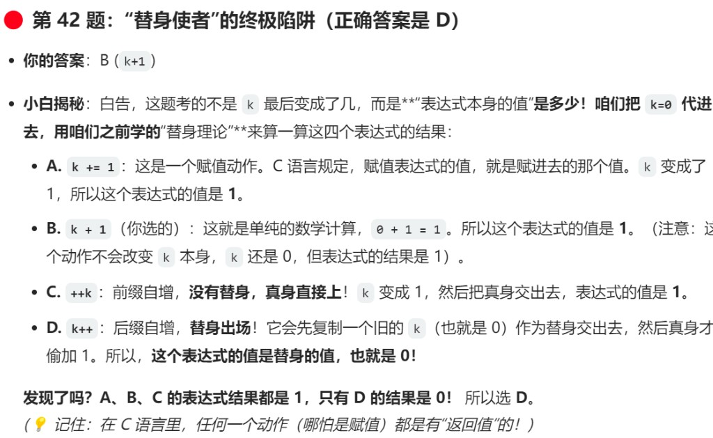

`k=0` 时：`k+=1`、`k+1`、`++k` 都得 **1**；只有 **`k++` 表达式值是 0**。

| 正确答案 |
|----------|
| **D `k++`** |

---

## 第 43 题

函数返回值类型由**函数定义首部**说明的类型决定。

| 正确答案 |
|----------|
| **C** |

---

## 第 44 题

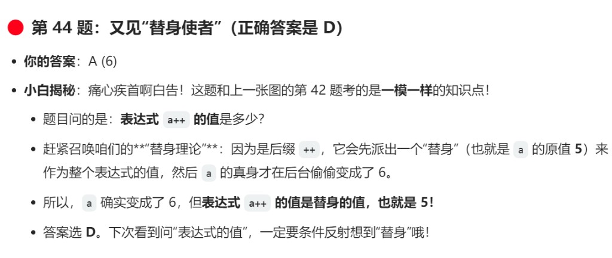

`int a=5; a++;` 问的是**表达式 `a++` 的值** → **5**（`a` 随后变 6）。

| 你的答案 | 正确答案 |
|----------|----------|
| A 6 | **D 5** |

---

## 第 45 题

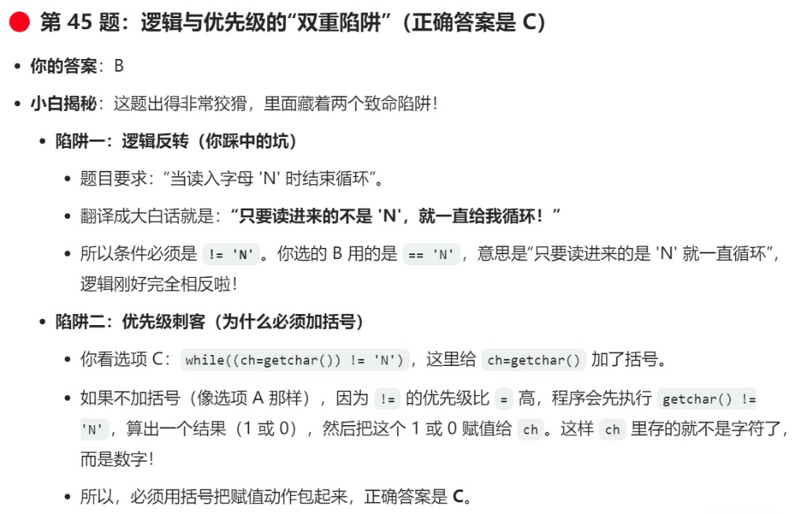

读字符直到 `N`：

```c
while ((ch = getchar()) != 'N')  // 必须加括号！
    printf("%c", ch);
```

| 你的答案 | 正确答案 |
|----------|----------|
| B `==N` | **C** |

**【⚠️ 避坑】** 无括号时 `ch=getchar()!='N'` 会把 0/1 赋给 `ch`，不是字符。

---

## 第 46 题

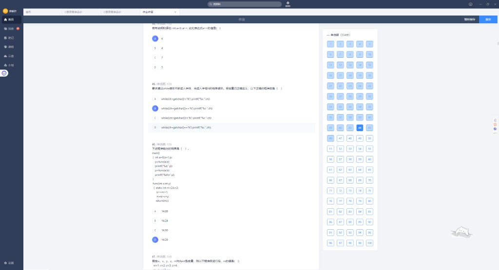

```c
// 第1次：i=5,m=14
// 第2次：i=20,m=29
```

| 你的答案 | 正确答案 |
|----------|----------|
| D ✓ | **D. 14,29** |

---

## 第 47 题

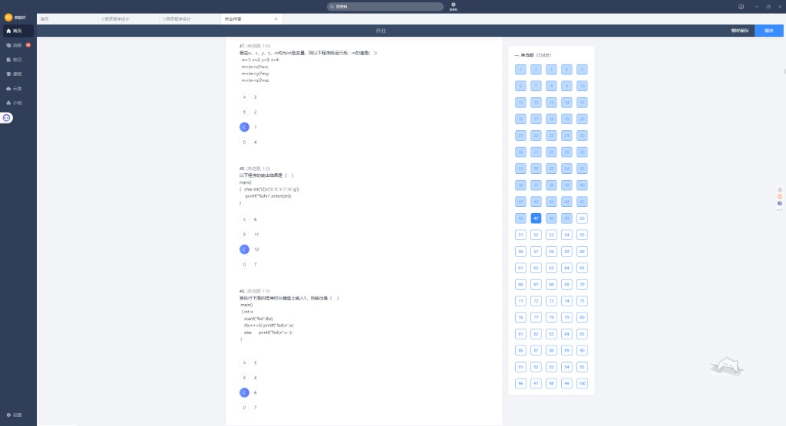

三连三元运算符取最小值 → **m=1**。

| 你的答案 | 正确答案 |
|----------|----------|
| C ✓ | **C. 1** |

---

## 第 48 题

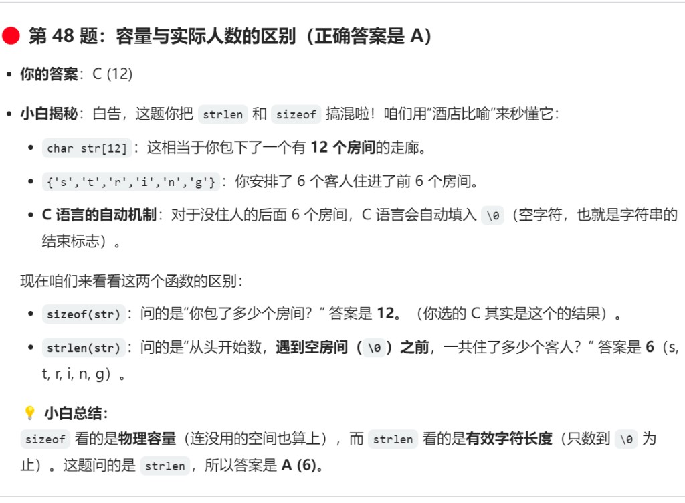

`{'h','e','l','l','o','\0','g'}` → `strlen` 遇 `\0` 停止 → **6**（不是 `sizeof` 的 12）。

| 你的答案 | 正确答案 |
|----------|----------|
| C 12 | **A 6** |

---

## 第 49 题

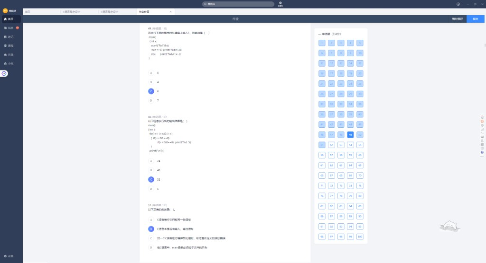

输入 5：`x++>5` 用 5 判断为假 → `else` 里 `printf(x--)` 先输出 **6**。

| 你的答案 | 正确答案 |
|----------|----------|
| C ✓ | **C. 6** |

---

## 第 50 题

`i=30` 时：`i++%5==0` → `++i` 得 32，`32%8==0` → 打印 **32**。

| 你的答案 | 正确答案 |
|----------|----------|
| C ✓ | **C. 32** |

---

## 第 51 题

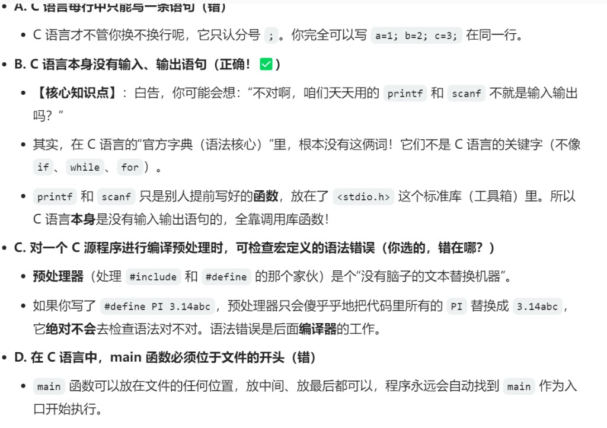

C 语言**本身**没有 I/O 语句，`printf`/`scanf` 是库函数。

| 你的答案 | 正确答案 |
|----------|----------|
| B ✓ | **B** |

---

## 第 52 题

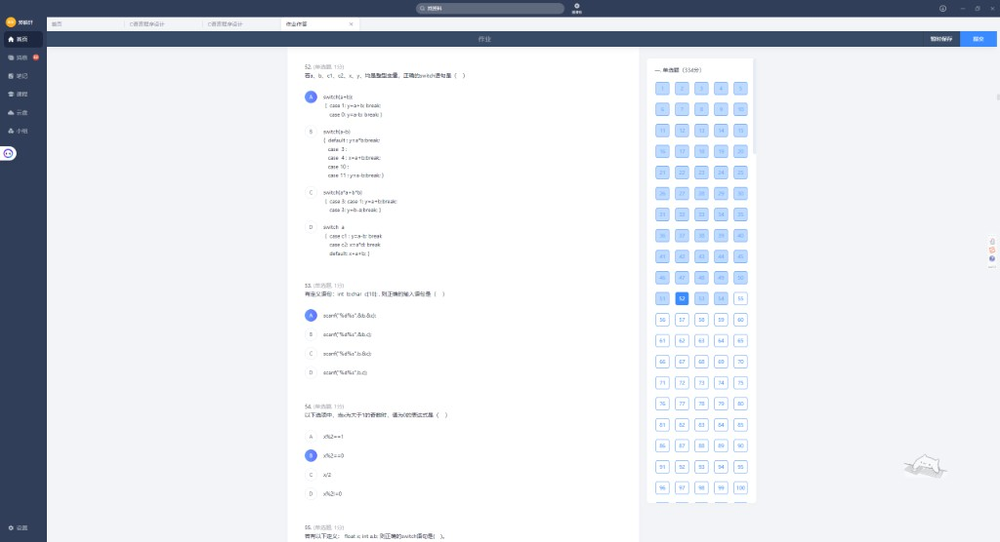

| 选项 | 问题 |
|------|------|
| A | `switch(a+b);` 后多了分号 |
| **B** | ✓ 表达式为整型，case 合法 |
| C | 两个 `case 3` 重复 |
| D | `switch a` 缺括号；case 不能是变量 |

| 正确答案 |
|----------|
| **B** |

---

## 第 53 题

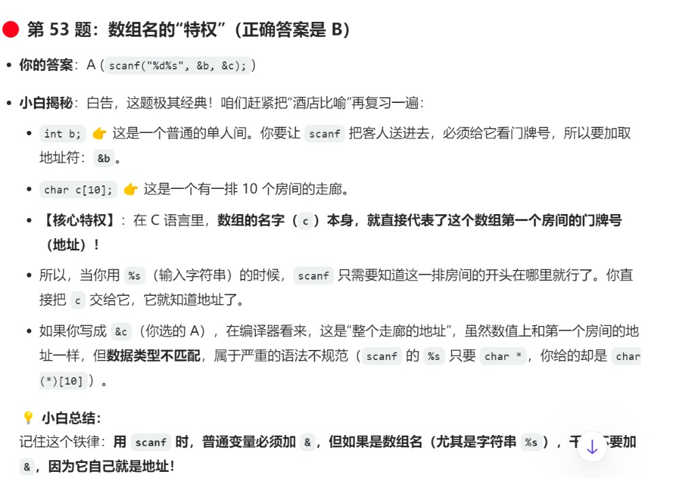

```c
int b; char c[10];
scanf("%d%s", &b, c);   // b 要 &，数组名 c 不要 &
```

| 你的答案 | 正确答案 |
|----------|----------|
| A `&c` | **B** |

**【⚠️ 避坑】** 数组名本身就是首元素地址，`scanf("%s", c)` 对；`&c` 类型是「数组指针」，不匹配。

---

## 第 54 题

x 为大于 1 的奇数 → `x%2==0` 为假 → 表达式值 **0**。

| 你的答案 | 正确答案 |
|----------|----------|
| B ✓ | **B** |

---

## 第 55 题

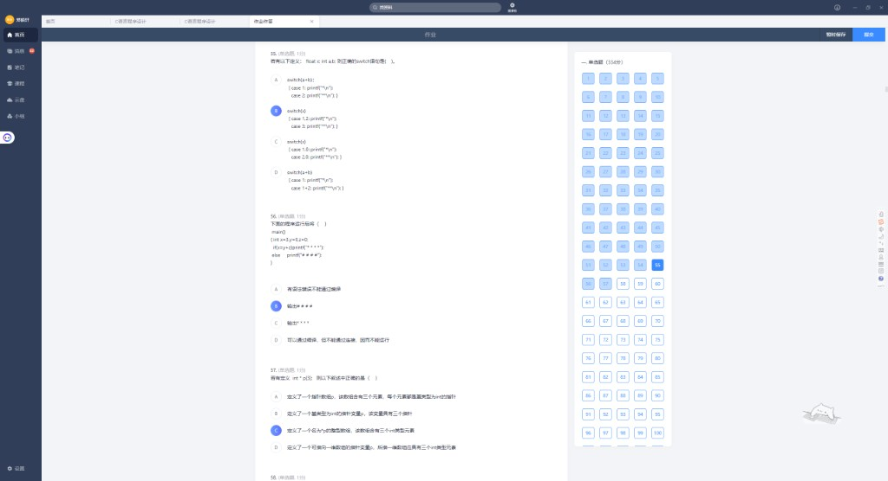
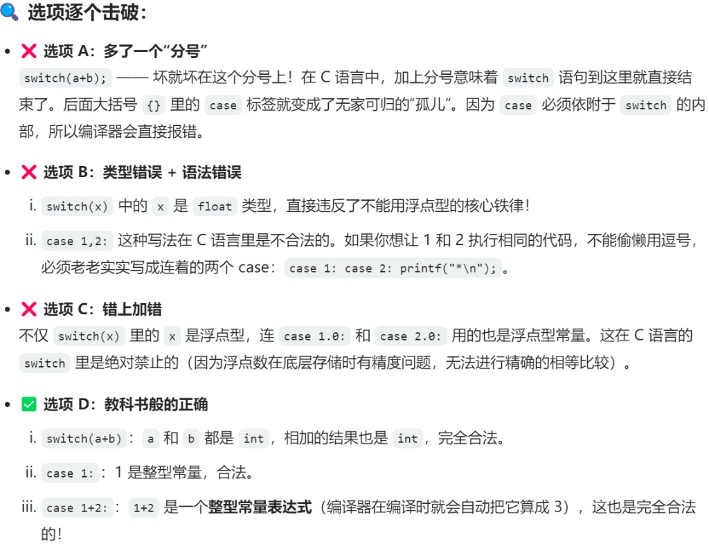

| 选项 | 问题 |
|------|------|
| A | `switch(a+b);` 多分号 |
| B/C | `switch(x)` 中 x 是 float，非法 |
| **D** | `switch(a+b)`，`case 1+2` 是常量表达式 |

| 你的答案 | 正确答案 |
|----------|----------|
| A | **D** |

---

## 第 56 题

`x+y=11>0` → 输出 **`****`**。

| 你的答案 | 正确答案 |
|----------|----------|
| B #### | **C. **** |

---

## 第 57 题

`int *p[3]` → **3 个元素的指针数组**，每个元素是 `int*`。

| 你的答案 | 正确答案 |
|----------|----------|
| C | **A** |

---

## 第 58 题

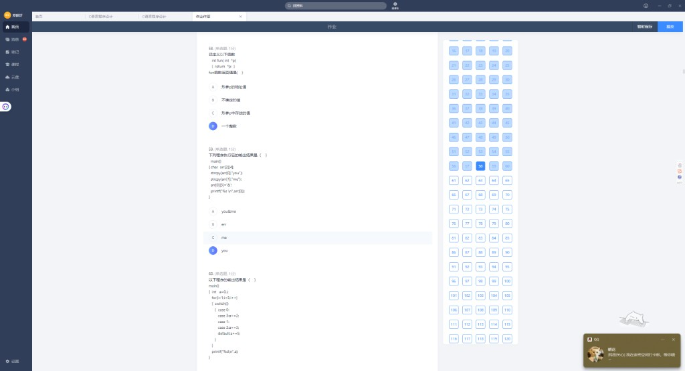

`return *p` → 返回 p 所指向的 **int 值**。

| 你的答案 | 正确答案 |
|----------|----------|
| C ✓ | **C** |

---

## 第 59 题

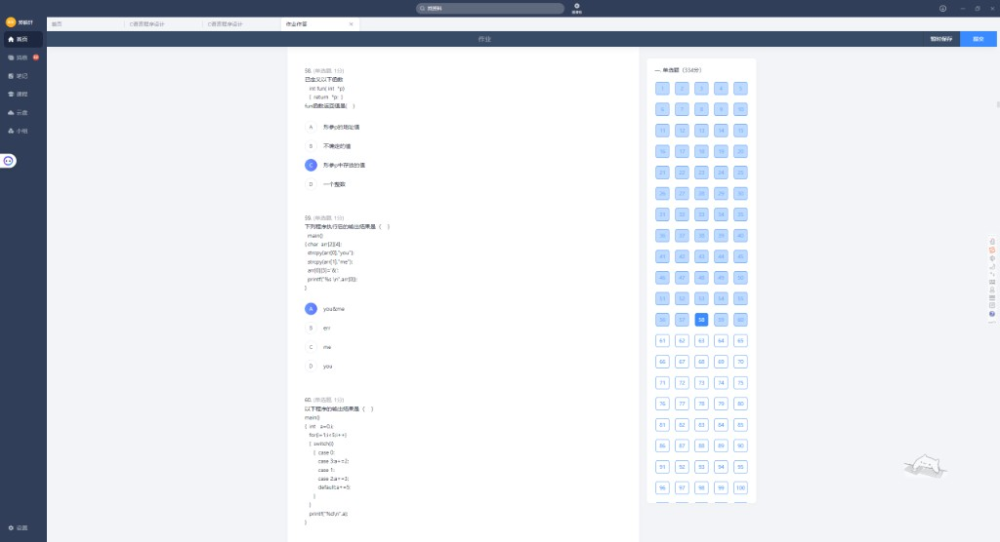
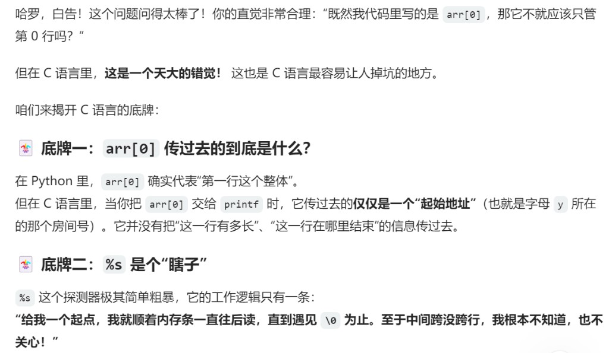

`arr[0][3]='&'` 破坏 `\0`，`printf("%s",arr[0])` 继续读到 `arr[1]` → **`you&me`**。

| 你的答案 | 正确答案 |
|----------|----------|
| A ✓ | **A. you&me** |

**【⚠️ 避坑】** `%s` 只认起始地址，遇到 `\0` 才停；二维 char 数组在内存里是连续流水线。

---

## 第 60 题

```c
// switch 无 break，i=1~4 累加：
// i=1: +3+5=8  i=2: +3+5=8  i=3: +2+3+5=10  i=4: +5=5
// a = 8+8+10+5 = 31
```

| 正确答案 |
|----------|
| **31**（选项以卷面为准） |

---

## 第 61 题

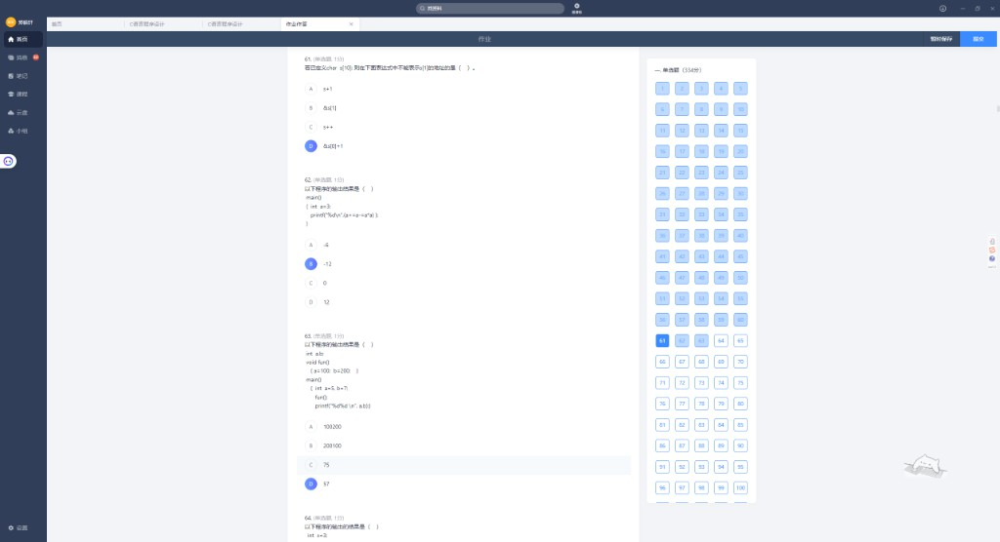
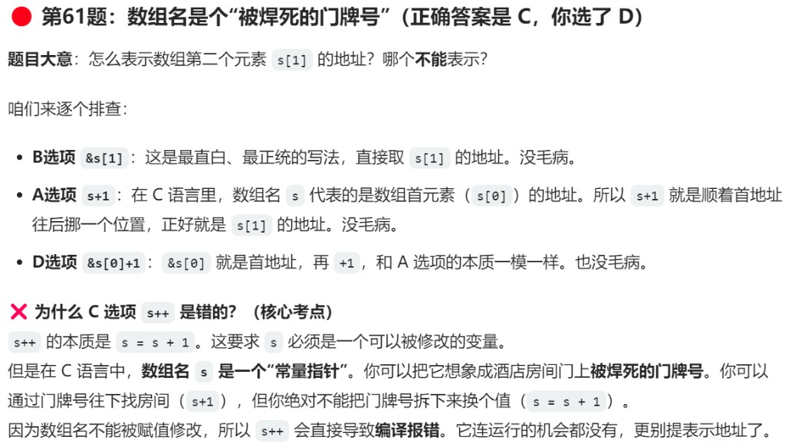

表示 `s[1]` 地址：`s+1`、`&s[1]`、`&s[0]+1` 均可；**`s++` 非法**（数组名不可自增）。

| 你的答案 | 正确答案 |
|----------|----------|
| D | **C `s++`** |

---

## 第 62 题

`a=3` → `a-=a*a` 得 -6 → `a+=a` → **-12**。

| 你的答案 | 正确答案 |
|----------|----------|
| B ✓ | **B. -12** |

---

## 第 63 题

`main` 里局部 `a=5,b=7` 遮蔽全局 → `fun()` 改不了它们 → 输出 **57**。

| 你的答案 | 正确答案 |
|----------|----------|
| D ✓ | **D. 57** |

---

## 第 64 题

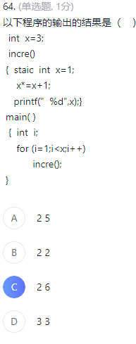

```c
int x=3;                    // 全局 x
incre() { static int x=1;   // 函数内 static x，与全局无关
           x*=x+1; printf(" %d",x); }
main() { for(i=1; i<x; i++) incre(); }  // i=1,2 调用 2 次
// 第1次：1*(1+1)=2  第2次：2*(2+1)=6  → 输出 " 2 6"
```

| 你的答案 | 正确答案 |
|----------|----------|
| C ✓ | **C. 2 6** |

---

## 第 65 题

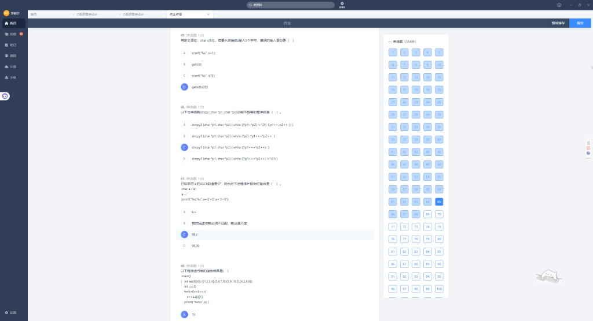

`scanf("%s", s[1])` 错：`s[1]` 是 **char 值**，不是地址。

| 你的答案 | 正确答案 |
|----------|----------|
| D | **C `scanf("%s", s[1])`** |

---

## 第 66 题

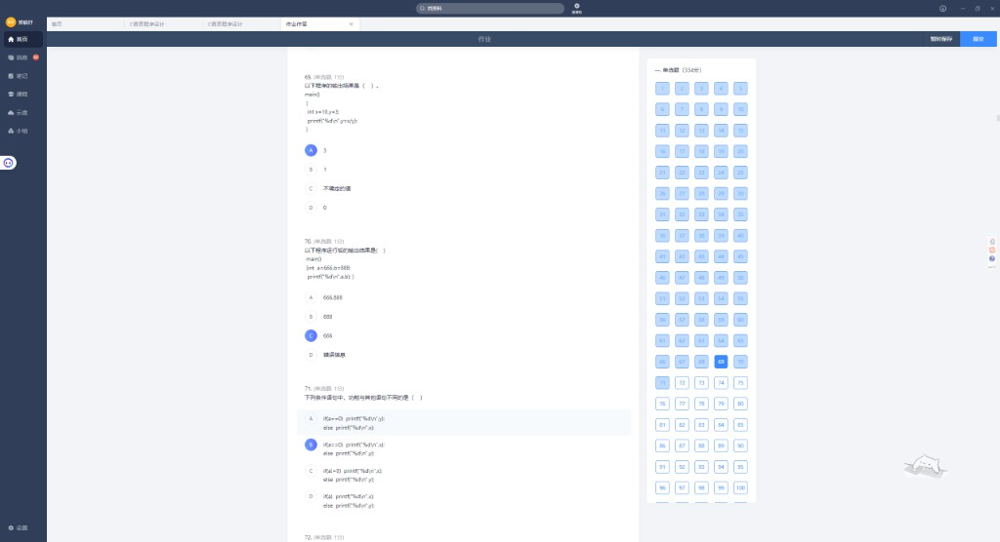

```c
while (*p2) *p1++ = *p2++;   // 遇 \0 就停，不会复制 \0
while (*p1++ = *p2++);       // 先赋值再判断，会复制 \0
```

| 你的答案 | 正确答案 |
|----------|----------|
| C | **B** |

---

## 第 67 题

`a='a'(97)` → `a--` 得 96 → `%d` 打 `96+'2'-'0'=98`，`%c` 打 `'c'`。

| 你的答案 | 正确答案 |
|----------|----------|
| C ✓ | **C. 98,c** |

---

## 第 68 题

```c
// 累加第 4 列 aa[i][3]：4+8+2+6 = 20
```

| 你的答案 | 正确答案 |
|----------|----------|
| A 13 | **C. 20** |

---

## 第 69 题


`y=x/y` → `y=10/3=3`，打印 **3**。

| 你的答案 | 正确答案 |
|----------|----------|
| A ✓ | **A. 3** |

---

## 第 70 题

`printf("%d\n", a, b)` 只有一个 `%d` → 只输出 **666**。

| 你的答案 | 正确答案 |
|----------|----------|
| C ✓ | **C. 666** |

---

## 第 71 题

A/B/C 都是「a 真输出 x，a 假输出 y」；**D 反过来**。

| 你的答案 | 正确答案 |
|----------|----------|
| B | **D** |

---

## 第 72 题

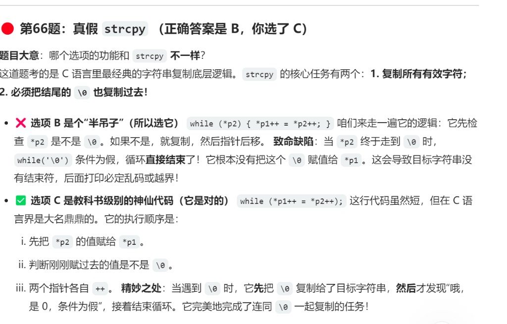

`c=a/b+0.4` → `8/5+0.4=1.4`，赋给 int → **1**。

| 你的答案 | 正确答案 |
|----------|----------|
| D ✓ | **D. 1** |

---

## 第 73 题

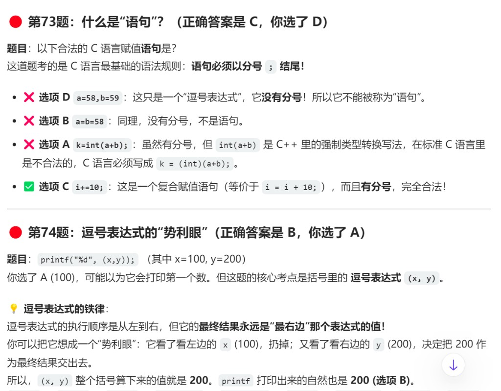

C 里**语句必须加分号**；`a=58,b=59` 只是逗号表达式，不是语句。

| 选项 | 判断 |
|------|------|
| A `k=int(a+b);` | ✗ C 强转应写 `(int)(a+b)` |
| B `a=b=58` | ✗ 缺分号 |
| **C `i+=10;`** | ✓ 合法复合赋值语句 |
| D `a=58,b=59` | ✗ 逗号表达式，缺分号 |

| 你的答案 | 正确答案 |
|----------|----------|
| D | **C** |

---

## 第 74 题

同上图纠错。逗号表达式 `(x,y)` **从左到右算，但整个表达式的值取最右边** → 200。

| 你的答案 | 正确答案 |
|----------|----------|
| A 100 | **B 200** |

**【⚠️ 避坑】** `printf("%d", (x,y))` 不是打印 x，而是打印 y。

---

## 第 75 题

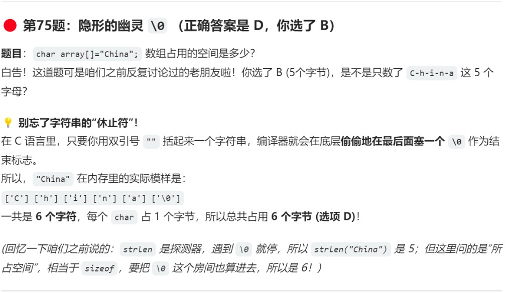

内存布局：`['C']['h']['i']['n']['a']['\0']` → **6 字节**。

| 函数 | 结果 | 含义 |
|------|------|------|
| `strlen("China")` | 5 | 数到 `\0` 前 |
| `sizeof(array)` | 6 | 含隐形 `\0` |

| 你的答案 | 正确答案 |
|----------|----------|
| B 5 | **D 6** |

---

## 第 76 题

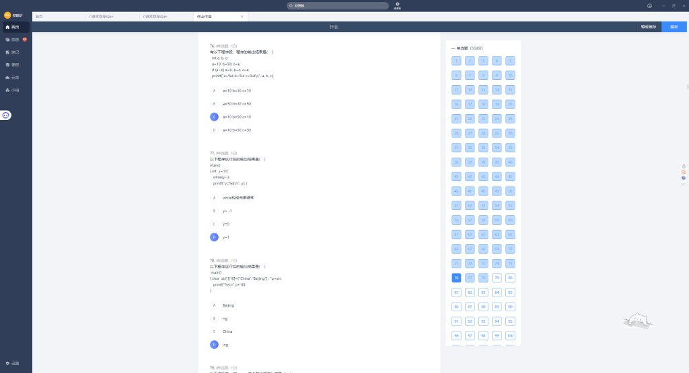

```c
a=10; b=50; c=a;
if (a>b) a=b;   // 只控制这一句
b=c; c=a;       // 始终执行
// → a=10, b=10, c=10
```

| 你的答案 | 正确答案 |
|----------|----------|
| C ✓ | **C. a=10 b=10 c=10** |

---

## 第 77 题


`while(y--)` 在 y=0 时仍先判断 0 再减 → 退出时 **y=-1**。

| 你的答案 | 正确答案 |
|----------|----------|
| D | **B. y=-1** |

---

## 第 78 题

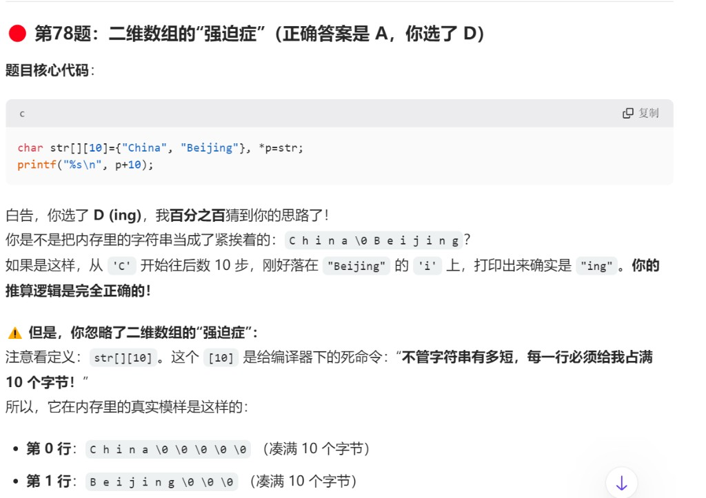

`char str[][10]` 每行占 **10 字节** → `p+10` 落到第 2 行开头 → **Beijing**。

| 你的答案 | 正确答案 |
|----------|----------|
| D ing | **A. Beijing** |

---

## 第 79 题

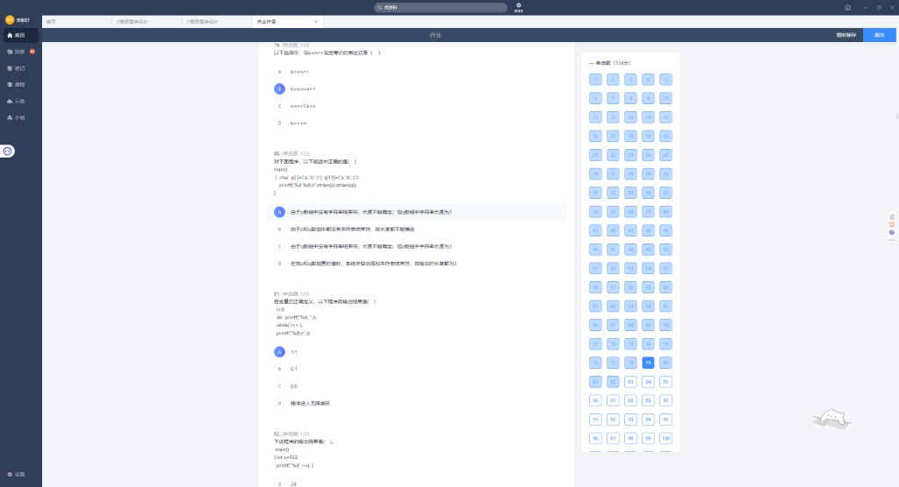

`k=n++` 等价于先赋旧值再自增 → **`k=n; n=n+1`**。

| 你的答案 | 正确答案 |
|----------|----------|
| B ✓ | **B** |

---

## 第 80 题

`p[]={'a','b','c'}` 无 `\0`，`strlen(p)` 不确定；`q[10]` 部分初始化后其余为 `\0` → 长度为 **3**。

| 你的答案 | 正确答案 |
|----------|----------|
| A ✓ | **A** |

---

## 第 81 题

```c
// i=1 → 打印 1，i 变 0；while(i++) 用 0 判断假，i 变 1 → 结束
// 输出 "1 " 然后 i=1
```

| 你的答案 | 正确答案 |
|----------|----------|
| A ✓ | **A. 1 1** |

---

## 第 82 题

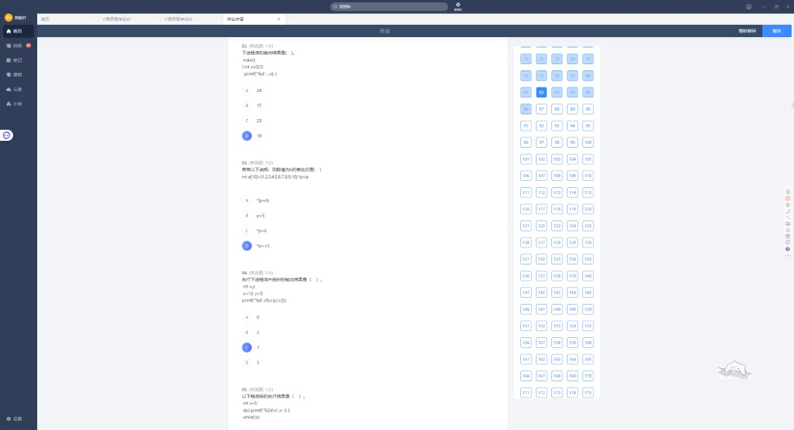

`022` 是八进制 = 18，`--x` → **17**。（若题面为 `023` 则得 18）

| 你的答案 | 正确答案 |
|----------|----------|
| D ✓ | **D. 18**（或 B. 17，以卷面为准） |

---

## 第 83 题

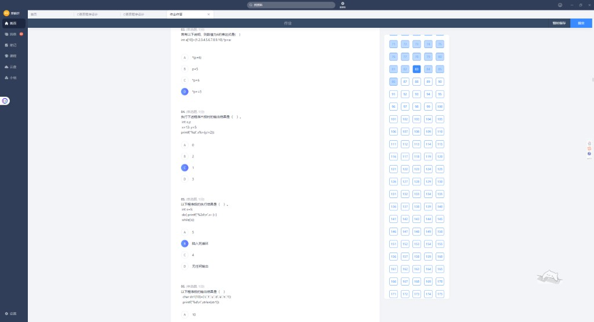

`*(p+=5)` → `a[5]` 的值 **6**。

| 你的答案 | 正确答案 |
|----------|----------|
| D ✓ | **D** |

---

## 第 84 题

`y/=2` → y=2；`x%=2` → x=13%2=**1**。

| 你的答案 | 正确答案 |
|----------|----------|
| C ✓ | **C. 1** |

---

## 第 85 题

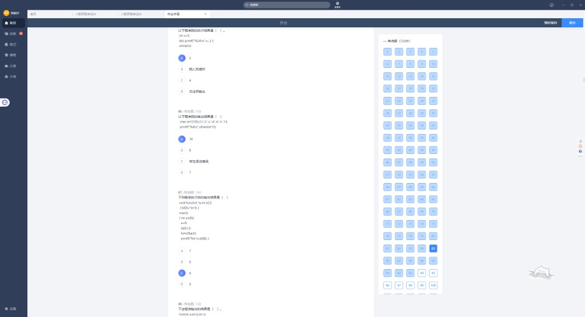
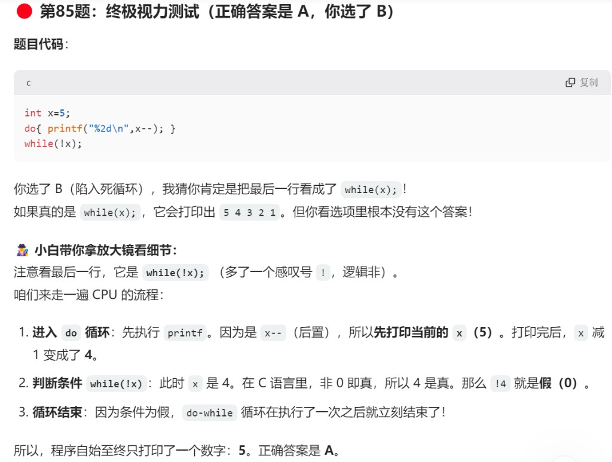

`while(!x)`：打印 5 后 x=4，`!4` 为假 → 只执行 **1 次**，输出 **5**。

| 你的答案 | 正确答案 |
|----------|----------|
| B 死循环 | **A. 5** |

---

## 第 86 题

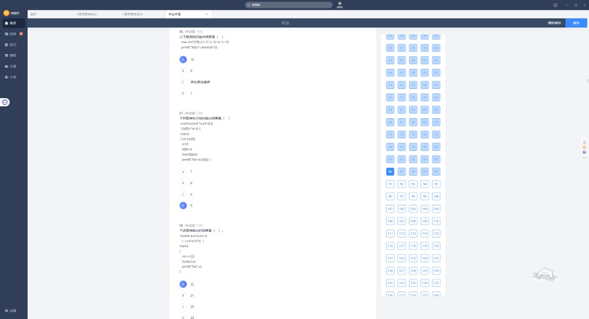
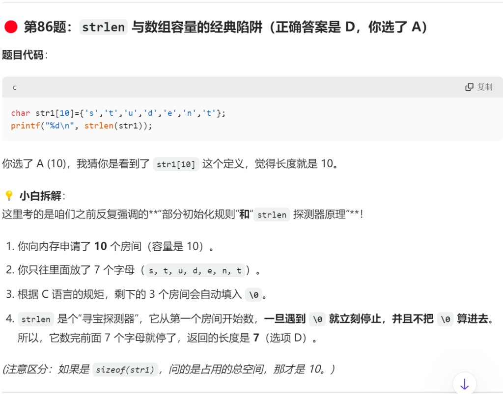

只初始化 7 个字符，剩余自动 `\0` → `strlen` = **7**（不是容量 10）。

| 你的答案 | 正确答案 |
|----------|----------|
| A 10 | **D 7** |

---

## 第 87 题

`b[0]=*a+b[0]` → 6+3=**9**。

| 你的答案 | 正确答案 |
|----------|----------|
| D ✓ | **D. 9** |

---

## 第 88 题

传值调用，`x` 仍是 **22**。

| 你的答案 | 正确答案 |
|----------|----------|
| A ✓ | **A. 22** |

---

## 第 89 题

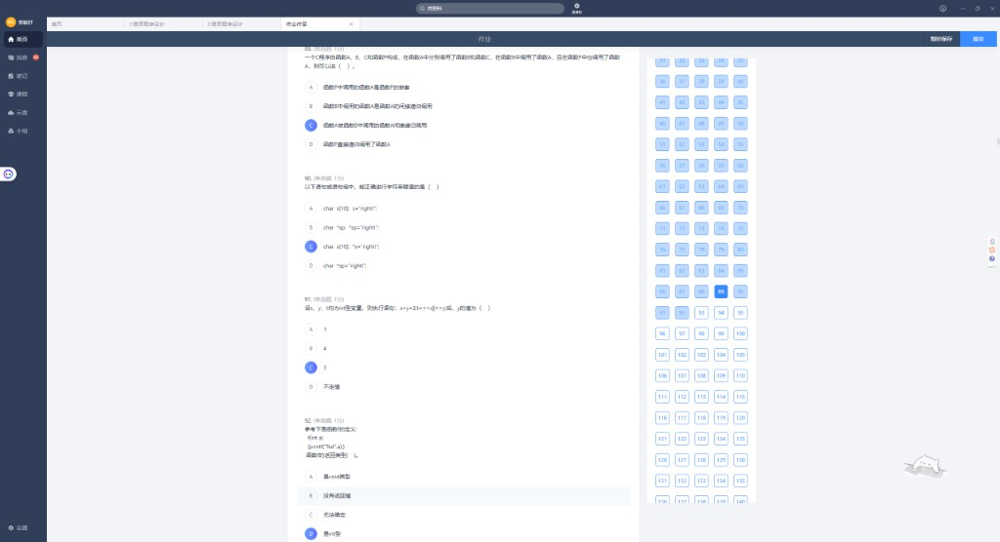

A 调 B，B 再调 A → **间接递归**。

| 你的答案 | 正确答案 |
|----------|----------|
| C | **B** |

---

## 第 90 题

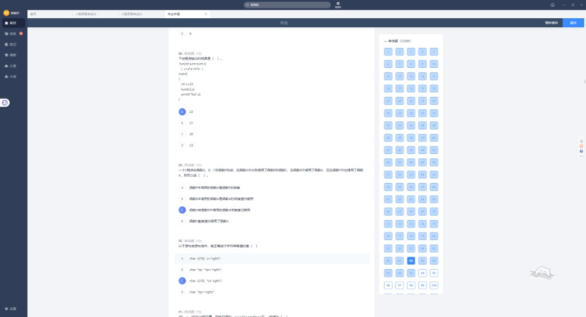

| 选项 | 判断 |
|------|------|
| A `s="right"` | ✗ 数组名不能二次赋值 |
| C `*s="right"` | ✗ 类型不匹配 |
| **D `char *sp="right"`** | ✓ 指针初始化 |

| 你的答案 | 正确答案 |
|----------|----------|
| C | **D** |

---

## 第 91 题

`++x` 为真，`||` 短路 → **y 仍为 3**。

| 你的答案 | 正确答案 |
|----------|----------|
| C ✓ | **C. 3** |

---

## 第 92 题

老标准 C 省略返回值类型 → 默认为 **int**。

| 你的答案 | 正确答案 |
|----------|----------|
| D ✓ | **D** |

---

## 第 93 题

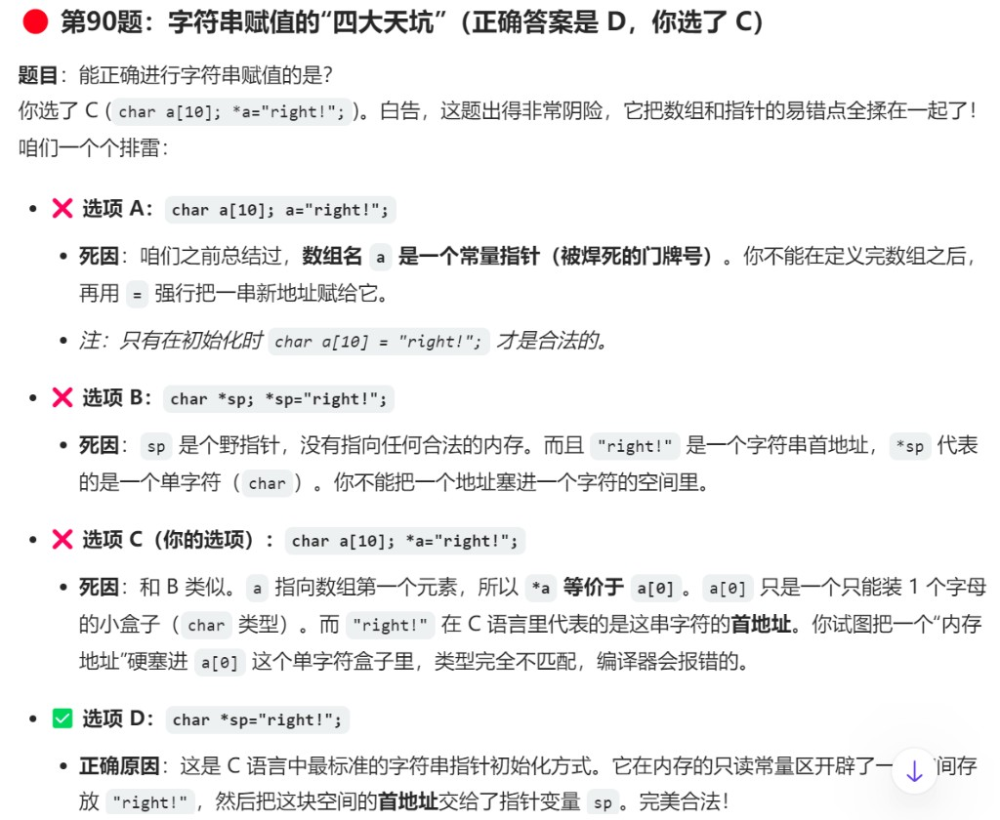

`ab=*var+10=100+10=**110**`。

| 你的答案 | 正确答案 |
|----------|----------|
| C ✓ | **C. 110** |

---

## 第 94 题

`p=&c` → `scanf("%d", p)` 等价读入 **c**。

| 你的答案 | 正确答案 |
|----------|----------|
| C ✓ | **C** |

---

## 第 95 题

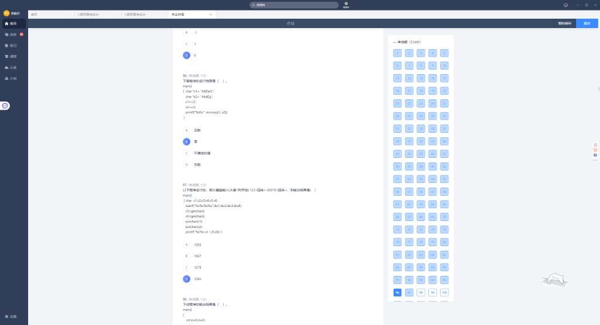

`NULL` 宏本质是 **0** → 打印 **0**。

| 你的答案 | 正确答案 |
|----------|----------|
| D ✓ | **D. 0** |

---

## 第 96 题

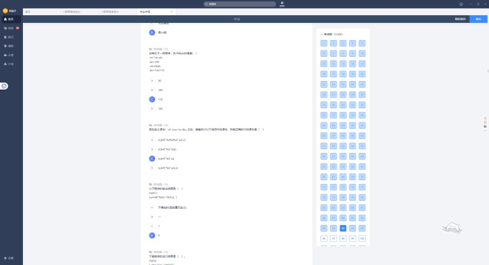
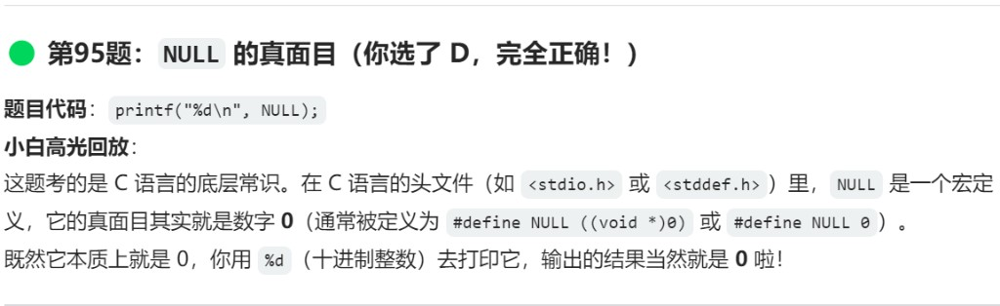

`s1+=2`→`"DaG"`，`s2+=2`→`"dEg"`；`'D'(68)<'d'(100)` → **负数**。

| 你的答案 | 正确答案 |
|----------|----------|
| B 零 | **D 负数** |

---

## 第 97 题

输入 `123↵45678↵`：`scanf` 读 `'1''2''3''\n'`；`getchar` 得 `'4''5'` → 输出 **1245**。

| 你的答案 | 正确答案 |
|----------|----------|
| D ✓ | **D. 1245** |

---

## 第 98 题

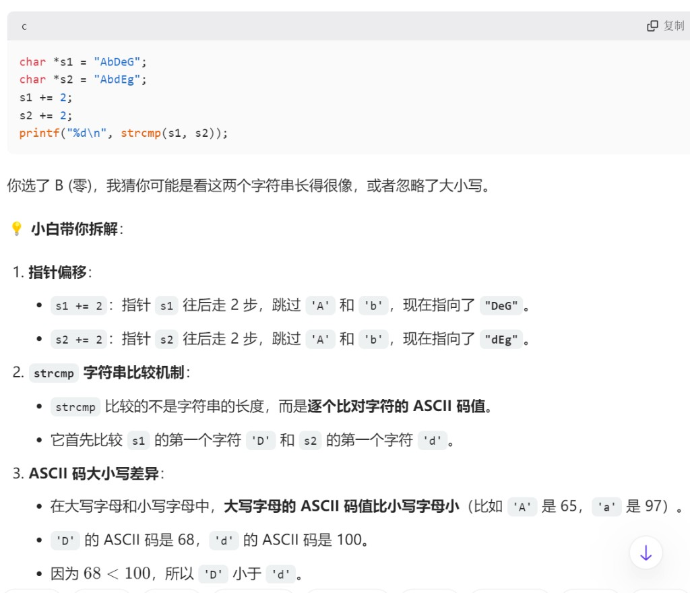
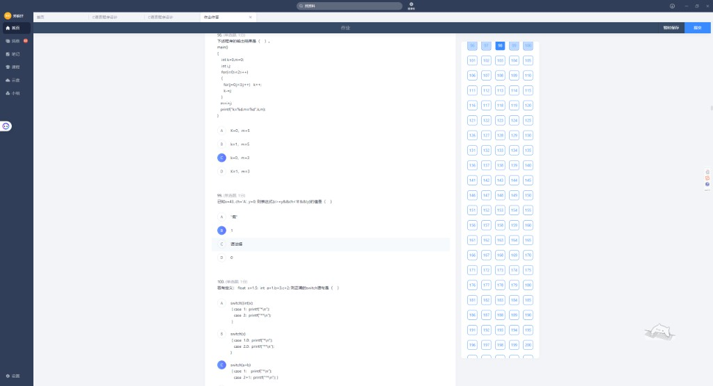

两轮内层循环各 `k+=3` 再 `k-=3` → k=0；结束时 i=2,j=3 → **m=5**。

| 你的答案 | 正确答案 |
|----------|----------|
| C | **A. k=0,m=5** |

---

## 第 99 题

`43>=0 && 'A'<'B' && !0` → **1（真）**。

| 你的答案 | 正确答案 |
|----------|----------|
| B ✓ | **B. 1** |

---

## 第 100 题

`switch(a+b)` 为整型；`case 2+1` 是常量表达式 → **C** 合法。

| 你的答案 | 正确答案 |
|----------|----------|
| C ✓ | **C** |

---

## 第 101 题

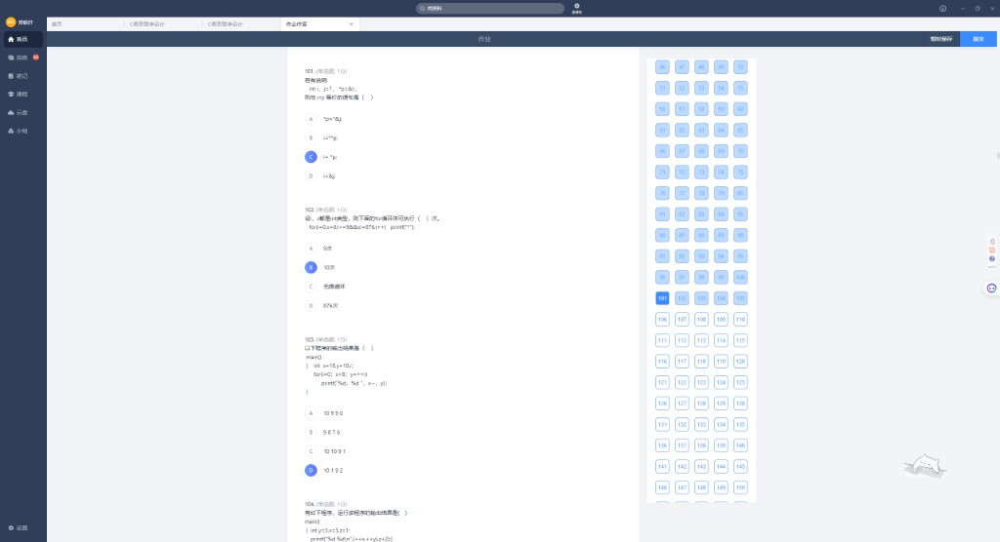

`int i, j=7, *p=&i;` — `*p=*&j` 即 `i=j`，**A** 正确。

| 你的答案 | 正确答案 |
|----------|----------|
| A ✓ | **A. `*p=*&j;`** |

---

## 第 102 题

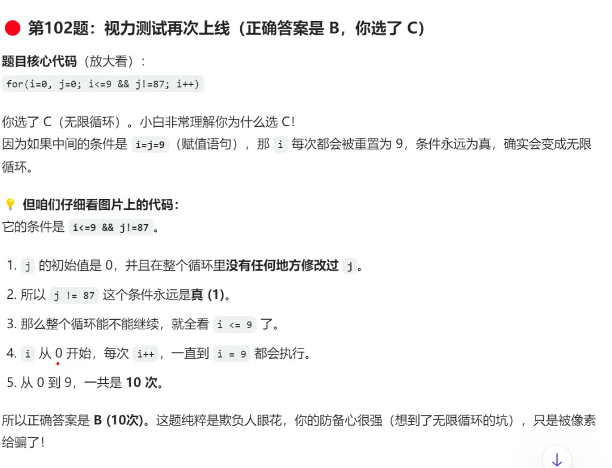

```c
for(i=0, x=0; i<=9 && x<=87; i++)
    printf("***");
```

`x` 始终为 0，`x<=87` 恒真；循环只看 `i<=9`，共 **10** 次。

| 你的答案 | 正确答案 |
|----------|----------|
| B ✓ | **B. 10 次** |

---

## 第 103 题

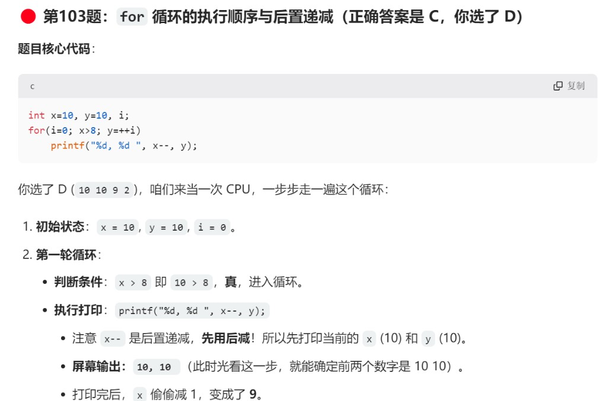
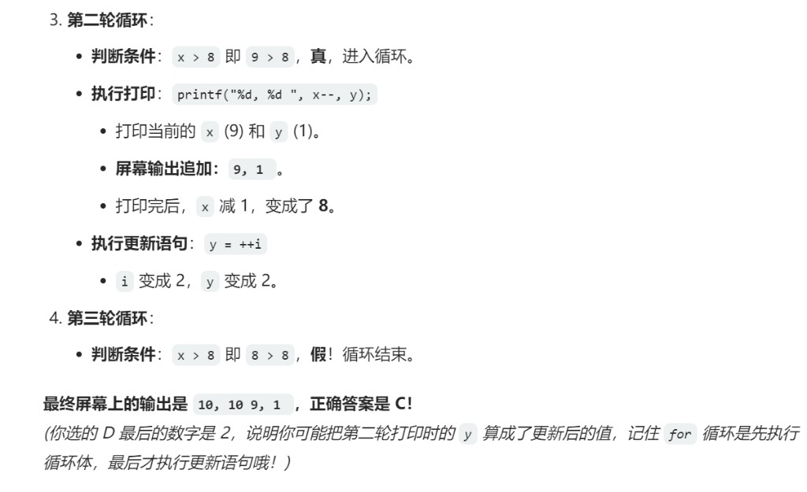

```c
int x=10, y=10, i;
for(i=0; x>8; y=++i)
    printf("%d, %d ", x--, y);
```

| 轮次 | 打印 | 更新后 |
|------|------|--------|
| 1 | 10, 10 | x=9, y=1 |
| 2 | 9, 1 | x=8, y=2 |
| 3 | x=8 不满足 | 结束 |

输出 **10 10 9 1**（`printf` 用的是**上一轮** `y=++i` 更新前的值）。

| 你的答案 | 正确答案 |
|----------|----------|
| D | **C. 10 10 9 1** |

**【⚠️ 避坑】** for 顺序：条件 → 循环体 → 更新；第二次打印时 `y` 还是 1 不是 2。

---

## 第 104 题

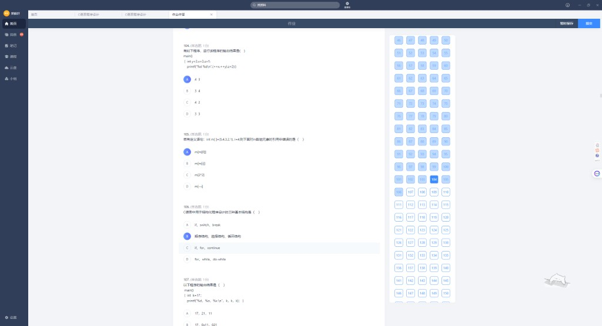

`(++x, ++y)` 逗号表达式值为 **4**；`z+2=3` → 输出 **4 3**。

| 你的答案 | 正确答案 |
|----------|----------|
| A ✓ | **A. 4 3** |

---

## 第 105 题

`m[]={5,4,3,2,1}`，下标 0~4。`m[m[0]]=m[5]` **越界** → **A** 错误。

| 你的答案 | 正确答案 |
|----------|----------|
| A ✓ | **A（错误项）** |

---

## 第 106 题

结构化三种基本结构：**顺序、选择、循环** → **B**。

| 你的答案 | 正确答案 |
|----------|----------|
| B ✓ | **B** |

---

## 第 107 题

```c
int k=17;
printf("%d, %o, %x\n", k, k, k);
```

17 的八进制 **21**、十六进制 **11** → **A. 17, 21, 11**。

---

## 第 108 题

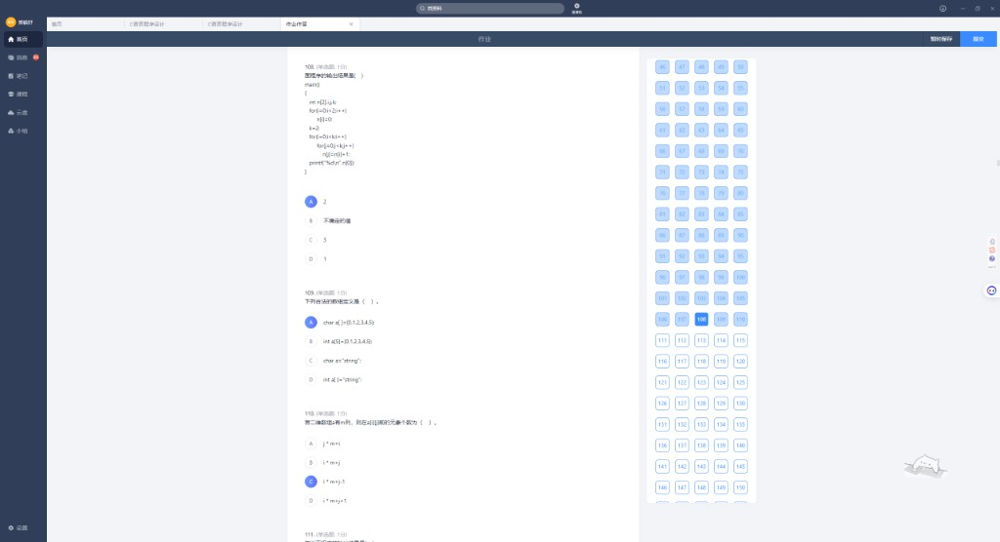

双重循环：`n[j]=n[i]+1`，`k=2` 时最终 `n[0]=**3**`。

| 你的答案 | 正确答案 |
|----------|----------|
| A | **C. 3** |

---

## 第 109 题

`char a[]={0,1,2,3,4,5};` 合法；B 初值个数超界，C/D 类型错 → **A**。

| 你的答案 | 正确答案 |
|----------|----------|
| A ✓ | **A** |

---

## 第 110 题

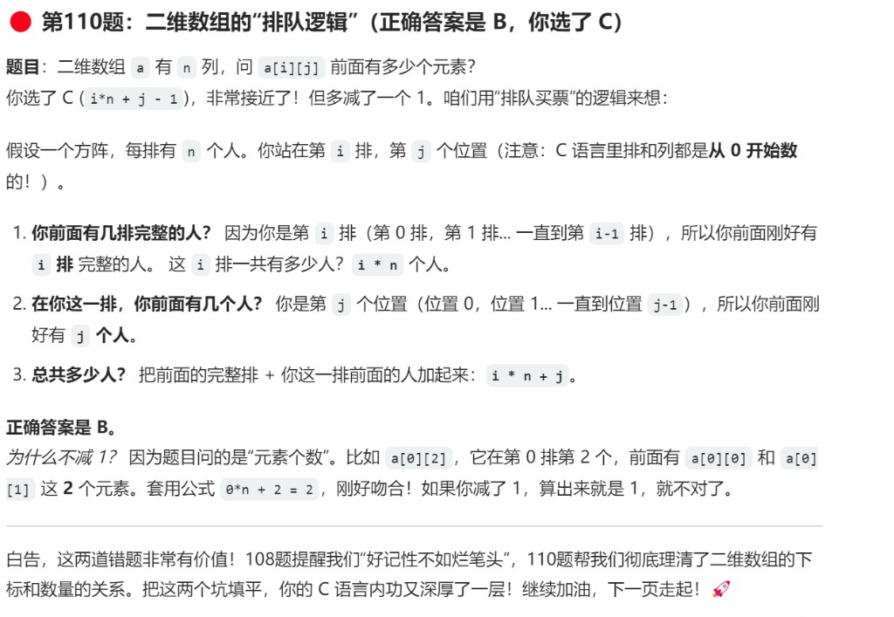

`a[i][j]` 前有 **i 整行 + j 个元素** → `i*m+j`（**不要减 1**）。

| 你的答案 | 正确答案 |
|----------|----------|
| C | **B. `i*m+j`** |

---

## 第 111 题

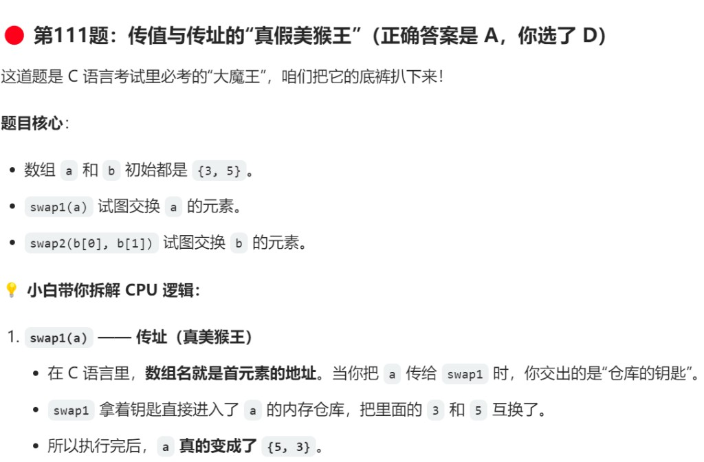
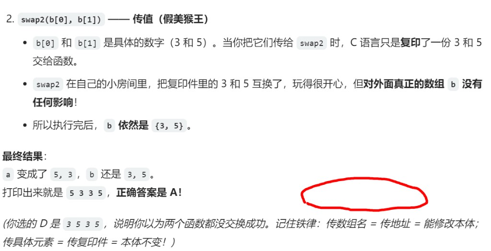

```c
void swap1(int a[]) { int t=a[0]; a[0]=a[1]; a[1]=t; }
void swap2(int x, int y) { int t=x; x=y; y=t; }
// a,b 初值均为 {3,5}
swap1(a);           // 传址 → a 变 {5,3}
swap2(b[0], b[1]);   // 传值 → b 仍 {3,5}
printf("%d %d %d %d", a[0],a[1],b[0],b[1]);  // 5 3 3 5
```

| 你的答案 | 正确答案 |
|----------|----------|
| D | **A. 5 3 3 5** |

**【⚠️ 避坑】** 数组名传参 = 传址；传 `b[0]` 只是复印件，改不了原数组。

---

## 第 112 题

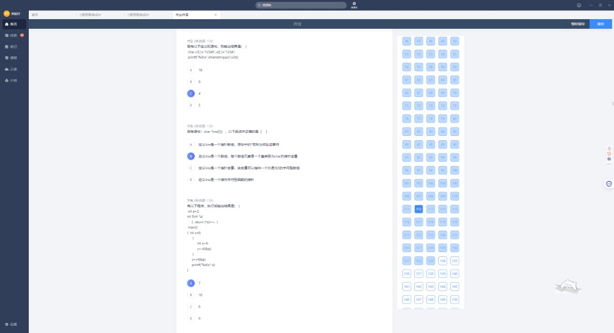

```c
char s1[]="12345", s2[]="1234";
printf("%d\n", strlen(strcpy(s1, s2)));
```

`strcpy(s1,s2)` 把 `"1234"` 拷入 `s1` 并**返回 s1 地址**；`strlen` 得 **4**。

| 你的答案 | 正确答案 |
|----------|----------|
| C ✓ | **C. 4** |

**【⚠️ 避坑】** `strcpy` 返回值可当字符串用，常和 `strlen` 链式写在一起。

---

## 第 113 题

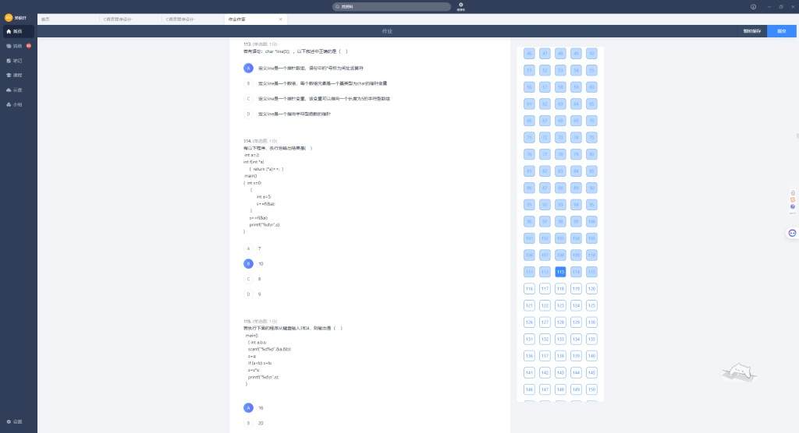
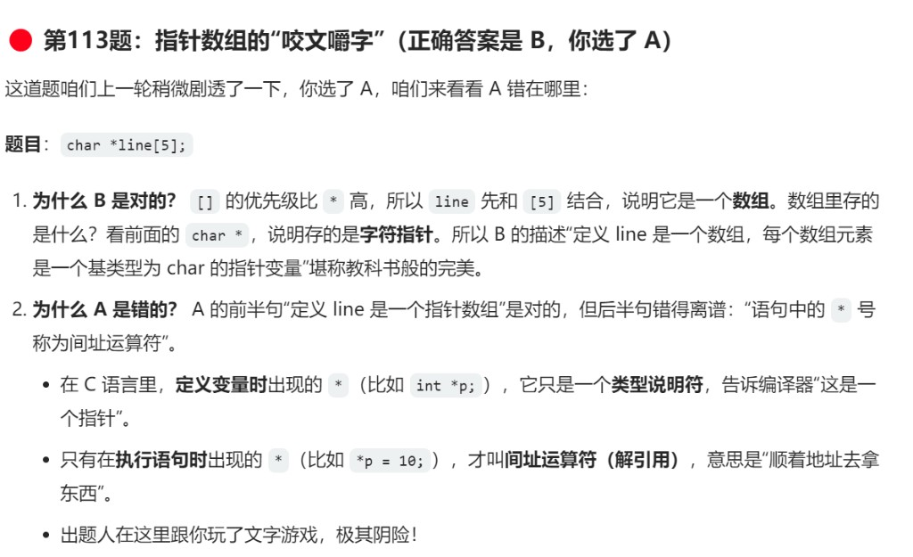
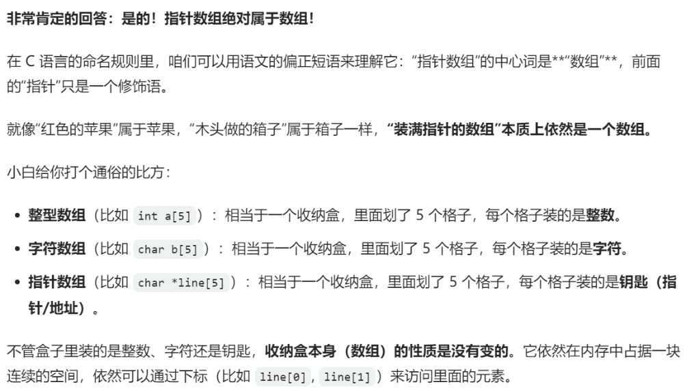

`char *line[5];` — `[]` 优先于 `*`，是 **5 个 char 指针的数组**。

| 你的答案 | 正确答案 |
|----------|----------|
| A | **B** |

**【⚠️ 避坑】** 定义里的 `*` 是**类型说明符**；执行语句里的 `*` 才是间址/解引用运算符。

---

## 第 114 题

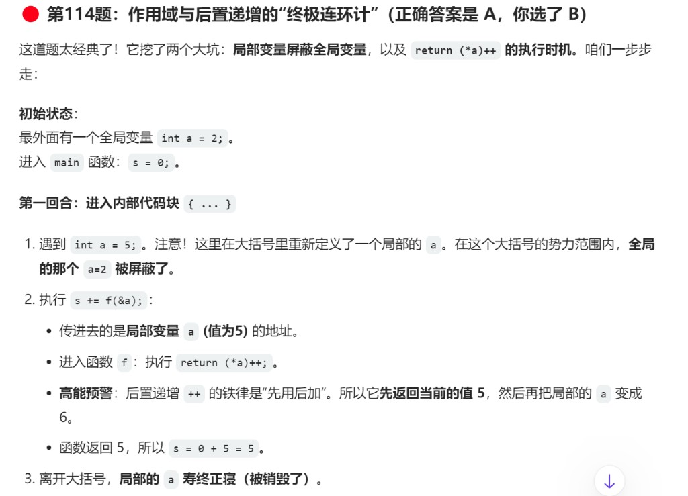
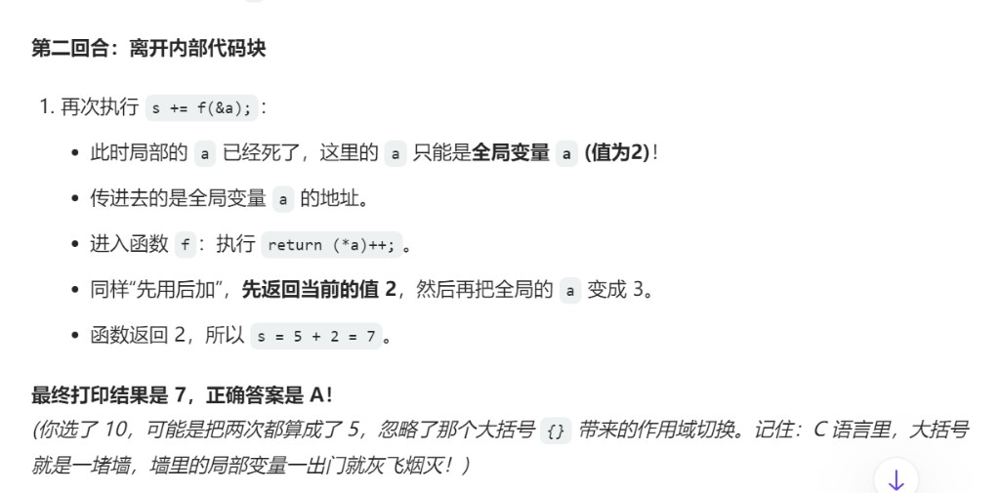

```c
int a=2;                    // 全局
int f(int *a) { return (*a)++; }  // 先用后加
// 块内 int a=5; s+=f(&a); → 返回 5，s=5
// 块外 f(&a) 用全局 a=2 → 返回 2，s=7
```

| 你的答案 | 正确答案 |
|----------|----------|
| B | **A. 7** |

**【⚠️ 避坑】** `{}` 里局部变量遮蔽全局；出块后局部变量销毁。

---

## 第 115 题

`a=3,b=4` → `s=4` → `s*s=**16**` → **A**。

| 你的答案 | 正确答案 |
|----------|----------|
| A ✓ | **A. 16** |

---

## 第 116 题

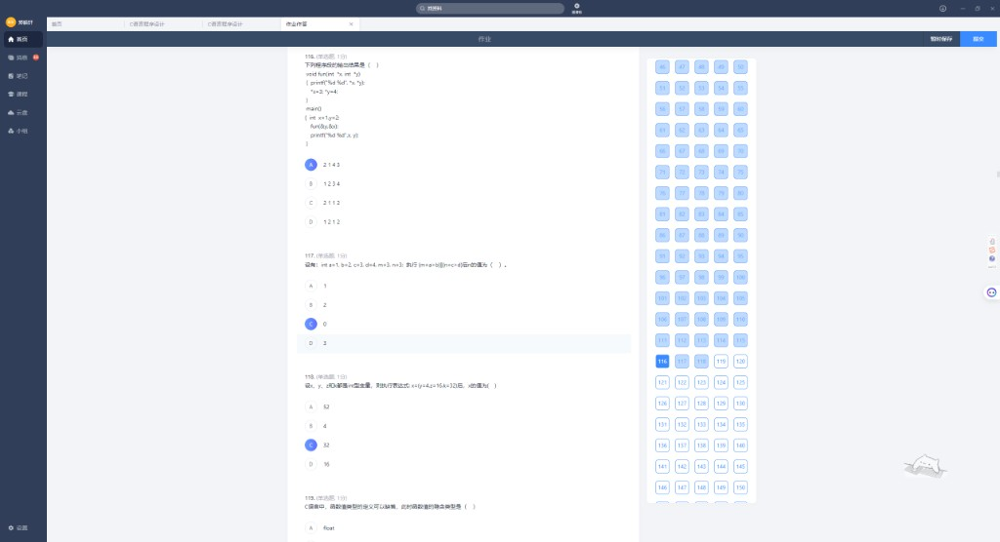

`fun(&y, &x)`：形参 `x` 指 main 的 `y`，形参 `y` 指 main 的 `x` → 先打 **2 1**，再改 x=4,y=3 → **2 1 4 3**。

| 你的答案 | 正确答案 |
|----------|----------|
| A ✓ | **A** |

---

## 第 117 题

`(m=a>b) && (n=c>d)` — `a>b` 假，`m=0`，`&&` **短路**，`n=c>d` 不执行，`n` 仍为 **3**。

| 你的答案 | 正确答案 |
|----------|----------|
| C | **D. 3** |

---

## 第 118 题

逗号表达式取最后一个：`x=(y=4, z=16, k=32)` → **x=32** → **C**。

| 你的答案 | 正确答案 |
|----------|----------|
| C ✓ | **C. 32** |

---

## 第 119 题

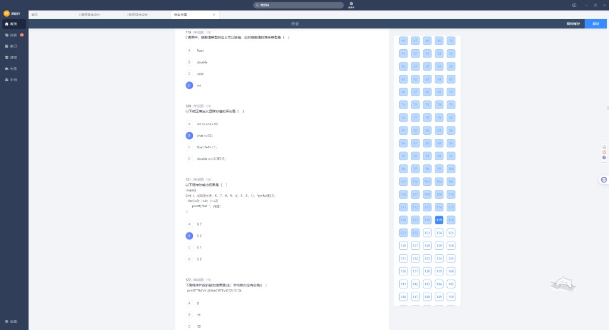

旧标准 C 函数缺省返回类型为 **int** → **D**。

| 你的答案 | 正确答案 |
|----------|----------|
| D ✓ | **D. int** |

---

## 第 120 题

`char c=32;` 合法（ASCII 空格）；A 不能连赋，C 自引用，D 指数非法 → **B**。

| 你的答案 | 正确答案 |
|----------|----------|
| B ✓ | **B** |

---

## 第 121 题

`p=&x[1][1]` 指向 5；`p[i]` 按** int 步长**偏移 → `p[0]=5, p[2]=3` → **B. 5 3**。

| 你的答案 | 正确答案 |
|----------|----------|
| B ✓ | **B. 5 3** |

---

## 第 122 题

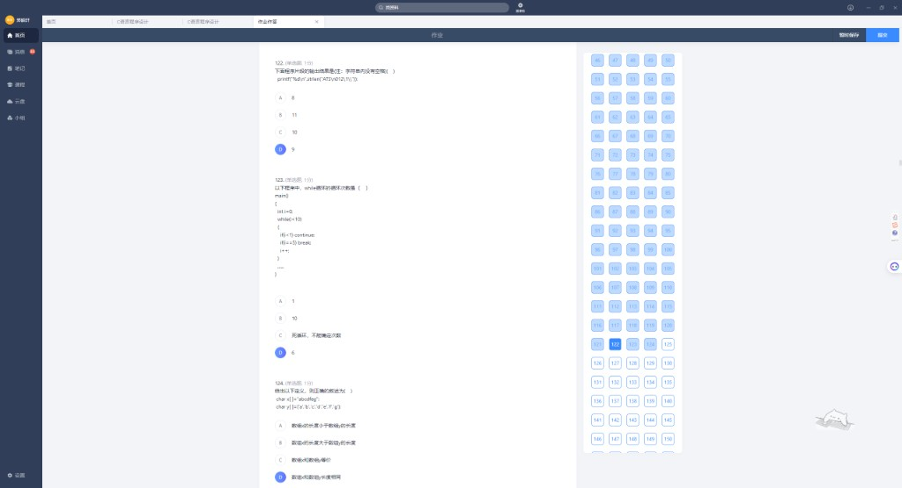

```c
printf("%d\n", strlen("ATS\n012\1\\"));
```

| 字符 | 计数 |
|------|------|
| A T S | 3 |
| `\n` | +1 |
| 0 1 2 | +3 |
| `\1` | +1 |
| `\\` | +1 |
| **合计** | **9** |

| 你的答案 | 正确答案 |
|----------|----------|
| D ✓ | **D. 9** |

---

## 第 123 题

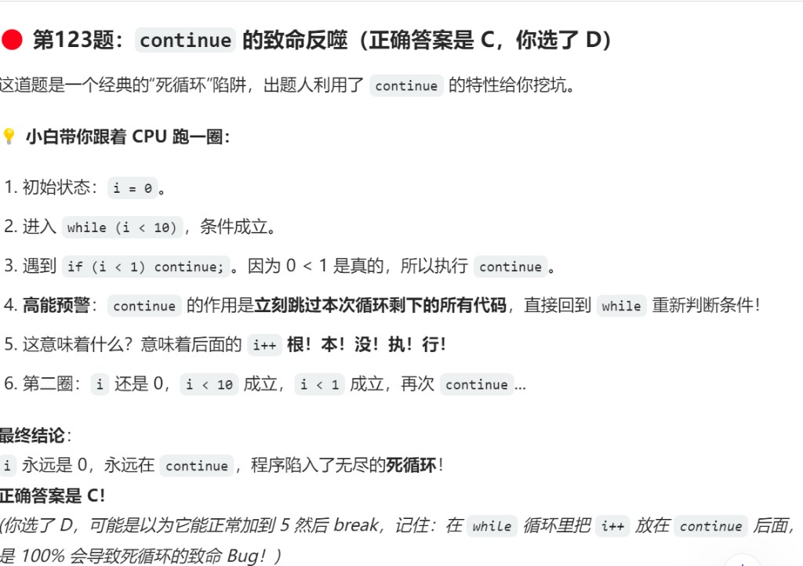

```c
while(i<10) {
    if(i<1) continue;   // i=0 时跳过 i++
    ...
}
```

`i` 永远停在 0 → **死循环** → **C**。

| 你的答案 | 正确答案 |
|----------|----------|
| D | **C. 死循环** |

**【⚠️ 避坑】** while 里 `continue` 在 `i++` 之前 = 致命死循环。

---

## 第 124 题

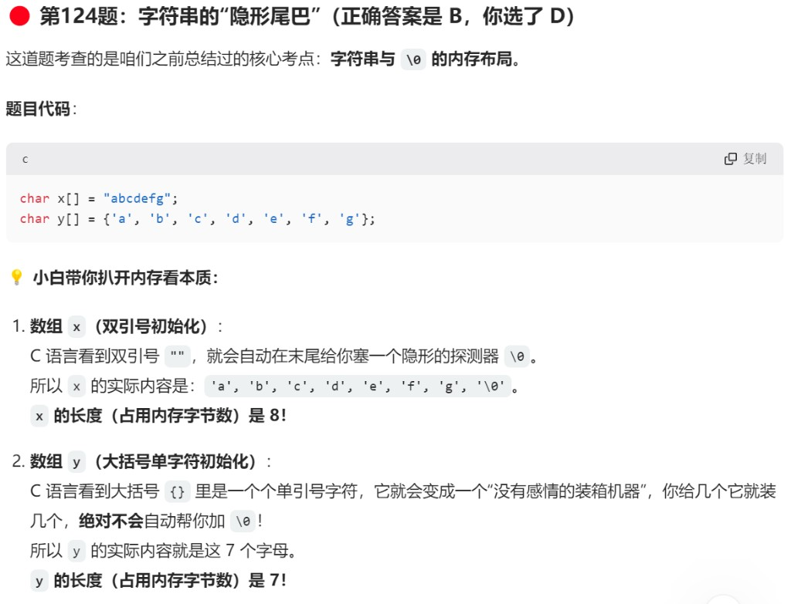

```c
char x[] = "abcdefg";              // 7 字母 + \0 → 8 字节
char y[] = {'a','b','c','d','e','f','g'};  // 仅 7 字节
```

`sizeof(x) > sizeof(y)` → **B**。

| 你的答案 | 正确答案 |
|----------|----------|
| B ✓ | **B** |

---

## 第 125 题

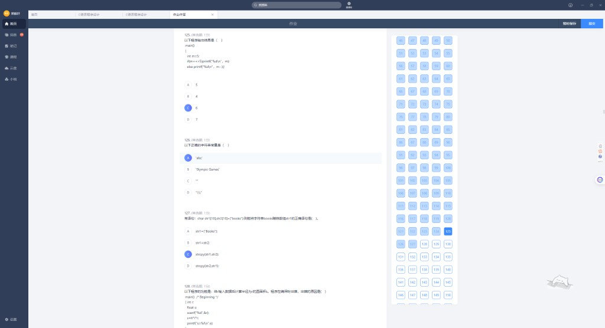

`m=5`：`m++>5` 先比 5 后变 6，条件假 → else 打印 `m--` → 先输出 **6** → **C**。

| 你的答案 | 正确答案 |
|----------|----------|
| C ✓ | **C. 6** |

---

## 第 126 题

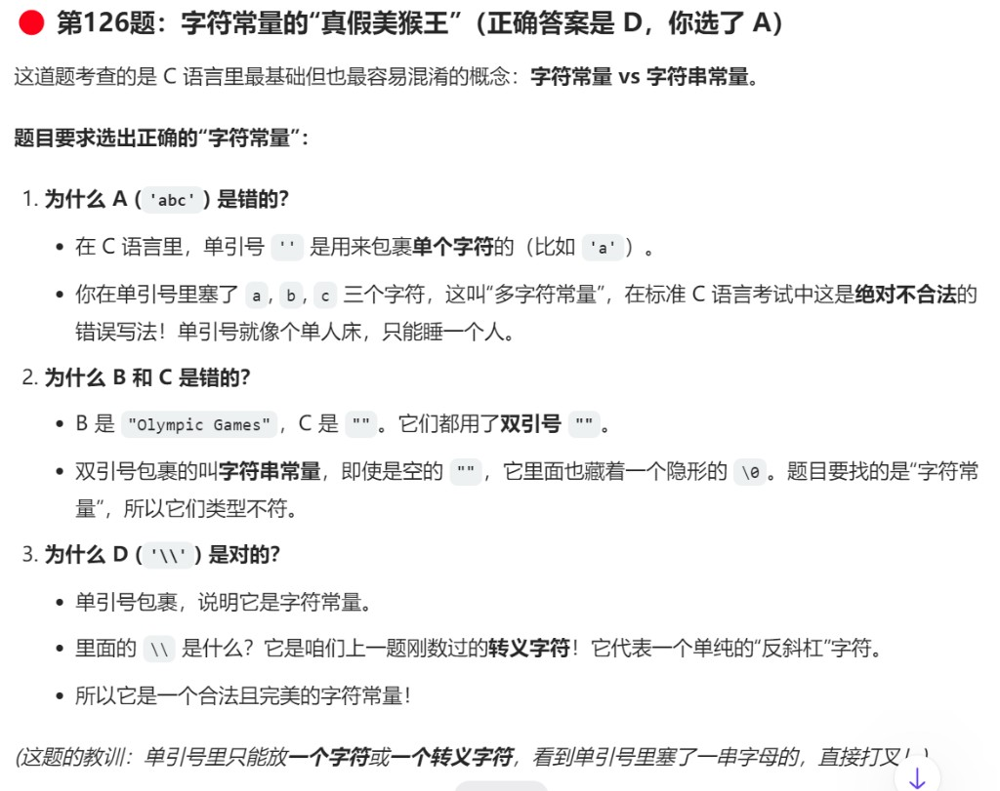

问**字符常量**：单引号只能一个字符/转义；`'abc'` 非法；双引号是字符串 → **`'\\'`** 合法 → **D**。

| 你的答案 | 正确答案 |
|----------|----------|
| A | **D. `'\\'`** |

---

## 第 127 题

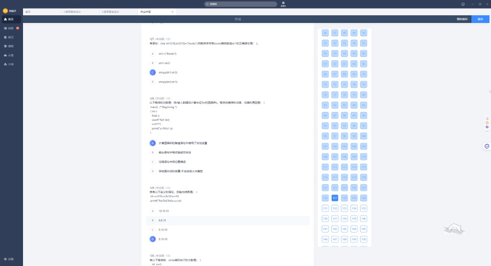

数组名不能二次赋值 → **`strcpy(str1, str2);`** → **C**。

| 你的答案 | 正确答案 |
|----------|----------|
| C ✓ | **C** |

---

## 第 128 题

`s=π*r*r;` 中 **π 不是 C 标识符** → 编译错误 → **A**。

| 你的答案 | 正确答案 |
|----------|----------|
| A ✓ | **A** |

---

## 第 129 题

`010`=八进制 **8**，`0x10`=十六进制 **16**，`10`=十进制 **10** → **D. 8,16,10**。

| 你的答案 | 正确答案 |
|----------|----------|
| D ✓ | **D** |

---

## 第 130 题

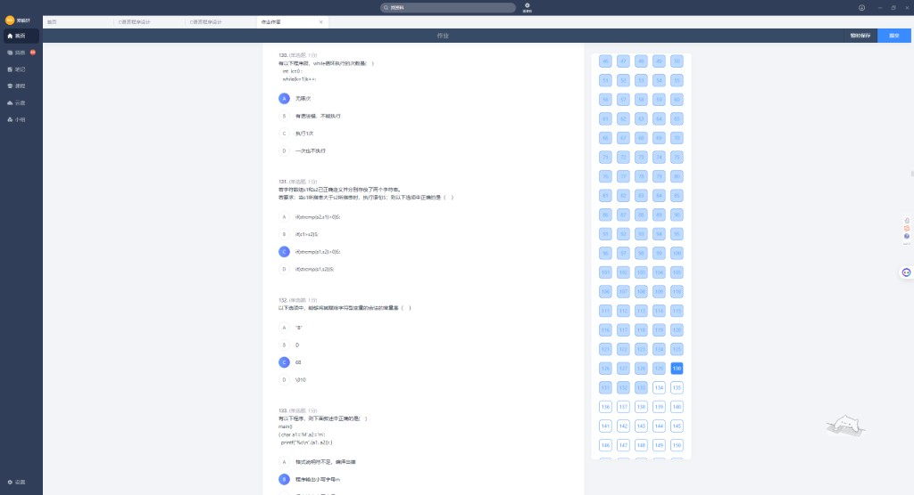

```c
int k=0;
while(k=1) k++;
```

`k=1` 是**赋值**（不是 `==`），结果恒为真 → **无限次** → **A**。

| 你的答案 | 正确答案 |
|----------|----------|
| A ✓ | **A. 无限次** |

---

## 第 131 题

`s1` 所指串**大于** `s2` 所指串 ⟺ `strcmp(s1,s2) > 0` → **C**。

| 你的答案 | 正确答案 |
|----------|----------|
| C ✓ | **C. `if(strcmp(s1,s2)>0) S;`** |

**【⚠️ 避坑】** 不能用 `s1>s2` 比字符串；`strcmp` 比的是字典序，不是长度。

---

## 第 132 题

`char c = 63;` 合法（整数赋给 char）；`"B"` 是字符串，`\010` 缺单引号 → **C**。

| 你的答案 | 正确答案 |
|----------|----------|
| C ✓ | **C. 63** |

---

## 第 133 题

```c
char a1='M', a2='m';
printf("%d\n", (a1, a2));
```

逗号表达式 `(a1,a2)` 值为 **a2**（`'m'`，即 109）。`%d` 输出整数 **109**。

| 你的答案 | 正确答案 |
|----------|----------|
| B | **D. 输出 m 的 ASCII 码值（109）** |

**【⚠️ 避坑】** `%d` 打印数字不是字符；选 B「输出字母 m」需用 `%c`。卷面若标 B，以老师答案为准。

---

## 第 134 题

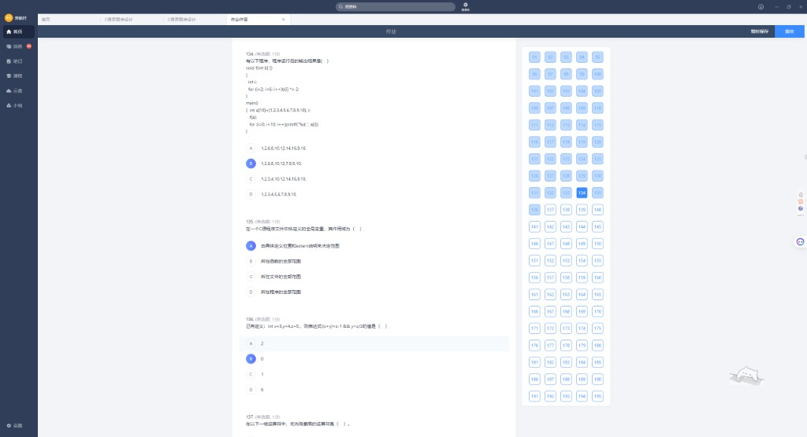

```c
void f(int b[]) {
    for (i=2; i<6; i++) b[i] *= 2;  // 改 a[2]~a[5]
}
// 原 a: 1,2,3,4,5,6,7,8,9,10
// 变:   1,2,6,8,10,12,7,8,9,10
```

| 正确答案 |
|----------|
| **B. 1,2,6,8,10,12,7,8,9,10** |

数组名传参，函数内修改会反映到 `main` 的 `a`。

---

## 第 135 题

全局变量作用域由**定义位置**和 **`extern` 说明**共同决定 → **A**。

| 你的答案 | 正确答案 |
|----------|----------|
| A ✓ | **A** |

---

## 第 136 题


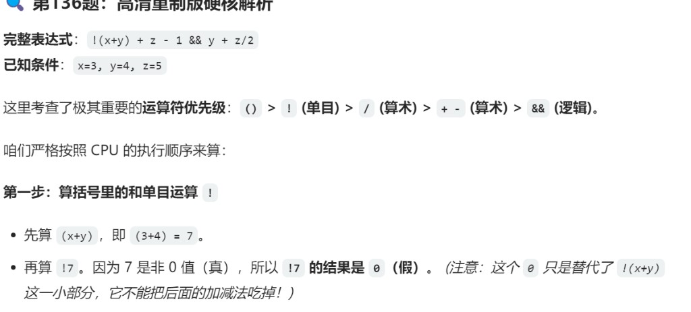
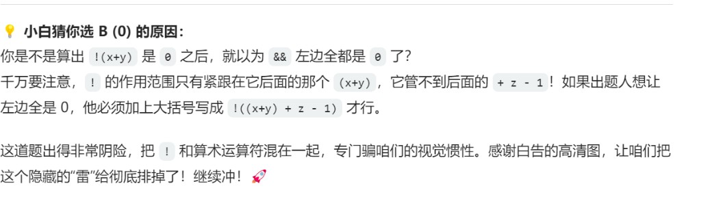

`x=3,y=4,z=5` → `(x+y)<z-1` 即 `7<4` 为**假(0)**；`&&` **短路**，右侧 `y=z/2` 不执行 → 整个表达式 **0**。

| 你的答案 | 正确答案 |
|----------|----------|
| B ✓ | **B. 0** |

> 专题图另考 `!(x+y)+z-1 && y+z/2`：`!` 只管 `(x+y)`，不能视觉合并成 `!((x+y)+z-1)`。

---

## 第 137 题

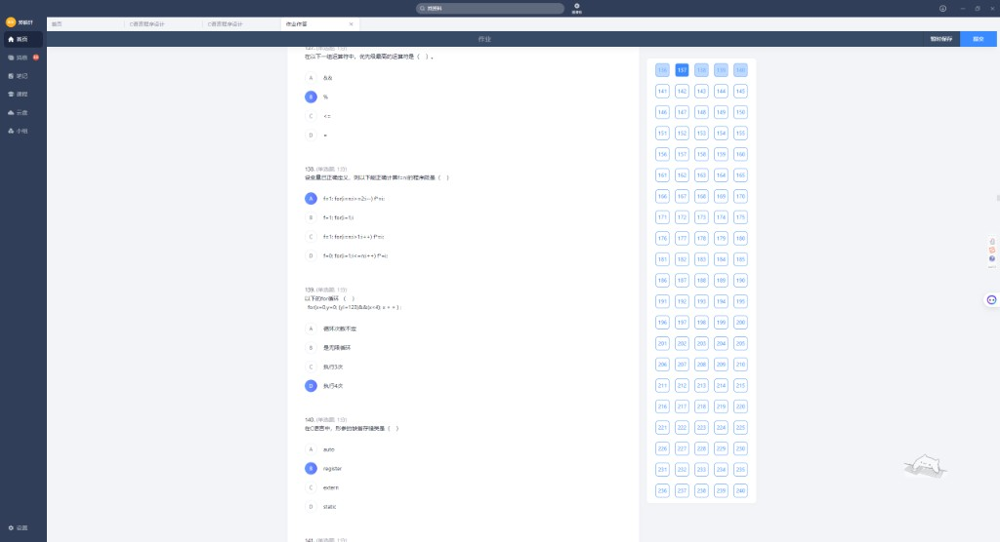

`%`（乘除模）高于 `&&`、`<=`、`=`` → **B**。

| 你的答案 | 正确答案 |
|----------|----------|
| B ✓ | **B. %** |

---

## 第 138 题

`n! = n×(n-1)×…×2×1` → `f=1; for(i=n;i>=2;i--) f*=i;` → **A**。

| 你的答案 | 正确答案 |
|----------|----------|
| A ✓ | **A** |

---

## 第 139 题

```c
for(x=0,y=0; (y!=123)&&(x<4); x++);  // 空循环体
```

`x` 从 0 到 3 各满足一次，共 **4** 次 → **D**。

| 你的答案 | 正确答案 |
|----------|----------|
| D ✓ | **D. 执行 4 次** |

---

## 第 140 题

形参缺省存储类型为 **`auto`** → **A**。

| 你的答案 | 正确答案 |
|----------|----------|
| A ✓ | **A. auto** |

---

## 第 141 题

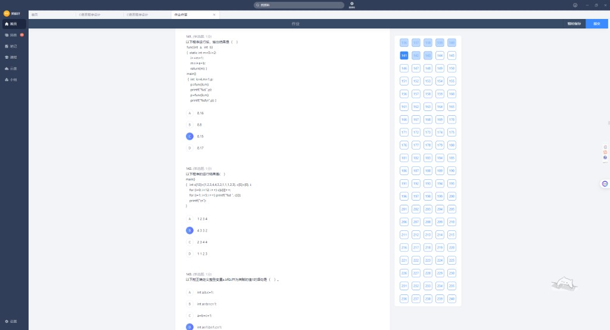

```c
static int m=0, i=2;   // m、i 都保留
// 第1次 func(4,1): i=2+0+1=3, m=3+4+1=8  → 8
// 第2次 func(4,1): i=3+8+1=12, m=12+4+1=17 → 17
```

| 你的答案 | 正确答案 |
|----------|----------|
| C | **D. 8,17** |

**【⚠️ 避坑】** `static` 局部变量**跨调用保留**；`m` 和 `i` 都会累加。

---

## 第 142 题

`c[a[i]]++` 统计 1~4 出现次数 → `c[1]=4, c[2]=3, c[3]=3, c[4]=2` → **B. 4 3 3 2**。

| 你的答案 | 正确答案 |
|----------|----------|
| B ✓ | **B** |

---

## 第 143 题

`int a=1,b=1,c=1;` 三个变量都赋初值 → **D**。

| 你的答案 | 正确答案 |
|----------|----------|
| D ✓ | **D** |

---

## 第 144 题

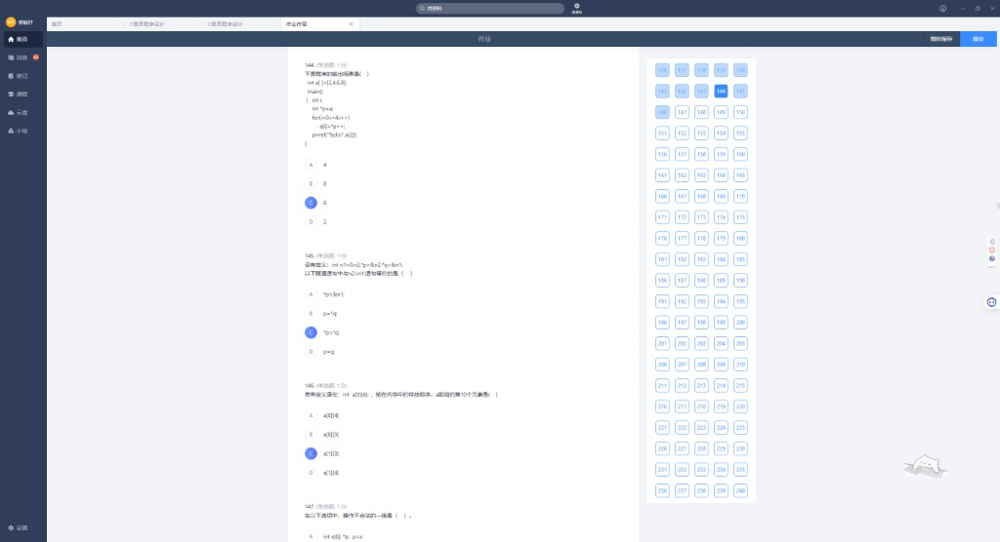

`a[i]=*p++` 按序把原 `{2,4,6,8}` 写回，`a[2]` 仍为 **6** → **C**。

| 你的答案 | 正确答案 |
|----------|----------|
| C ✓ | **C. 6** |

---

## 第 145 题

`p=&n2, q=&n1` → `n2=n1` 等价于 `*p=*q` → **C**。

| 你的答案 | 正确答案 |
|----------|----------|
| C ✓ | **C** |

---

## 第 146 题

`a[3][6]` 按行存，第 10 个元素（从 1 数）= 下标 9 → **`a[1][3]`** → **C**。

| 你的答案 | 正确答案 |
|----------|----------|
| C ✓ | **C** |

---

## 第 147 题

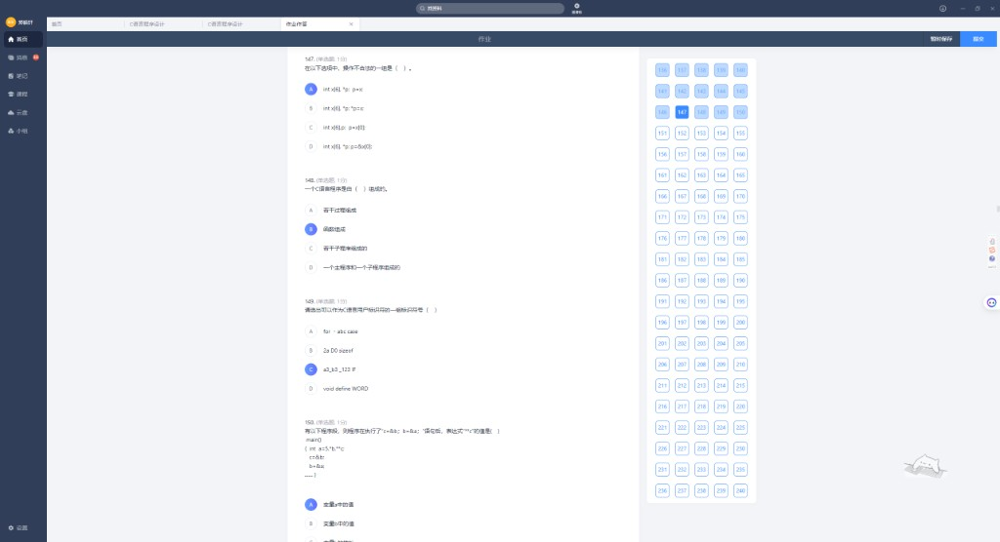

`*p=x` 把**数组首地址**赋给 `*p`（整型变量），类型非法 → **B** 不合法。

| 正确答案 |
|----------|
| **B. `*p=x;`** |

---

## 第 148 题

C 程序由**函数**组成 → **B**。

| 你的答案 | 正确答案 |
|----------|----------|
| B ✓ | **B** |

---

## 第 149 题

`a3_b3 _123 IF` 均合法（`IF` 全大写不是关键字 `if`）→ **C**。

| 你的答案 | 正确答案 |
|----------|----------|
| C ✓ | **C** |

---

## 第 150 题

```c
a=5, b=7;
c = a & b;   // c = 5
b = ~a;      // b = ~5
// ~c = ~5 = b 中的值
```

| 你的答案 | 正确答案 |
|----------|----------|
| A | **B. 变量 b 中的值** |

**【⚠️ 避坑】** `b=~a` 后，`~c` 与 `b` 相等，不是 `a` 原来的 5。

---

## 第 151 题

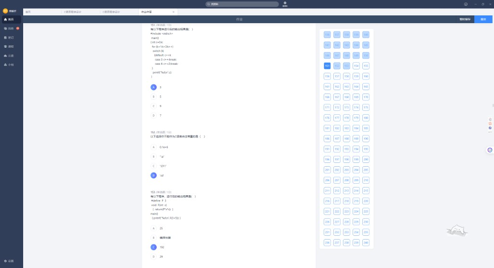

```c
for (k=1; k<3; k++)
    switch (k) {
        default: c += k;
        case 2: c++; break;
        case 4: c += 2; break;
    }
```

| k | 路径 | c |
|---|------|---|
| 1 | default +1 → case2 +1 | 2 |
| 2 | **直接 case2** +1 | **3** |

| 你的答案 | 正确答案 |
|----------|----------|
| A ✓ | **A. 3** |

**【⚠️ 避坑】** `k=2` 跳过 default；`default` 无 `break` 会落入 `case 2`。

---

## 第 152 题

`'cd'` 多字符放单引号，非法字符常量 → **D**。

| 你的答案 | 正确答案 |
|----------|----------|
| D ✓ | **D. 'cd'** |

---

## 第 153 题


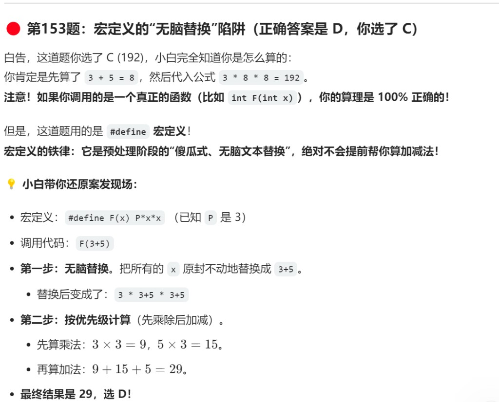
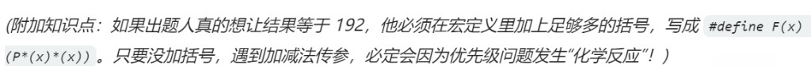

```c
#define P 3
#define F(x) P*x*x
printf("%d\n", F(3+5));
```

宏替换：`F(3+5)` → `3*3+5*3+5` = 9+15+5 = **29**（不是 3×8×8=192）。

| 你的答案 | 正确答案 |
|----------|----------|
| C | **D. 29** |

**【⚠️ 避坑】** 宏是无括号文本替换；要得 192 需 `#define F(x) (P*(x)*(x))`。

---

## 第 154 题

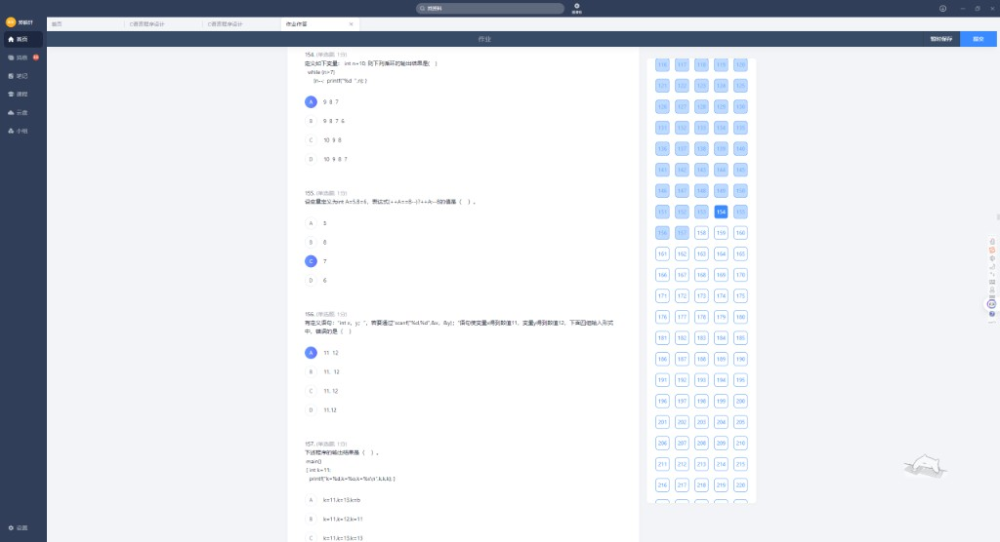

```c
while (n>7) { n--; printf("%d ", n); }  // n 初值 10
```

输出 **9 8 7** → **A**。

---

## 第 155 题

`A=5,B=6` → `++A==6`，`B--` 值为 6，条件真 → `++A` 得 **7** → **C**。

| 你的答案 | 正确答案 |
|----------|----------|
| C ✓ | **C. 7** |

---

## 第 156 题

`scanf("%d,%d",...)` 要求逗号分隔；**11 12**（空格）错误 → **A**。

| 你的答案 | 正确答案 |
|----------|----------|
| A ✓ | **A（错误输入）** |

---

## 第 157 题


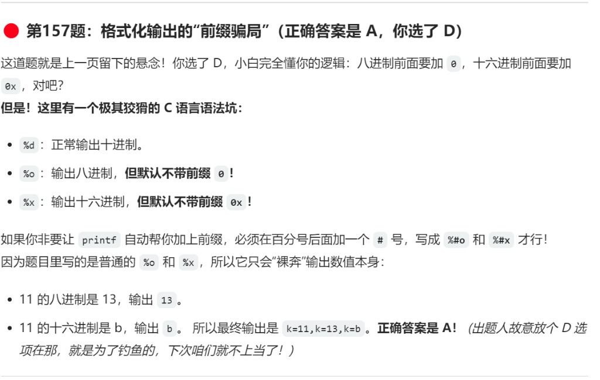

`k=11` → `%d`=11，`%o`=13，`%x`=b（**不带** 0/0x 前缀）→ **A**。

| 你的答案 | 正确答案 |
|----------|----------|
| D | **A. k=11,k=13,k=b** |

---

## 第 158 题

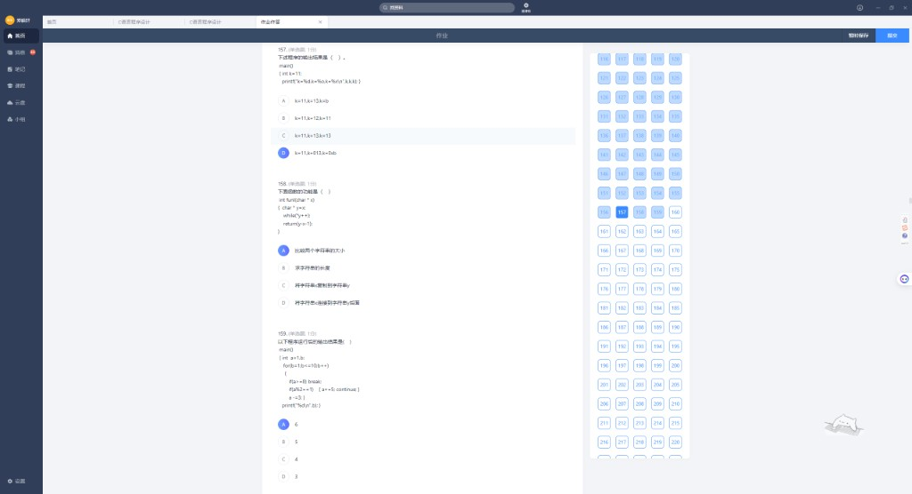

`while(*y++); return(y-s-1);` — 求字符串长度 → **B**。

| 你的答案 | 正确答案 |
|----------|----------|
| A | **B. 求字符串长度** |

---

## 第 159 题

| b | a 变化 |
|---|--------|
| 1 | a=6 (continue) |
| 2 | a=3 |
| 3 | a=8 (continue) |
| 4 | a>=8 break |

输出 **b=4** → **C**。

| 你的答案 | 正确答案 |
|----------|----------|
| A | **C. 4** |

---

## 第 160 题

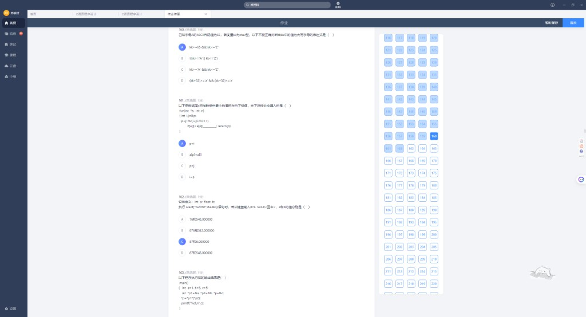

`kk>=65 && kk<='Z'` 混用数字与字符，不规范/不可靠 → **不能**正确判断 → **A**。

| 你的答案 | 正确答案 |
|----------|----------|
| A ✓ | **A（不能）** |

---

## 第 161 题

找最小元素下标：发现更小则 **`p=i`** → **A**。

| 你的答案 | 正确答案 |
|----------|----------|
| A ✓ | **A** |

---

## 第 162 题

`scanf("%2d%f",...)` 输入 `876 543.0` → a=**87**，剩余 `6 543.0` → b=**6.0** → **C**。

| 你的答案 | 正确答案 |
|----------|----------|
| C ✓ | **C** |

---

## 第 163 题

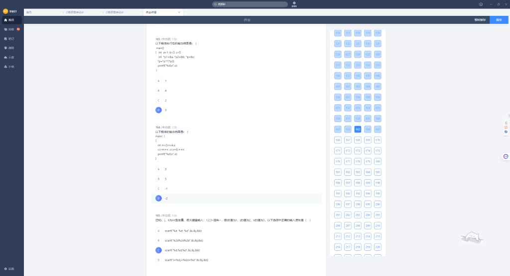

`*p = *p1 * (*p2)` = 1×3 = **3** → **D**。

| 你的答案 | 正确答案 |
|----------|----------|
| D ✓ | **D. 3** |

---

## 第 164 题

`x=-m++` → x=-3,m=4；`8/++n` 中 n=5，8/5=1 → x=-2 → **D**。

| 你的答案 | 正确答案 |
|----------|----------|
| D ✓ | **D. -2** |

---

## 第 165 题

输入 `1,2,3` 需格式串带逗号 → **`scanf("%d,%d,%d",...)`** → **C**。

| 你的答案 | 正确答案 |
|----------|----------|
| C ✓ | **C** |

---

## 第 166 题

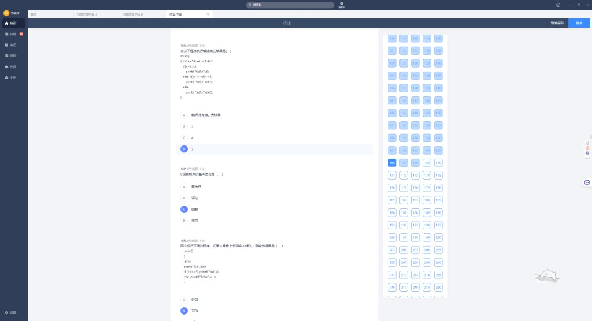

`a>b>c` → `(5>4)>3` → 0；`(c-1>=d)==1` → `(2>=2)==1` 真 → 输出 **d+1=3** → **B**。

| 你的答案 | 正确答案 |
|----------|----------|
| D | **B. 3** |

---

## 第 167 题

C 程序基本单位是**函数** → **C**。

| 你的答案 | 正确答案 |
|----------|----------|
| C ✓ | **C** |

---

## 第 168 题

输入 6：`x++>5` 真，x→7，输出 **7**  
输入 4：条件假，x→5，`x--` 先输出 **5** → **D. 7和5**

| 你的答案 | 正确答案 |
|----------|----------|
| B | **D. 7和5** |

---

## 第 169~171 题

| 题号 | 答案 | 要点 |
|------|------|------|
| 169 | **C** | `main` 可在源程序任意位置 |
| 170 | **D** | `void play(int a,int b)` 合法首部 |
| 171 | **D** | `++*x`，a=25 → **26** |

（你截图中 **169~172 全对** ✓）

---

## 第 172 题

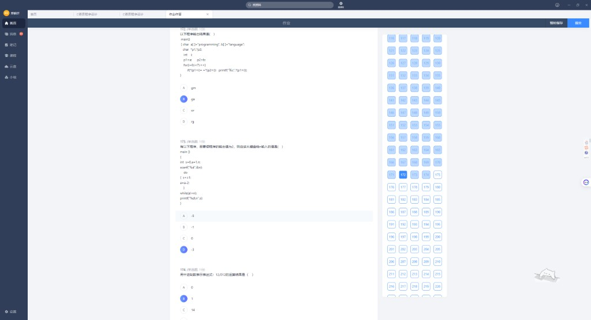

`programming` 与 `language` 前 7 位相同处：下标 3 的 `g`、下标 5 的 `a` → **ga** → **B**。

| 你的答案 | 正确答案 |
|----------|----------|
| B ✓ | **B. ga** |

---

## 第 173 题

do-while：`a` 变 1,-1,-3… 要使 `s=2`，结束时 `a=n=-3` → **D**。

| 你的答案 | 正确答案 |
|----------|----------|
| D ✓ | **D. -3** |

---

## 第 174 题

`012` 八进制 = 10；`12/10` 整除 = **1** → **B**。

| 你的答案 | 正确答案 |
|----------|----------|
| B ✓ | **B. 1** |

---

## 第 175 题

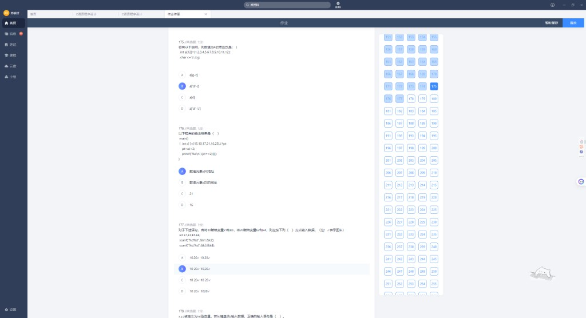

`'d'-'a'` = 3 → `a[3]` 的值是 **4** → **B**（`a['d'-c]`，c='a'）。

| 你的答案 | 正确答案 |
|----------|----------|
| B ✓ | **B** |

---

## 第 176 题

`ptr=x+2` → `*(ptr+2)=x[4]=**16**` → **D**（`%d` 输出值不是地址）。

| 你的答案 | 正确答案 |
|----------|----------|
| A | **D. 16** |

---

## 第 177 题

```c
scanf("%d %d", &k1, &k2);    // 10 20↵
scanf("%d,%d", &k3, &k4);    // 10,20↵  ← 必须有逗号
```

| 你的答案 | 正确答案 |
|----------|----------|
| B | **A. 10 20↵ 10,20↵** |

---

## 专题 · 指针酒店

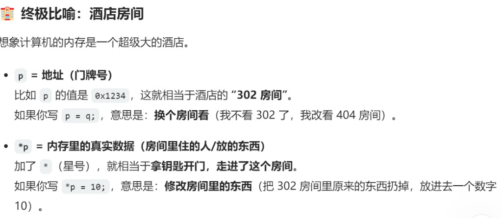

| 写法 | 含义 |
|------|------|
| `p = q` | 换房间号（改指针指向） |
| `*p = 10` | 改房间里的人（改所指内容） |
| `printf("%s", p)` | 把「狗绳」交给 `%s`，它顺着地址牵出整串 |

---

## 本批易错点速记

| 题号 | 你的选择 | 正确答案 | 一句话 |
|------|----------|----------|--------|
| 4 | A aa | **Ab** | 指针传值，`a=b` 改不了 p1 |
| 7 | D | **B** | `*p` 只交换首字符 |
| 9 | C | **D** | 无 `{}` 时 `x--` 后要加分号 |
| 12 | B | **A** | 不能写 `x>=y>=z` |
| 17 | D | **B** | `*p2=*p1` 是复制不是改地址 |
| 18 | C | **A** | `while(n--)` 配 `--n` → 2 0 |
| 19 | B | **A** | 逗号表达式缺 `;` 不是语句 |
| 20 | D | **C** | 左边不能是 `y*5` 这种右值 |
| 30 | D | **A** | `=` 优先级很低，`--` 很高 |
| 33 | D | **C** | 转义序列按「包」数，长度 8 |
| 37 | B | **A** | `*p=5` 合法，`*q=2` 类型错 |
| 44 | A | **D** | 问表达式 `a++` 的值是 5 |
| 45 | B | **C** | `getchar()` 赋值要加括号 |
| 48 | C | **A** | `strlen` 不是 `sizeof` |
| 53 | A | **B** | 字符串 `%s` 不要 `&数组名` |
| 55 | A | **D** | switch 不能跟 float |
| 56 | B | **C** | `3+8>0` 输出 **** |
| 57 | C | **A** | `int *p[3]` 是指针数组 |
| 61 | D | **C** | 数组名不能 `s++` |
| 65 | D | **C** | `s[1]` 不是地址 |
| 66 | C | **B** | `while(*p2)` 漏复制 `\0` |
| 68 | A | **C** | 第 4 列求和得 20 |
| 71 | B | **D** | D 的 if 分支与其他相反 |
| 73 | D | **C** | 合法语句要加分号 |
| 74 | A | **B** | 逗号表达式取最后一个 |
| 75 | B | **D** | 字符串占 6 字节含 `\0` |
| 31 | C | **D** | `while(k=0)` 是赋值，循环 0 次 |
| 77 | D | **B** | `while(y--)` 结束时 y=-1 |
| 78 | D | **A** | 二维数组每行 10 字节 |
| 85 | B | **A** | `while(!x)` 只打印 5 |
| 86 | A | **D** | strlen 数有效字符 7 |
| 89 | C | **B** | A→B→A 间接递归 |
| 90 | C | **D** | 字符串赋给 char* 指针 |
| 96 | B | **D** | strcmp 比 ASCII，D<d |
| 98 | C | **A** | 嵌套循环 k=0,m=5 |
| 103 | D | **C** | for 更新在打印之后 |
| 108 | A | **C** | 双重循环 n[0] 最终为 3 |
| 110 | C | **B** | 前面元素个数 i*m+j |
| 111 | D | **A** | 数组名传址，元素传值 |
| 113 | A | **B** | 定义中 * 是类型说明符 |
| 114 | B | **A** | 局部 a 遮蔽全局 |
| 117 | C | **D** | && 短路 n 不变 |
| 123 | D | **C** | continue 跳过 i++ |
| 126 | A | **D** | 单引号是字符常量 |
| 133 | B | **D** | `%d` 输出 109 不是字母 m |
| 141 | C | **D** | static 的 m、i 都跨调用累加 |
| 150 | A | **B** | `~c` 等于 `b=~a` 后的 b |
| 153 | C | **D** | 宏替换 3*3+5*3+5=29 |
| 157 | D | **A** | %o/%x 不带 0/0x 前缀 |
| 158 | A | **B** | while(*y++) 求 strlen |
| 159 | A | **C** | break 时 b=4 |
| 166 | D | **B** | (c-1>=d)==1 输出 3 |
| 168 | B | **D** | 输入 4 输出 5 |
| 176 | A | **D** | *(ptr+2)=x[4]=16 |
| 177 | B | **A** | 第二个 scanf 要逗号 |

---

## 附录：截图索引

| 文件 | 内容 |
|------|------|
| `01~02` | 第 1~5 题 |
| `03~11` | 第 7 题 + 指针专题 |
| `12~13` | 第 8~10 题 |
| `14~15` | 第 11~13 题 |
| `16` | 第 14~16 题 |
| `17~22` | 第 17~20 题纠错 |
| `23` | 指针酒店专题 |
| `24` | 第 24~26 题 |
| `25~26,28~43` | 第 27~51 题 + 专题纠错 |
| `27` | 专题：后缀递减 `a--`（第 42、44 题） |
| `44` | 第 6 题 |
| `45` | 第 32 题 |
| `46~61` | 第 52~75 题 + 专题 |
| `62~63` | 第 73~75 题纠错 |
| `64` | 第 31 题 |
| `65` | 第 64 题 |
| `66~85` | 第 76~100 题 + 纠错 |
| `86~107` | 第 101~130 题 + 纠错/专题 |
| `108~109` | 第 112、130~133 题 |
| `110~116` | 第 134~150 题 + 136 专题 |
| `117~127` | 第 151~177 题 + 153/157 纠错 |

---

## 178~334 快速答案

> **用法**：白告直接发截图/题号，此处只追加「题号 → 选项」，不做逐题解析。  
> 单选 **1~334 已全部有答案**。

| 题号 | 答案 | 题号 | 答案 | 题号 | 答案 |
|------|------|------|------|------|------|
| 169 | **C** | 213 | **B** | 257 | **B** |
| 170 | **D** | 214 | **A** | 258 | **C** |
| 171 | **D** | 215 | **A** | 259 | **C** |
| 178 | **D** | 216 | **D** | 260 | **D** |
| 179 | **C** | 217 | **D** | 261 | **D** |
| 180 | **D** | 218 | **C** | 262 | **D** |
| 181 | **A** | 219 | **C** | 263 | **A** |
| 182 | **D** | 220 | **A** | 264 | **B** |
| 183 | **B** | 221 | **C** | 265 | **B** |
| 184 | **D** | 222 | **B** | 266 | **C** |
| 185 | **D** | 223 | **C** | 267 | **D** |
| 186 | **C** | 224 | **A** | 268 | **C** |
| 187 | **D** | 225 | **B** | 269 | **C** |
| 188 | **B** | 226 | **C** | 270 | **C** |
| 189 | **A** | 227 | **B** | 271 | **C** |
| 190 | **C** | 228 | **D** | 272 | **D** |
| 191 | **A** | 229 | **C** | 273 | **C** |
| 192 | **C** | 230 | **B** | 274 | **D** |
| 193 | **C** | 231 | **C** | 275 | **D** |
| 194 | **C** | 232 | **B** | 276 | **C** |
| 195 | **A** | 233 | **D** | 277 | **D** |
| 196 | **A** | 234 | **A** | 278 | **C** |
| 197 | **D** | 235 | **A** | 279 | **C** |
| 198 | **D** | 236 | **B** | 280 | **A** |
| 199 | **C** | 237 | **C** | 281 | **A** |
| 200 | **A** | 238 | **A** | 282 | **A** |
| 201 | **C** | 239 | **B** | 283 | **B** |
| 202 | **B** | 240 | **B** | 284 | **A** |
| 203 | **C** | 241 | **C** | 285 | **A** |
| 204 | **D** | 242 | **C** | 286 | **A** |
| 205 | **A** | 243 | **A** | 287 | **D** |
| 206 | **A** | 244 | **C** | 288 | **A** |
| 207 | **D** | 245 | **A** | 289 | **B** |
| 208 | **D** | 246 | **C** | 290 | **B** |
| 209 | **B** | 247 | **B** | 291 | **D** |
| 210 | **C** | 248 | **A** | 292 | **A** |
| 211 | **B** | 249 | **A** | 293 | **A** |
| 212 | **A** | 250 | **B** | 294 | **D** |
| | | 251 | **A** | 295 | **D** |
| | | 252 | **B** | 296 | **C** |
| | | 253 | **B** | 297 | **A** |
| | | 254 | **B** | 298 | **B** |
| | | 255 | **D** | 299 | **A** |
| | | 256 | **D** | 300 | **D** |
| | | | | 301 | **A** |
| | | | | 302 | **D** |
| | | | | 303 | **C** |
| | | | | 304 | **B** |
| | | | | 305 | **D** |
| | | | | 306 | **D** |
| | | | | 307 | **B** |
| | | | | 308 | **A** |
| | | | | 309 | **B** |
| | | | | 310 | **D** |
| | | | | 311 | **D** |
| | | | | 312 | **B** |
| | | | | 313 | **C** |
| | | | | 314 | **B** |
| | | | | 315 | **B** |
| | | | | 316 | **A** |
| | | | | 317 | **A** |
| | | | | 318 | **B** |
| | | | | 319 | **A** |
| | | | | 320 | **D** |
| | | | | 321 | **B** |
| | | | | 322 | **B** |
| | | | | 323 | **A** |
| | | | | 324 | **A** |
| | | | | 325 | **C** |
| | | | | 326 | **B** |
| | | | | 327 | **D** |
| | | | | 328 | **C** |
| | | | | 329 | **A** |
| | | | | 330 | **B** |
| | | | | 331 | **A** |
| | | | | 332 | **D** |
| | | | | 333 | **D** |
| | | | | 334 | **D** |
| | | | | 335 | **ACD**（多选） |
| | | | | 336~471 | 待续 |

---

## 复习重点总结

### 1. 指针（错最多，必背）

| 概念 | 记住这句 |
|------|----------|
| 传值 vs 传址 | 形参指针 `p1=p2` 只改局部副本，改不了实参（**4**） |
| `*p` 解引用 | 改的是「房间里的人」，`*p1=*p2` 是**复制内容**不是改指针（**17**） |
| 指针数组 | `int *p[3]` 是**3 个 int 指针**，不是 `int[3]`（**57**） |
| 数组与地址 | `s[1]` 是**元素值**，不是地址；`&s[1]` 才是（**65**） |
| 字符串复制 | `while(*p2++)` 会**漏掉 `\0`**，长度/复制题要看终止符（**66**） |
| 定义里的 `*` | `int *p` 中 `*` 是**类型说明符**的一部分（**113**） |
| 作用域遮蔽 | 局部变量与全局同名时，**局部优先**（**114**） |
| `printf` 与指针 | `*(ptr+2)` 用 `%d` 输出的是**值**（如 16），不是地址（**176**） |

**专题口诀**：`p = q` 换房间号；`*p = 10` 改房间里的人。

---

### 2. 宏定义（预处理陷阱）

```c
#define F(x) P*x*x
F(3+5)  →  3*3+5*3+5 = 29   // 不是 3*(3+5)*(3+5)
```

- 宏 = **无脑文本替换**，不算括号、不先算参数。
- 安全写法：`#define F(x) (P*(x)*(x))`（**153**）

---

### 3. 运算符与表达式

| 陷阱 | 例题要点 |
|------|----------|
| 连续比较 | `a>b>c` 实际是 `(a>b)>c`，结果为 0/1，**不能**当数学连比（**12, 166**） |
| 优先级 | `=` 很低，`--`/`++` 很高；`a=3*5` 先算乘法（**30**） |
| 后缀 `++`/`--` | 表达式**先用旧值**，再自增/自减（**44, 168**） |
| 前缀 vs 后缀 | `++A==B--` 要分步：先算 ++A 和 B-- 的**表达式值**，再比（**155**） |
| 逗号表达式 | 整体值 = **最后一个**子表达式的值（**74**） |
| 位运算 | `~a` 按位取反；`b=~a` 后 `~c` 与 `b` 比较（**150**） |
| 短路 | `&&`/`||` 短路，右侧可能**不执行**（**117**） |
| 左值 | 赋值号左边必须是左值，`y*5=…` 非法（**20**） |

---

### 4. 输入输出（scanf / printf）

| 考点 | 要点 |
|------|------|
| 格式串要**完全匹配** | `"%d,%d"` 输入必须有逗号；`"11 12"` 错（**156, 165, 177**） |
| 宽度限制 | `"%2d%f"` 只读 2 位整数，剩余留给下一项（**162**） |
| `%o` / `%x` | 默认**不带** `0` / `0x` 前缀；要前缀用 `%#o`、`%#x`（**157**） |
| 字符串 `%s` | 不要对数组名再取址 `&s`（**53**） |
| `%d` 打印字符 | 输出的是 **ASCII 码**（如 109），不是字母本身（**133**） |

---

### 5. 循环（while / for / break / continue）

| 陷阱 | 说明 |
|------|------|
| `while(k=0)` | 赋值表达式值为 0，循环**一次都不进**（**31**） |
| `while(n--)` 与 `--n` | 搭配方式决定输出序列（**18**） |
| `continue` | 跳过本次剩余语句，**for 的 i++ 仍会执行**；while 里手写 i++ 可能被跳过 → 死循环（**123**） |
| `break` | 只跳出**最近一层**循环；看清 break 时循环变量是多少（**159**） |
| for 执行顺序 | 条件 → 体 → **更新表达式** → 再条件（**103**） |
| 嵌套循环 | 画表追踪外层/内层各变量（**98, 108**） |

---

### 6. switch 与分支

- **不能**对 float/double 做 switch（**55**）
- 无 `break` 会**穿透**到下一个 case；`default` 位置不限，同样会穿透（**151**）
- `if-else` 嵌套要看清**哪条分支**与其他选项不同（**71**）

---

### 7. 字符串与字符

| 考点 | 要点 |
|------|------|
| `strlen` vs `sizeof` | strlen = 有效字符数（不含 `\0`）；sizeof 含 `\0` 和填充（**48, 75, 86**） |
| 字符常量 | 单引号**只能一个字符**，`'cd'` 非法（**126, 152**） |
| 转义序列 | `\123` 等按规则算长度，不是普通字符（**33**） |
| `strcmp` | 按 ASCII 比，`'D' < 'd'`（**96**） |
| 求长度写法 | `while(*y++); return(y-s-1);` 经典 strlen（**158**） |

---

### 8. 数组与二维数组

- 二维数组行优先：`a[i*m+j]` 是线性下标（**110**）
- 每行字节数 = 列数 × `sizeof(元素)`（**78**）
- 数组名不能做 `s++`（**61**）
- `'d'-'a'` 可作下标，值为 3 → `a[3]` 是第 4 个元素（**175**）

---

### 9. 函数与 static

- **static 局部变量**：只初始化一次，**跨调用保留**（**141**）
- 递归：直接/间接都要能想到调用链（**89**）
- `return` 表达式 vs `void` 函数：带返回值的 return 不能写在 void 里

---

### 10. 进制与常量

- 以 `0` 开头是**八进制**：`012` = 10（**174**）
- `0.1e+6`、 `"\a"`、 `'\011'` 均合法；`'cd'` 不合法（**152**）

---

## 你的易错点总览（1~177，共 55 题）

> 下面按**你选错的题**归纳；考前优先过一遍打 ✗ 的。

#### 指针类（12 题）— 最优先复习
4, 7, 17, 37, 57, 65, 66, 90, 111, 113, 114, 176

#### 循环类（9 题）
18, 31, 77, 85, 98, 103, 108, 123, 159

#### 运算符 / 表达式（10 题）
12, 20, 30, 44, 74, 117, 133, 141, 150, 166

#### scanf / printf（6 题）
53, 133, 157, 162, 177 + 156（你做对但属高频）

#### 字符串（6 题）
48, 75, 86, 96, 126, 158

#### 宏 / 预处理（1 题）
153

#### 分支 / switch（4 题）
55, 71, 151（做对）, 168

#### 数组 / 二维（5 题）
61, 68, 78, 110, 175（做对）

#### 语法 / 语句（5 题）
9, 19, 45, 73, 126

#### 其它
6, 33, 56, 89 …（完整 55 条见上表「本批易错点速记」）

**错题率**：55 / 177 ≈ **31%**（约七成已掌握；**指针**和**循环**是主要失分点）

---

## 考前50题（必刷）

> **独立文件**：题目 → [考前必刷_题目卷.md](考前必刷_题目卷.md)　答案 → [考前必刷_答案解析.md](考前必刷_答案解析.md)  
> 下方为索引表（含答案，复习时可忽略）。

> **配比**：**错题 36**（✗）+ **未做 14**（○）= 50 道  
> **✗** = 你选错过（1~177 共 25 + 178~304 共 11）　**○** = 没练过 / 只看过答案（169~171、178 + 305~334 精选）  
> 用法：遮住「答案」列自己做，再对照。时间紧至少刷完 **✗ 的 36 道**。

| # | 题号 | 答案 | 类型 | 一句话 |
|---|------|------|------|--------|
| 1 | 4 | **Ab** | ✗ | 指针传值，`a=b` 改不了 p1 |
| 2 | 7 | **B** | ✗ | `*p` 只交换首字符 |
| 3 | 17 | **B** | ✗ | `*p2=*p1` 复制内容，不改指针 |
| 4 | 12 | **A** | ✗ | 不能写 `a>b>c` |
| 5 | 31 | **D** | ✗ | `while(k=0)` 循环 0 次 |
| 6 | 48 | **A** | ✗ | `strlen` ≠ `sizeof` |
| 7 | 57 | **A** | ✗ | `int *p[3]` 是指针数组 |
| 8 | 65 | **C** | ✗ | `s[1]` 是值不是地址 |
| 9 | 66 | **B** | ✗ | 复制字符串漏 `\0` |
| 10 | 74 | **B** | ✗ | 逗号表达式取最后一个 |
| 11 | 90 | **D** | ✗ | 字符串赋给 `char*` |
| 12 | 103 | **C** | ✗ | for 更新在打印之后 |
| 13 | 108 | **C** | ✗ | 双重循环画表推 |
| 14 | 111 | **A** | ✗ | 数组名传址，元素传值 |
| 15 | 117 | **D** | ✗ | `&&` 短路 |
| 16 | 133 | **D** | ✗ | `%d` 打字符得 ASCII |
| 17 | 141 | **D** | ✗ | static 跨调用累加 |
| 18 | 153 | **D** | ✗ | 宏替换 → 29 不是 192 |
| 19 | 157 | **A** | ✗ | `%o` `%x` 不带前缀 |
| 20 | 158 | **B** | ✗ | `while(*y++)` 求 strlen |
| 21 | 159 | **C** | ✗ | break 时 b=4 |
| 22 | 166 | **B** | ✗ | `(c-1>=d)==1` → 输出 3 |
| 23 | 168 | **D** | ✗ | 输入 4，`x--` 打印 5 |
| 24 | 176 | **D** | ✗ | `*(ptr+2)` 是值 16 |
| 25 | 177 | **A** | ✗ | 第二个 scanf 要逗号 |
| 26 | 190 | **C** | ✗ | `*p=j` 才能给 i 赋值 |
| 27 | 198 | **D** | ✗ | 缺返回类型默认 int |
| 28 | 214 | **A** | ✗ | 双重 for 嵌套推输出 |
| 29 | 215 | **A** | ✗ | 访问 `x[2]` 用 `*(x+2)` |
| 30 | 221 | **C** | ✗ | 局部 s 与全局 s，32/13=2 |
| 31 | 238 | **A** | ✗ | static a 累加 → 6 |
| 32 | 241 | **C** | ✗ | `(++x,y++)` → 3 3 |
| 33 | 251 | **A** | ✗ | `z=x++` 只赋旧值 1 |
| 34 | 298 | **B** | ✗ | `%d,%d` → 65,66 |
| 35 | 299 | **A** | ✗ | `*ps+4` → 字符 `e` |
| 36 | 300 | **D** | ✗ | `strlen("cd")`=2 |
| 37 | 169 | **C** | ○ | `main` 可在任意位置（你做对✓） |
| 38 | 170 | **D** | ○ | `void play(int a,int b)`（你做对✓） |
| 39 | 171 | **D** | ○ | `++*x` → 26（你做对✓） |
| 40 | 178 | **D** | ○ | `scanf` 要 `&x,&y,&z`（你做对✓） |
| 41 | 297 | **A** | ○ | 指针两端交换 → 逆序 |
| 42 | 305 | **D** | ○ | `char *aa[2]` 存字符串首址 |
| 43 | 308 | **A** | ○ | `fun(a,&a[3])` 首参不能是 int |
| 44 | 309 | **B** | ○ | 原型 `fun(int,int)` 非法 |
| 45 | 310 | **D** | ○ | `(x%=k)-(k%=5)` 得 3 |
| 46 | 311 | **D** | ○ | `printf` 后缺 `;` 编译错 |
| 47 | 312 | **B** | ○ | static a + 局部 a 遮蔽 → 14 |
| 48 | 318 | **B** | ○ | 奇数下标求和 → 56 |
| 49 | 321 | **B** | ○ | `z-->0` → 3,2,-1 |
| 50 | 323 | **A** | ○ | `sum` 未初始化，值不确定 |

**加练（有时间多做）**：333 **D**（`strcmp`+`strcat` → `*9`）、334 **D**（转义串长度 5）。

**刷题顺序**：#1~25（1~177 错题）→ #26~36（178~304 错题）→ #37~50（未做题）→ **多选20** → **判断15**。

### 考前必刷独立文件

| 文件 | 内容 |
|------|------|
| [考前必刷_题目卷.md](考前必刷_题目卷.md) | 85 题**纯题面**（无答案） |
| [考前必刷_答案解析.md](考前必刷_答案解析.md) | 85 题**答案 + 解析** |

---

## 考前20题·多选必刷

> **335~393 多选**精选 20 道：**错题 16** + **高频补 4**  
> 用法：遮住答案自己做，再对照下方 [335~393 多选答案](#335349-多选题答案) 各段。

| # | 题号 | 答案 | 类型 | 一句话 |
|---|------|------|------|--------|
| 1 | 335 | **AB** | ✗ | 二维初始化：**行可省，列必留** |
| 2 | 336 | **ABC** | ✗ | `*p++` = `*(p++)`，别漏 A |
| 3 | 340 | **BC** | ✗ | 数组名定义后不能 `=`；`*s` 可以 |
| 4 | 345 | **BC** | ✗ | `char str=''` 非法；`{'\064'}` 无 `\0` |
| 5 | 349 | **ABC** | ✗ | `x[4][]` 非法；D 列不能省 |
| 6 | 350 | **ACD** | ✗ | 问**错误**叙述；B（定义不嵌套）是对的 |
| 7 | 356 | **A** | ✗ | `a=a+7=c+b` 左值非法；`(int)18.5%3` 合法 |
| 8 | 361 | **BC** | ✗ | `a[][3]={}` 空 `{}` 无法推断行数 |
| 9 | 342 | **BC** | ✗ | 赋字符串用 `strcpy` 或定义时 `="..."` |
| 10 | 355 | **ABD** | ✗ | `p2=k` 不能把 int 赋给指针 |
| 11 | 367 | **CD** | ✗ | `sizeof` 是**运算符**，结果是整型 |
| 12 | 374 | **ABD** | ✗ | `aa+1`=`&aa[1]`；`&aa[0]++` 非法 |
| 13 | 385 | **AC** | ✗ | `#define d 2` 后 `d++`→`2++` 报错 |
| 14 | 389 | **ABC** | ✗ | 只有 **`p1=p2`** 能让 p1 指向 b |
| 15 | 363 | **ABC** | ✗ | `2L`/`0xFF` 合法；`1.2e0.5` 指数须整数 |
| 16 | 375 | **AD** | ✗ | 宏名不必大写；宏替换在编译期 |
| 17 | 337 | **BC** | ○ | `int n=10,a[n]` 非法（C89） |
| 18 | 346 | **ABD** | ○ | `sizeof(p)` 是 3，不是 char 大小 |
| 19 | 373 | **BD** | ○ | `1.234e04`/`e-2` 合法；`e0.4` 非法 |
| 20 | 393 | **CD** | ○ | `getchar()` 无参；`putchar('\n')` 不是 `"\\n"` |

**多选口诀**：行可省列必留 · 数组名二次不能 `=` · 宏别对常量 `++` · 两指针不能 `+`

---

## 考前15题·判断必刷

> **394~471 判断**精选 15 道：**你错过 9** + **高频易混 6**  
> **A**=对 · **B**=错。对照 [394~471 判断题答案](#394471-判断题答案)。

| # | 题号 | 答案 | 类型 | 一句话 |
|---|------|------|------|--------|
| 1 | 406 | **A** | ✗ | 空串 `\0`(0) **小于** 空格(32) |
| 2 | 430 | **A** | ✗ | 考试按 C89：**无专门逻辑型**，用 int |
| 3 | 434 | **B** | ✗ | do-while：**非 0 继续**，0 才结束 |
| 4 | 453 | **B** | ✗ | 数组名作实参 → 传**地址**不是各元素值 |
| 5 | 424 | **A** | ✗ | 无 return 应定义 **void** |
| 6 | 426 | **A** | ✗ | C 程序基本组成单位是**函数** |
| 7 | 442 | **A** | ✗ | 宏替换**无类型限制**（文本替换） |
| 8 | 468 | **A** | ✗ | `#include`/`#define` **不是** C 语句 |
| 9 | 444 | **A** | ✗ | 函数之间可以互相调用 |
| 10 | 415 | **A** | ○ | 定义不嵌套，**调用**可嵌套 |
| 11 | 419 | **B** | ○ | 数组名传**首元素地址** |
| 12 | 402 | **A** | ○ | 值传递：形参实参**各占**存储单元 |
| 13 | 436 | **B** | ○ | `sizeof` 是运算符，不是函数调用 |
| 14 | 417 | **B** | ○ | `a=b+c=1` 非法（不能给 `b+c` 赋值） |
| 15 | 462 | **A** | ○ | `t=1,t+5,t++` 逗号表达式值为 **1.0** |

**判断口诀**：非 0 继续 · 数组传址 · 形参占栈 · 预处理不是 C 语句

---

## 335~349 多选题答案

> 只列答案；**你漏选/多选**的题在「备注」栏标出。

| 题号 | 答案 | 备注 |
|------|------|------|
| 335 | **AB** | 你漏 **B**；`a[][2]` 行可省、列必留 |
| 336 | **ABC** | 你漏 **A**；`*p++` 与 `*(p++)` 等价 |
| 337 | **BC** | ✓ |
| 338 | **BC** | 若 D 为 `s[]="..."` 则只选 BC |
| 339 | **ABD** | |
| 340 | **BC** | 你漏 **B**、误选 D；`*s` 可赋值，数组名不可 |
| 341 | **ABC** | 你漏 **B、C**；`a[5+5]`、`a[2*n]` 合法 |
| 342 | **BC** | 你多选 **D**；逐字符 `{}` 不算「赋字符串」 |
| 343 | **ACD** | B 不能当形参名写调用 |
| 344 | **AD** | 你误选 C |
| 345 | **BC** | `char str=''` 非法；`{'\064'}` 无 `\0` |
| 346 | **ABD** | `sizeof(p)` 是整个数组长度 3，不是 char |
| 347 | **BC** | 你误选 D；`'\018'` 八进制非法 |
| 348 | **AC** | 不能数字开头、不能有 `-` |
| 349 | **ABC** | 你漏 B、误选 D；`x[4][]` 非法 |

### 多选易错口诀

- 二维数组初始化：**行可省，列必留**
- `*p++` = `*(p++)` ≠ `(*p)++` ≠ `*p+i`
- 数组名：**定义时可 `="..."`，定义后只能 `strcpy`**
- 字符串：`""` 自动带 `\0`，`{}` 单字符**不一定**有 `\0`

---

## 350~353 多选题答案

| 题号 | 答案 | 备注 |
|------|------|------|
| 350 | **ACD** | 你误选 **B**；B 是**正确**描述（定义不嵌套、调用可嵌套），本题要选**错误**叙述 |
| 351 | **BCD** | 你误选 **A**；C89 源程序**不能**写二进制字面量（无 `0b`） |
| 352 | **AC** | 你漏 **A**；B 给了 3 行数据却只有 2 行；D 列不能省 |
| 353 | **ABC** | 你漏 **B、C**；字母/数字/下划线均可出现，**连接符 `-` 不行** |

---

## 354~357 多选题答案

| 题号 | 答案 | 备注 |
|------|------|------|
| 354 | **ACD** | 你选 A ✓；**B** 是字符常量 `'abc'`，不是字符串 |
| 355 | **ABD** | 你漏 **A、D**；**C** `p2=k` 把 int 赋给指针，非法 |
| 356 | **A** | 你误选 **C**；`(int)18.5%3` 合法；**A** `a+7=…` 左值不能是表达式 |
| 357 | **AC** | 你选 A ✓；**C** 嵌套赋值也合法；B/D 左值非法 |

---

## 358~361 多选题答案

| 题号 | 答案 | 备注 |
|------|------|------|
| 358 | **B** | ✓；`x+1=y` 左值非法；D `double(x)` 是 C++ 写法，C 用 `(double)x` |
| 359 | **BCD** | ✓；**A** `4d` 数字开头非法 |
| 360 | **ACD** | ✓；A 缺类型、C 无函数体、D 参数用 `;` 分隔 |
| 361 | **BC** | 你漏 **B**、多选 **D**；B `a[][3]={}` 空 `{}` 无法推断行数；D 合法 |

---

## 362~365 多选题答案

| 题号 | 答案 | 备注 |
|------|------|------|
| 362 | **AB** | 你多选 **D**；`'ab'` 多字符；`"n"` 是字符串 |
| 363 | **ABC** | 你漏 **B**、误选 **D**；`2L` 长整型；`1.2e0.5` 指数须为整数 |
| 364 | **ACD** | ✓；B `a[1][0]` 合法勿选；D 列下标 4 越界 |
| 365 | **BCD** | ✓；**A** 标识符不能含 `$` |

---

## 366~369 多选题答案

| 题号 | 答案 | 备注 |
|------|------|------|
| 366 | **BCD** | ✓；`j++` 本质是 `j=j+1`，考试算合法赋值语句 |
| 367 | **CD** | 你漏 **D**、误选 **A**；`sizeof` 是**运算符**，结果是整型 |
| 368 | **BCD** | ✓ |
| 369 | **AB** | ✓；`'\18'` 八进制含 8 非法；`"n"` 是字符串 |

---

## 370~372 多选题答案

| 题号 | 答案 | 备注 |
|------|------|------|
| 370 | **ABD** | ✓；**C** 重复声明通常能编译通过，不算必错 |
| 371 | **BCD** | 你漏 **B**；`-10<x-y<10` 即 `\|x-y\|<10` |
| 372 | **BCD** | 你漏 **B**；`*x` 即 `x[0]`；**A** `x[5]` 越界 |

---

## 373 多选题答案

| 题号 | 答案 | 备注 |
|------|------|------|
| 373 | **BD** | ✓；**A** `e0.4` 指数须整数；**C** `e+4` 缺尾数 |

---

## 374~377 多选题答案

| 题号 | 答案 | 备注 |
|------|------|------|
| 374 | **ABD** | 你漏 **B**、误选 **C**；`aa+1` 即 `&aa[1]`；`&aa[0]++` 非法 |
| 375 | **AD** | 你误选 **B、C**；宏名大小写随意；宏替换在编译期 |
| 376 | **ABC** | 你漏 **C**、误选 **D**；两指针**不能相加** |
| 377 | **ABC** | 你漏 **B**、误选 **D**；`ch=65` 合法；`ch='\'` 转义不完整 |

---

## 378~380 多选题答案

| 题号 | 答案 | 备注 |
|------|------|------|
| 378 | **ABD** | ✓；**C** `a==b` 是比较不是赋值 |
| 379 | **AD** | 你漏 **D**、误选 **C**；C 缺函数返回值类型 `int` |
| 380 | **ABC** | ✓；值传递时形参实参**各占**独立存储单元 |

---

## 381~384 多选题答案

| 题号 | 答案 | 备注 |
|------|------|------|
| 381 | **ABD** | 你漏 **A**；`'A'+1.6`→66（**B** 不是 `'C'`）；C 可相加 |
| 382 | **CD** | 你误选 **B**；break 也用于循环；不必与 case 绑定 |
| 383 | **BD** | 你误选 **A**；A 表示 a<10 或 a>15；D 整数等价 |
| 384 | **BC** | ✓；A 列不能省；D 初始化行数超出 |

---

## 385~387 多选题答案

| 题号 | 答案 | 备注 |
|------|------|------|
| 385 | **AC** | 你误选 **D**；`#define d 2` 展开后 `2++` 非法；**B** 未定义 |
| 386 | **BCD** | ✓；**A** `p=n` 不能把 int 赋给指针 |
| 387 | **AC** | 你误选 **B**；C 用 `(int)f` 不是 `int(f)`；**D** `<>` 非 C 运算符 |

---

## 388~390 多选题答案

| 题号 | 答案 | 备注 |
|------|------|------|
| 388 | **AC** | 你误选 **B**；`'\081'` 八进制含 8；`"\n"` 是字符串 |
| 389 | **ABC** | 你误选 **D**；只有 **`p1=p2`** 能让 p1 指向 b |
| 390 | **BD** | 你漏 **D**、误选 **A**；`while(1)` 与 `for(;;)` 都是无限循环 |

---

## 391~393 多选题答案

> **多选部分收尾**（335~393 已齐）。

| 题号 | 答案 | 备注 |
|------|------|------|
| 391 | **ABD** | 声明只要求类型匹配；**C** `b` 缺类型 |
| 392 | **BD** | `'\\'`、`'\''` 合法；`'\018'` 八进制含 8 |
| 393 | **CD** | `getchar()` 无参；`putchar` 不能传 `"\\n"` 字符串 |

---

## 394~471 判断题答案

> **A**=对 · **B**=错。与你选择不一致的在备注标出。

### 394~417

| 题号 | 答案 | 备注 |
|------|------|------|
| 394 | **A** | ✓ 预处理行不以 `;` 结束 |
| 395 | **B** | ✓ 函数内不能再定义函数 |
| 396 | **A** | ✓ |
| 397 | **A** | ✓ `x=y==5` 合法 |
| 398 | **B** | ✓ `++/--` 不能作用于常量 |
| 399 | **A** | ✓ 无 `-`，可有 `_` |
| 400 | **A** | ✓ 空条件等价 `1` |
| 401 | **A** | ✓ `\|\|` 结果为 0/1 |
| 402 | **A** | ✓ 值传递各占单元 |
| 403 | **B** | ✓ 从 main 开始/结束 |
| 404 | **B** | ✓ 调用可嵌套 |
| 405 | **A** | ✓ main 位置任意 |
| 406 | **A** | 你选 **B**；`""` 的 `\0`(0) < 空格(32) |
| 407 | **A** | ✓ 一行可多条语句 |
| 408 | **A** | ✓ 必须有 main |
| 409 | **B** | ✓ 需声明/定义顺序 |
| 410 | **B** | ✓ 宏不必在文件最前 |
| 411 | **B** | ✓ break 也用于循环 |
| 412 | **B** | ✓ 注释可单独成行 |
| 413 | **B** | ✓ main 位置不固定 |
| 414 | **B** | ✓ main 等不能随意改名 |
| 415 | **A** | ✓ 定义不嵌套、调用可嵌套 |
| 416 | **B** | ✓ strcmp 不要求等长 |
| 417 | **B** | ✓ `b+c=1` 非法 |

### 418~441

| 题号 | 答案 | 备注 |
|------|------|------|
| 418 | **A** | ✓ |
| 419 | **B** | ✓ 数组名传地址 |
| 420 | **A** | ✓ |
| 421 | **B** | ✓ C 只有函数 |
| 422 | **B** | ✓ 宏在编译期 |
| 423 | **A** | ✓ 赋值优先级很低 |
| 424 | **A** | 你选 **B**；无 return 应定义 void |
| 425 | **A** | ✓ `10!=9`→1 |
| 426 | **A** | 你选 **B**；基本单位是函数 |
| 427 | **A** | ✓ 可缩进 |
| 428 | **B** | ✓ 调用可嵌套 |
| 429 | **B** | ✓ 传地址非全部元素值 |
| 430 | **A** | 你选 **B**；C89 无专门逻辑型，用 int |
| 431 | **B** | ✓ `\` 不是整型运算符；`/` 也不仅限整型 |
| 432 | **B** | ✓ main 位置任意 |
| 433 | **A** | ✓ 可多文件组成 |
| 434 | **B** | 你选 **A**；非 0 **继续**，0 才结束 |
| 435 | **A** | ✓ 非 main 函数由调用链执行 |
| 436 | **B** | ✓ sizeof 是运算符 |
| 437 | **A** | ✓ |
| 438 | **A** | ✓ 形参分配栈空间 |
| 439 | **A** | ✓ |
| 440 | **B** | ✓ `2E0.5` 指数须整数 |
| 441 | **B** | ✓ `\|\|` 值为 1 不是 4 |

### 442~465

| 题号 | 答案 | 备注 |
|------|------|------|
| 442 | **A** | 你选 **B**；宏替换无类型限制 |
| 443 | **B** | ✓ |
| 444 | **A** | 你选 **B**；函数间可互调 |
| 445 | **B** | ✓ 定义不可嵌套 |
| 446 | **A** | ✓ `++(i+1)` 非法 |
| 447 | **A** | ✓ |
| 448 | **B** | ✓ 声明即可，不必先定义 |
| 449 | **A** | ✓ |
| 450 | **B** | ✓ 形参占存储 |
| 451 | **B** | ✓ 源程序不能直接执行 |
| 452 | **B** | ✓ `#define MAX` 缺替换串 |
| 453 | **B** | 你选 **A**；传地址非各元素值 |
| 454 | **B** | ✓ 宏名大小写随意 |
| 455 | **B** | ✓ 在 main 结束非最后函数 |
| 456 | **A** | ✓ |
| 457 | **A** | ✓ |
| 458 | **B** | ✓ 一行可多条 |
| 459 | **A** | ✓ `y=2+3/2=3.0` |
| 460 | **A** | ✓ 字符数组可用 `%s`/gets/puts 等 |
| 461 | **B** | ✓ 值传递不共用单元 |
| 462 | **A** | ✓ 逗号表达式最后一项 `t++` 值为 1.0 |
| 463 | **A** | ✓ 实参可以是表达式 |
| 464 | **B** | ✓ `sizeof(float)` 通常 4 |
| 465 | **B** | ✓ `{}` 也用于复合语句等 |

### 466~471

| 题号 | 答案 | 备注 |
|------|------|------|
| 466 | **B** | ✓ 函数不能单独运行 |
| 467 | **B** | ✓ continue 跳过本次循环 |
| 468 | **A** | 你选 **B**；预处理命令不是 C 语句 |
| 469 | **B** | ✓ 形参占存储 |
| 470 | **A** | ✓ |
| 471 | **B** | ✓ 定义不可嵌套 |

### 判断易错口诀

- **406**：空串 `\0`(0) 比 `" "`(32) 小
- **430**：考试按 C89——**无专门逻辑型**
- **434**：`while(1)` 非 0 → **继续**；0 才结束
- **453/419/429**：数组名作实参 → 传**地址**
- **442**：宏是文本替换，**无类型限制**

---

*全卷 **471 题答案已全部录入** · **考前50+20多选+15判断见上***
