# 综合填空 · 四题（二进制 / 冒泡 / 字符串 / 文件）

> 整理日期：2026-06-18  
> 全卷 4 题 · 100 分 · **全卷完结**

---

## 目录

- [第 1 题 · 二进制串转十进制](#第-1-题)
- [第 2 题 · 冒泡排序 sort](#第-2-题)
- [第 3 题 · 自定义 strcomp](#第-3-题)
- [第 4 题 · 成绩单文件读写](#第-4-题)
- [查漏清单](#查漏清单)

---

## 第 1 题


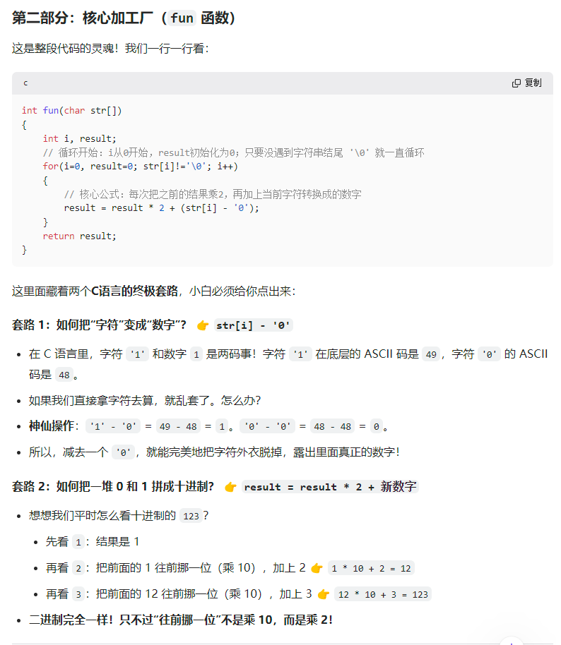
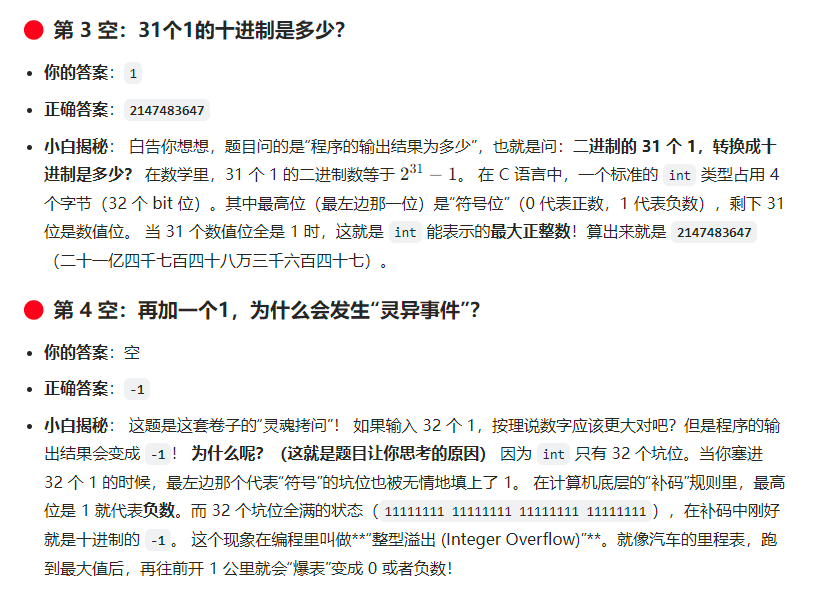

二进制串 `"1111"` → 十进制 15。

```c
int fun(char str[]) {
    int i, result;
    for (i = 0, result = 0; str[i] != '\0'; i++)
        result = result * 2 + (str[i] - '0');
    return result;
}
```

| 空 | 正确答案 | 你的答案 | 说明 |
|----|----------|----------|------|
| ① 循环条件 | **`str[i] != '\0'`** | `result=0` ✗ | 初始化写在 `for` 里：`i=0, result=0` |
| ② | **`result * 2`** | ✓ | 二进制「左移一位」 |
| ③ | **`(str[i] - '0')`** | `1` ✗ | 字符变数字：`'1'-'0'=1` |
| ④ 31 个 1 | **`2147483647`** | 空 | `2^31-1`，int 最大正数 |
| ⑤ 32 个 1 | **`-1`** | 空 | 符号位填满 → 补码为 -1（整型溢出） |

**【⚠️ 避坑】** `'1'` 和 `1` 不是一回事；`'1'-'0'` 才是数字 1。

---

## 第 2 题

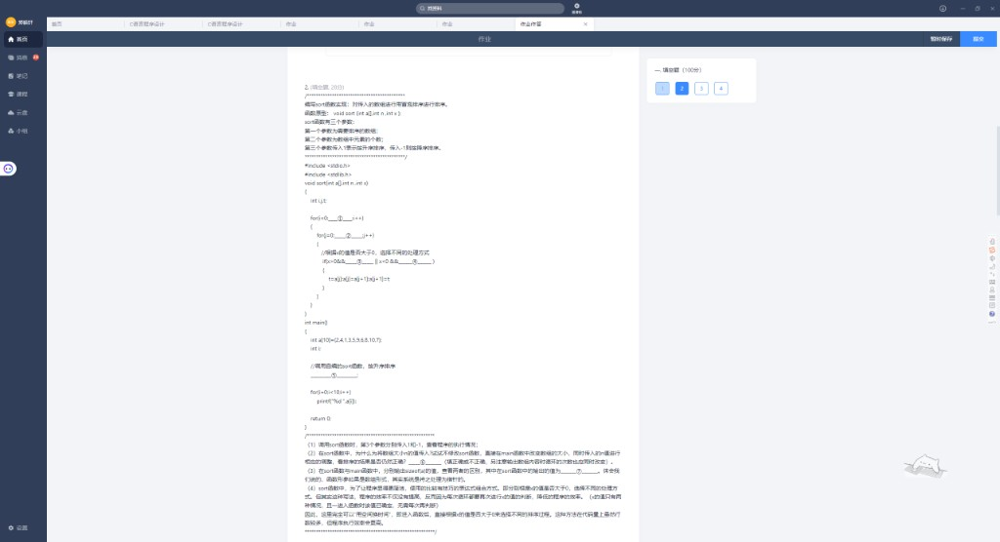
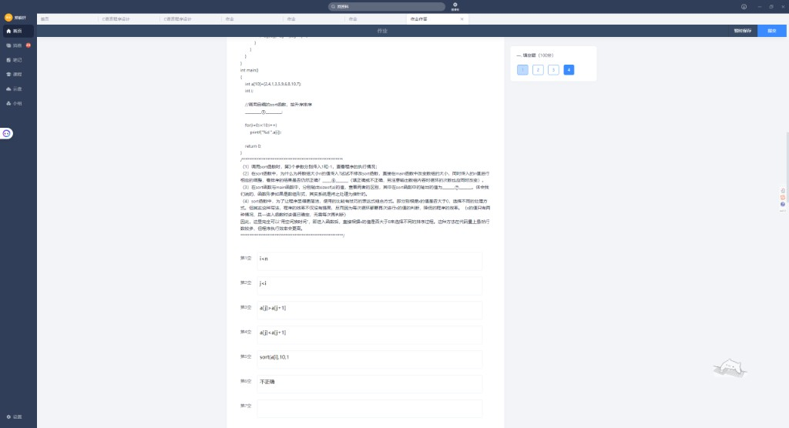
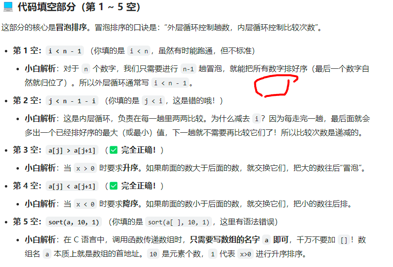
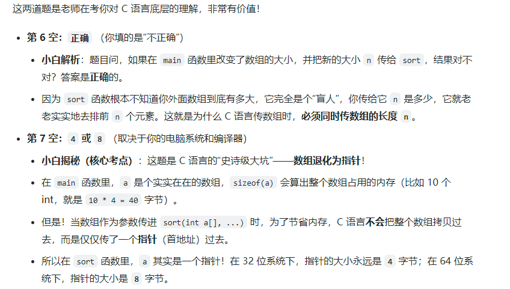

`sort(a, n, x)`：`x>0` 升序，`x<0` 降序。

| 空 | 正确答案 | 你的答案 |
|----|----------|----------|
| ① 外循环 | **`i < n - 1`** | `i<n` ✗ |
| ② 内循环 | **`j < n - 1 - i`** | `j<i` ✗ |
| ③ 升序交换条件 | **`a[j] > a[j+1]`** | ✓ |
| ④ 降序交换条件 | **`a[j] < a[j+1]`** | ✓ |
| ⑤ 升序调用 | **`sort(a, 10, 1)`** | `sort(a[],10,1)` ✗ |
| ⑥ 改 n 仍正确？ | **正确** | 不正确 ✗ |
| ⑦ sort 内 sizeof(a) | **4 或 8** | 空 |

**口诀：** 外层控制趟数（n-1 趟），内层控制比较次数（每趟少比 i 次）。

**【⚠️ 避坑】**
- 传数组只写 **`a`**，不能写 `a[]`
- 数组作形参**退化为指针**，`sizeof(a)` 在函数内是 4/8，不是 40

---

## 第 3 题


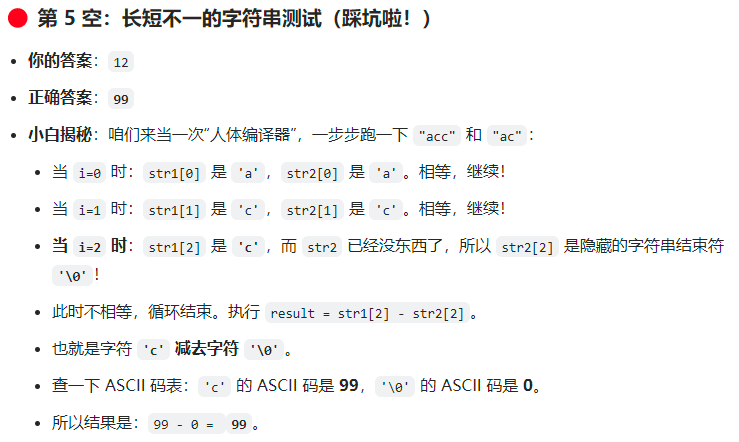

模拟 `strcmp`：找第一个不同字符，返回差值。

| 空 | 正确答案 | 你的答案 |
|----|----------|----------|
| ① 循环条件 | **`str1[i] != '\0'`**（或同时判 str2） | `str2[i]!='\0'` ✓ |
| ② 返回值 | **`str1[i] - str2[i]`** | ✓ |
| ③ main 调用 | **`strcomp(str1, str2)`** | ✓ |
| ④ 都是 "acc" | **`0`** | ✓ |
| ⑤ "acc" vs "ac" | **`99`** | `12` ✗ |

**⑤ 推演：** i=2 时 `str1[2]='c'(99)`，`str2[2]='\0'(0)` → `99-0=99`。

**【⚠️ 避坑】** 短串后面是隐藏的 **`'\0'`**，不是空格，ASCII 为 0。

---

## 第 4 题

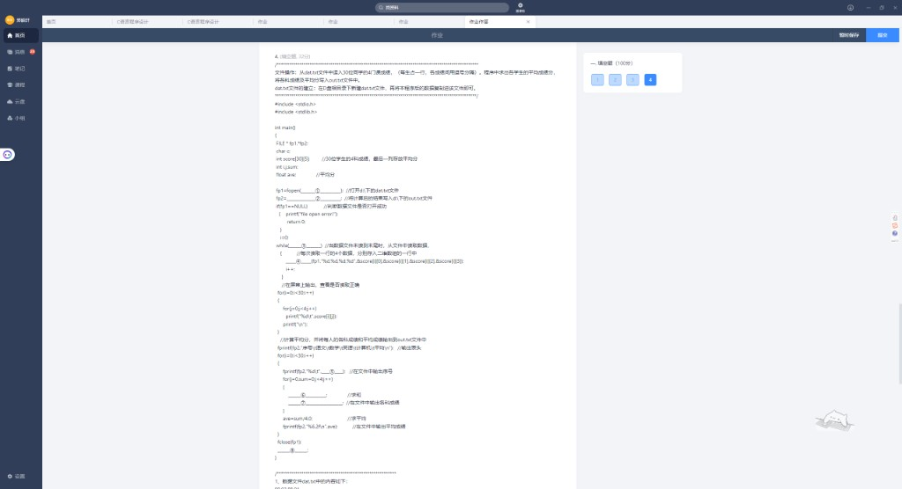
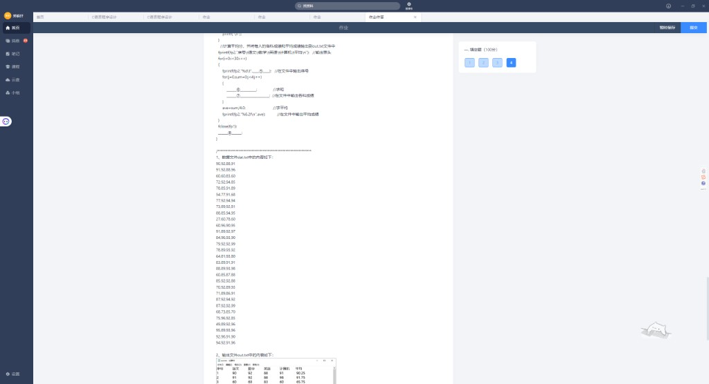
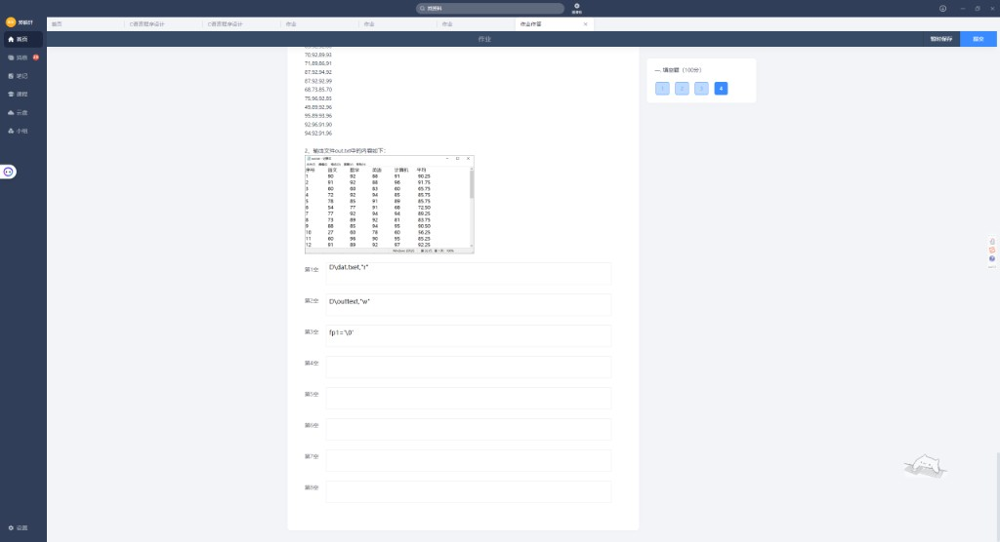
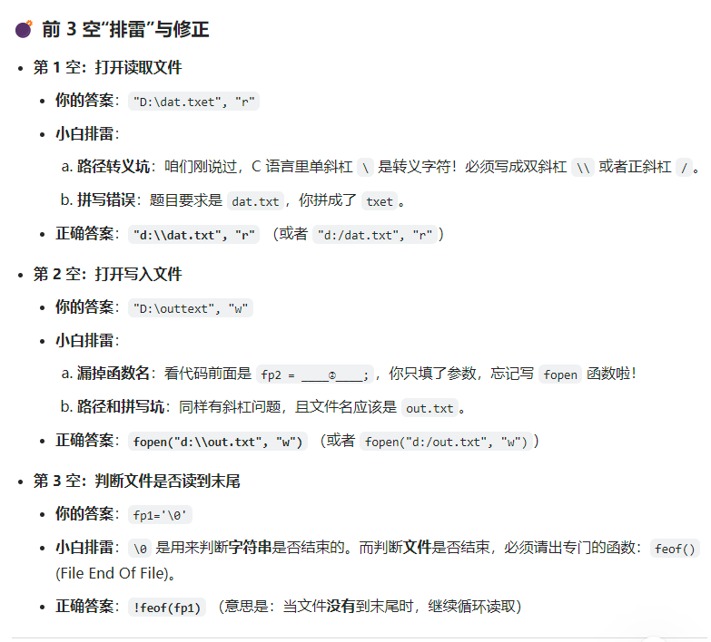
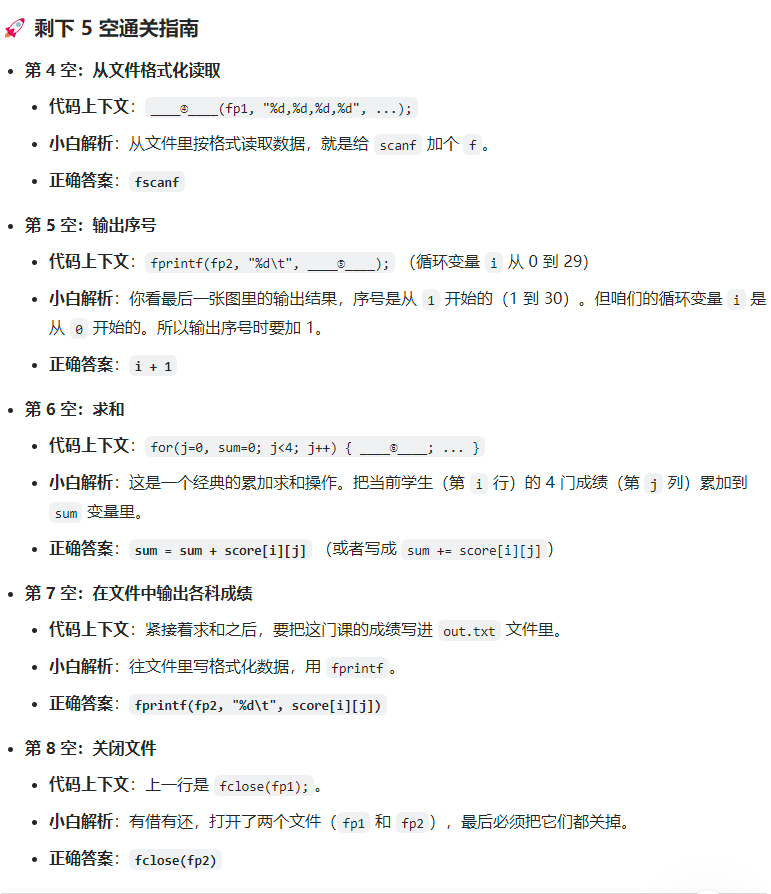

从 `d:\dat.txt` 读 30 人 4 科成绩，算平均分写入 `d:\out.txt`。

| 空 | 正确答案 | 你的答案 |
|----|----------|----------|
| ① 打开 dat | **`"d:\\dat.txt"`** 或 `"d:/dat.txt"` | 缺引号、`\` 未转义 |
| ② 读模式 | **`"r"`** | ✓（路径写法有误） |
| ③ 打开 out | **`fopen("d:\\out.txt", "w")`** | 缺 `fopen`、拼写 |
| ④ 循环条件 | **`!feof(fp1)`** | `fp1='\0'` ✗ |
| ⑤ 读数据 | **`fscanf(fp1, "%d %d %d %d", ...)`** | — |
| ⑥ 输出学号 | **`i + 1`** | — |
| ⑦ 累加 | **`sum += score[i][j]`** | — |
| ⑧ 输出单科 | **`fprintf(fp2, "%d\t", score[i][j])`** | — |
| ⑨ 关文件 | **`fclose(fp2)`** | — |

**【⚠️ 避坑】**
- 路径 `\` 要写成 **`\\`** 或用 **`/`**
- 文件末尾用 **`!feof(fp)`**，不是 `'\0'`
- **`"w"` 会清空**，`"a"` 才是追加（你 demo 里刚体验过）
- 平均分用 **`sum / 4.0`** 避免整数除法

**可运行 demo：** [`demo/score_file_demo.c`](demo/score_file_demo.c) + [`demo/dat.txt`](demo/dat.txt)  
运行后生成 `demo/out.txt`，逻辑与填空一一对应（路径改成本地 `dat.txt`/`out.txt`，避免 `d:\` 权限问题）。

```powershell
cd "E:\期末复习\C语言错题分析\demo"
chcp 65001
gcc score_file_demo.c -o score_file_demo.exe
.\score_file_demo.exe
```

---

## 查漏清单

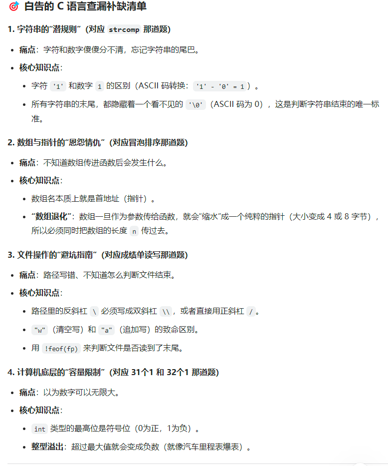

| 专题 | 核心 |
|------|------|
| 字符串 | `'1'-'0'`；串尾 `'\0'` |
| 数组传参 | 数组名=地址；必须另传 `n`；函数内 `sizeof` 是指针大小 |
| 文件 | 路径转义；`w`/`a`/`r`；`!feof(fp)` |
| 整型溢出 | int 最高位符号位；31 个 1 → 2147483647；32 个 1 → -1 |

---

## 本卷易错点速记

| 题 | 你的易错 | 正确答案 |
|----|----------|----------|
| 1③ | 写死 `1` | **`str[i]-'0'`** |
| 1④⑤ | 空 | **2147483647 / -1** |
| 2①② | `i<n`, `j<i` | **`i<n-1`, `j<n-1-i`** |
| 2⑤ | `sort(a[],...)` | **`sort(a,...)`** |
| 2⑥ | 不正确 | **正确** |
| 3⑤ | 12 | **99**（'c' - '\0'） |
| 4③ | `fp1='\0'` | **`!feof(fp1)`** |

---

## 附录：截图索引

| 文件 | 内容 |
|------|------|
| `01~05` | 填空 1 二进制 + 溢出 |
| `02~07` | 填空 2 冒泡排序 |
| `08~09` | 填空 3 strcomp |
| `10~14` | 填空 4 文件读写 |
| `15` | 查漏清单 |

---

*综合填空 4 题整理完毕。*
