# 选择结构 · 填空题（第 3~12 题）

> 整理日期：2026-06-14  
> 二、填空题 96 分（含单选 1~2 题见截图 01）

---

## 目录

- [第 3 题 · 成绩分级](#第-3-题)
- [第 4 题 · 复合语句与作用域](#第-4-题)
- [第 5 题 · 嵌套 if-else](#第-5-题)
- [第 6 题 · 大小写转换](#第-6-题)
- [第 7 题 · 阶乘 n!](#第-7-题)
- [第 8 题 · 两数排序](#第-8-题)
- [第 9 题 · scanf %d%c](#第-9-题)
- [第 10 题 · switch 成绩等级](#第-10-题)
- [第 11 题 · switch 穿透](#第-11-题)
- [第 12 题 · 四位回文数](#第-12-题)

---

## 第 3 题

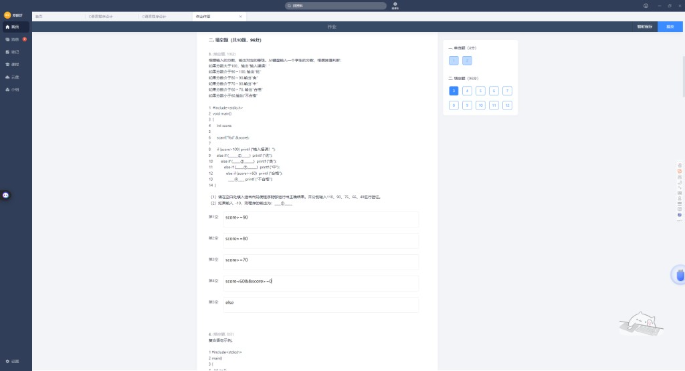

按分数输出：>100 错误；90~100 优；80~90 良；70~80 中；60~70 合格；<60 不合格。

```c
if (score > 100) printf("输入错误!");
else if (①) printf("优");
else if (②) printf("良");
else if (③) printf("中");
else if (score >= 60) printf("合格");
else if (④) printf("不合格");
```

| 空 | 参考答案 |
|----|----------|
| ① | `score >= 90` |
| ② | `score >= 80` |
| ③ | `score >= 70` |
| ④ | `score < 60`（或 `else` 直接跟不合格） |
| ⑤ 输入 -10 输出 | **不合格** |

### ⚠️ 注意

若 ④ 写成 `score<60 && score>=0`，则 **-10 没有任何分支匹配，无输出**。交作业建议 ④ 用 `score < 60`。

---

## 第 4 题

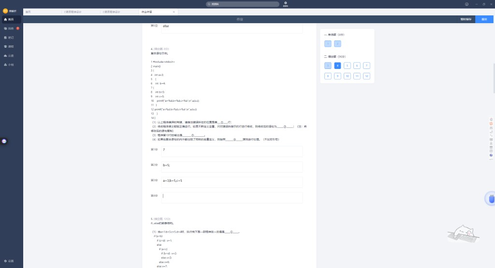
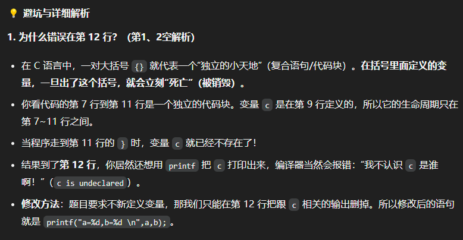

```c
int a=3;
{
  int b=4;
  {
    int b=5;
    int c=5;
    printf(...);  // 第10行
  }
  printf(...);    // 第12行 ← 用了 c，但 c 已"死亡"
}
```

| 空 | 你的答案 | 正确答案 |
|----|----------|----------|
| ① 错误行号 | 7 | **12**（c 在第 11 行 `}` 后超出作用域） |
| ② 修改第 12 行 | `b=5;` | **`printf("a=%d,b=%d\n",a,b);`**（去掉 c） |
| ③ 第 10 行输出 | `a=3,b=5,c=5` ✓ | **a=3,b=5,c=5** |
| ④ 同名变量原则 | （空） | **就近原则**（或：变量屏蔽原则） |

### 核心概念

`{}` 是独立小世界，里面定义的变量出了 `}` 就销毁。第 7~11 行的 `c` 活不到第 12 行。

---

## 第 5 题

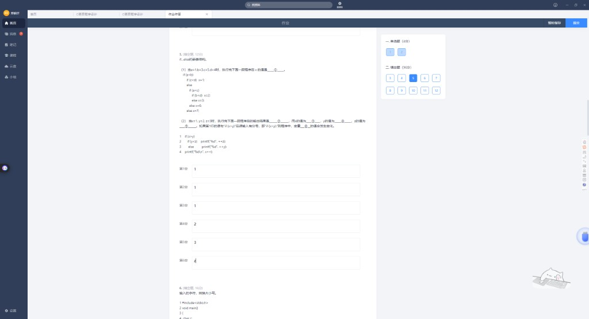

### (1) a=1,b=3,c=5,d=4 → x=?

| 你的答案 | 正确答案 |
|----------|----------|
| 1 | **2** |

```
a<b 真 → c<d(5<4) 假 → else if a<c(1<5) 真 → b<d(3<4) 真 → x=2
```

（与单选第 29 题、实验3 第 29 题相同）

### (2) x=1,y=2,z=3

```c
if (x < y)
  if (y < z) printf("%d", ++z);
  else printf("%d", ++y);
printf("%d\n", x++);
```

| 空 | 参考答案 |
|----|----------|
| ② 输出 | **41**（先打 4，再打 1 换行） |
| ③ x 的值 | **2**（打印时用 1，随后 x++） |
| ④ y 的值 | **2** |
| ⑤ z 的值 | **4** |
| ⑥ `if(x<y);` 误加分号，哪个变量会变 | **z**（内层 if 不再受外层控制，++z 会执行） |

---

## 第 6 题

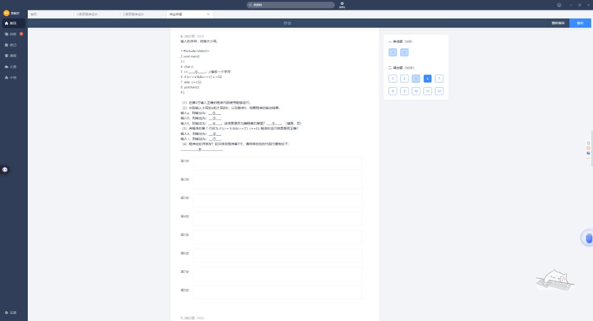


```c
c = ____①____;
if (c>='a'&&c<='z') c-=32;
else c+=32;
putchar(c);
```

| 空 | 参考答案 | 说明 |
|----|----------|------|
| ① | **`getchar()`** | 不是 `scanf`！见下方 |
| ② 输入 a | **A** | 小写 -32 |
| ③ 输入 R | **r** | 大写走 else，+32 |
| ④ 输入 0 | **P** | '0'=48，+32=80='P' |
| ⑤ 是编程者意图吗 | **否** | 数字不该被转换 |
| ⑥ 改第7行后输入 A | **a** | |
| ⑦ 改第7行后输入 r | **T** 或乱码 | 小写走 else +32，结果错误 |
| ⑧ 只改第 7 行 | **`else if (c>='A'&&c<='Z') c+=32;`** | 只处理字母 |

### ⚠️ 为什么不能用 `scanf`？

```c
c = scanf("%c", &c);  // scanf 返回值是 1，c 变成数字 1 而不是字符！
```

赋值号左边要的是**字符**，用 **`getchar()`** 专门读一个字符。

### 输入 '0' 为何输出 'P'？

'0' 的 ASCII 是 48，不是小写字母 → 走 `else` → 48+32=80 → 字符 **'P'**。

---

## 第 7 题

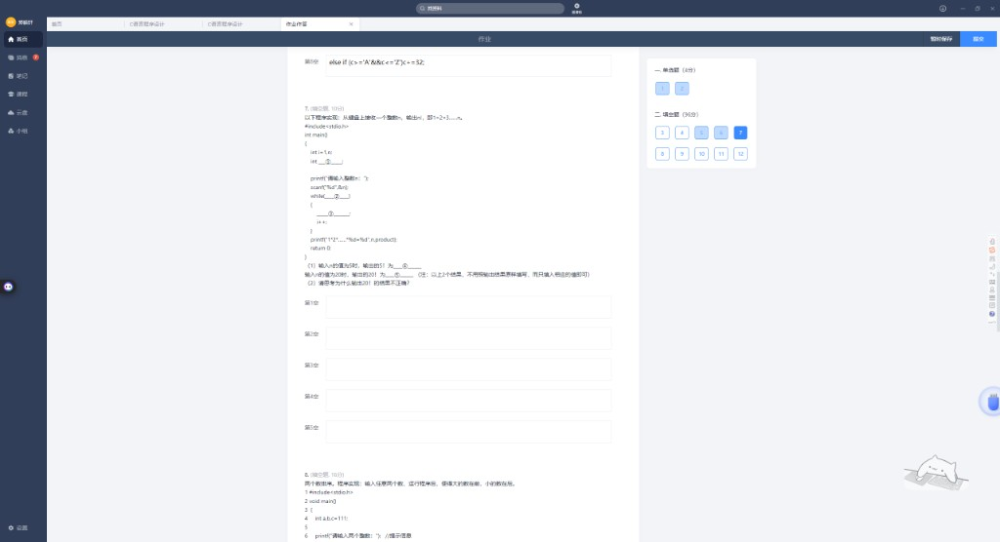

求 n! = 1×2×…×n

| 空 | 参考答案 |
|----|----------|
| ① 乘积变量 | **`product=1`**（前面需 `int product;`） |
| ② while 条件 | **`i <= n`** 或 `i<=n` |
| ③ 累乘 | **`product *= i`** 或 `product=product*i` |
| ④ n=5 时 5! | **120** |
| ⑤ n=20 时为何不对 | **int 溢出**（20! 远超 int 范围） |

---

## 第 8 题

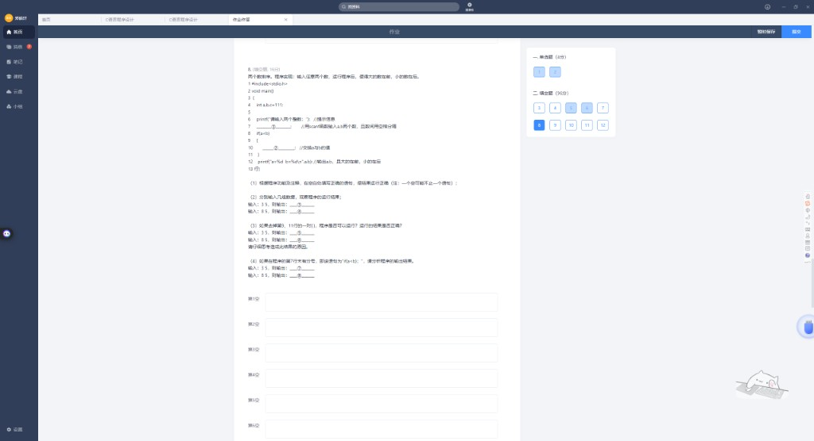

大数在前，小数在后。`int c=111` 用于交换。

| 空 | 参考答案 |
|----|----------|
| ① 输入 | **`scanf("%d %d",&a,&b);`** |
| ② 交换 | **`c=a; a=b; b=c;`** |
| ③ 输入 3 5 | **`a=5 b=3`** |
| ④ 输入 8 5 | **`a=8 b=5`** |

### 去掉第 9、11 行 `{}` 后

```c
if(a<b)
  c=a;    // 只有这句受 if 控制
a=b; b=c; // 永远执行
```

| 空 | 输入 3 5 | 输入 8 5 |
|----|----------|----------|
| ⑤ | **a=5 b=3** ✓ | **a=5 b=111** |
| ⑥ | | （a=b 变 5，b=c 还是 111） |

### `if(a<b);` 误加分号

if 体为空，交换**每次都执行**：

| 空 | 输入 3 5 | 输入 8 5 |
|----|----------|----------|
| ⑦ | **a=5 b=3** | **a=5 b=8** |

---

## 第 9 题

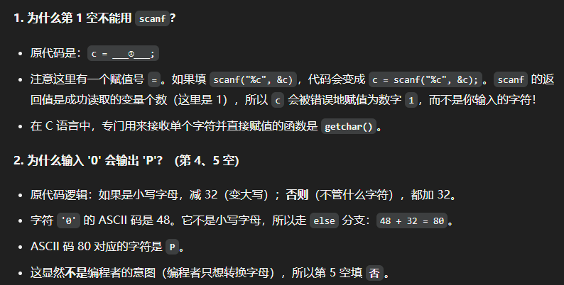

```c
scanf("%d%c", &a, &c);
```

| 空 | 参考答案 |
|----|----------|
| ① 输入 `5A`，输出 | **`a=5 c=A`**（或 `a=5,c=A`） |
| ② 想正确读 5 和 A | **`5A`** 可以；若遇换行问题用 **`5` 回车 `A`** |
| ③ 改为 `%d %c` 后正确输入 | **`5 A`**（中间必须有空格） |

### ⚠️ 避坑

`%d` 后直接 `%c` 会吃掉紧跟的数字后面的**第一个字符**（含换行），读字符时常要在格式串加空格：`%d %c`。

---

## 第 10 题

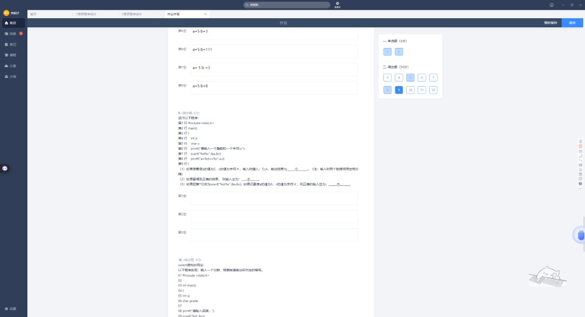

```c
scanf("%d", &g);
____①____;           // 把 0~100 转成十位数字
switch(g) {
    case 10:
    case 9: grade='A';   // 缺 break！
    ...
}
```

| 空 | 参考答案 |
|----|----------|
| ① 第 10 行 | **`g = g / 10`** 或 `g/=10` |
| ② 修改后第 14 行 | **`case 9: grade='A'; break;`** |

每个 `case` 后都要 **`break`**，否则穿透。

---

## 第 11 题

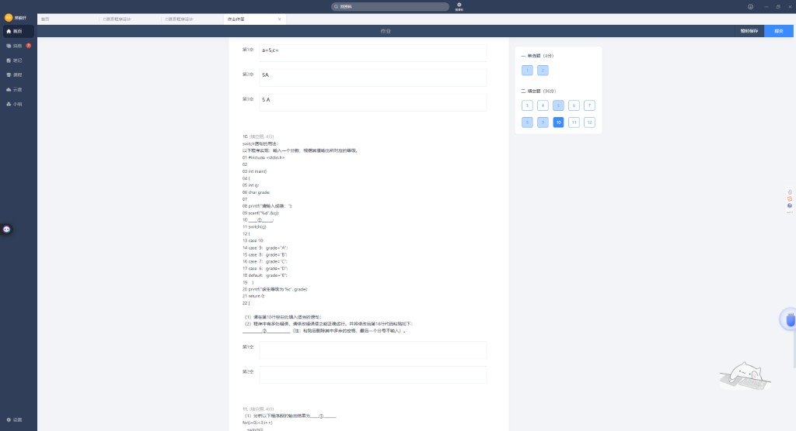

### (1) for + switch 无 break

```c
for(i=0; i<3; i++)
    switch(i) {
        case 0: printf("%d",i);
        case 2: printf("%d",i);
        default: printf("%d",i);
    }
```

| 答案 |
|------|
| **000122** |

（与单选第 15 题、第三批错题本相同）

### (2) X='A'

```c
switch(X) {
    case 'A': printf("A");
    case 'B': printf("B");
    default: printf("error");
}
```

| 答案 |
|------|
| **ABerror**（无 break，一路穿透） |

---

## 第 12 题

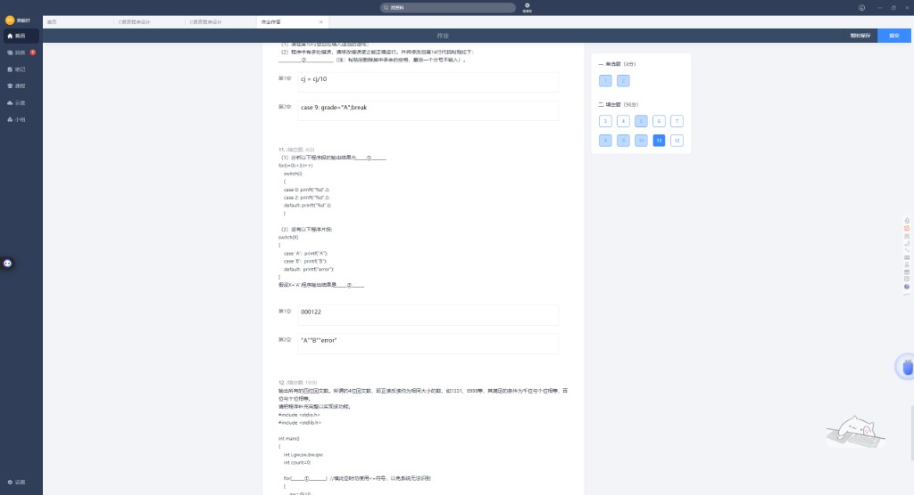

四位回文：千位=个位，百位=十位（如 1331、8998）。

```c
for (____①____)   // 勿用 <=
{
    gw = i % 10;
    sw = ____②____;
    bw = i % 1000 / 100;
    qw = i / 1000;
    if (____③____)
    {
        printf("%5d", i);
        ____④____;
    }
}
```

| 空 | 你的答案 | 参考答案 |
|----|----------|----------|
| ① for | `i=1;i<10000` | **`i=1000; i<10000; i++`** |
| ② 十位 | | **`i/10%10`** 或 `i%100/10` |
| ③ 回文条件 | | **`qw==gw && bw==sw`** |
| ④ 计数 | | **`count++`** |
| ⑤ 共有几个 | | **90** |

### ⑤ 验算

千位 a：1~9（9 种），百位 b：0~9（10 种）→ 形式 abba → **9×10=90** 个。

---

## 你的易错点汇总

| 题号 | 你的答案 | 应改为 |
|------|----------|--------|
| 4① | 错误行 7 | **12** |
| 4② | `b=5;` | **删 c 的 printf** |
| 5① | x=1 | **x=2** |
| 5② | 输出 1 | **41** |
| 6① | `scanf("%c",&c)` | **`getchar()`** |
| 12① | `i=1` 起步 | **`i=1000` 起步** |

---

## 速记卡片

| 知识点 | 一句话 |
|--------|--------|
| 复合语句 `{}` | 变量出了 `}` 就失效 |
| if 空语句 `if();` | 分号让 if 啥也不干 |
| getchar vs scanf | `c=scanf(...)` 会把 c 变成 1 |
| 非字母 +32 | '0'→'P'，只转换字母要加 else if |
| int 阶乘 | 20! 会溢出 |
| if 无 `{}` | 只控制一条语句 |
| scanf %d%c | 字符会吃掉紧跟的字符 |
| switch | 别忘了 break |
| 四位回文 | 1000~9999，千=个，百=十，共 90 个 |

---

## 附录：截图索引

| 文件 | 内容 |
|------|------|
| `01_题目1-2.png` | 单选题 1~2 |
| `02~17` | 填空题 3~12 及解析 |

---

*相关：单选 29 题见 `错题本_第三批.md`；switch 穿透见 `错题本_第二批.md` 第 15 题。*
