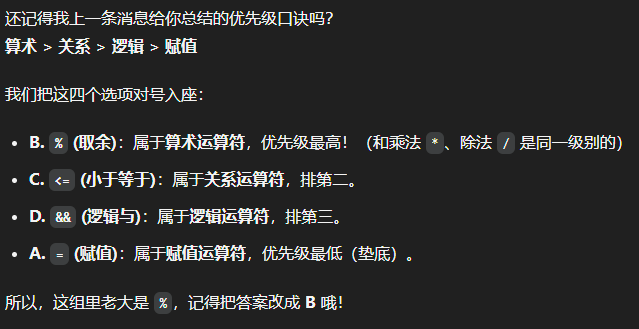
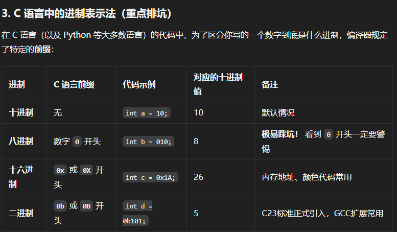
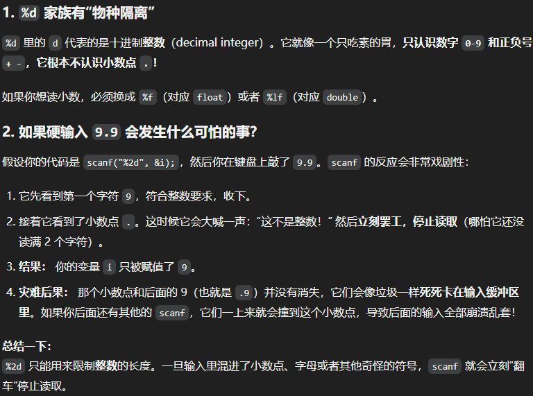
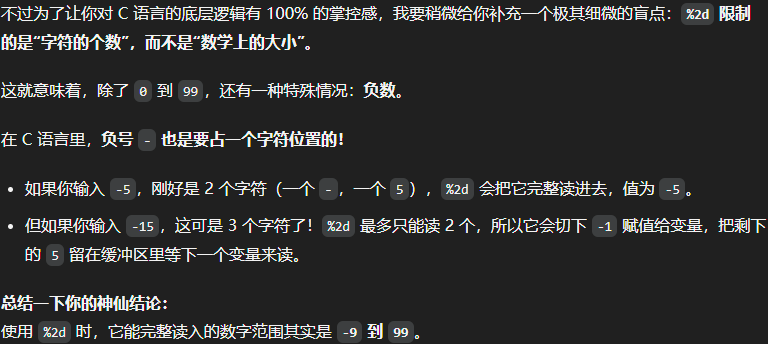
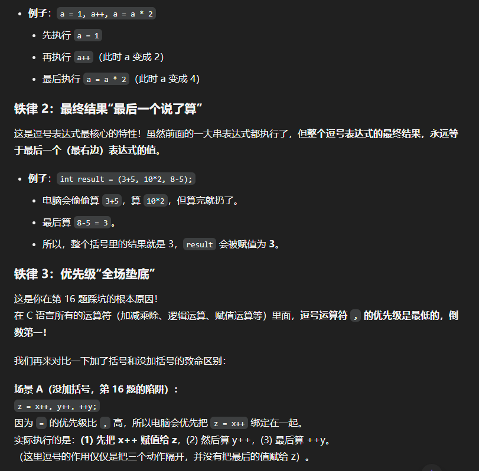
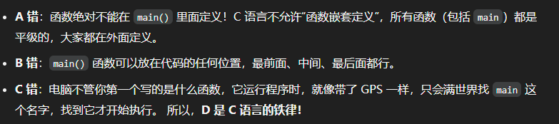
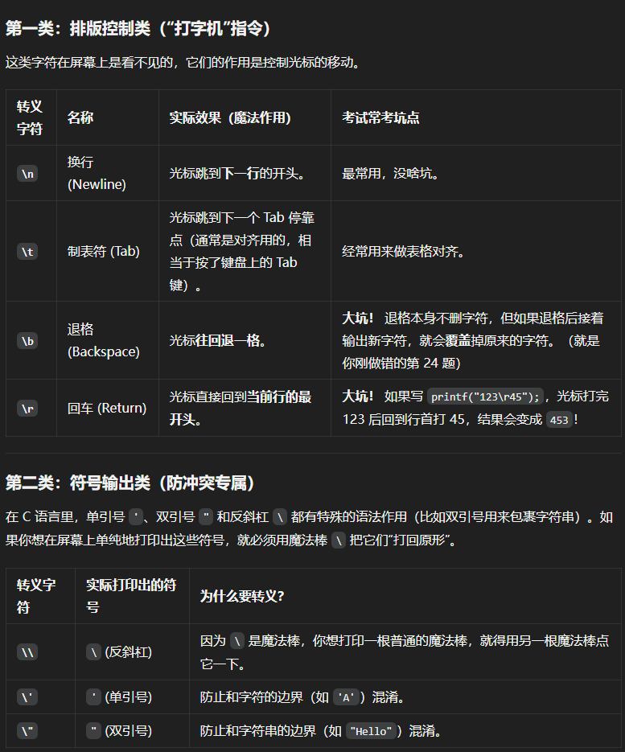
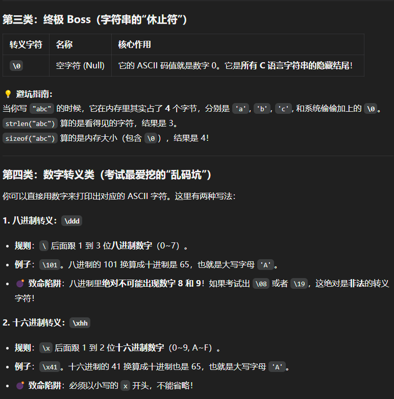
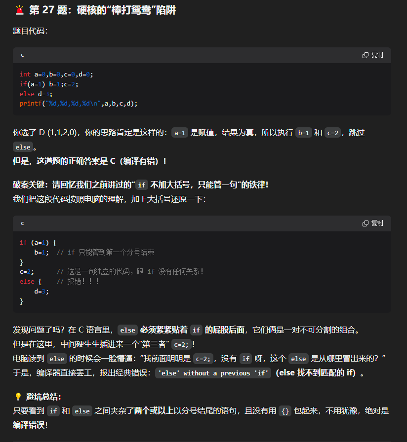
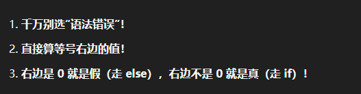

# C 语言错题本 · 第一批

> 整理日期：2026-06-14  
> 内容来源：期末复习错题截图

---

## 目录

1. [运算符优先级](#1-运算符优先级)
2. [整数除法](#2-整数除法)
3. [进制表示](#3-进制表示)
4. [scanf 输入格式](#4-scanf-输入格式)
5. [逗号运算符](#5-逗号运算符)
6. [函数定义规则](#6-函数定义规则)
7. [转义字符](#7-转义字符)
8. [if-else 语法陷阱](#8-if-else-语法陷阱)
9. [if 条件中的赋值](#9-if-条件中的赋值)

---

## 1. 运算符优先级



### 口诀

**算术 > 关系 > 逻辑 > 赋值**

### 选项分析示例

| 运算符 | 类型 | 优先级 |
|--------|------|--------|
| `%` | 算术运算符 | 最高 |
| `<=` | 关系运算符 | 第二 |
| `&&` | 逻辑运算符 | 第三 |
| `=` | 赋值运算符 | 最低（垫底） |

**结论**：`%` 与 `*`、`/` 同级，在这组选项中优先级最高 → 选 **B**。

---

## 2. 整数除法


### ⚠️ 避坑指南

C 语言中：**整数 ÷ 整数 = 整数**，小数部分直接截断，**不四舍五入**。

```c
5 / 2   // 结果是 2，不是 2.5！
```

### 常见错误

- 心算时把 `5/2` 当成 `2.5` 继续计算
- 加减法手滑

**牢记**：只要两边都是整数，结果一定是整数。

---

## 3. 进制表示



### C 语言中各进制的写法

| 进制 | 前缀 | 代码示例 | 十进制值 | 备注 |
|------|------|----------|----------|------|
| 十进制 | 无 | `int a = 10;` | 10 | 默认情况 |
| 八进制 | 数字 `0` 开头 | `int b = 010;` | **8** | ⚠️ 极易踩坑！看到前导 0 要警惕 |
| 十六进制 | `0x` 或 `0X` | `int c = 0x1A;` | 26 | 常用于内存地址、颜色值 |
| 二进制 | `0b` 或 `0B` | `int d = 0b101;` | 5 | C23 标准正式支持，GCC 扩展常用 |

### ⚠️ 避坑指南

- `010` 不是十进制的 10，而是八进制的 8
- 二进制字面量在较新编译器中才支持

---

## 4. scanf 输入格式



### 4.1 `%d` 的"物种隔离"

- `%d` 中的 `d` = **decimal integer**（十进制整数）
- 只认 `0-9` 和 `+`、`-`，**不认小数点 `.`**
- 读小数要用 `%f`（float）或 `%lf`（double）

### 4.2 硬输入 `9.9` 时会发生什么？

代码：`scanf("%2d", &i);`，键盘输入 `9.9`

| 步骤 | 发生了什么 |
|------|------------|
| 1 | 读到 `9`，合法，收下 |
| 2 | 遇到 `.`，立即停止（即使 `%2d` 允许读 2 位） |
| 3 | `i = 9` |
| 4 | **灾难**：`.9` 留在输入缓冲区，后续 `scanf` 会读到它，程序乱套 |

**总结**：`%2d` 限制最多读 2 位整数；遇到小数点、字母等"奇怪符号"会立刻"罢工"。

### 4.3 `%2d` 限制的是字符数，不是数值大小



- 负号 `-` 也占 **1 个字符位**

| 输入 | 字符数 | `%2d` 读取结果 | 剩余在缓冲区 |
|------|--------|----------------|--------------|
| `-5` | 2（`-` 和 `5`） | `-5` | 无 |
| `-15` | 3（`-`、`1`、`5`） | `-1` | `5` 留在缓冲区 |

**结论**：`%2d` 能完整读入的范围是 **-9 到 99**。

---

## 5. 逗号运算符



### 铁律 1：从左到右依次执行

```c
a = 1, a++, a = a * 2;
// 执行顺序：a=1 → a++(a变2) → a=a*2(a变4)
```

### 铁律 2：最终结果是"最后一个说了算"

```c
int result = (3+5, 10*2, 8-5);
// 3+5 和 10*2 算了但丢弃，最终 result = 8-5 = 3
```

### 铁律 3：优先级全场最低

逗号运算符优先级比赋值、逻辑、算术都低。

#### 场景 A：没加括号的陷阱

```c
z = x++, y++, ++y;
```

因为 `=` 优先级高于 `,`，实际等价于：

```c
(z = x++), (y++), (++y);
// z 拿到的是 x++ 的值，不是 ++y 的值！
```

#### 场景 B：加了括号

```c
z = (x++, y++, ++y);
// z 拿到的是 ++y 的值
```

---

## 6. 函数定义规则



### A 错：函数不能在 `main()` 里面定义

C 语言**不允许函数嵌套定义**。所有函数（包括 `main`）都是平级的，都在外面定义。

### B 错：`main()` 可以放在代码任何位置

最前面、中间、最后面都行，位置不影响功能。

### C 错：程序入口永远是 `main`

电脑不管你第一个写的是什么函数，运行时只会找 `main` 这个名字，找到才开始执行。

### D 正确：C 语言的铁律

程序从 `main` 函数开始执行。

---

## 7. 转义字符



### 第一类：排版控制类（"打字机"指令）

屏幕上不可见，控制光标移动。

| 转义字符 | 名称 | 实际效果 | 考试易错点 |
|----------|------|----------|------------|
| `\n` | 换行 | 光标跳到下一行开头 | 最常用，无大坑 |
| `\t` | 制表符 | 光标跳到下一个 Tab 位，用于对齐 | 常用来对齐表格 |
| `\b` | 退格 | 光标后退一格 | ⚠️ 退格本身不删字符，但后面输出新字符会覆盖原字符 |
| `\r` | 回车 | 光标回到**当前行最开头** | ⚠️ `printf("123\r45")` → 先打 123，光标回到行首，再打 45 覆盖 12，最终显示 **453** |

### 第二类：符号输出类（防冲突）

用 `\` 这根"魔杖"把特殊符号还原成普通符号。

| 转义字符 | 实际打印 | 为什么要转义 |
|----------|----------|--------------|
| `\\` | `\` | `\` 是魔杖，要打印普通反斜杠需再敲一下 |
| `\'` | `'` | 防止和字符常量边界混淆（如 `'A'`） |
| `\"` | `"` | 防止和字符串边界混淆（如 `"Hello"`） |

### 第三类：终极 Boss（字符串的"休止符"）

| 转义字符 | 名称 | 核心作用 |
|----------|------|----------|
| `\0` | 空字符 | ASCII 值为 0，C 字符串的隐藏结束标记 |

#### ⚠️ 避坑指南

```c
"abc"           // 占 4 字节：'a' 'b' 'c' '\0'
strlen("abc")   // 返回 3（只数可见字符）
sizeof("abc")   // 返回 4（含 '\0' 的总内存）
```

### 第四类：数字转义（考试高频坑）



#### 八进制转义 `\ddd`

- 规则：`\` 后跟 **1~3 位八进制数**（0~7）
- 示例：`\101` → 八进制 101 = 十进制 65 = 字符 `'A'`
- ⚠️ **致命陷阱**：八进制不能含 8 和 9，`\08`、`\19` 是**非法**转义字符

#### 十六进制转义 `\xhh`

- 规则：`\x` 后跟 **1~2 位十六进制数**（0~9, A~F）
- 示例：`\x41` → 十六进制 41 = 十进制 65 = 字符 `'A'`
- ⚠️ **致命陷阱**：必须以小写 `x` 开头，不能省略也不能大写

---

## 8. if-else 语法陷阱



### 题目 27：硬核"拆散情侣"陷阱

```c
int a=0, b=0, c=0, d=0;
if(a=1) b=1; c=2;
else d=3;
printf("%d,%d,%d,%d\n", a, b, c, d);
```

### 你以为的输出

`a=1` 为真 → `b=1` 和 `c=2` 都执行 → 输出 `1,1,2,0`

### 正确答案

**编译错误！**

### 破案关键

`if` 没有花括号 `{}` 时，**只能控制紧跟其后的那一个语句**（到第一个分号为止）。

编译器实际看到的结构：

```c
if (a=1) {
    b=1;    // if 只控制到这里
}
c=2;        // 独立语句，和 if 无关
else {      // 错误！！！
    d=3;
}
```

`else` 必须紧跟在 `if` 控制的语句之后。中间夹了 `c=2;`，`else` 找不到匹配的 `if`，报错：

> **`'else' without a previous 'if'`**（else 找不到匹配的 if）

### ⚠️ 避坑总结

只要看到 `if` 和 `else` 之间有两条以上语句（两个分号），且没用 `{}` 包裹 → **一定是编译错误**。

---

## 9. if 条件中的赋值



### 三句口诀（应对 `if(a=0)` 类题目）

1. **千万别选"语法错误"** — `if(a=0)` 语法完全合法
2. **直接算等号右边的值** — `if(a=5)` 整个表达式的值就是 `5`
3. **右边是 0 就是假（走 else），不是 0 就是真（走 if）**

### 示例

```c
if (a = 0)   // a 被赋值为 0，条件为假 → 走 else
if (a = 5)   // a 被赋值为 5，条件为真 → 走 if
```

### ⚠️ 避坑指南

- `=` 是赋值，`==` 才是比较，但 `if(a=5)` 不是语法错误
- 条件判断看的是**赋值后右边的值**，不是比较结果

---

## 速记卡片

| 知识点 | 一句话记住 |
|--------|------------|
| 运算符优先级 | 算术 > 关系 > 逻辑 > 赋值 |
| 整数除法 | 整数÷整数=整数，截断不四舍五入 |
| 八进制 | `010` = 8，不是 10 |
| scanf %d | 不认小数点，剩余字符留缓冲区 |
| %2d | 限字符数，负号占一位，范围 -9~99 |
| 逗号运算符 | 从左执行，结果为最后一个，优先级最低 |
| 函数定义 | 不能嵌套，main 位置随意，入口永远是 main |
| `\r` | 回车到行首，`"123\r45"` → `453` |
| `\0` | 字符串结束符，sizeof 比 strlen 多 1 |
| if 无花括号 | 只控制一条语句，else 中间不能夹语句 |
| if(a=0) | 不是语法错误，看右边值是否为 0 |

---

## 附录：原始截图索引

所有图片保存在 `images/第一批/` 目录下：

| 文件名 | 对应知识点 |
|--------|------------|
| `01_运算符优先级.png` | 算术 > 关系 > 逻辑 > 赋值 |
| `02_整数除法.png` | 5/2=2，整数除法截断 |
| `03_进制表示.png` | 十/八/十六/二进制写法 |
| `04_scanf%d输入.png` | %d 物种隔离、输入 9.9 的灾难 |
| `05_scanf%2d宽度.png` | %2d 限字符数，范围 -9~99 |
| `06_逗号运算符.png` | 逗号运算符三条铁律 |
| `07_函数定义规则.png` | 不能嵌套、main 位置、入口 |
| `08_转义字符_排版与符号.png` | \n \t \b \r 及符号转义 |
| `09_转义字符_空字符与数字转义.png` | \0、\ddd、\xhh |
| `10_if-else无花括号陷阱.png` | else without previous if |
| `11_if条件赋值口诀.png` | if(a=0) 三句口诀 |
| `12_if-else陷阱_重复.png` | （与 10 重复） |
| `13_if赋值口诀_重复.png` | （与 11 重复） |

---

*下一批照片发来后，会继续追加到本错题本，图片存入 `images/第二批/`。*
