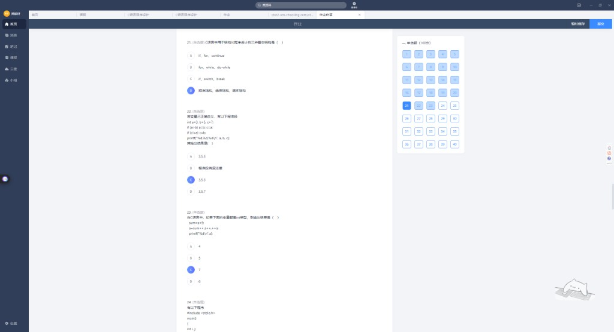
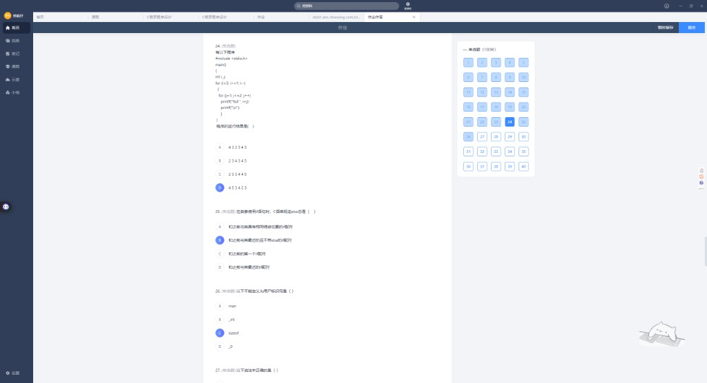
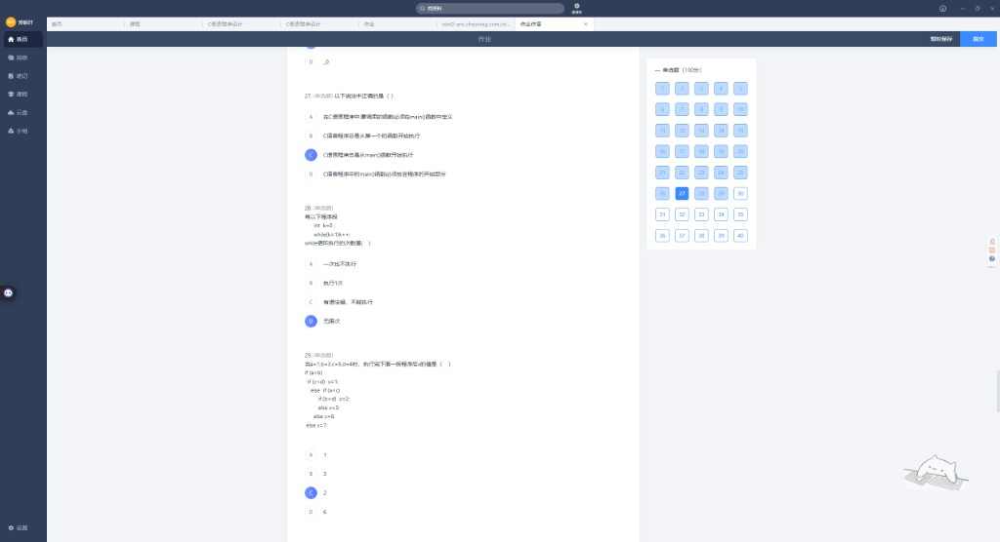
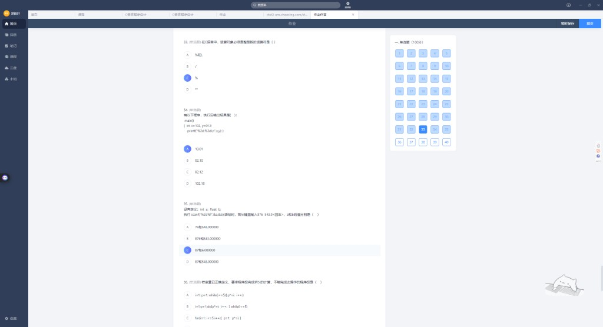
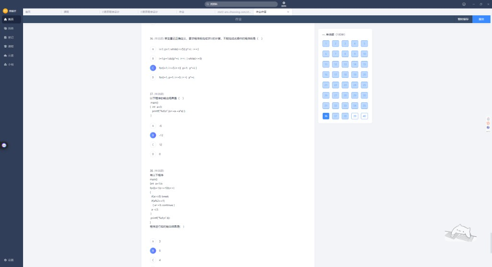
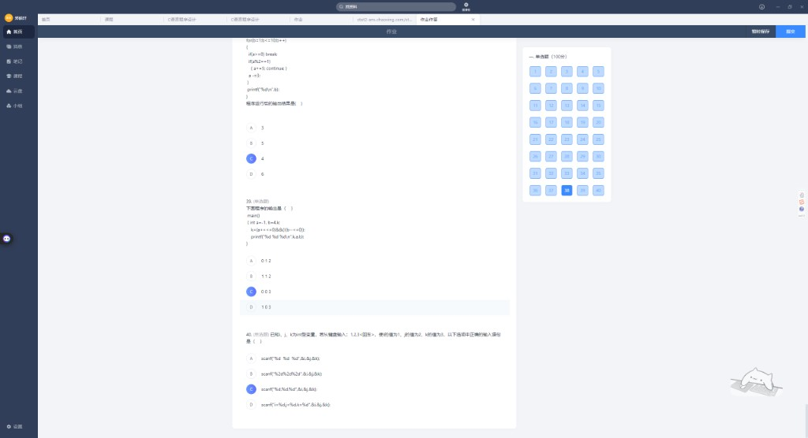
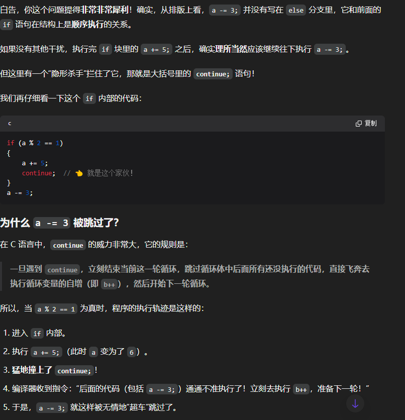
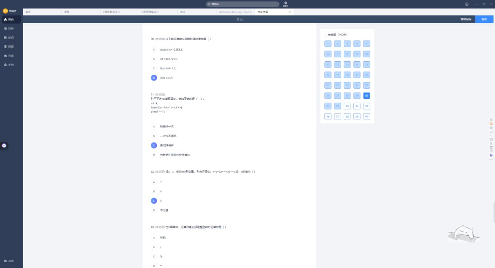

# C 语言错题本 · 第三批（作业单选题 22~40）

> 整理日期：2026-06-14  
> 来源：超星作业截图（含部分重复卷/补充题）

---

## 目录

- [第 22~24 题](#第-22-24-题)
- [第 25~27 题](#第-25-27-题)
- [第 28~29 题](#第-28-29-题)
- [第 34~36 题](#第-34-36-题)
- [第 37~40 题](#第-37-40-题)
- [补充题（另一套卷 20~23）](#补充题另一套卷-20-23)
- [速记卡片](#速记卡片)

---

## 第 22~24 题




### 第 22 题

```c
int a=3, b=5, c=7;
if (a>b) a=b; c=a;
if (c>a) c=b;
printf("%d,%d,%d\n", a, b, c);
```

| 你的答案 | 正确答案 |
|----------|----------|
| C 3,5,3 ✓ | **C. 3,5,3** |

**逐步执行**：

```
if(a>b) a=b;   → 3>5 假，跳过
c=a;           → c=3（独立语句，不在 if 里）
if(c>a) c=b;   → 3>3 假，跳过
输出：3, 5, 3
```

### 第 23 题

```c
sum = a = 5;
a = sum++, a++, ++a;
printf("%d\n", a);
```

| 你的答案 | 正确答案 |
|----------|----------|
| C 7 ✓ | **C. 7** |

**逗号表达式**（从左到右，结果为最后一个）：

```
sum++  → sum 变 6，表达式值 5
a++    → a 变 6，表达式值 5
++a    → a 变 7，表达式值 7  ← 最终 a=7
```

### 第 24 题 · 嵌套 for

```c
for (i=3; i>=1; i--)
{
    for (j=1; j<=2; j++)
        printf("%d", i+j);
    printf("\n");
}
```

| 你的答案 | 正确答案 |
|----------|----------|
| D 453423 ✓ | **D. 453423** |

| i | j=1 | j=2 | 本行 |
|---|-----|-----|------|
| 3 | 4 | 5 | 45 |
| 2 | 3 | 4 | 34 |
| 1 | 2 | 3 | 23 |

拼接（忽略换行显示）：**453423**

---

## 第 25~27 题

### 第 25 题 · else 配对规则

**题目**：嵌套 `if` 时，`else` 总是（ ）

| 你的答案 | 正确答案 |
|----------|----------|
| B 和最近且不带 else 的 if 配对 ✓ | **B** |

**铁律**：`else` 与**前面最近的、还没有 else 的 if** 配对（看结构，不看缩进）。

### 第 26 题 · 用户标识符

**题目**：不能作为用户标识符的是（ ）

| 你的答案 | 正确答案 |
|----------|----------|
| C sizeof ✓ | **C. sizeof**（关键字） |

合法：`_int`、`_0`、`man`；非法：`sizeof`（关键字）。

### 第 27 题 · main 函数



| 你的答案 | 正确答案 |
|----------|----------|
| C 从 main 开始执行 ✓ | **C** |

---

## 第 28~29 题

### 第 28 题 · while 赋值陷阱

```c
int k=0;
while(k=1) k++;
```

| 你的答案 | 正确答案 |
|----------|----------|
| D 无限次 ✓ | **D. 无限次** |

**解析**：`k=1` 是赋值不是比较，条件永远为真（1）→ **死循环**。

### 第 29 题 · 嵌套 if-else

```c
if (a<b)
    if (c<d) x=1;
    else if (a<c)
        if (b<d) x=2;
        else x=3;
    else x=6;
else x=7;
```

已知 `a=1, b=3, c=5, d=4`

| 你的答案 | 正确答案 |
|----------|----------|
| C 2 ✓ | **C. 2** |

**结构树**（else 配对）：

```
if(a<b)          → 1<3 真
  if(c<d)        → 5<4 假
  else if(a<c)   → 1<5 真
    if(b<d)      → 3<4 真 → x=2
```

---

## 第 34~36 题



### 第 33/34 题 · % 运算符（与另一套卷第 23 题相同）

**题目**：运算对象**必须是整型**的运算符是（ ）

| 正确答案 |
|----------|
| **C. %**（取模；`/ ` 可用于浮点） |

### 第 34 题 · printf %2d 与八进制

```c
int x=102, y=012;
printf("%2d,%2d\n", x, y);
```

| 你的答案 | 正确答案 |
|----------|----------|
| A 10,01 | **D. 102,10** |

**解析**：

- `012` 是八进制 → **十进制 10**
- `printf` 的 `%2d`：**最小**宽度 2，不是最多 2 位！
  - `102` 输出 `102`（不会截成 10）
  - `10` 输出 `10`

### ⚠️ 避坑指南

`scanf` 的 `%2d` 限**最多读 2 个字符**；`printf` 的 `%2d` 是**最少占 2 格**，两者完全不同！

### 第 35 题 · scanf %2d%f

```c
int a; float b;
scanf("%2d%f", &a, &b);
// 键盘输入：876 543.0
```

| 你的答案 | 正确答案 |
|----------|----------|
| C 87 和 6.0 ✓ | **C. 87 和 6.000000** |

```
%2d 读 '8''7'  → a=87，剩余 "6 543.0"
%f  从 '6' 读  → b=6.0（遇空格停止）
```

### 第 36 题 · 求 5! 哪个不能完成

| 你的答案 | 正确答案 |
|----------|----------|
| C ✓ | **C** |

```c
// C 错：每轮都把 p 重置为 1，永远算不出 5!
for(i=1; i<=5; i++) { p=1; p*=i; }
```

---

## 第 37~40 题




### 第 37 题 · 赋值运算从右向左

```c
int a=3;
printf("%d\n", (a+=a-=a*a));
```

| 你的答案 | 正确答案 |
|----------|----------|
| B -12 ✓ | **B. -12** |

**从右向左**（赋值运算符）：

```
① a-=a*a  → a=3, 3*3=9, a=3-9=-6
② a+=(-6) → a=-6+(-6)=-12
```

### 第 38 题 · break 与 continue

**注意**：截图中有两个版本，条件不同！

#### 版本 A：`if(a>=5) break`（你曾选 B=2）

```c
int a=1, b;
for(b=1; b<=10; b++)
{
    if(a>=5) break;
    if(a%2==1) { a+=5; continue; }
    a-=3;
}
printf("%d\n", b);
```

| b | a 变化 | 结果 |
|---|--------|------|
| 1 | a=1 奇数 → a=6, continue | |
| 2 | a=6 ≥5 → **break** | 输出 **2** |

#### 版本 B：`if(a>=8) break`（正确答案 C=4）

| b | a 变化 | 结果 |
|---|--------|------|
| 1 | a=1 → a=6, continue | |
| 2 | a=6 偶数分支 → a=3 | |
| 3 | a=3 → a=8, continue | |
| 4 | a=8 ≥8 → **break** | 输出 **4** |

| 版本 | 正确答案 |
|------|----------|
| `a>=5` | **B. 2** |
| `a>=8` | **C. 4** |

#### 深度解析：为什么 `a -= 3` 会被跳过？



表面上看，`a -= 3` 写在 `if` 后面、又不在 `else` 里，应该顺序执行。但第 38 题的关键是 **`continue`**：

```c
if (a % 2 == 1)
{
    a += 5;
    continue;   // 👈 隐藏的"杀手"
}
a -= 3;         // 本轮循环里可能永远执行不到
```

**`continue` 的铁律**：一旦遇到，**立刻结束本轮循环**，后面未执行的代码全部跳过，直接跳到循环变量的自增（如 `b++`），开始下一轮。

**当 `a % 2 == 1` 为真时，5 步流程**：

1. 进入 `if` 块
2. 执行 `a += 5`（例如 a 从 1 变成 6）
3. 遇到 `continue`
4. 编译器：本轮剩余代码（含 `a -= 3`）**一律不许执行**，直接去 `b++`
5. `a -= 3` 被无情跳过

### ⚠️ 避坑指南

| 语句 | 作用 |
|------|------|
| `break` | 跳出**整个循环** |
| `continue` | 跳过**本轮剩余代码**，进入下一轮 |

版本 B 中 b=2 时 a=6 会走 `a -= 3`（因为 6 是偶数，不进 `if(a%2==1)` 分支），这正是 `continue` 和顺序执行的差别。

### 第 39 题 · 逻辑运算与自增

```c
int a=-1, b=4, k;
k = (a++<=0) && (!(b--<=0));
printf("%d %d %d\n", a, b, k);
```

| 正确答案 |
|----------|
| **B. 0 3 1** |

```
a++<=0  → 用 -1，-1<=0 真，a 变 0
&& 左边真，继续算右边：
!(b--<=0) → 用 b=4，4<=0 假，!假=真，b 变 3
k=1
输出：0 3 1
```

### 第 40 题 · scanf 格式匹配

**题目**：键盘输入 `1,2,3<回车>`，使 i=1, j=2, k=3

| 你的答案 | 正确答案 |
|----------|----------|
| C `scanf("%d,%d,%d",...)` ✓ | **C** |

**格式字符串必须与输入完全一致**：输入有逗号，格式串也要有逗号。

---

## 补充题（另一套卷 20~23）



### 第 20 题 · 正确定义并赋初值

| 正确答案 |
|----------|
| **D. `char c=32;`** |

| 选项 | 为何错 |
|------|--------|
| A `12.3E2.5` | 指数必须是整数 |
| B `int n1=n2=10` | 声明时不能链式赋值 |
| C `float f=f+1.1` | 不能用自身初始化 |

### 第 21 题 · for 死循环

```c
for(i=0, k=-1; k=1; i++, k++)
    printf("***");
```

| 正确答案 |
|----------|
| **C. 是死循环**（条件 `k=1` 永远为真） |

### 第 22 题 · || 短路

```c
x=y=3;
t=++x||++y;
```

| 你的答案 | 正确答案 |
|----------|----------|
| C 3 ✓ | **C. 3** |

`++x` 使 x=4（非 0 为真），`||` **短路**，`++y` 不执行，y 仍为 3。

---

## 速记卡片

| 题号 | 一句话 |
|------|--------|
| 22 | 无 `{}` 的 if 只控一条；`c=a` 常是独立语句 |
| 23 | 逗号表达式：最后一个说了算 |
| 24 | 嵌套 for 先内后外，逐行拼接 |
| 25 | else 找最近且无 else 的 if |
| 28 | `while(k=1)` 赋值永真 → 死循环 |
| 29 | 画 else 配对树，别被缩进骗 |
| 34 | `printf %2d` 最小宽度 ≠ `scanf %2d` 最多字符 |
| 35 | `%2d` 后 `%f` 注意剩余字符怎么读 |
| 36 | 循环里别每轮 `p=1` 重置累乘 |
| 37 | `a+=a-=a*a` 赋值从右向左 |
| 38 | break 跳出循环；continue 跳过本轮剩余代码 |
| 39 | `&&`/`||` 短路 + 自增先用后变 |
| 40 | scanf 格式串要和键盘输入逐字匹配 |

---

## 附录：原始截图索引

| 文件名 | 内容 |
|--------|------|
| `01_作业题21-24.png` | 第 21~24 题 |
| `02_作业题24-27.png` | 第 24~27 题 |
| `03_作业题27-29.png` | 第 27~29 题 |
| `04_作业题27-29_重复.png` | 第 27~29 题（重复） |
| `05_作业题20-23_另一套.png` | 补充卷 20~23 题 |
| `06_作业题33-36.png` | 第 33~36 题 |
| `07_作业题36-38.png` | 第 36~38 题 |
| `08_作业题36-38_重复.png` | 第 36~38 题（重复） |
| `09_作业题38-40.png` | 第 38~40 题 |
| `10_continue跳过循环体.png` | 第 38 题 continue 深度解析 |

---

## 全卷 1~40 完成情况

| 批次 | 题号 | 文件 |
|------|------|------|
| 第二批 | 1~21 | `错题本_第二批.md` |
| 第三批 | 22~40 | 本文件 |

**建议重点复习的错题**（本批）：

- **第 34 题**：你选了 A，正确是 D（`printf %2d` 不截断）
- 其余本批你选的答案基本正确 ✓

---

*基础知识点见 `错题本_第一批.md`。*
