# C 语言错题本 · 第二批（作业单选题 1~21）

> 整理日期：2026-06-14  
> 来源：超星作业截图 + 解析笔记

---

## 目录

### 作业题目
- [第 1 题 · if-else 无花括号](#第-1-题)
- [第 2 题 · do-while 死循环](#第-2-题)
- [第 3 题 · if 嵌套跳过](#第-3-题)
- [第 4 题 · switch 穿透 + for 循环](#第-4-题)
- [第 5~7 题 · 概念与逻辑](#第-5-7-题)
- [第 6 题 · 转义字符综合](#第-6-题)
- [第 8 题 · 大小写互换（魔法 32）](#第-8-题)
- [第 9 题 · 混合运算](#第-9-题)
- [第 10 题 · if 只控制一条语句](#第-10-题)
- [第 14 题 · 连环比较](#第-14-题)
- [第 15 题 · switch 穿透 + for 顺序](#第-15-题)
- [第 16 题 · 逻辑与短路](#第-16-题)
- [第 17~18 题 · printf 与 for](#第-17-18-题)
- [第 19~21 题 · 自增与逗号、三种结构](#第-19-21-题)

### 知识点专题
- [while vs do-while](#专题-while-vs-do-while)
- [for 循环四步规则](#专题-for-循环四步规则)
- [从右向左的运算符](#专题-从右向左的运算符)

---

## 第 1 题

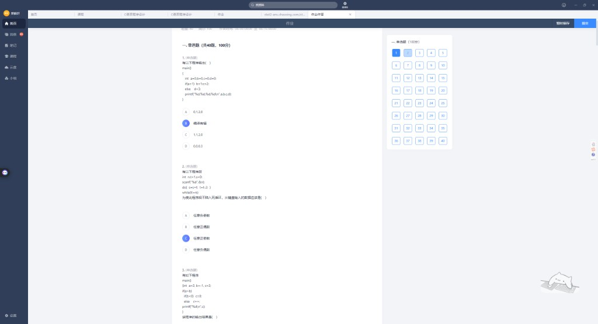

**题目**：以下程序输出（ ）

```c
main()
{
    int a=0, b=0, c=0, d=0;
    if(a=1) b=1; c=2;
    else d=3;
    printf("%d, %d, %d, %d\n", a, b, c, d);
}
```

| 你的答案 | 正确答案 |
|----------|----------|
| B 编译有错 ✓ | **B 编译有错** |

**错因**：`if` 无 `{}` 只控制 `b=1;`，`c=2;` 夹在中间导致 `else` 找不到 `if`。

（详见第一批错题本第 8 章）

---

## 第 2 题

**题目**：为使程序不陷入死循环，键盘输入的数据应当是（ ）

```c
int n, t=1, s=0;
scanf("%d", &n);
do {
    s = s + t;
    t = t - 2;
} while(t != n);
```

| 你的答案 | 正确答案 |
|----------|----------|
| C 任意正奇数 | **A 任意负奇数** |

**解析**：

- `do-while` 先执行一次，`t` 的变化序列：`1 → -1 → -3 → -5 → …`
- 循环在 `while(t != n)` 为假时结束，即 `n` 必须等于某次执行后的 `t`
- `t` 只会变成 **-1、-3、-5…**（负奇数）
- 若输入正奇数（如 3），`t` 永远不等于 3 → **死循环**

### ⚠️ 避坑指南

正奇数 1 也不行：第一次 `do` 后 `t` 就变成 -1，再也回不到 1。

---

## 第 3 题

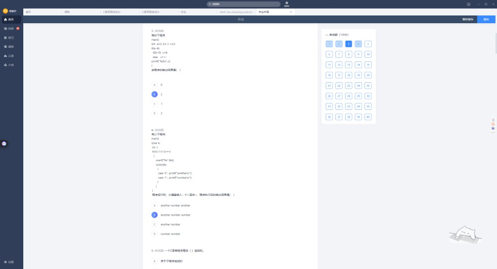

**题目**：

```c
main()
{
    int a=2, b=-1, c=2;
    if(a<b)
        if(b<0) c=0;
        else c++;
    printf("%d\n", c);
}
```

| 正确答案 |
|----------|
| **B. 2** |

**解析**：

- `a<b` → `2 < -1` 为假，整个 `if` 块跳过
- `c` 保持初值 **2**

### ⚠️ 避坑指南

`else` 只和**最近的** `if` 配对。这里 `else c++` 属于内层 `if(b<0)`，不是外层 `if(a<b)`。

---

## 第 4 题

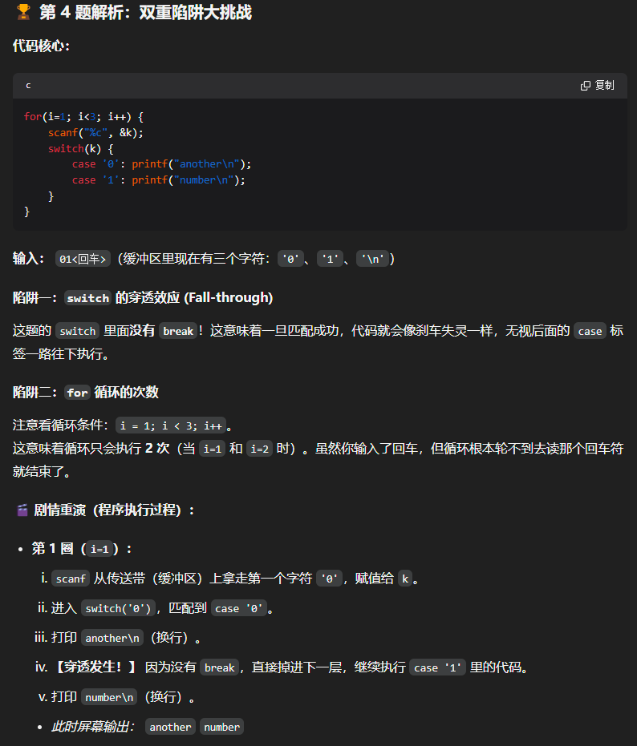
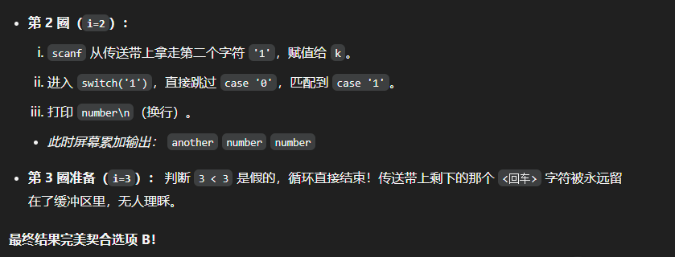

**题目**：输入 `01<回车>`，输出（ ）

```c
main()
{
    char k;
    int i;
    for(i=1; i<3; i++)
    {
        scanf("%c", &k);
        switch(k)
        {
            case '0': printf("another\n");
            case '1': printf("number\n");
        }
    }
}
```

| 正确答案 |
|----------|
| **B. another number number** |

**双重陷阱**：

1. **switch 穿透**：没有 `break`，匹配后一路"滑下去"
2. **for 只跑 2 圈**：`i=1,2`，缓冲区有 `'0''1''\n'` 三个字符，但只读前两个

**执行过程**：

| 圈次 | 读到 | 输出 |
|------|------|------|
| i=1 | `'0'` | `another` + 穿透 → `number` |
| i=2 | `'1'` | `number` |
| i=3 | 不满足 `i<3` | 结束，`'\n'` 留在缓冲区 |

---

## 第 5~7 题

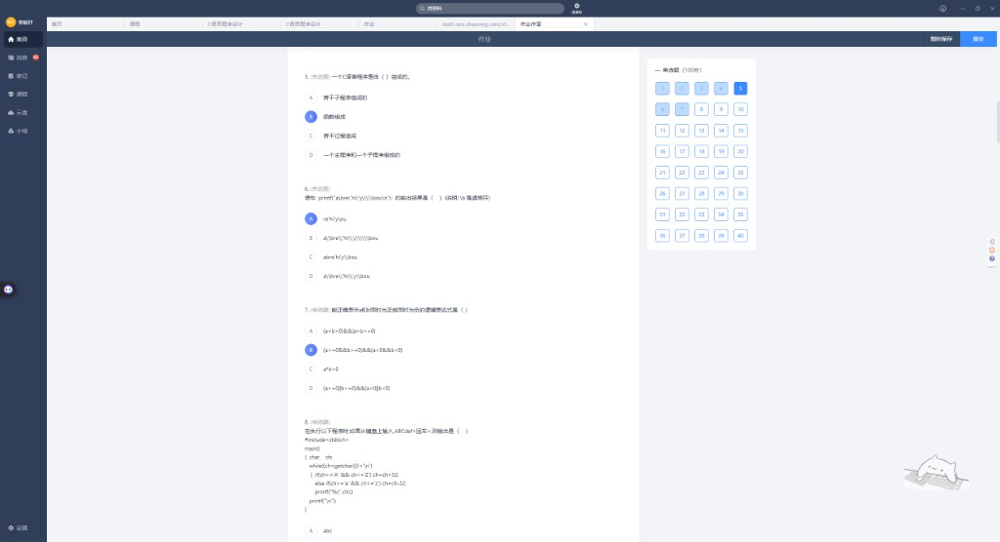

### 第 5 题：C 程序由什么组成？

| 正确答案 |
|----------|
| **B. 函数组成** |

### 第 7 题：a 和 b 同正或同负的逻辑表达式

| 你的答案 | 也正确的写法 |
|----------|--------------|
| B `(a>=0&&b>=0)\|\|(a<0&&b<0)` ✓ | C `a*b>0`（同号且均不为 0） |

---

## 第 6 题

**题目**：`printf("a\bre\'hi\'y\\\bou\n");` 输出（ ）（`\b` 是退格符）

| 你的答案 | 正确答案 |
|----------|----------|
| A re'hi'you ✓ | **A. re'hi'you** |

**逐步拆解**：

```
a  → 打出 a
\b → 光标退回，覆盖 a
re'hi'y → 打出 re'hi'y
\\   → 打出一个反斜杠 \
\b → 退格，覆盖掉刚打的 \
bou → 打出 bou
\n → 换行
```

最终屏幕：**re'hi'you**

---

## 第 8 题

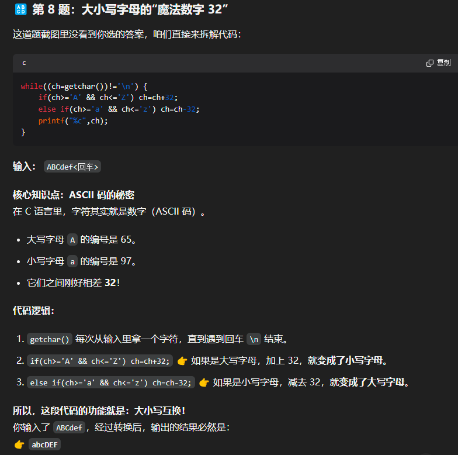
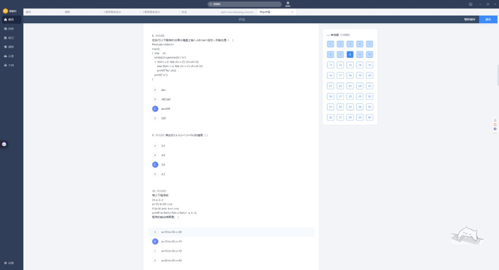

**题目**：输入 `ABCdef<回车>`，输出（ ）

```c
#include <stdio.h>
main()
{
    char ch;
    while((ch=getchar())!='\n')
    {
        if(ch>='A' && ch<='Z') ch=ch+32;
        else if(ch>='a' && ch<='z') ch=ch-32;
        printf("%c", ch);
    }
    printf("\n");
}
```

| 你的答案 | 正确答案 |
|----------|----------|
| C abcDEF ✓ | **C. abcDEF** |

**魔法数字 32**：

- `'A'` = 65，`'a'` = 97，差值 **32**
- 大写 +32 → 小写；小写 -32 → 大写
- 本题是**大小写互换**

---

## 第 9 题

**题目**：`3.6 - 5/2 + 1.2 + 5%2` 的值是（ ）

| 你的答案 | 正确答案 |
|----------|----------|
| C 2.8 ✓ | **C. 2.8** |

**计算**：

```
5/2 = 2      （整数除法）
5%2 = 1
3.6 - 2 + 1.2 + 1 = 2.8
```

---

## 第 10 题

**题目**：

```c
int a, b, c;
a=10; b=50; c=a;
if (a>b) a=b; b=c; c=a;
printf("a=%d b=%d c=%d\n", a, b, c);
```

| 你的答案 | 正确答案 |
|----------|----------|
| B a=10 b=50 c=10 | **a=10 b=10 c=10** |

**解析**：

```c
if (a>b) a=b;   // if 只控制这一句，a>b 假，跳过
b=c;            // 独立执行，b=10
c=a;            // 独立执行，c=10
```

### ⚠️ 避坑指南

不要误以为 `b=c; c=a;` 也在 `if` 里面。无 `{}` 时只有紧跟的一条语句受 `if` 控制。

---

## 第 14 题

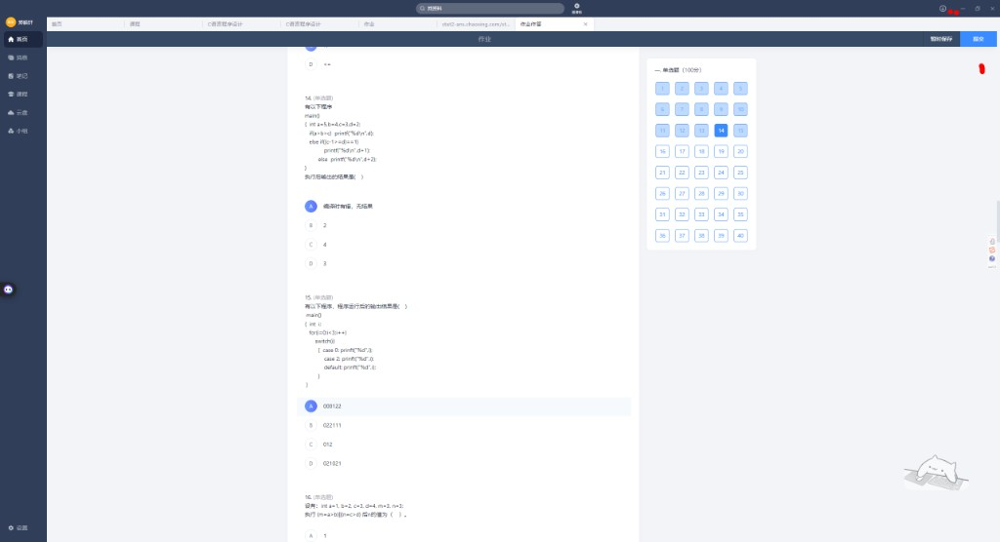
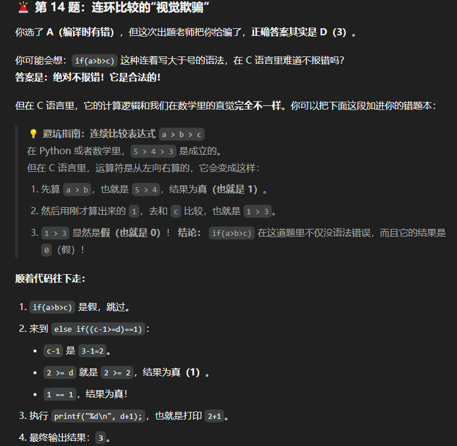

**题目**：

```c
main()
{
    int a=5, b=4, c=3, d=2;
    if(a>b>c) printf("%d\n", d);
    else if((c-1>=d)==1) printf("%d\n", d+1);
    else printf("%d\n", d+2);
}
```

| 你的答案 | 正确答案 |
|----------|----------|
| A 编译有错 | **D. 3** |

**连环比较陷阱**：`a>b>c` 不是语法错误！

```
a>b>c  →  (a>b)>c  →  (5>4)>3  →  1>3  →  0（假）
```

走 `else if`：

```
(c-1>=d)==1  →  (3-1>=2)==1  →  (2>=2)==1  →  1==1  →  真
输出 d+1 = 3
```

---

## 第 15 题

**题目**：

```c
main()
{
    int i;
    for(i=0; i<3; i++)
        switch(i)
        {
            case 0: printf("%d", i);
            case 2: printf("%d", i);
            default: printf("%d", i);
        }
}
```

| 你的答案 | 正确答案 |
|----------|----------|
| A 000122 ✓ | **A. 000122** |

**执行过程**（注意 for 四步规则 + switch 穿透）：

| i | switch 输出 | 说明 |
|---|-------------|------|
| 0 | `000` | case 0→case 2→default 全穿透 |
| 1 | `1` | 只进 default |
| 2 | `22` | case 2→default 穿透 |

---

## 第 16 题

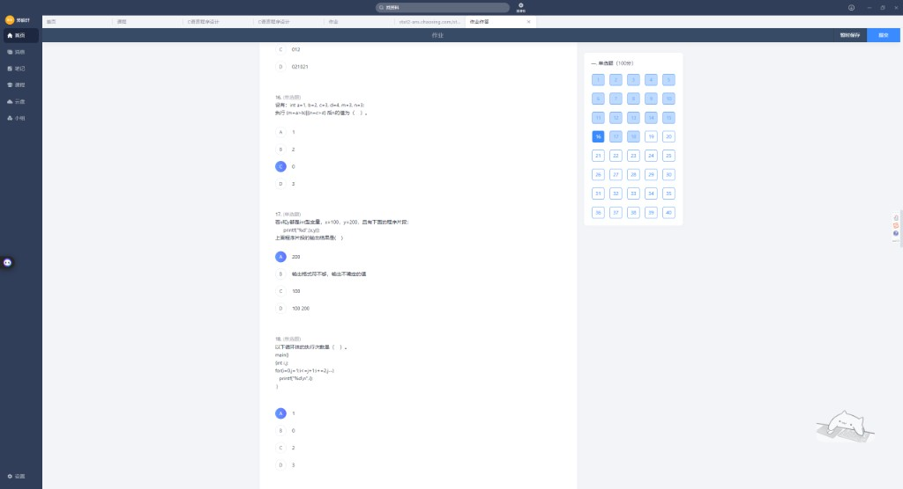

**题目**：`int a=1,b=2,c=3,d=4,m=3,n=1;` 执行 `(m=a>b)&&(n=c>d)` 后 n 的值（ ）

| 你的答案 | 正确答案 |
|----------|----------|
| C 0 | **A. 1**（n 保持初值） |

**解析**：

```
m = a>b  →  m = 0（假）
&& 短路：左边为假，右边 n=c>d 根本不执行
n 保持初值 1
```

### ⚠️ 避坑指南

`&&` 左边为假时，右边**不会执行**，不要被 `n=c>d` 的写法迷惑。

---

## 第 17~18 题

### 第 17 题

`printf("%d", x, y);` — 只有一个 `%d`，只输出 **x = 100**

| 你的答案 | 正确答案 |
|----------|----------|
| A 200 | **C. 100** |

### 第 18 题

```c
for(i=0, j=1; i<=j+1; i++, j--)
    printf("%d\n", i);
```

| 你的答案 | 正确答案 |
|----------|----------|
| A 1 | **C. 2** |

| 轮次 | i | j | i<=j+1 | 输出 |
|------|---|---|--------|------|
| 1 | 0 | 1 | 0<=2 真 | 0 |
| 2 | 1 | 0 | 1<=1 真 | 1 |
| 3 | 2 | -1 | 2<=0 假 | 结束 |

---

## 第 19~21 题

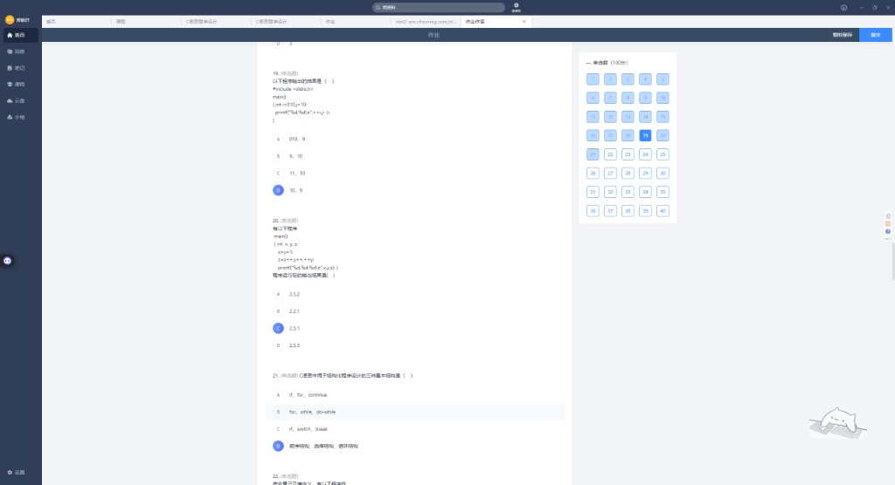

### 第 19 题

```c
int i=10, j=10;
printf("%d, %d\n", ++i, j--);
```

| 你的答案 | 常见答案 |
|----------|----------|
| D 10, 9 | **C. 11, 10** |

`++i` 先加后用 → 11；`j--` 先用后减 → 10

### 第 20 题

```c
x=y=1;
z=x++, y++, ++y;
printf("%d, %d, %d\n", x, y, z);
```

| 你的答案 | 正确答案 |
|----------|----------|
| C 2, 3, 1 ✓ | **C. 2, 3, 1** |

逗号表达式：`(z=x++), (y++), (++y)` → z=1, x=2, y=3

### 第 21 题

| 正确答案 |
|----------|
| **D. 顺序结构、选择结构、循环结构** |

---

## 专题：while vs do-while

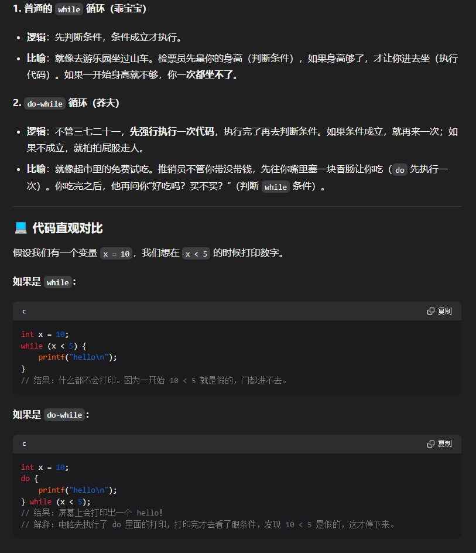

| 类型 | 昵称 | 逻辑 |
|------|------|------|
| `while` | 乖宝宝 | **先判断**，条件成立才执行 |
| `do-while` | 莽夫 | **先执行一次**，再判断条件 |

**经典对比**（`x=10`，条件 `x<5`）：

```c
// while：一次都不执行
while (x < 5) printf("hello\n");

// do-while：至少执行一次，打印一个 hello
do { printf("hello\n"); } while (x < 5);
```

---

## 专题：for 循环四步规则

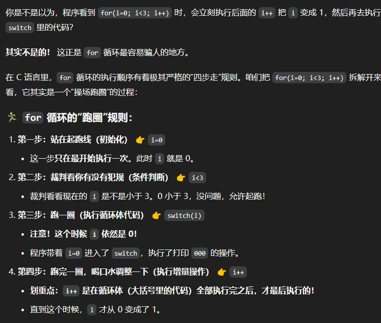

`for(i=0; i<3; i++)` 的严格顺序：

1. **初始化** `i=0`（只执行一次）
2. **判断条件** `i<3`？成立才进入
3. **执行循环体**（此时 i 还没自增！）
4. **自增** `i++`（循环体全部跑完才执行）

### ⚠️ 避坑指南

`i++` 不是在判断之后立刻执行，而是在**整个循环体跑完之后**才执行。

---

## 专题：从右向左的运算符

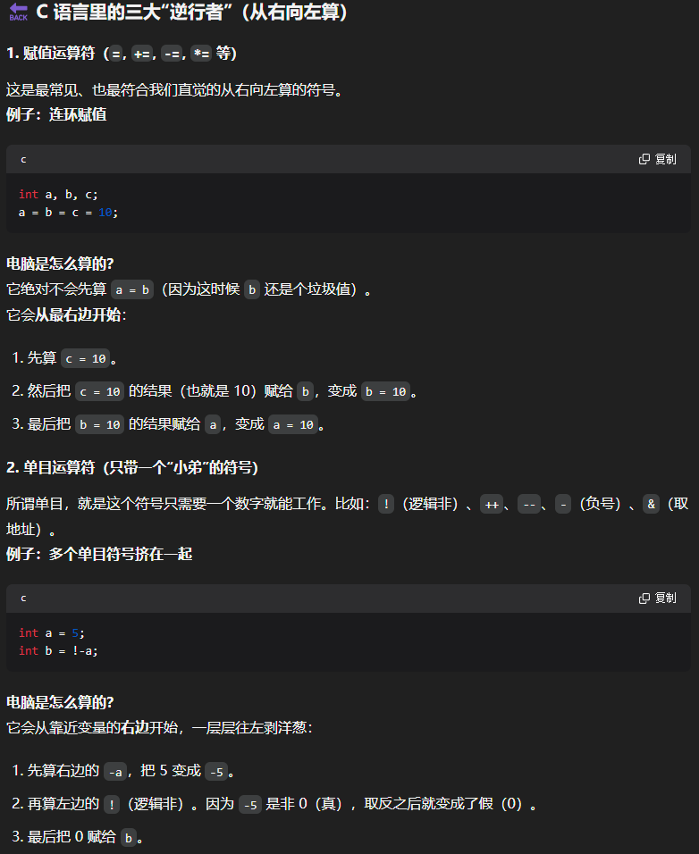
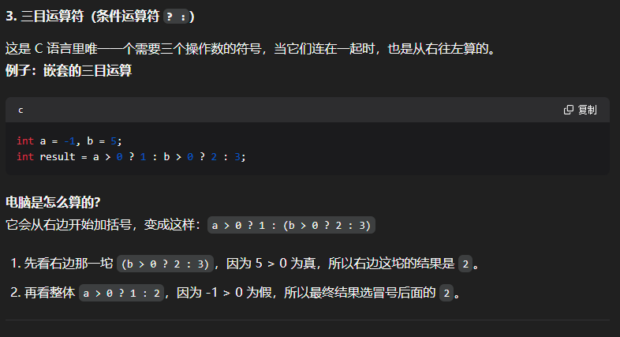

C 语言三大"逆行者"（从右向左算）：

### 1. 赋值运算符

```c
a = b = c = 10;  // 先 c=10，再 b=10，再 a=10
```

### 2. 单目运算符

```c
int a = 5;
int b = !-a;  // 先算 -a=-5，再 !(-5)=0
```

### 3. 三目运算符（嵌套时）

```c
int a=-1, b=5;
int result = a>0 ? 1 : b>0 ? 2 : 3;
// 等价于 a>0 ? 1 : (b>0 ? 2 : 3) → 2
```

---

## 本批易错点速记

| 题号 | 易错点 | 一句话 |
|------|--------|--------|
| 1 | if-else 无花括号 | else 中间不能夹语句 |
| 2 | do-while + t 序列 | 输入应为负奇数，不是正奇数 |
| 4 | switch 无 break | 穿透 + for 只跑 2 圈 |
| 10 | if 控制范围 | 无 `{}` 只控制一条语句 |
| 14 | a>b>c | 合法语法，按 `(a>b)>c` 算 |
| 16 | && 短路 | 左边假，右边不执行 |
| 17 | printf 格式符 | 几个 `%` 输出几个值 |
| 18 | for 多变量 | 注意 i 和 j 同步变化 |
| 19 | 自增顺序 | ++i 先加，j-- 先用 |

---

## 附录：原始截图索引

| 文件名 | 内容 |
|--------|------|
| `01_作业题1-3.png` | 第 1~3 题截图 |
| `02_while与do-while对比.png` | while vs do-while 专题 |
| `03_第4题解析_第1圈.png` | 第 4 题第 1 圈执行 |
| `04_第4题解析_第2圈.png` | 第 4 题第 2 圈执行 |
| `05_作业题3-5.png` | 第 3~5 题截图 |
| `06_作业题5-8.png` | 第 5~8 题截图 |
| `07_作业题8-10.png` | 第 8~10 题截图 |
| `08_第8题_魔法数字32.png` | 第 8 题 ASCII 解析 |
| `09_作业题14-16.png` | 第 14~16 题截图 |
| `10_第14题_连环比较.png` | 第 14 题连环比较 |
| `11_for循环跑圈规则.png` | for 循环四步规则 |
| `12_从右向左运算符.png` | 赋值、单目运算符 |
| `13_三目运算符嵌套.png` | 三目运算符嵌套 |
| `14_作业题16-18.png` | 第 16~18 题截图 |
| `15_作业题19-21.png` | 第 19~21 题截图 |

---

*下一批照片发来后，存入 `images/第三批/` 并追加。*
